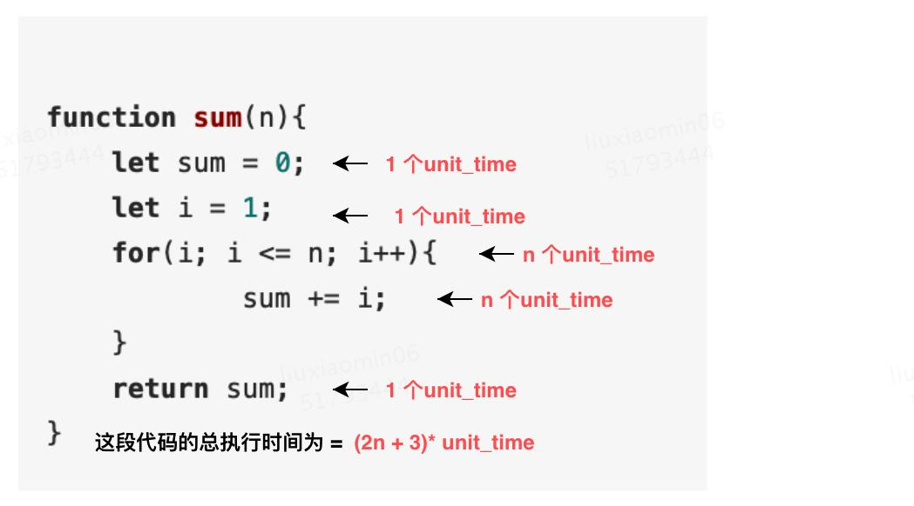
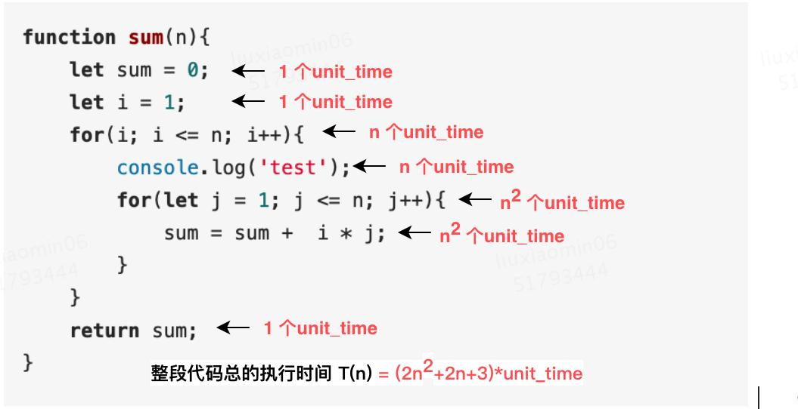
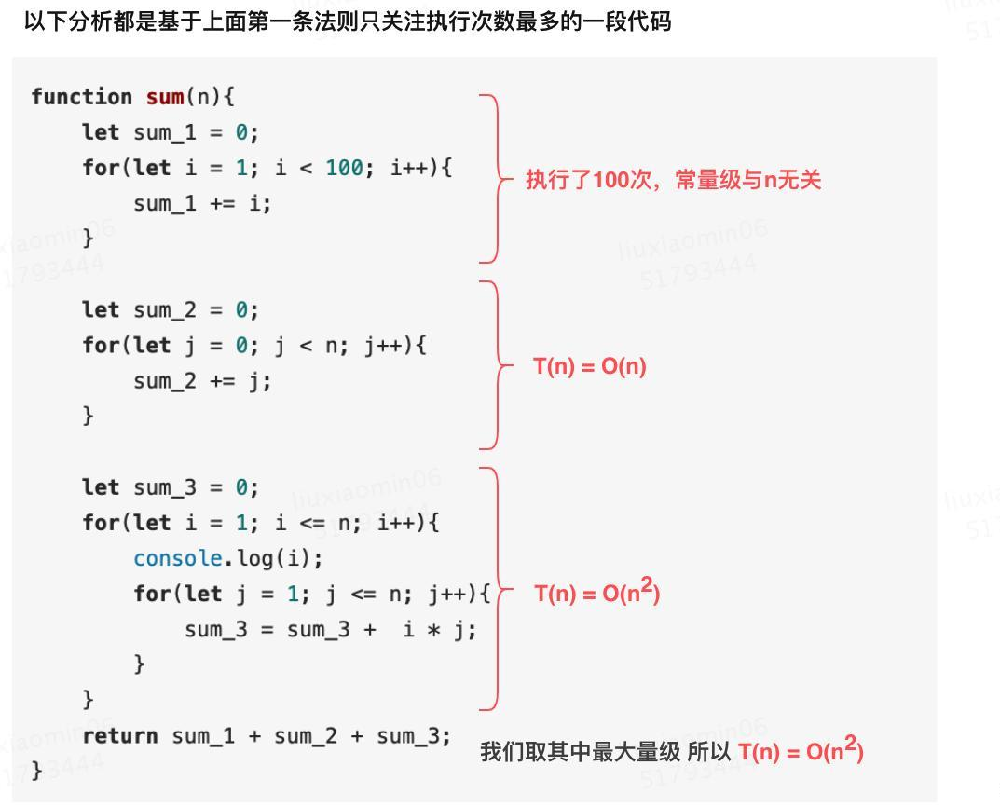
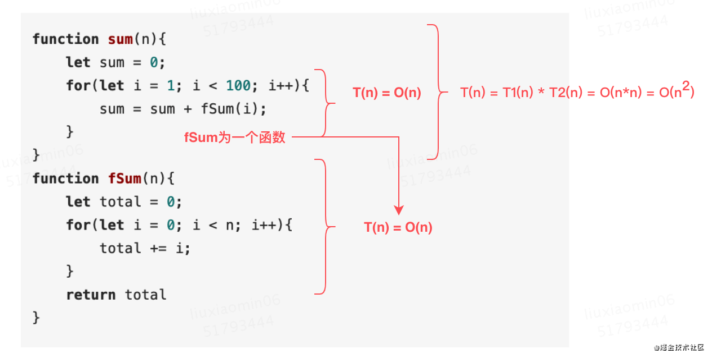
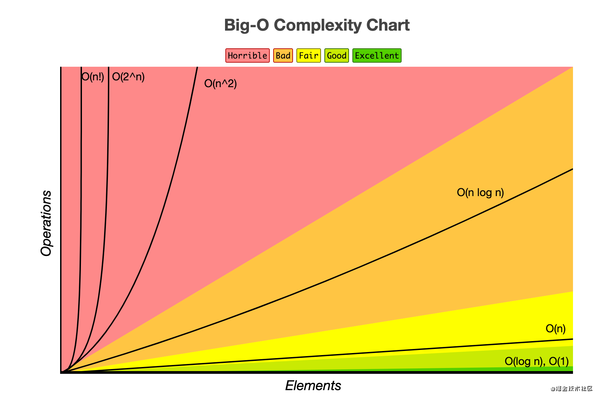
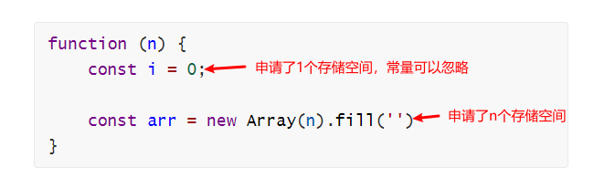

# 数据结构与算法


## 认识数据结构和算法

数据结构就是指一组数据的存储结构。算法就是操作数据的一组方法；**数据结构是为算法服务的，算法要作用在特定的数据结构之上**


## 为什么要进行复杂度分析

数据结构和算法本身解决的是“快”和“省”的问题，即如何让代码运行得更快，如何让代码更省存储空间。所以，执行效率是算法一个非常重要的考量指标。

可以通过**事后统计法**(把代码跑一遍，通过统计、监控，就能得到算法执行的时间和占用的内存大小)来评估算法执行效率的,但是这种方法有非常大的局限性

- 测试结果非常依赖环境
- 测试结果受数据规模影响比较大

所以，就需要一个不依赖测试数据就可以粗略地估计算法的执行效率的方法，这就是**渐进时间、空间复杂度分析**，也就是常说的复杂度分析


## 时间复杂度与空间复杂度

时间复杂度的全称是**渐进时间复杂度**，**表示算法的执行时间与数据规模之间的增长关系**。

类比一下，空间复杂度全称就是**渐进空间复杂度**（asymptotic space complexity），**表示算法的存储空间与数据规模之间的增长关系**


## 大 O 复杂度表示法

简单说，算法的执行效率就是算法代码的执行时间

**示例1：**

假设每段代码的执行时间都是 unit_time：

```js
function sum(n){
    let sum = 0;
    let i = 1;
    for(i; i <= n; i++){
            sum += i;
    }
    return sum;
}
```

那么有：



可以得出：T(n) = (2n+3) * unit_time，所有代码执行的时间 T(n) 与每一行代码执行的次数成正比

**示例2：**

```js
function sum(n){
    let sum = 0;
    let i = 1;
    for(i; i <= n; i++){
        console.log('test');
        for(let j = 1; j <= n; j++){
            sum = sum +  i * j;
        }
    }
    return sum;
}
```

那么有：



可以得出：T(n) = (2n^2 + 2n + 3) * unit_time


由以上两个例子，可以得出：所有代码的执行时间 T(n) 和每行代码的执行次数 n 成正比，公式就是：

T(n) = O(f(n))

 O：表示表示执行时间 T(n) 与 每行代码执行次数 f(n) 成正比

所以，上面的例子1可以记为：T(n) = O(2n+3)，例子2可以记为：T(n) =O(2n^2 + 2n + 3)

当 n 很大时，一般可以忽略公式中的低阶、常量、系数，那么例子1可以记为：T(n) = O(n)，例子2可以记为：T(n) = O(n^2)


## 分析时间复杂度的几个实用方法

### 1、只关注循环执行最多的一段代码

大 O 这种复杂度表示方法只是关注代码执行时间随数据规模增长的变化趋势。通常会忽略掉低阶、常量、系数，只需要记录一个最大的量级就可以

所以，**在分析一个算法、一段代码的时间复杂度的时候，也只关注循环执行次数最多的那一段代码就可以了**

比如，以下代码，执行了嵌套的两次循环，那么复杂度就是 O(n^2)


### 2、加法法则：总复杂度等于量级最大的那段代码的复杂度

例子：

```js
function sum(n){
    let sum_1 = 0;
    for(let i = 1; i < 100; i++){
        sum_1 += i;
    }

    let sum_2 = 0;
    for(let j = 0; j < n; j++){
        sum_2 += j;
    }

    let sum_3 = 0;
    for(let i = 1; i <= n; i++){
        console.log(i);
        for(let j = 1; j <= n; j++){
            sum_3 = sum_3 +  i * j;
        }
    }
    return sum_1 + sum_2 + sum_3;
}
```

分析：



得出，复杂度为 O(n^2)

即：T1(n) = O(n)，T2(n) = O(n)，T(n) = O(max(T1(n), T2(n) ))

**加法法则一般适用于多个平行的循环**

### 3、乘法法则：嵌套代码的复杂度等于嵌套内外代码复杂度的乘积

例子：

```js
function sum(n){
    let sum = 0;
    for(let i = 1; i < 100; i++){
        sum = sum + fSum(i);
    }
}
function fSum(n){
    let total = 0;
    for(let i = 0; i < n; i++){
        total += i;
    }
    return total
}
```

分析：



得出：复杂度为 O(n^2)

即：假设 T1(n) = O(n)，T2(n) = O(n2)，则 T1(n) * T2(n) = O(n3)

**乘法法则一般适用于嵌套循环**


## 一些常见的时间复杂度

**多项式量级：**

- 常量阶 O(1)
- 对数阶 O(logn)
- 线性阶 O(n)
- 线性对数阶 O(nlogn)
- 平方阶 O(n^2)、立方阶 O(n^3)、...，k次方阶 O(n^k)

**非多项式量级：**

- 指数阶 O(2^n)
- 阶乘阶 O(n!)

> 当数据规模 n 越来越大时，非多项式量级算法的执行时间会急剧增加，求解问题的执行时间会无限增长，所以，非多项式时间复杂度的算法其实是非常低效的算法


### 1、O(1)

例子：

```js
const a = 1
const b = 2
const c = a + b
```

O(1) 是常量级时间复杂度的一种表示方法，并不是说执行了一行代码，如上，代码有三行，时间复杂度也是 O(1)，而不是 O(3)

总结：只要代码的执行时间不随 n 的增大而增长，这样代码的时间复杂度我们都记作 O(1)。或者说，**一般情况下，只要算法中不存在循环语句、递归语句，即使有成千上万行的代码，其时间复杂度也是Ο(1)**

### 2、O(m+n)、O(m*n)

例子：

```js
function cal(m, n) {
  let sum_1 = 0;
  let i = 1;
  for (; i < m; ++i) {
    sum_1 = sum_1 + i;
  }
 
  let sum_2 = 0;
  let j = 1;
  for (; j < n; ++j) {
    sum_2 = sum_2 + j;
  }
 
  return sum_1 + sum_2;
}
```

这段代码的复杂度由两个数据的规模来决定。m 和 n 是表示两个数据规模。由于无法事先评估 m 和 n 谁的量级大，**所以在表示复杂度的时候，就不能简单地利用加法法则，省略掉其中一个。所以，上面代码的时间复杂度就是 O(m+n)**

针对这种情况，原来的加法法则就不正确了，我们需要将加法规则改为：*T*1(*m*)+*T*2(*n*)=*O*(*f*(*m*)+*g*(*n*))。但是原来的乘法法则依然有效：*T*1(*m*)∗*T*2(*n*)=*O*(*f*(*m*)∗*f*(*n*))

### 3、O(logn)、O(nlogn)

例子：

```js
const i=1;
while (i <= n)  {
  i = i * 2;
}
```

分析：

变量 i 从 1 开始取值，没循环一次，i 就乘以 2，所以有：

2^0、2^1、2^2、...、2^x = n

得出 x = log2n，所以时间复杂度就是 O(log2n)

一般，不管是以 2 为底、以 3 为底，还是以 10 为底，我们可以把所有对数阶的时间复杂度都记为 O(logn)，因为：

log3n = log32 * log2n

常量可以忽略，所以复杂度记为 O(logn)


**对于 O(nlogn)：**如果一段代码的时间复杂度是 O(logn)，我们循环执行 n 遍，时间复杂度就是 O(nlogn) 了。**O(nlogn) 也是一种非常常见的算法时间复杂度。比如，归并排序、快速排序的时间复杂度都是 O(nlogn)**


不同时间复杂度随数据量的变化：




## 最好、最坏、平均、均摊时间复杂度

[参考掘金文章](https://juejin.cn/post/6938373568782663711/)

### 1、最好、最坏时间复杂度

例子：

```js
function find(array, n, x) {
  let i = 0;
  let pos = -1;
  for (; i < n; ++i) {
    if (array[i] == x) {
       pos = i;
       break;
    }
  }
  return pos;
}
```

以上代码，是在 n 次内，查找 x 在数组中的位置，没找到返回 -1。那么这段代码的时间复杂度正常来说就是 O(n)

但是，如果刚好第一个就是需要找的元素呢，那么时间复杂度就是 O(1)。如果最后一个或者不存在，那么就需要把整个数组遍历一次，时间复杂度就成了 O(n)

因此，针对上面两种情况，就有了最好时间复杂度和最坏时间复杂度

- 最好时间复杂度：在最理想的情况下，执行这段代码的时间复杂度
- 最坏时间复杂度：在最糟糕的情况下，执行这段代码的时间复杂度

### 2、平均时间复杂度


## 空间复杂度

例子：

```js
function (n) {
    const i = 0;
    
    const arr = new Array(n).fill('')
}
```

分析：



所以，上面例子的空间复杂度就是 O(n)

> 常见的空间复杂度就是 O(1)、O(n)、O(n2 )，像 O(logn)、O(nlogn) 这样的对数阶复杂度平时都用不到。而且，空间复杂度分析比时间复杂度分析要简单很多