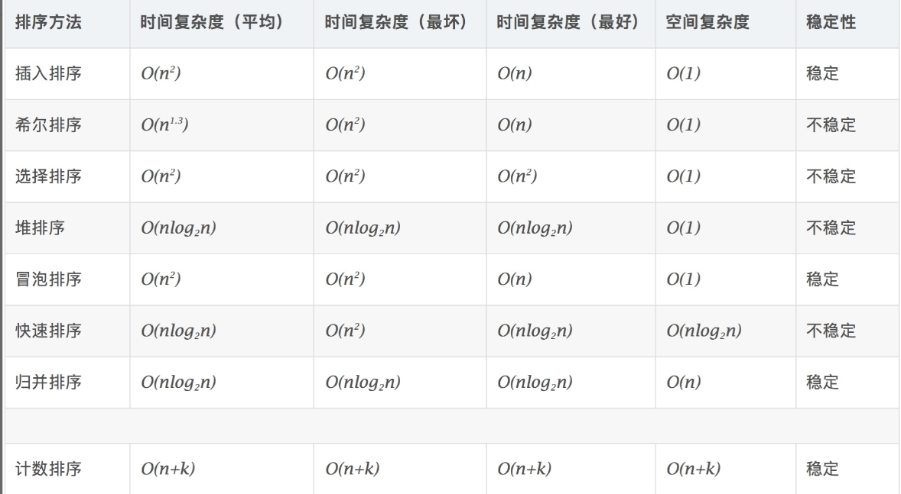
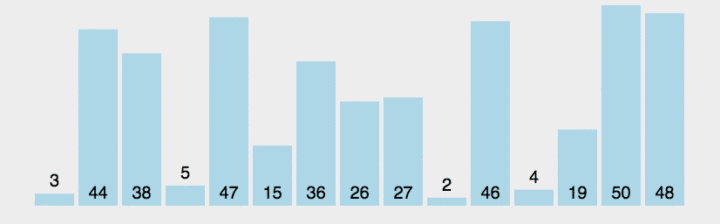
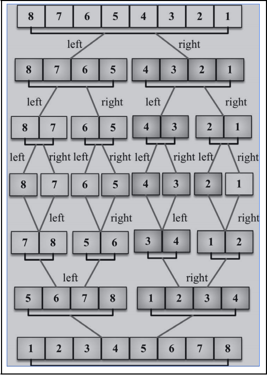

## 排序算法

常见的 6 种排序算法

- 冒泡排序
- 快速排序
- 选择排序
- 插入排序
- 归并排序
- 计数排序


这 6 种排序的时间复杂度：




### 冒泡排序

开始学习排序算法时，通常都先学冒泡算法，因为它在所有排序算法中最简单。然而，**从运行时间的角度来看，冒泡排序是最差的一个**


冒泡排序主要的思想：就是临近两两相比较。

时间复杂度： O(n^2)

#### 实现思路

假设按照从小到大排序

1. 比较相邻的元素，前者比后者大的话，两者交换位置
2. 对每一对相邻元素做相同操作，从开始第一对到最后一对，**这样子最后的元素就是最大元素**
3. 针对 n 个元素重复以上步骤，每次循环排除当前最后一个
4. 重复步骤 1~3，直到排序完成

#### 动画图解

冒泡排序


#### 代码演示

```js
// 从小到大排序，每一轮外层循环都是将最大的往最后移动
// 也就是，第一轮过后，最后面一个肯定是最大的
function bubbleSort(arr) {
  const len = arr.length

  for (let i = 0; i < len; i++) {
    let flag = true

    for (let j = 0; j < len - i - 1; j++) {
      if (arr[j] > arr[j+1]) {
        flag = false;
        [arr[j], arr[j+1]] = [arr[j+1], arr[j]]
      }
    }

    // 这个 flag 的含义是：如果`某次循环`中没有交换过元素，那么意味着排序已经完成
    if (flag) break
  }

  return arr
}

console.log('冒泡排序', bubbleSort([1, 8, 4, 9, 6, 7, 2]))
```


### 快速排序

快速排序也许是最常用的排序算法了。它的复杂度为 *O*(*n*log(*n*))，且性能通常比其他复杂度为 *O*(*n*log(*n*))的排序算法要好。


主要思路：不断分割数组

时间复杂度：O(nlogn)

#### 实现思路

1. 在数据集之中，选择一个元素作为"基准"（pivot）
2. 所有小于"基准"的元素，都移到"基准"的左边；所有大于"基准"的元素，都移到"基准"的右边
3. 对"基准"左边和右边的两个子集，不断重复第一步和第二步，直到所有子集只剩下一个元素为止

#### 代码演示

```js
function quickSort(arr) {
  if (arr.length <= 1) return arr

  const pivotIdx = Math.floor(arr.length / 2)
  const pivoit = arr.splice(pivotIdx, 1)[0]

  const left = []
  const right = []

  for(let i = 0, len = arr.length; i < len; i++) {
    if (arr[i] < pivoit) {
      left.push(arr[i])
    } else {
      right.push(arr[i])
    }
  }

  return quickSort(left).concat([pivot], quickSort(right))
}

console.log('快速排序', bubbleSort([1, 8, 4, 9, 6, 7, 2]))
```


### 选择排序

主要思路：每一次从待排序的数组元素中选择最大(最小)的一个元素作为首元素,直到排完为止

时间复杂度：O(n^2)

#### 实现思路

假设按照从小到大排序

1. 有 n 个数,需要**排序 n-1 次**

   n - 1 次，所以内循环是 for(let j = i)

2. 第一次选择最小值,放在第一位

3. 第二次选择最小值,放在第二位

4. 第 n-1 次选择最小值,放在第 n-1 位

#### 代码演示

```js
function selectSort(arr) {
  const len = arr.length
  let idx = 0

  for(let i = 0; i < len - 1; i++) {
    idx = i
    for(let j = i; j < len; j++) {
      if (arr[idx] > arr[j]) {
        idx = j
      }
    }
    if (idx !== i) {
      [arr[i], arr[idx]] = [arr[idx], arr[i]]
    }
  }

  return arr
}

console.log('选择排序', selectSort([1, 8, 4, 9, 6, 7, 2]))
```


### 插入排序

主要思路：通过构建有序序列，对于未排序数据，在已排序序列中从后向前扫描，找到相应位置并插入

时间复杂度：O(n^2)

#### 实现思路

假设从小到大排序数组 [3, 5, 1, 4, 2]

1. 3 已被排序，所以我们从数组第二个值 5 开始。3 比 5 小，所以 5 待在原位（数组的第二位）。3 和 5 排序完毕。
2. 下一个待排序和插到正确位置上的值是 1（目前在数组的第三位）。5 比 1 大，所以 5 被移至第三位去了。我们得分析 1 是否应该被插入到第二位——1 比 3 大吗？不，所以 3 被移到第二位去了。接着，我们得证明 1 应该插入到数组的第一位上。因为 0 是第一个位置且没有负数位，所以 1 必须被插入第一位。1、3、5 三个数字已经排序。
3. 重复上面第二步，直到排序完成

#### 动画图解



#### 代码演示

```js
function insertSort(arr) {
  const len = arr.length

  for (let i = 0; i < len; i++) {
    let j = i
    let temp = arr[i] // 保存当前位置的值
    while(j >= 0 && arr[j - 1] > temp) {
      // 如果前面的比自己大，那么前面的移到自己的位置
      arr[j] = arr[j - 1]
      j--
    }
    // 前面的没有比自己大的，那么可以确定自己的位置
    arr[j] = temp
  }

  return arr
}

console.log('插入排序', insertSort([1, 8, 4, 9, 6, 7, 2]))
```


### 归并排序

归并排序性能不错，其复杂度为O(nlog(n))。


将两个有序数列合并成一个有序数列，我们称之为“归并”

主要思路：先递归的分解数列，再合并数列（分治思想的典型应用）

时间复杂度： O(nlog(n))

#### 实现思路

默认从小到大

1. 将一个数组拆成A、B两个小组，两个小组继续拆，直到每个小组只有一个元素为止。
2. 按照拆分过程逐步合并小组，由于各小组初始只有一个元素，可以看做小组内部是有序的，合并小组可以被看做是合并两个有序数组的过程。
3. 对左右两个小数列重复第二步，直至各区间只有1个数

#### 动画图解



#### 代码演示

```js
function mergeFun(left, right) {
  let result = []
  while(left.length && right.length) {
    if (left[0] < right[0]) {
      result.push(left.shift())
    } else {
      result.push(right.shift())
    }
  }

  while(left.length) {
    result.push(left.shift())
  }

  while(right.length) {
    result.push(right.shift())
  }

  return result
}

function mergeSort(arr) {
  // 长度小于等于 1，直接返回
  if (arr.length <= 1) return arr

  // 选取数组长度中值，分割数组
  const mid = Math.floor(arr.length / 2)
  const leftArr = arr.slice(0, mid)
  const rightArr = arr.slice(mid)

  // 继续递归分割左右
  const mergeLeftArr = mergeSort(leftArr)
  const mergeRightArr = mergeSort(rightArr)

  return mergeFun(mergeLeftArr, mergeRightArr)
}

console.log('归并排序', mergeSort([1, 8, 4, 9, 6, 7, 2]))
```

