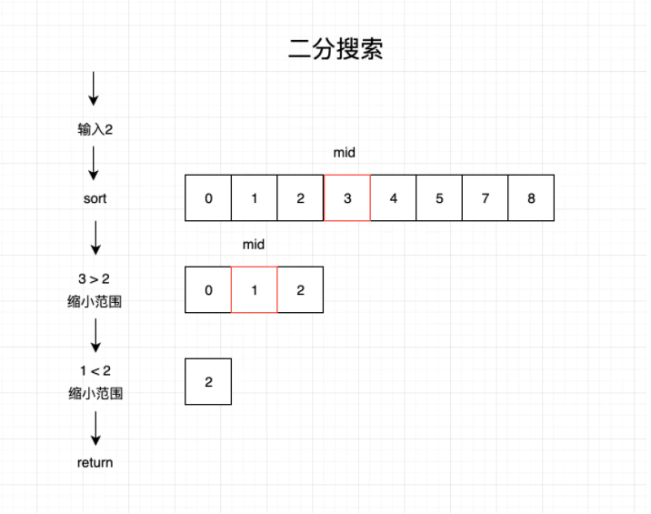

## 搜索算法

比较常见的搜索算法：二分搜索、广度优先遍历（简称为 BFS）、深度优先遍历（简称为 DFS）

### 二分搜索

#### 原理：
二分搜索算法的原理和猜数字游戏类似，就是有人说“我正想着一个 1～100 的数”。其他人每回应一个数，那个人就会说这个数是高了、低了还是对了。

> 二分搜索开始前要先排好序

#### 实现思路:
1. 找出数组的中间值
2. 如果中间值是待搜索的值，那么直接返回中间值的索引
3. 如果待搜索的值比中间值小，则返回步骤1，将区间范围缩小，在中间值左边的子数组中继续搜索
4. 如果待搜索的值比选中的值大，则返回步骤1，将区间范围缩小，在中间值右边的子数组中继续搜索
5. 如果没有搜到，则返回-1

#### 图解：



实现代码：

```js
// 使用二分查找需要有序
function binarySearch(arr, value) {
  let minIdx = 0 // 数组开始的 index
  let maxIdx = arr.length - 1 // 数组结束的 index
  let midIdx // 数组的中间 index
  let ele // 数组中间 index 的取值

  while(minIdx <= maxIdx) {
    midIdx = Math.floor((minIdx + maxIdx) / 2)
    ele = arr[midIdx]

    if (ele > value) {
      maxIdx = midIdx - 1 
    } else if (ele < value) {
      minIdx = midIdx + 1
    } else {
      return midIdx
    }

    return -1
  }
}

console.log('二分搜索结果：', binarySearch([1, 5, 8, 13, 27], 8))
```

使用分而治之实现二分搜索

```js
function binarySearchRecursive(arr, value, minIdx, maxIdx) {
  if (minIdx <= maxIdx) {
    const midIdx = Math.floor((minIdx + maxIdx) / 2)
    const ele = arr[midIdx]
    if (ele < value) {
      binarySearchRecursive(arr, value, midIdx + 1, maxIdx)
    } else if (ele > value) {
      binarySearchRecursive(arr, value, minIdx, midIdx - 1)
    } else {
      return midIdx
    }

    return -1
  }
}

function binarySearchDivide(arr, value) {
  const minIdx = 0
  const maxIdx = arr.length - 1

  return binarySearchRecursive(arr, value, minIdx, maxIdx)
}

console.log('分而治之二分搜索：', binarySearch([1, 5, 8, 13, 27], 8))
```