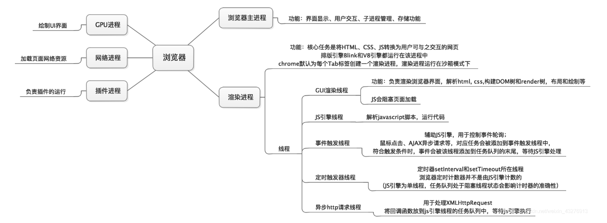
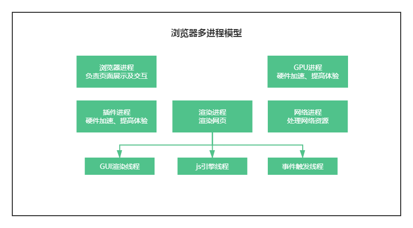
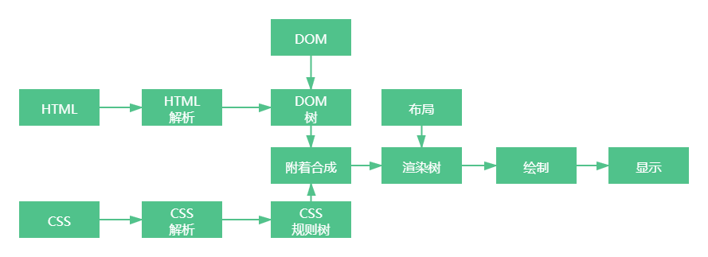

# 浏览器相关

一些参考资料：

[[从浏览器多进程到JS单线程，JS运行机制最全面的一次梳理](https://segmentfault.com/a/1190000012925872)](https://segmentfault.com/a/1190000012925872)

[浏览器灵魂之问，请问你能接得住几个？](https://juejin.cn/post/6844904021308735502)

[深入理解现代浏览器](https://juejin.cn/post/6905952553490448397)

[前端都该懂的浏览器工作原理，你懂了吗？](https://juejin.cn/post/6844904158131126279)

[多角度理解浏览器工作（从输入url到页面呈现）](https://juejin.cn/post/6867075801133776909)


## 1、进程和线程




### 1-1、简单区分一下进程与线程

- 进程是一个工厂，工厂有它的独立资源，所以进程也有系统分配的一块独立内存
- 工厂之间相互独立，因此进程之间也是相互独立
- 线程是工厂中的工人，多个工人协作完成任务，多个线程在进程中协作完成任务
- 工厂内有一个或多个工人，所以对应的一个进程由一个或多个线程组成
- 工人之间共享空间，所以同一进程下的各个线程之间共享程序的内存空间（包括代码段、数据集、堆等）


**官方回答：**

- 进程是cpu资源分配的最小单位（是能拥有资源和独立运行的最小单位）
- 线程是cpu调度的最小单位（线程是建立在进程的基础上的一次程序运行单位，一个进程中可以有多个线程）


### 1-2、浏览器中的进程

上面说过，浏览器是多进程的，下面就来看看主要是哪些进程：

 

- 浏览器进程：负责页面展示、用户交互、子进程管理、提供存储等

  > 浏览器进程主要管理浏览器操作，例如打开页面，输入 url 等，它还有调度其他进程的功能

- 网络进程：主要负责网络资源加载（html、css、js、静态资源等）

- 渲染进程：每个 Tab 页卡都有单独的渲染进程，核心用于渲染页面

- `GPU`进程：3d 绘制，提高性能

- 插件进程：浏览器中安装的一些插件

> 不同进程之间也可以通信，不过代价较大


在浏览器内，每打开一个 tab，就相当于创建了一个独立的浏览器进程。当然，也不是一定的，浏览器有时会将多个进程合并（譬如打开多个空白标签页后，会发现多个空白标签页被合并成了一个进程）。

具体可以通过 Chrome 的 `更多工具 -> 任务管理器` 查看浏览器进程信息。


**多进程的优势：**

相比于单进程浏览器，多进程有如下优点：

- 避免单个页面崩溃影响整个浏览器
- 避免第三方插件崩溃影响整个浏览器
- 多进程充分利用多核优势
- 方便使用沙盒模型隔离插件等进程，提高浏览器稳定性

简单点理解：**如果浏览器是单进程，那么某个 Tab 页崩溃了，就影响了整个浏览器，体验非常差；同理如果是单进程，插件崩溃了也会影响整个浏览器；最主要的就是，多进程保证的浏览器的稳定性。**

当然，相应的内存等资源消耗也会更大，有点空间换时间的意思。


### 1-3、渲染进程

对于前端而言，最重要的是渲染进程。

下面是渲染进程的一些常驻线程：

- GUI 渲染线程
  - 负责渲染浏览器界面，解析 HTML，CSS，构建 DOM 树和 RenderObject 树，布局和绘制等。
  - 当界面需要重绘（Repaint）或由于某种操作引发回流(reflow)时，该线程就会执行。
  - 注意，**GUI 渲染线程与 JS 引擎线程是互斥的**，当 JS 引擎执行时 GUI 线程会被挂起（相当于被冻结了），GUI 更新会被保存在一个队列中**等到 JS 引擎空闲时**立即被执行。

- JS 引擎线程
  - 也称为 JS 内核，负责处理 Javascript 脚本程序。（例如 V8 引擎）
  - JS 引擎线程负责解析 Javascript 脚本，运行代码。
  - JS 引擎一直等待着任务队列中任务的到来，然后加以处理，一个 Tab 页（renderer进程）中无论什么时候都只有一个 JS 线程在运行 JS 程序。
  - 同样注意，**GUI渲染线程与JS引擎线程是互斥的**，所以如果 JS 执行的时间过长，这样就会造成页面的渲染不连贯，导致页面渲染加载阻塞。

- 事件触发线程
  - 归属于浏览器而不是 JS 引擎，用来控制事件循环。（可以理解，JS 引擎自己都忙不过来，需要浏览器另开线程协助）
  - 当 JS 引擎执行代码块如 setTimeOut 时（也可来自浏览器内核的其他线程,如鼠标点击、AJAX 异步请求等），会将对应任务添加到事件线程中。
  - 当对应的事件符合触发条件被触发时，该线程会把事件添加到待处理队列的队尾，等待 JS 引擎的处理。
  - 注意，由于 JS 的单线程关系，所以这些待处理队列中的事件都得排队等待JS引擎处理。（当 JS 引擎空闲时才会去执行）

- 定时触发器线程
  - 传说中的 `setInterval` 与 `setTimeout` 所在线程。
  - 浏览器定时计数器并不是由 JavaScript 引擎计数的。（因为 JavaScript 引擎是单线程的, 如果处于阻塞线程状态就会影响记计时的准确）
  - 因此通过单独线程来计时并触发定时。（计时完毕后，添加到事件队列中，等待 JS 引擎空闲后执行）
  - 注意，W3C 在 HTML 标准中规定，规定要求 setTimeout 中低于 4ms 的时间间隔算为 4ms。

- 异步 http 请求线程
  - 在 XMLHttpRequest 在连接后是通过浏览器新开一个线程请求。
  - 将检测到状态变更时，如果设置有回调函数，异步线程就**产生状态变更事件**，将这个回调再放入事件队列中。再由 JavaScript 引擎执行。


## 2、从输入 URL 到浏览器显示页面


### 2-1、进行 URL 解析

这里只考虑输入的是一个URL 结构字符串，如果是非 URL 结构的字符串，则会用浏览器默认的搜索引擎生成地址。（这一步是在浏览器进程里面完成的，并非是渲染进程）


**URL 的组成**


URL 主要由 `协议`、`主机`、`端口`、`路径`、`查询参数`、`锚点` 6 部分组成。

浏览器会进行 `URL` 解析，看看输入的内容是否符合 `URL` 规则，符合，就合成一个合法的 URL，浏览器进程会通过进程通信将 `URL` 请求发送给网络进程。


### 2-2、浏览器缓存

浏览器缓存主要分为强缓存和协商缓存。网络进程发起请求之前，会先去检查强缓存，查看是否能直接使用缓存。

强制缓存优先于协商缓存进行，若强制缓存 (Expires 和 Cache-Control) 生效则直接使用缓存，若不生效则进行协商缓存 (Last-Modified / If-Modified-Since 和 Etag / If-None-Match)，协商缓存由服务器决定是否使用缓存，若协商缓存失效，那么代表该请求的缓存失效，返回 200，重新返回资源和缓存标识，再存入浏览器缓存中；生效则返回 304，继续使用缓存。


#### 2-2-1、强缓存

强缓存：不会向服务器发送请求，直接从缓存中读取资源，在 chrome 控制台的 Network 选项中可以看到该请求返回 200 的状态码，并且 Size 显示 from disk cache【磁盘缓存】 或 from memory cache【内存缓存】。


在 `HTTP/1.0` 和 `HTTP/1.1` 当中，这个字段是不一样的。在早期，也就是 `HTTP/1.0` 时期，使用的是 **Expires**，而 `HTTP/1.1` 使用的是**Cache-Control**。


**Expires**

`Expires` 指定过期时间，存在于服务端返回的响应头中，告诉浏览器在这个过期时间之前可以直接从缓存里面获取数据，无需再次请求。例如：

```js
Expires: Wed, 1 Jun 2021 08:00:00 GMT
```

表示资源在 `2021年6月1号8点` 过期，过期了就得向服务端发请求。

这种方式最大的问题是：服务器的时间和浏览器的时间可能并不一致，那服务器返回的这个过期时间可能就是不准确的。所以在 http1.1 版本中抛弃了这种方法。


**Cache-Control**

Cache-Control：它并没有采用具体的过期时间点这个方式，而是采用过期时长来控制缓存。例如：

```js
Cache-Control:max-age=3600
```

代表这个响应返回后在 3600 秒，也就是一个小时之内可以直接使用缓存。

除了 max-age，Cache-Control 还有一些其他属性：

- private：只有浏览器能缓存，中间的代理服务器不能缓存
- no-cache：跳过当前的强缓存，发送HTTP请求，即直接进入`协商缓存阶段`
- no-store：不进行任何形式的缓存
- s-maxage：与 max-age 差不多，只是 s-maxage 针对的是代理服务器的缓存


**Expires 与 Cache-Control 区别：**

Expires 是 http1.0 的产物，Cache-Control 是 http1.1 的产物，两者同时存在的话，Cache-Control 优先级高于 Expires


当 `强缓存` 失效了，接下来就进入到第二级屏障——**协商缓存**


#### 2-2-2、协商缓存

强缓存失效之后，浏览器在请求头中携带相应的`缓存标识`来向服务器发请求，由服务器根据这个tag，来决定是否使用缓存，这就是**协商缓存**。

> 需要注意的是，协商缓存是会发起请求的，所以协商缓存在 DNS 解析、TCP 连接之后

浏览器第一次请求数据时，服务器会将缓存标识与数据一起响应给客户端，客户端将它们备份至缓存中。再次请求时，客户端会先从缓存数据库拿到一个缓存的标识，然后向服务端验证标识是否失效，如果没有失效服务端会返回 304，这样客户端可以直接去缓存数据库拿出数据，如果失效，服务端会返回新的数据


协商缓存的标识有两种：

**Last-Modified**

即最后修改时间。在浏览器第一次给服务器发送请求后，服务器会在响应头中加上这个字段。

浏览器接收到后，如果再次请求，会在请求头中携带`If-Modified-Since`字段，这个字段的值也就是服务器传来的最后修改时间。

服务器拿到请求头中的`If-Modified-Since`的字段后，其实会和这个服务器中`该资源的最后修改时间`对比:

- 如果请求头中的这个值小于最后修改时间，说明是时候更新了。返回新的资源，跟常规的HTTP请求响应的流程一样。
- 否则返回304，告诉浏览器直接用缓存。


**ETag**

`ETag` 是服务器根据当前文件的内容，给文件生成的唯一标识，只要里面的内容有改动，这个值就会变。服务器通过`响应头`把这个值给浏览器。

浏览器接收到`ETag`的值，会在下次请求时，将这个值作为**If-None-Match**这个字段的内容，并放到请求头中，然后发给服务器。

服务器接收到**If-None-Match**后，会跟服务器上该资源的**ETag**进行比对:

- 如果两者不一样，说明要更新了。返回新的资源，跟常规的HTTP请求响应的流程一样。
- 否则返回304，告诉浏览器直接用缓存。


**Last-Modified 与 ETag 对比：**

在精准度上，ETag 优于 Last-Modified。优于 ETag 是按照内容给资源上标识，因此能准确感知资源的变化。而 Last-Modified 就不一样了，它在一些特殊的情况并不能准确感知资源变化，主要有两种情况:

- 编辑了资源文件，但是文件内容并没有更改，这样也会造成缓存失效。

- Last-Modified 能够感知的单位时间是秒，如果文件在 1 秒内改变了多次，那么这时候的 Last-Modified 并没有体现出修改了。

在性能上，Last-Modified 优于 ETag，也很简单理解，Last-Modified 仅仅只是记录一个时间点，而 Etag 需要根据文件的具体内容生成哈希值。


另外，如果两种方式都支持的话，服务器会优先考虑 ETag。


### 2-2、URL 请求过程

**网络七层模型：**

- 物理层

- 数据链路层

  > 一般来讲，物理层与数据链路层归为网络接口层，比如说电缆、光纤之类的

- 网络层（ip）

- 传输层（tcp：安全可靠[三次握手]，分段传输，但是慢、udp：快[仅需发送一次确认]，但是会存在丢包）

- 会话层

- 表示层

- 应用层

  > 会话层、表示层、应用层归为应用层，主要就是 http


**一张经典的图：**


**网络 OSI 七层模型与 TCP/IP 四层模型：**

 


**在浏览器中输入 URL：**

1. 输入的一般是域名，会先去查找缓存，检测缓存是否过期，如果没有过期，则直接返回缓存的内容

2. 查看域名是否被解析过（如果域名被请求国，那么就代表解析过），没有 DNS 解析域名成 ip 地址（DNS 实际上就是做了一个映射表，把域名和 ip 地址做了一个映射）

   > DNS 是基于UDP 的。为什么 DNS 不基于 TCP：因为在解析的过程中，涉及到服务器的查找，而服务会分成一级、二级域名等等，会迭代去查询，如果采用 TCP，那么没经过一次域名都要进行三次握手，那么将会非常慢

3. 如果是 https，还会经过 SSL 协商

4. 根据 ip 地址来寻找服务器；需要排队等待，因为在 http 1.1 中规定，一次最多只能同时发送 6 个请求

5. tcp 创建连接用于传输（三次握手）

6. 利用 tcp 传输数据（拆分成数据包，有序的发送，丢包有重发机制），服务器会按照顺序接收数据包

7. http 请求（请求行、请求头、请求体）

   > 在 http1.1 中，默认不会断开，有 keep-alive：为了下次传输数据时可以复用上次创建的链接，避免的建立链接消耗时间

8. 服务器收到数据后，解析数据，响应给浏览器（响应行、状态码、响应头、响应体）

9. 状态码 304 协商缓存


### 2-3、HTTP 发展历史流程

1. http 0.9：只负责传输 html，最早的时候没有请求头和请求体，不能传输 js 或者静态资源等
2. http1.0：提供了请求头，那么就可以根据请求头的不同来处理不同的资源，但是它有很多缺点，例如每次请求完都会断开链接，需要重新创建链接，带来较大的时间成本，需要手动 keep-alive
3. http1.1：默认开启了 keep-alive 链路复用，管线化（一个域名下最多可以建立6个链接）。但是服务器处理请求是按照顺序来的，虽然发送是并发发送6个，但是响应还是按照顺序一一处理（即队头阻塞）。而且 6 个链接，会建立6个tcp，那么会有带宽争抢的情况
4. http2.0：用同一个 tcp 发送数据，一个域名一个 tcp（多路复用）、头部压缩、双向链接（不止客户端可以先发起请求，也可以服务端先推送数据）
5. http3.0：解决了 tcp 的队头阻塞问题。最重要的是 http3.0 不再采用 tcp，而是使用 udp，并且加了 QUIC 协议


### 2-4、渲染流程




## 3、请求 ---> 渲染流程

