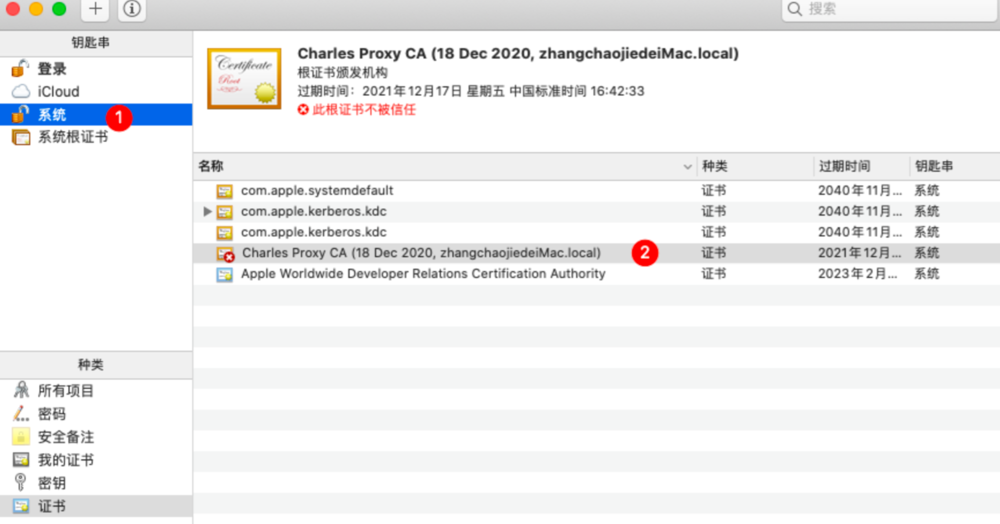

# Charles 抓包配置

本教程适用 PC、H5、小程序的抓包

## 一、Charles 安装

下载地址：https://www.charlesproxy.com/download/

ps：正式版可能会收费，可以自行找 xxx 版本。例如 MacOs 可以到这里下载：https://macwk.com/soft/charles

## 二、基础配置

安装好后，需要对 charles 进行一些常规配置：

### 2.1、基础配置

- 打开 Proxy -> Proxy Settings 

- 配置如下选项 

### 2.2、配置 https

- 点开 Proxy -> SSL Proxy Settings

- 勾选【Enable SSL Proxying】,并 add 一条，如下：

## 三、安装电脑证书

### 3.1 Mac

- 点开 Help -> SSl Proxying -> Install Charles Root Certificate

- 安装证书

​    会弹出证书的设置，选择【系统】后点击添加

- 信任证书

​    点击 系统，找到 charles ，双击

   在弹框中，点击【信任】展开配置，点击使用此证书时的选择框，选择 【始终信任】，点击 × 后，会让你输入密码，输入就完事了。

   下图表明，已经受信任。

### 3.2 Windows 10

- 点开 Proxy -> Proxy Settings -> 进入窗口

- - 填写端口号为【8888】
  - 勾选【Support HTTP/2】

- 查看IP地址，点开 Help -> Local IP Address

- 安装证书，点开 Help->SSL Proxying->Install Charles Root Certificate，点击下一步

- 选择证书存储    

- 证书安装完成

## 四、安装手机证书

- 点击 Help，点击 SSL Proxying，再点击 Install Charles Root Certificate on a Mobile Device or Remote Browser：

​    会有一个弹窗，其中最关键的信息有两点：1、代理地址 10.9.48.74:8888 （不同电脑 ip 不同）2、证书下载地址 chls.pro/ssl

### 4.1 iOS

- 连接公司 WiFi（确保手机和电脑都是公司的同一网络）
- 进入 WIFi 详情，滑到底部，点击 【配置IP】

- 点击【手动】，在展开的配置中，输入上面弹窗中的 IP 和端口，例如我上面的是： 【10.9.48.74】 和 【8888】

- 进入浏览器，输入 【chls.pro/ssl】；提示下载描述文件，点击下载

- 进入【设置】，它会在最顶部出现【已下载描述文件】

- 点击进入，看到证书是 charles 开头的，点击右上角【安装】

- 进入【设置】->【通用】-> 【关于本机】-> 拉到底部，找到【证书信任设置】

- 信任 Charles 证书 开启即可

### 4.2 Android

 ps：以下是华为手机，其它手机可能会有差异（例如证书安装路径），但是步骤是基本一样的。差异点可自行百度解决

- 连接公司 WiFi（确保手机和电脑都是公司的同一网络）
- 进入 WIFi 详情，滑到底部，点击 【配置代理】,并选择【手动】    

- 将上面的 IP 地址和端口填入，保存。例如我上面的是：【10.9.48.74】 和 【8888】    

- 进入浏览器，输入 【chls.pro/ssl】
- 提示证书，点击下载
- 进入手机【设置 → 安全 → 更多安全设置 → 加密和凭证 → 从存储设备安装 → 找到下载的证书路径】，将下载好的证书点击安装。（ps：有些安卓手机可能安装证书路径不一致，可自行百度） 

- 安装信任证书，填写证书名（随意名字），点击确认

- 安装完后，可在【设置 → 安全 → 更多安全设置 → 加密和凭证 → 用户凭据】中查看安装成功的证书

## 五、开始抓包

经过上面的配置，基本 PC、H5、小程序等都可以正常抓包了。

例如 PC 抓包百度：

需要注意的是：

- 电脑打开 charles 就可以正常抓包
- 手机 H5、小程序每次需要先确保电脑和手机处于同一网络下，然后电脑先打开charles，手机进入网络详情，选择手动，填入 IP 和 端口，才可抓包。（PS：不需要抓包记得去掉手机IP和端口代理，不然没法上网）

小程序要想抓包接口，需要满足两个条件：

- 需要是体验版
- 需要开启调试模式

或者直接使用电脑微信打开小程序，则没有这个限制