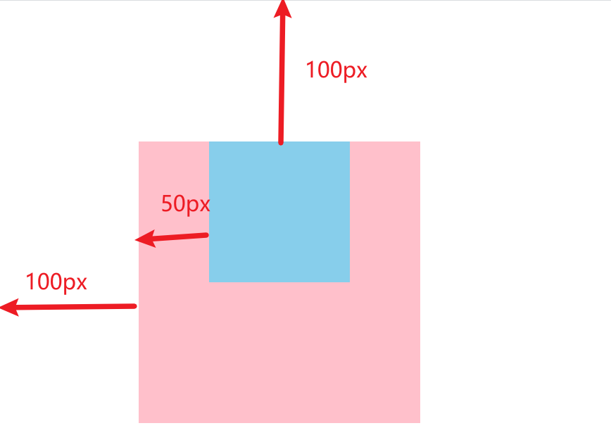
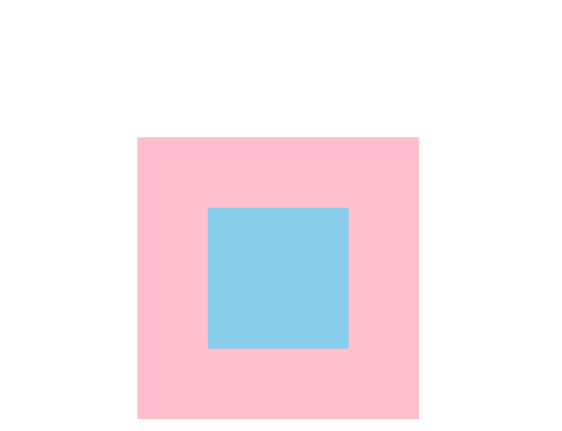
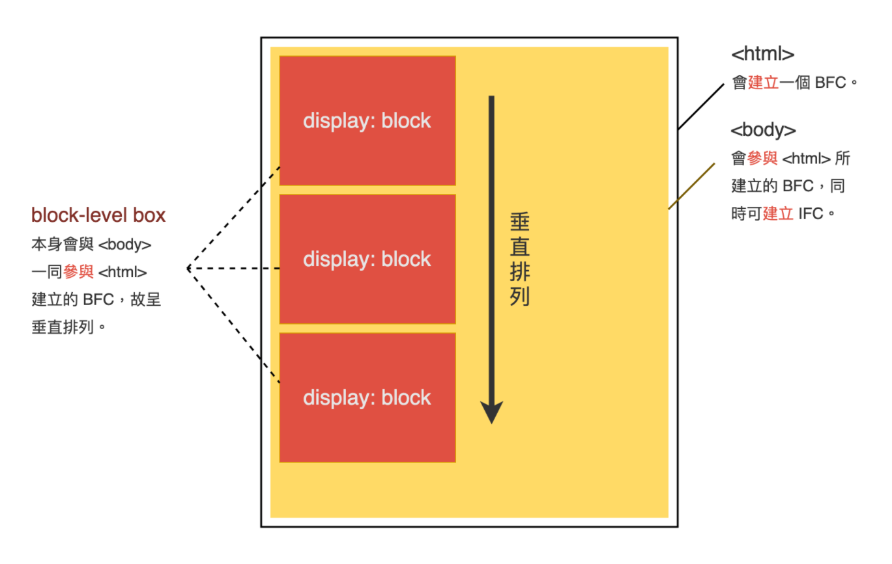
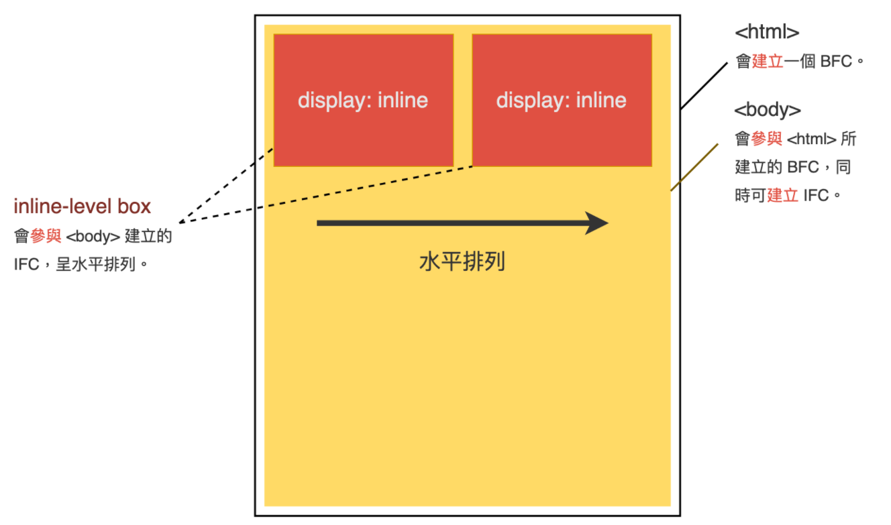

## CSS 相关知识点汇总

本文是一些 CSS 基础知识汇总。

大部分可参考阮一峰的博客：https://www.ruanyifeng.com/blog/


[CSS 面试知识点总结](https://github.com/CavsZhouyou/Front-End-Interview-Notebook/blob/master/Css/Css.md)

[CSS面试题](https://github.com/yisainan/web-interview/blob/master/content/CSS.md)

[css篇--100道近两万字帮你巩固css知识点](https://juejin.cn/post/6844904185847087111)

[CSS经典面试题](https://juejin.cn/post/6844903832552472583)

[1.5 万字 CSS 基础拾遗](https://juejin.cn/post/6941206439624966152)

[css面试考点全面总结](https://juejin.cn/post/6844904095757631501)


#### 1、盒模型？标准盒模型与 IE 的盒子模型？

盒子模型：主要由 content 内容、内边距、边框、外边距四部分组成

- 标准盒子模型：元素宽高＝内容（content）的宽高

- IE 盒子模型：元素宽高＝内容（content）＋填充（padding）＋边框 （border） 的总宽高

也就是说，IE 盒子模型把 padding 和 boder 都算进元素宽高里面了


标准盒子模型与 IE 盒子模型之间的转换：

```css
box-sizing: content-box | border-box
```

默认是 content-box，代表标准盒子模型，需要转成 IE 盒子模型可以使用 border-box


#### 2、CSS 常见的选择器

常见的 CSS 选择器：

```css
（1）id选择器（#myid）
（2）类选择器（.myclassname）
（3）标签选择器（div,h1,p）
（4）后代选择器（h1 p）
（5）相邻后代选择器（子）选择器（ul>li）
（6）兄弟选择器（li~a）
（7）相邻兄弟选择器（li+a）
（8）属性选择器（a[rel="external"]）
（9）伪类选择器（a:hover,li:nth-child）
（10）伪元素选择器（::before、::after）
（11）通配符选择器（*）
```


#### 3、CSS 优先级以及权重计算

优先级：

```
!important > 行内 > id选择器 > class类选择器 > 标签选择器 > 通配符
```

权重：

|                        选择器                        |   权重   |
| :--------------------------------------------------: | :------: |
|                   继承或者通配符 *                   | 0,0,0,0  |
|     标签选择器（元素选择器），伪类选择器 ::after     | 0,0,0,1  |
| 每个类，结构伪类(如:hover),属性选择器[type="number"] | 0,0,1,0  |
|                      id 选择器                       | 0,1,0,0  |
|                每个行内样式 style=""                 | 1,0,0,0  |
|                   每个 !important                    | ∞ 无穷大 |

如果优先级相同，就近原则，选择最后出现的样式


#### 4、CSS 有哪些属性可以继承，哪些属性无法继承

**可以继承的属性**

- 字体系列属性：

  ```
  font:组合字体
  font-family:规定元素的字体系列
  font-weight:设置字体的粗细
  font-size:设置字体的尺寸
  font-style:定义字体的风格
  font-variant:偏大或偏小的字体
  ```

- 文本系列属性：

  ```
  text-indent：文本缩进
  text-align：文本水平对刘
  line-height：行高
  word-spacing：增加或减少单词间的空白
  letter-spacing：增加或减少字符间的空白
  text-transform：控制文本大小写
  direction：规定文本的书写方向
  color：文本颜色
  ```

- 表格布局属性

  ```
  caption-side：定位表格标题位置
  border-collapse：合并表格边框
  border-spacing：设置相邻单元格的边框间的距离
  empty-cells：单元格的边框的出现与消失
  table-layout：表格的宽度由什么决定
  ```

- 列表属性

  ```
  list-style-type：文字前面的小点点样式
  list-style-position：小点点位置
  list-style：以上的属性可通过这属性集合
  ```


**不可继承的属性**

```
display

文本属性：vertical-align、text-decoration

盒子模型的属性：宽度、高度、内外边距、边框等

背景属性：背景图片、颜色、位置等

定位属性：浮动、清除浮动、定位 position 等

生成内容属性：content、counter-reset、counter-increment

轮廓样式属性：outline-style、outline-width、outline-color、outline

页面样式属性：size、page-break-before、page-break-after
```


#### 5、伪类与伪元素区别

- 伪类：用于已有的元素处于某个状态时，为其添加对应的样式，这个状态是根据用户行为而动态变化的。比如说，当用户悬停在指定的元素时，可以通过 :hover 来描述这个元素的状态
- 伪元素：伪元素用于创建一些不在文档树中的元素，并为其添加样式。它允许我们为元素的某些部分设置样式。比如说，可以通过 ::before 来在一个元素前增加一些文本，并为这些文本添加样式。虽然用户可以看到这些文本，但是这些文本实际上不在文档树中

> 有时会发现伪元素使用了两个冒号（::）而不是一个冒号（:）。这是 CSS3 尝试区分伪类和伪元素。大多数浏览器都支持这两个值。按照规则应该使用（::）而不是（:），从而区分伪类和伪元素。但是，由于在旧版本的 W3C 规范并未对此进行特别区分，因此目前绝大多数的浏览器都支持使用这两种方式表示伪元素


#### 6、CSS3 新特性

- 新的选择器

  ```
  :root 选择文档的根元素，等同于html元素
  :empty 选择没有子元素的元素
  :target 选取当前活动的目标元素
  :not(selector) 选择除 selector 元素意外的元素
  :enabled 选择可用的表单元素
  :disabled 选择禁用的表单元素
  :checked 选择被选中的表单元素
  :nth-child(n) 匹配父元素下指定子元素，在所有子元素中排序第n
  :nth-last-child(n) 匹配父元素下指定子元素，在所有子元素中排序第n，从后向前数
  :first-child 选中第一个子元素
  :last-child 选中最后一个子元素
  :nth-of-type(n) 匹配父元素下指定子元素，在同类子元素中排序第n
  :nth-last-of-type(n) 匹配父元素下指定子元素，在同类子元素中排序第n，从后向前数
  ::selection 选择被用户选取的元素部分（伪元素）
  :first-line 选择元素中的第一行（伪元素）
  :first-letter 选择元素中的第一个字符（伪元素）
  :after 在元素在该元素之后添加内容（伪元素）
  :before 在元素在该元素之前添加内容（伪元素）
  ```

- rgba

- 圆角（border-radius）

- 文字阴影（text-shadow）、盒子阴影（box-shadow）

  文字阴影

  ```
  text-shadow: [X-offset,Y-offset,Color,Blur]; 
  
  X-offset:指阴影居于字体水平偏移的位置。
  Y-offset:指阴影居于字体垂直偏移的位置。
  color:指阴影的颜色；
  Blur:指阴影的模糊值。
  ```

  盒子阴影：

  ```
  box-shadow: h-shadow v-shadow blur spread color inset;
  
  h-shadow: 阴影水平偏移量，其值可以是正负值。如果值为正值，则阴影在对象的右边，其值为负值时，阴影在对象的左边
  v-shadow: 阴影垂直偏移量，其值也可以是正负值。如果为正值，阴影在对象的底部，其值为负值时，阴影在对象的顶部
  blur 阴影模糊半径：此参数可选，值只能是为正值，如果其值为0时，表示阴影不具有模糊效果，其值越大阴影的边缘就越模糊
  spread 阴影扩展半径
  color 阴影颜色：此参数可选
  inset 阴影类型：内阴影或者外阴影
  ```

- 渐变：background: linear-gradient(blue, pink);

- 多背景图

- @font-face 属性（字体）

- @media 媒体查询

- CSS3 过渡 transition

  ```
  transition: transition-property, transition-duration,transition-timing-function, transition-delay

  transition-property 这个是过渡的属性，例如 all(全部) width(宽)
  transition-duration 这个是过渡效果花费的时间
  transition-timing-function 这个是过渡曲线，默认是 ease
  transition-delay 这个规定过渡效果何时开始，默认是 0 马上开始

  例子：
  div {
    width: 100px;
    height: 200px;
    background-color: pink;
    transition: width 2s;
  }
  div:hover {
    width: 500px;
  }
  ```

- CSS3 变形 （旋转：rotate、缩放：scale、倾斜：skew、移动：translate）

  ```
  transform: rotate(180deg)   旋转 180度
  transform: scale(2)         放大 2 倍
  transform: skew(10deg)      倾斜 10 度
  transform: translate(x, y, z)
  ```

  更多变换属性可以参考：https://www.runoob.com/cssref/css3-pr-transform.html

- CSS 3 动画 animation + @keyframes

  ```
  /* animation: 动画名称 持续时间 运动曲线 何时开始 播放次数 是否反方向 起始与结束状态 */
  animation: name duration timing-function delay iteration-count direction fill-mode
  其中 动画名称 和 持续时间 是必须的
  
  
  @keyframes abc {
      from {
          transform: rotate(0);
      }
  
      to {
          transform: rotate(360deg);
      }
  }
  
  也可以分阶段
  @keyframes abc {
      0 {
          transform: rotate(0);
      }
      
      50% {
          transform: rotate(180deg);
      }
      
      100% {
          transform: rotate(360deg);
      }
  }
  ```

- flex 布局，可参考：https://www.ruanyifeng.com/blog/2015/07/flex-grammar.html


#### 7、常见的元素隐藏方式

- display: none：隐藏元素，该元素不会在页面中占据位置，也不会响应绑定的监听事件，html 中还是会有该标签，会触发重绘回流

- visibility: hidden：隐藏元素。元素在页面中仍占据空间，但是不会响应绑定的监听事件，html 中会有该标签，会触发重绘，不触发回流

- opacity: 0：将元素的透明度设置为 0，以此来实现元素的隐藏。元素在页面中仍然占据空间，并且能够响应元素绑定的监听事件，会触发重绘，不触发回流
- 设置 height、width 模型属性为0
- 通过使用绝对定位将元素移除可视区域内，以此来实现元素的隐藏
- transform:scale(0,0)：将元素缩放为 0，以此来实现元素的隐藏。这种方法下，元素仍在页面中占据位置，但是不会响应绑定的监听事件

下面概括一下 display: none、visibility: hidden、opacity: 0

|              | display: none | visibility: hidden | opacity: 0 |
| :----------- | :------------ | ------------------ | ---------- |
| 页面中       | 不存在        | 存在               | 存在       |
| 重排         | 会            | 不会               | 不会       |
| 重绘         | 会            | 会                 | 不一定     |
| 自身绑定事件 | 不触发        | 不触发             | 可触发     |
| transition   | 不支持        | 支持               | 支持       |


#### 8、CSS 画一个三角形

采用的是相邻边框连接处的均分原理，将元素的宽高设为0，只设置边框，把任意三条边隐藏掉（即设置为透明）剩下的就是一个三角形

```
.box {
    width:0;
    height:0;
    border:50px solid transparent;
    border-top: 50px solid pink;
}
```


#### 9、简单介绍使用图片 base64 编码的优点和缺点

base64 编码是一种图片处理格式，通过特定的算法将图片编码成一长串字符串，在页面上显示的时候，可以用该字符串来代替图片的
url属性

使用 base64 的优点是：

- 减少一个图片的HTTP请求

使用base64的缺点是：

- 根据base64的编码原理，编码后的大小会比原文件大小大1/3，如果把大图片编码到html/css中，不仅会造成文件体
  积的增加，影响文件的加载速度，还会增加浏览器对html或css文件解析渲染的时间

- 使用base64无法直接缓存，要缓存只能缓存包含base64的文件，比如HTML或者CSS，这相比域直接缓存图片的效果要
  差很多

- 兼容性的问题，ie8以前的浏览器不支持

一般一些网站的小图标可以使用 base64 图片来引入


#### 10、浮动与清除浮动

容器不设定高度且子元素浮动时，容器高度不能被内容撑开。那么底部兄弟元素就会顶上来，被浮动的子元素覆盖


**清除浮动**

- 在浮动元素的下方添加一个空标签

  ```css
  <div clear="both"></div>
  ```

- 使用 overflow 清除浮动：找到浮动元素的父元素，给父元素添加 overflow:hidden

- 伪元素清除浮动

  ```css
  .clearfix:after {
      content: "";
      height: 0;
      display: block;
      visibility: hidden;
      clear: both;
  }
  
  .clearfix {
      *zoom: 1;
  }
  ```

- 双伪元素清除浮动

  ```css
  .clearfix:after,
  .clearfix:before {
      content: "";
      display: table;
  }
  
  .clearfix:after {
      clear: both;
  }
  
  兼容 ie
  .clearfix {
      *zoom: 1;
  }
  ```


#### 11、margin 合并

相邻的两个盒子（可能是兄弟关系也可能是祖先关系）的外边距可以结合成一个单独的外边距。这种合并外边距的方式被称为折叠，并且因而所结合成的外边距称为折叠外边距

合并结果遵循下列计算规则：

- 两个相邻的外边距都是正数时，折叠结果是它们两者之间较大的值

- 两个相邻的外边距都是负数时，折叠结果是两者绝对值的较大值

- 两个外边距一正一负时，折叠结果是两者的相加的和


#### 12、margin 塌陷

在父子元素中，通过marigin让父元素相对左边及顶部各距离100px,也让子元素相对于父元素左边和顶部各50px

```html
<!DOCTYPE html>
<html lang="en">
<head>
    <meta charset="UTF-8">
    <meta http-equiv="X-UA-Compatible" content="IE=edge">
    <meta name="viewport" content="width=device-width, initial-scale=1.0">
    <title>Document</title>
    <style>
        * {
            margin: 0;
            padding: 0;
        }
        .parent {
            width: 200px;
            height: 200px;
            background-color: pink;
            margin-top: 100px;
            margin-left: 100px;
        }
        .child {
            width:100px;
            height: 100px;
            background-color: skyblue;
            margin-top: 50px;
            margin-left: 50px;
        }
    </style>
</head>
<body>
    <div class="parent">
        <div class="child"></div>
    </div>
</body>
</html>
```

效果如下：



会发现上边的边距明显不对，子元素并没有相对父元素有 50px 的距离，这种情况就是 margin 塌陷问题


解决：给父元素加上 overflow: hidden 触发 BFC 即可，结果变为：




#### 13、rgba()和 opacity 的透明效果有什么不同

- opacity 作用于元素，以及元素内的所有内容的透明度

- 而 rgba()只作用于元素的颜色或其背景色。（设置 rgba 透明的元素的子元素不会继承透明效果！）


#### 14、说说 em/px/rem/vh/vw/百分比 区别

**px**：绝对单位，页面按精确像素展示

**em**：相对单位，基准点为父节点字体的大小，如果自身定义了`font-size`按自身来计算，整个页面内`1em`不是一个固定的值

**rem**：相对单位，相对根节点`html`的字体大小来计算

**vh、vw**：就是根据窗口的宽高，分成100等份

**百分比**：百分比更多的是相对于父元素


#### 15、BFC

块格式化上下文，它是一个独立的渲染区域，只有块级盒子参与，它规定了内部的块级盒子如何布局，并且与这个区域外部毫不相干。



**BFC 渲染规则**

- 内部的盒子会在垂直方向，一个接一个地放置

- 盒子垂直方向的距离由 margin 决定，属于同一个 BFC 的两个相邻盒子的 margin 会发生重叠

- 每个元素的 margin 的左边，与包含块 border 的左边相接触(对于从左往右的格式化，否则相反)，即使存在浮动也是如此

- BFC 的区域不会与 float 盒子重叠

- BFC 就是页面上的一个隔离的独立容器，容器里面的子元素不会影响到外面的元素。反之也如此

- 计算 BFC 的高度时，浮动元素也参与计算


**触发 BFC 条件**

- 浮动元素：float 值为 left、right
- overflow 值不为 visible，为 auto、scroll、hidden
- display 的值为 inline-block、inltable-cell、table-caption、table、inline-table、flex、inline-flex、grid、inline-grid
- position 的值为 absolute 或 fixed


**BFC 应用场景**

- 解决 margin 重叠
- 清除浮动


#### 16、IFC

可参考：https://juejin.cn/post/6941206439624966152#heading-21


IFC，行内格式上下文

IFC 的形成条件非常简单，块级元素中仅包含内联级别元素，需要注意的是当IFC中有块级元素插入时，会产生两个匿名块将父元素分割开来，产生两个 IFC




#### 17、长文本溢出处理

单行文本溢出

```css
overflow: hidden;
white-space: nowrap;
text-overflow: ellipsis;
```

- overflow: hidden   超出隐藏
- white-space: nowrap    不换行
- text-overflow: ellipsis    超出显示省略号

`text-overflow`只有在设置了`overflow:hidden`和`white-space:nowrap`才能够生效


多行文本溢出省略号

```
display: -webkit-box;
-webkit-box-orient: vertical;
-webkit-line-clamp: 3;
overflow: hidden;
```


#### 18、CSS提高性能的方法

- 去除无用 CSS

- 使用 CSS 动画替代 JS 动画，开启 GPU 加速
- 资源压缩，将多个 CSS 合并压缩
- 合理使用选择器，不要嵌套过深
- 减少使用昂贵的属性，例如 box-shadow 等
- 使用 link 的方式引用 css，不使用 @import
- 了解哪些属性可以继承而来，避免对这些属性重复编写
- 使用雪碧图、把小的icon图片转成base64编码，减少 http 请求
- 合理利用属性，减少重排操作，以及减少不必要的重绘


#### 19、移动端 1px 问题

主要还是 2 倍屏幕 3 倍屏幕的问题，所谓的 1倍屏、2倍屏(Retina)、3倍屏，指的是设备以多少物理像素来显示一个CSS像素

- 物理像素：又叫设备像素
- 物理独立像素：又叫 CSS 像素
- 设备像素比：物理像素 / CSS 像素，得到的就是几倍屏的概念


解决 1px 问题的一些方法：

- 直接使用一张图片，兼容性最好，灵活行最差，不能改变颜色、长度

- 使用 box-shadow 模拟边框，边框有阴影，颜色浅，同样也有兼容性问题

- :after + transform:scale(0.5)

  实现原理：设置背景颜色为边框颜色，设置宽高为 `1px`，使用 `scale` 实现缩放

- 升级第三种，通过媒体查询得到像素比，再根据像素比设置缩放比例

  ```css
  @media only screen and (-webkit-min-device-pixel-ratio: 2.0) {
      .border-bottom::after {
          -webkit-transform: scaleY(0.5);
          transform: scaleY(0.5);
      }
  }
  /* 3倍屏 */
  @media only screen and (-webkit-min-device-pixel-ratio: 3.0) {
      .border-bottom::after {
          -webkit-transform: scaleY(0.33);
          transform: scaleY(0.33);
      }
  }
  ```

  

#### 20、设置元素浮动后，display 变为什么

自动变成 display:block


#### 21、超链接访问过后 hover 样式就不出现的问题是什么？如何解决

被点击访问过的超链接样式不在具有 hover 和 active 了, 解决方法是改变 CSS 属性的排列顺序: L-V-H-A（link, visited, hover, active）


#### 22、FOUC 是什么？怎么解决

在引用 css 的过程中，如果方法不当或者位置引用不对，会导致某些页面在 windows 下的 ie 出现一些奇怪的现象，以无样式显示页面内容的瞬间闪烁，这种现象称之为文档样式短暂失效，简称 FOCU

其实原理很清楚：当样式表晚于结构性 html 加载，当加载到此样式表时，页面将停止之前的渲染。此样式表被下载和解析后，将重新渲染页面，也就出现了短暂的花屏现象

解决：使用 link 标签将样式表放在文档 head 中


#### 23、png、jpg、gif 区别

GIF：

- 无损，编辑 保存时候，不会损失。
- 支持简单动画。
- 支持 boolean 透明，也就是要么完全透明，要么不透明

JPEG：

- 有损压缩， 意味着每次编辑都会失去质量
- 不支持透明
- 适合照片，实际上很多相机使用的都是这个格式

PNG：

- 无损，其实 PNG 有好几种格式的，一般分为两类：PNG8 和 truecolor PNGs
- 与 GIF 相比：
  - 它通常会产生较小的文件大小
  - 它支持阿尔法（变量）透明度
  - 无动画支持
- 与 JPEG 相比：
  - 文件更大
  - 无损
  - 因此可以作为 JPEG 图片中间编辑的中转格式
- 结论：
  - JPEG 适合照片
  - GIF 适合动画
  - PNG 适合其他任何种类——图表，buttons，背景，图表等等


#### 24、content 属性

css 的 content 属性专门应用在 before/after 伪元素上，用来插入生成内容


#### 25、z-index

`z-index` 只能影响 `position` 值不是 `static` 的元素


#### 26、如何编写高效的 CSS

浏览器从最右边的选择器向左依次匹配。根据关键选择器，浏览器从 DOM 中筛选出元素，然后向上遍历被选元素的父元素，判断是否匹配。选择器匹配语句链越短，浏览器的匹配速度越快。避免使用标签和通用选择器作为关键选择器，因为它们会匹配大量的元素，浏览器必须要进行大量的工作，去判断这些元素的父元素们是否匹配

搞清楚哪些 CSS 属性会触发重新布局（reflow）、重绘（repaint）和合成（compositing）。在写样式时，避免触发重新布局的可能


#### 27、CSS 预处理器的优缺点

优点：

- 提高 CSS 可维护性
- 易于编写嵌套选择器
- 引入变量，增添主题功能。可以在不同的项目中共享主题文件
- 通过混合（Mixins）生成重复的 CSS

缺点：

- 需要预处理工具
- 重新编译需要耗费更多的时间
- 编写时可能不留神就过多嵌套选择器，不利于浏览器匹配


#### 28、如何脱离文档流

- 使用浮动（float）会将元素脱离文档流，float: left 或者 float: right
- 使用绝对定位（`position: absolute;`）或者固定定位（`position: fixed;`）也会使得元素脱离文档流


#### 29、媒体查询

使用 @media 查询，你可以针对不同的媒体类型定义不同的样式。

基本语法：

```css
@media mediatype and|not|only (media feature) {
    CSS-Code;
}
```

mediatype：媒体类型，常用的有：

- all：所有设备
- screen：屏幕设备
- print：用于打印机或者预览

media feature：媒体功能，例如：

- max-width：定义输出设备中的页面最大可见区域宽度


例子：

```css
@media screen and (max-width: 500px) {
    .gridmenu {
        width:100%;
    }
}
```


#### 30、flex 布局

flex布局是CSS3新增的一种布局方式，我们可以通过将一个元素的display属性值设置为flex从而使它成为一个flex
容器，它的所有子元素都会成为它的项目

一个容器默认有两条轴，一个是水平的主轴，一个是与主轴垂直的交叉轴。我们可以使用flex-direction来指定主轴的方向。
我们可以使用justify-content来指定元素在主轴上的排列方式，使用align-items来指定元素在交叉轴上的排列方式。还
可以使用flex-wrap来规定当一行排列不下时的换行方式

对于容器中的项目，我们可以使用order属性来指定项目的排列顺序，还可以使用flex-grow来指定当排列空间有剩余的时候，
项目的放大比例。还可以使用flex-shrink来指定当排列空间不足时，项目的缩小比例


#### 30、自定义属性

```css
<!-- 定义自定义属性 -->
:root {
    --theme-color: red;
}

<!-- 使用变量 -->
h1 {
    color: var(--theme-color);
}
```


#### 31、overflow属性定义溢出元素内容区的内容会如何处理

- 参数是 scroll 时候，必会出现滚动条。
- 参数是 auto 时候，子元素内容大于父元素时出现滚动条。
- 参数是 visible 时候，溢出的内容出现在父元素之外。
- 参数是 hidden 时候，溢出隐藏。


#### 32、css hack

主要是利用不同浏览器对`CSS`的支持和解析结果不一样编写针对特定浏览器的样式

常见的`hack`有： **属性hack**、**选择器hack**、**IE条件注释**


#### 33、隐藏元素的图片到底加不加载

对于 background-image：

- 元素本身设置 display:none，会请求图片
- 父级元素设置 display:none，不会请求图片

对于 img 标签：

- 任何情况下都会请求图片


#### 34、 CSS里的 visibility 属性有个 collapse 属性值是干吗用的？

当一个元素的 `**visibility**` 属性被设置成 `**collapse**` 值后，对于一般的元素，它的表现跟 `**hidden**` 是一样的。但例外的是，如果这个元素是table相关的元素，例如table行，table group，table列，table column group，它的表现却跟 `**display: none**` 一样，也就是说，它们占用的空间也会释放

在谷歌浏览器里，使用 `**collapse**` 值和使用 `**hidden**` 值没有什么区别

在火狐浏览器、Opera和IE11里，使用 `**collapse**` 值的效果就如它的字面意思：table的行会消失，它的下面一行会补充它的位置


#### 35、浏览器是怎样解析CSS选择器的

**CSS选择器的解析是从右向左解析的，为了避免对所有元素进行遍历**。

若从左向右的匹配，发现不符合规则，需要进行回溯，会损失很多性能

若从右向左匹配，先找到所有的最右节点，对于每一个节点，向上寻找其父节点直到找到根元素或满足条件的匹配规则，则结束这个分支的遍历

两种匹配规则的性能差别很大，是因为从右向左的匹配在第一步就筛选掉了大量的不符合条件的最右节点（叶子节点），而从左向右的匹配规则的性能都浪费在了失败的查找上面


#### 36、元素竖向的百分比设定是相对于容器的高度吗

当按百分比设定一个元素的宽度时，它是相对于父容器的宽度计算的。


#### 37、全屏滚动的原理是什么？用到了 CSS 的哪些属性？

原理：有点类似于轮播，整体的元素一直排列下去，假设有5个需要展示的全屏页面，那么高度是500%，只是展示100%，容器及容
器内的页面取当前可视区高度，同时容器的父级元素overflow属性值设为hidden，通过更改容器可视区的位置来实现全
屏滚动效果。主要是响应鼠标事件，页面通过CSS的动画效果，进行移动。

overflow：hidden；transition：all 1000 ms ease；


#### 38、li 与 li 之间有看不见的空白间隔是什么原因引起的？有什么解决办法？

浏览器会把inline元素间的空白字符（空格、换行、Tab等）渲染成一个空格。而为了美观。我们通常是一个`<li>`放在一行，
这导致`<li>`换行后产生换行字符，它变成一个空格，占用了一个字符的宽度。

解决方法：

- 为`<li>`设置float:left。不足：有些容器是不能设置浮动，如左右切换的焦点图等
- 将`<ul>`内的字符尺寸直接设为0，即font-size:0。不足：`<ul>`中的其他字符尺寸也被设为0，需要额外重新设定其他
  字符尺寸，且在 Safari 浏览器依然会出现空白间隔
- 可以将 ul{letter-spacing: -4px;}; li{letter-spacing: normal;}。letter-spacing 属性增加或减少字符间的空白（字符间距）


#### 39、解决 img 图片自带边距的问题

产生原因：图片底部的空隙实际上涉及行内元素的布局模型，图片默认的垂直对齐方式是基线，而基线的位置是与字体相关的。所以在某些时候，图片**底部**的空隙可能是 2px，而有时可能是 4px 或更多。不同的 font-size 应该也会影响到这个空隙的大小


最优的解决办是给 img 定义 vertical-align（消除底部边距）；注意：定义 vertical-align 为 middle 时在 IE6 中大概还有一像素的顶边距，最好为 top 或 bottom

```css
img{    
    border: 0;    
    vertical-align: bottom;
}
```

其他的一些方法：

- 转换为块级元素

  ```
  display: block
  ```

- 浮动，浮动后的元素默认可以转化为块元素

  ```
  float: left
  ```


#### 40、如果使用了 float 的元素，没有实现并排效果，可能出现的问题

父级的宽度不够，导致元素无法并排显示


#### 41、单词间距与字母间距属性，中文应用哪一种？

word-spacing : 单词

letter-spacing : 字母、中文


#### 42、文字如何加下划线，上划线，删除线

下划线：text-decoration :  underline

上划线：text-decoration :  overline 

删除线：text-decoration :  line-through


#### 43、CSS 会阻塞 DOM 树的解析和渲染吗

- DOM解析和CSS解析是两个并行的进程，所以 CSS 加载不会阻塞 DOM 的解析。
- 由于 Render Tree 是依赖于 DOM Tree 和 CSSOM Tree 的，所以必须等待到 CSSOM Tree 构建完成，也就是 CS S资源加载完成(或者 CSS 资源加载失败)后，才能开始渲染。因此，CSS 加载是会阻塞 Dom 的渲染的。
- 由于 js 可能会操作之前的 Dom 节点和 css 样式，因此浏览器会维持 html中 css 和 js 的顺序。因此，样式表会在后面的js执行前先加载执行完毕。所以 css 会阻塞后面js的执行。