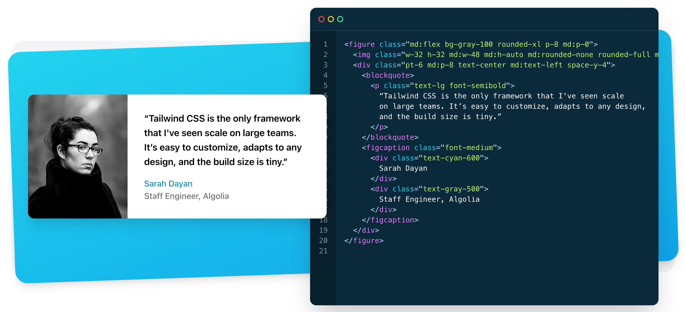

# Tailwind CSS



**官网**：[www.tailwindcss.cn/](https://link.juejin.cn/?target=https%3A%2F%2Fwww.tailwindcss.cn%2F)


**参考：**

1、[为什么使用Tailwind Css框架](https://juejin.cn/post/7066594369809154078)


## Tailwind CSS 介绍

Tailwind 能够快速将样式添加到 HTML 元素中，并提供了大量的开箱即用的设计样式

tailwindcss 基于比组件更小、更灵活的工具类思想的 CSS 框架。这个思想简单来说就是用 class 保证灵活、便于自定义组件，而不是在组件基础上实现个性化


**下面是一个简单的例子：**

```html
<div class="bg-gray-10 rounded-xl p-2">Hello World</div>
```

对应的一些场景：

1）背景 (bg-gray-200, bg-gradient-to-bl)

2）弹性布局 (flex-1, flex-row)

3）网格布局 (grid-cols-1, col-span-4)

4）内边距 (p-0, p-1)

5）尺寸 (w-1, h-1)

**Tailwind 的定义：**一个包含多个预定义类（所谓的工具类）的集合。开发者并不需要编写基础的 CSS 样式规则，只需要直接在 HTML 中应用已经事先定义好的类名。


TailwindCSS 的类名都是由 属性缩写 + 属性程度 + [属性值]。比如在默认情况下，TailwindCSS 对于数值分成几个程度，每个程度为 0.25rem。如： `mt-2` 表示 `margin-top: 0.5rem` 。对于 opacity 等属性还有属性值，如`bg-opacity-30` 表示 `--tw-bg-opacity: 0.3; // e.g. background-color: rgba(0, 0, 0, var(--tw-bg-opacity));`。（对于颜色、变换等，都会使用变量。）还提供了一些字面量，如 `md` `sm` 等用于响应式布局


**一些问题：**

但是在开发大型应用的时候，每一个 HTML 元素都充斥着一大堆 Tailwind 的工具类名：

```html
<div class="sm:w-4 md:w-6 lg:w-10 xl:w-full sm:text-sm md:text-base lg:text-base xl:text-2xl flex-1 sm:flex-none bg-black sm:bg-white rounded-md sm:rounded-none"> 
  hello world
</div>
```

解决：

Tailwind 允许我们在单个 CSS 文件中使用它们的类名：@apply

```js
.test {
  @apply relative w-full h-[40px] bg-background-regular flex items-center justify-between px-4 truncate;
}
```


还有一个问题就是，Tailwind CSS 这么多，根本记不住。此时可以利用 Tailwind CSS IntelliSense 这个 vscode 插件


## Tailwind CSS 的优点
