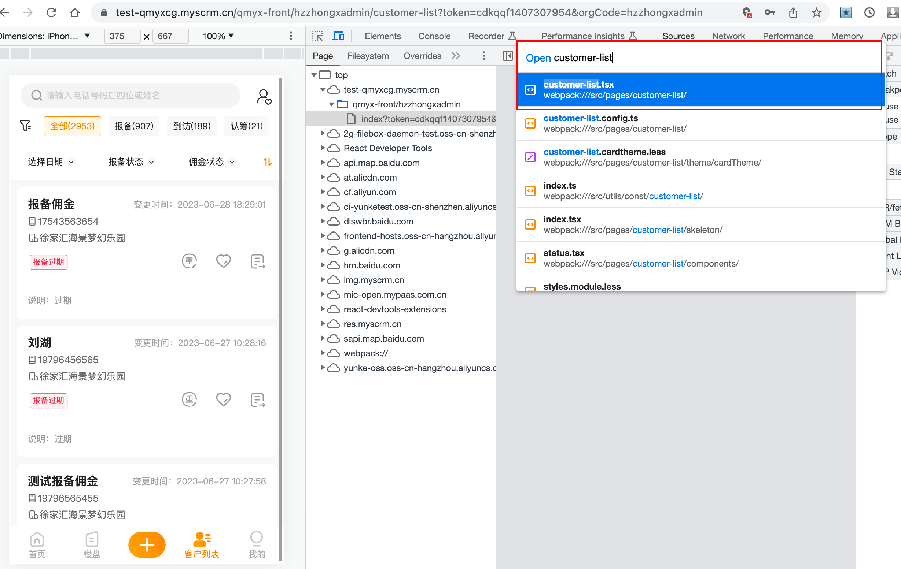

## 浏览器 source 调试技巧

### 1、source 定位打开对应的文件

直接在 source 面板  `ctrl + p`，可以打开文件跳转面板

> 需要注意的是：
>
> 1、如果使用了懒加载，那么需要打开那个页面，才会请求资源，才能找到那个页面相关的文件资源
>
> 2、如果没有 sourcemap（内联），那么也是没法定位到文件的

### 谷歌浏览器修改响应和请求头

参考：https://juejin.cn/post/7279295129348440122

