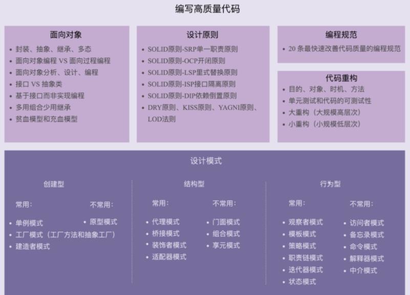

# 设计模式

可参考资料：

[1.5w字整理23种前端设计模式](https://juejin.cn/post/6868054744557060110)


设计模式就是在软件设计、开发过程中，针对普遍存在（反复出现）的各种问题、特定问题、场景的更优解决方案。

设计模式可以分为以下 3 种类型：

1、创建型模式：用来描述 “如何创建对象”（如何创建），它的主要特点是 “将对象的创建和使用分离”。包括单例、原型、工厂方法、抽象工厂和建造者 5 种模式。

2、结构型模式：用来描述如何将类或对象按照某种布局组成更大的结构（如何组合布局更大结构）。包括代理、适配器、桥接、装饰、外观、享元和组合 7 种模式。

3、行为型模式：用来识别对象之间的常用交流模式以及如何分配职责（如何分配职责）。包括模板方法、策略、命令、职责链、状态、观察者、中介者、迭代器、访问者、备忘录和解释器 11 种模式。


 


## 设计原则


[掌握设计原则，你就是光（25个问题，你会几个）](https://juejin.cn/post/6948235657978314783)


1. 单一职责原则
   - 一个程序只做好一件事
   - 如果功能过于复杂就拆分开，每个部分保持独立
2. 开放/封闭原则

   - 对扩展开放，对修改封闭
   - 增加需求时，扩展新代码，而非修改已有代码
3. 里氏替换原则

   - 子类能覆盖父类
   - 父类能出现的地方子类就能出现
4. 接口隔离原则

   - 保持接口的单一独立
   - 类似单一职责原则，这里更关注接口
5. 依赖倒转原则

   - 面向接口编程，依赖于抽象而不依赖于具
   - 使用方只关注接口而不关注具体类的实现


## 创建型


### 1、工厂模式

从字面意思上来理解工厂模式：对于消费者来说，并不关心你的生产流程，关心的是最终的产品。

所以为了让代码逻辑更加清晰，可读性更好，我们要善于将功能独立的代码块进行封装一个职责单一的类或者模块，这种基于抽象的思维就是工厂模式的来源。

工厂模式又分为简单工厂模式，工厂方法模式和抽象工厂模式。


#### 2-1、简单工厂

需要创建一个用户，没创建一个，就要写一次。

```js
const liMing = {
  name: "张三",
  age: 20,
  sex: "男",
};
```

那么可以创建一个类，来录入多个

```
class User {
  constructor(name, role) {
    this.name = name;
    this.role = role;
  }
}

const zhangsan = new User('张三', ['首页', '通讯录', '发现页'])
```


#### 2-2、工厂方法

当一个简单工厂变得过于复杂时，我们可以考虑用工厂方法来代替它。工厂方法的核心是**将实际创建对象的工作推迟到子类中**

```js
class User {
  constructor(name = '', viewPage = []) {
    this.name = name;
    this.viewPage = viewPage;
  }
}

class UserFactory extends User {
  constructor(name, viewPage) {
    super(name, viewPage)
  }
  create(role) {
    switch (role) {
      case 'superAdmin': 
        return new UserFactory( '超级管理员', ['首页', '通讯录', '权限管理'] );
        break;
      case 'admin':
        return new UserFactory( '管理员', ['首页', '通讯录'] );
        break;
      default:
        throw new Error('params error');
    }
  }
}
let userFactory = new UserFactory();
let superAdmin = userFactory.create('superAdmin');
let admin = userFactory.create('admin');
let user = userFactory.create('user');
```


### 2、单例模式

单例设计模式（Singleton Design Pattern）理解起来非常简单。一个类只允许创建一个对象（或者实例），那这个类就是一个单例类，这种设计模式就叫作单例设计模式，简称单例模式。

```js
class GetSeetingConfig {
  static instance = null

  constructor() {
    console.log('new')
  }

  static getInstance () {
    if (!this.instance) {
      this.instance = new GetSeetingConfig()
    }
    return this.instance
  }
}

const seeting1 = GetSeetingConfig.getInstance()
const seeting2 = GetSeetingConfig.getInstance()
//两次只打印一次 new
seeting1 === seeting2 // true
```


实际场景：例如 Vuex 的 store


## 结构型


### 1、代理模式

是为一个对象提供一个代用品或占位符，以便控制对它的访问

假设当 A 在心情好的时候收到花，小明表白成功的几率有 60%，而当 A 在心情差的时候收到花，小明表白的成功率无限趋近于 0。小明跟 A 刚刚认识两天，还无法辨别 A 什么时候心情好。如果不合时宜地把花送给 A，花被直接扔掉的可能性很大，这束花可是小明吃了 7 天泡面换来的。但是 A 的朋友 B 却很了解 A，所以小明只管把花交给 B，B 会监听 A 的心情变化，然后选择 A 心情好的时候把花转交给 A，代码如下

```
let Flower = function() {}

let xiaoming = {
  sendFlower: function(target) {
    let flower = new Flower()
    target.receiveFlower(flower)
  }
}

let B = {
  receiveFlower: function(flower) {
    A.listenGoodMood(function() {
      A.receiveFlower(flower)
    })
  }
}

let A = {
  receiveFlower: function(flower) {
    console.log('收到花'+ flower)
  },
  listenGoodMood: function(fn) {
    setTimeout(function() {
      fn()
    }, 1000)
  }
}
xiaoming.sendFlower(B)
```


通过代理方式实现图片懒加载：

```js
class MyImg {
	static imgNode = document.createElement("img")
	constructor(selector) {
    	selector.appendChild(this.imgNode);
    }
    
    setSrc(src) {
    	this.imgNode = src
    }
}


class ProxyMyImg {
	static src = 'xxx本地预览图地址loading.gif'

	constructor(selector) {
		this.img = new Image

    // 通过代理的方式先设置一张本地默认图
    this.myImg = new MyImg(selector)
    this.myImg.setSrc(this.src)
  }
    
  setSrc(src) {
    // 设置 this.img.src 代表发起图片资源请求
    this.img.src = src
    // 等到图片资源加载完成
    this.img.onload = () => {
      // 再将图片设置上去
    	this.myImg.setSrc(src)
    }
  }
}

const img = new ProxyMyImg(document.body)
img.setSrc('xxx')
```


### 2、适配器模式

适配器模式的作用是解决两个软件实体间的接口不兼容的问题。使用适配器模式之后，原本由于接口不兼容而不能工作的两个软件实体可以一起工作。

现实中的例子：

- 港式插头转换器
- 电源适配器
- USB转接口

例如接口数据适配：

```js
const data1 = {name: 'alan'};
const data2 = {username: 'tom'};

function sayName(param) {
    console.log(param.name);
}

function adapter(param) {
    return { name: param.username }
}


sayName(data1);
sayName(adapter(data2));
```


### 3、装饰器模式

装饰器模式就是不改变原有的代码逻辑，达到增强代码功能的作用。就像打游戏，可以通过锻造增强装备。

```js
class Shape {
  constructor(name) {
    this.name = name
  }

  draw() {
    console.log(`draw ${this.name}`)
  }
}

class ColorDecorator {
  constructor(shape) {
    this.shape = shape
  }

  draw() {
    this.setColor()
    this.shape.draw()
  }

  setColor() {
    console.log(`color the ${this.shape.name}`)
  }
}

let circle = new Shape('circle')
circle.draw()

let decorator = new ColorDecorator(circle)
decorator.draw()
```


## 行为型


### 1、策略模式

策略模式简单描述就是：对象有某个行为，但是在不同的场景中，该行为有不同的实现算法。把它们一个个封装起来，并且使它们可以互相替换

例如：多层 if...else if

```
function doSoming(type) {
    let obj = {
        "aa": "1",
        "bb": "2",
        "cc": "3"
    }

    return obj[type]
}
```


### 2、观察者模式【发布-订阅模式】

观察者模式又称发布-订阅模式（Publish/Subscribe Pattern），也是经常接触到的设计模式，日常生活中的应用也比比皆是，比如你订阅了某个博主的频道，当有内容更新时会收到推送；又比如 Vue 的响应式。观察者模式的思想用一句话描述就是：被观察对象（subject）维护一组观察者（observer），当被观察对象状态改变时，通过调用观察者的某个方法将这些变化通知到观察者。

```
class EventBus {
  constructor() {
    this.events = {}
  }

  // 实现订阅
  on(type, callback) {
    if (!this.events) {
      this.events = Object.create(null)
    }

    if (!this.events[type]) {
      this.events[type] = [callback]
    } else {
      this.events[type].push(callback)
    }
  }

  // 发布
  emit(type, params) {
    if (!['String', 'Object', 'Undefined'].includes(checkType(params))) {
      throw new Error('参数必须是字符串或者对象或者不传')
    }

    this.events[type] && this.events[type].forEach((cb) => cb(params))
  }

  // 删除订阅
  off(type, callback) {
    if (!this.events[type]) return
    this.events[type] = this.events[type].filter((item) => {
      return item !== callback
    })
  }

  // 只执行一次订阅
  once(type, callback) {
    function fn() {
      callback()
      this.off(type, fn)
    }

    this.on(type, fn)
  }
}
```