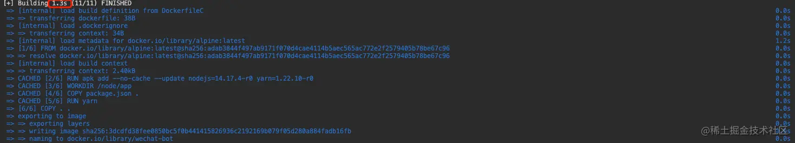

## 前端项目 Docker 优化

参考文章：

- [如何优化 node 项目的 docker 镜像](https://juejin.cn/post/6991689670027542564)


docker 的优化思路一般是两方面：

- 镜像体积大小优化
- 镜像构建速度优化


### Docker 镜像分层基本原理

1. Dockerfile 内部包含了一条条的指令，每一条指令构建一层，因此每一条指令的内容，就是描述该层如何构建

2. Docker 镜像不只是一个文件，而是由一堆文件组成，最主要的文件是 **层**（Layers）

   - 镜像构建时，会一层层构建，前一层是后一层的基础

     > 每一层构建完就不会再发生改变，后一层上的任何改变只发生在自己这一层。比如，删除前一层文件的操作，实际不是真的删除前一层的文件，而是仅在当前层标记为该文件已删除。在最终容器运行的时候，虽然不会看到这个文件，但是实际上该文件会一直跟随镜像

   - 镜像层将会被缓存和复用（这也是从第二次开始构建镜像时，速度会快的原因，优化镜像构建速度的原理也是利用缓存原理来做）

   - 当 Dockerfile 的指令修改了，操作的文件变化了，或者构建镜像时指定的变量不同了，对应的镜像层缓存就会失效

     > **docker build 的缓存机制，docker 是怎么知道文件变化的呢？**
     >
     > 
     >
     > Docker 采取的策略是：获取 Dockerfile 下内容（包括文件的部分 inode 信息），计算出一个唯一的 hash 值，若 hash 值未发生变化，则可以认为文件内容没有发生变化，可以使用缓存机制，反之亦然。

   - 某一层的镜像缓存失效之后，它之后的镜像层缓存都会失效

   - 镜像的每一层只记录文件变更，在容器启动时，Docker 会将镜像的各个层进行计算，最后生成一个文件系统


基于以上，可以得出：**镜像是由多层文件系统组成的，想要优化镜像的大小，就需要去减少层数、每一层尽量只包含该层需要的东西，任何额外的东西应该在该层构建结束前清理掉**


### 镜像例子

```dockerfile
FROM node:14.17.3

# 设置环境变量
ENV NODE_ENV=production
ENV APP_PATH=/node/app

# 设置工作目录
WORKDIR $APP_PATH

# 把当前目录下的所有文件拷贝到镜像的工作目录下 .dockerignore 指定的文件不会拷贝
COPY . $APP_PATH

# 安装依赖
RUN yarn

# 暴露端口
EXPOSE 4300

CMD yarn start
```

这份镜像，初始看，没啥问题。但是执行构建，**大小有 1 G 多，构建时间是 30 s**。

下面就是对这份镜像进行逐步优化。


### 优化方案


#### 优化 base 镜像

如上面的镜像例子，使用的是 node 完整版本

```dockerfile
FROM node:14.17.3
```


**方案一：使用 Node 的 Alpine 版本**

Alpine 是一个很小的 Linux 发行版，只要选择 Node 的 Alpine 版本，就会有很大改进，此时，只要把基础镜像改成：

```dockerfile
FROM node:14.17.4-alpine
```

构建镜像后，体积从 1 G 下降到 200 多M

可以在 [dockerhub](https://hub.docker.com/search?image_filter=official&q=) 中查找相关版本


还可以使用其它更小的镜像，例如：

```dockerfile
FROM mhart/alpine-node:14.17.3
```


**方案二：使用纯净 Alpine 镜像手动装 Node**

Alpine 是最小的 Linux，那么可以尝试使用纯净的 Alpine 镜像，再单独安装 Node

```dockerfile
FROM alpine:latest

# 使用 apk 命令安装 nodejs 和 yarn，如果使用 npm 启动，就不需要装 yarn
RUN apk add --no-cache --update nodejs=14.17.4-r0 yarn=1.22.10-r0

......
```

这种方式构建出来的镜像，只有 170+M


但是这种方式，需要注意的是：

>alpine 的包仓库，提供的包版本是会有变动的，指定版本安装包（eg: nodejs、yarn）会在往后构建导致找不到包对应的版本导致构建失败
>
>
>
>解决方式：
>
>1、在安装包时不指定版本
>
>```dockerfile
>RUN apk add --no-cache --update nodejs yarn
>```
>
>不推荐这种方式，因为项目往往是要指定版本的，不同版本会导致项目的一些依赖运行差异
>
>
>
>2、自制一个 alpine-node 基础镜像
>
>```dockerfile
>FROM alpine:3.14
>
># 安装 nodejs 和 yarn
>RUN apk add --no-cache --update nodejs=14.19.0-r0 yarn=1.22.10-r0
>```
>
>发布到 dockerhub，当需要使用的时候，以这个自制镜像为基础镜像


#### 优化镜像层

主要的手段：**减少层数、不经常变动的层提到前面去**

还是以上面镜像例子为例，可以做优化的地方：

- `ENV` 指令是可以一次性设置多个环境变量，能一次指令执行完，就不用两次，多一个指令就多一层
- `EXPOSE` 指令是暴露端口，其实也可以不用写这个指令，在启动容器的时候自己映射端口，如果写了这个指令的话，因为端口不经常变，所以把这个指令提前

```dockerfile
FROM node:14.17.3

# 暴露端口
EXPOSE 4300

# 设置环境变量
ENV NODE_ENV=production \
    APP_PATH=/node/app

# 设置工作目录
WORKDIR $APP_PATH

# 把当前目录下的所有文件拷贝到镜像的工作目录下 .dockerignore 指定的文件不会拷贝
COPY . $APP_PATH

# 安装依赖
RUN yarn

# 启动命令
CMD yarn start
```


#### 优化缓存

其实，对于前端项目，每次执行构建的时候，最耗时的都是执行依赖安装的过程。而在开发的过程中，大部分时候我们只是改代码，依赖不变，这时候如果可以让这一步缓存起来，依赖没有变化的时候，不需要重新装依赖，提高编译速度


镜像构建时，是一层层构建，前一层是后一层的基础，因此可以把 `package.json` 、`lock`文件单独提前拷贝到镜像，然后下一步装依赖，执行命令装依赖这层的前一层是进行拷贝，因为安装依赖命令不会变化，所以只要 `package.json` 和 `lock` 文件没变化，就不会重新执行 `yarn` 安装依赖，会复用之前安装好的依赖


```dockerfile
FROM node:14.17.3

# 暴露端口
EXPOSE 4300

# 设置环境变量
ENV NODE_ENV=production \
    APP_PATH=/node/app

# 设置工作目录
WORKDIR $APP_PATH

# 拷贝 package.json 到工作跟目录下
COPY ["package.json .", "yarn.lock ."]

# 安装依赖
RUN yarn

# 把当前目录下的所有文件拷贝到镜像的工作目录下 .dockerignore 指定的文件不会拷贝
COPY . .

# 启动命令
CMD yarn start
```


此时，执行 build，编译时间从 30s 降到 2s，使用了缓存的层前面会有个 CACHED：



