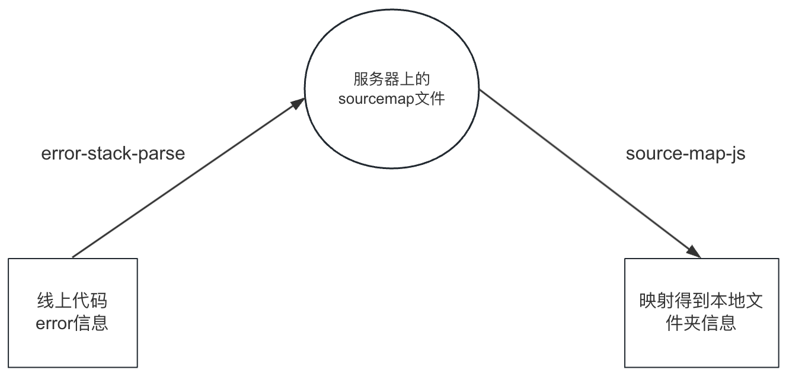

# 错误监控

错误监控相关


## sourcemap还原

生产环境，拦截到的错误是项目打包后的错误，无法找到报错的代码信息（文件路径、行数、列数），所以需要进行映射，这样可以更高效的排查解决问题。


安装两个依赖包：

- error-stack-parser
- source-map-js

```shell
npm i error-stack-parser source-map-js --save
```



- `error-stack-parser`可以基于`js error`类还原出错误信息的堆栈、行数、构建后的报错文件名
- `source-map-js`可以基于线上异常信息和服务器上的`sourcemap`文件，来得到最后的源文件信息


实际实现：

```js
const logStackTrace = async error => {
      let errorInfo = `错误信息：${error}`;
      // sourcemap代码映射，获取源代码位置信息
      try {
        const res = ErrorStackParser.parse(new Error(error));
        // 文件名路径分组
        const errorFileNameGroup = res[0].fileName.split('/');
        // 线上版本，0.0.160
        const version = errorFileNameGroup.find(_ => _.includes('0.0')) || '';
        // 文件名 xxx.js
        const fileName = errorFileNameGroup[errorFileNameGroup.length - 1];
        const aoneNameIndex = errorFileNameGroup.findIndex(_ =>
          _.includes('eleme')
        );
        // aone名，xxxx
        const aoneName = errorFileNameGroup[aoneNameIndex];
        // 项目名，projectA
        const projectName = errorFileNameGroup[aoneNameIndex + 1];
        if (version && fileName && aoneName && projectName) {
          const sourceMapPath = `https://sourcemap.def.alibaba-inc.com/sourcemap/${aoneName}/${projectName}/${version}/client/js/${fileName}.map`;
          let sourceRes = await loadSourceMap(sourceMapPath);
          if (sourceRes.includes('Redirecting to')) {
            // sourcemap的文件在OSS，需要重定向请求一次
            let ossPath = sourceRes.split('Redirecting to')[1].trim();
            ossPath = ossPath.slice(0, ossPath.length - 1);
            sourceRes = await loadSourceMap(ossPath);
          }
          const sourceData = JSON.parse(sourceRes);
          const consumer = await new sourceMap.SourceMapConsumer(sourceData);
          const result = consumer.originalPositionFor({
            line: Number(res[0].lineNumber),
            column: Number(res[0].columnNumber),
          });
          errorInfo += `，文件路径为：${result.source}，报错代码行数：${result.line}行，报错代码列数：${result.column}列`;
        }
      } catch (e) {
        console.log('捕捉sourcemap出错:', e);
      } finally {
        this.ErrorReducer.pushJsError(errorInfo);
      }
};
```

> 如果是普通项目对于`sourcemap`文件没有保护机制的话，直接通过网络请求访问应该就可以了


