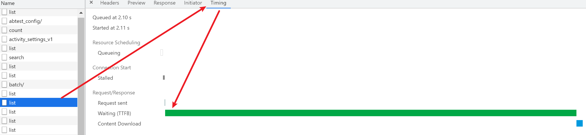

# 前端性能监控


## 性能指标


### window.performance API

```js
// 兼容 performance API
var performance = window.performance || window.msPerformance || window.webkitPerformance
```

可以拿到相应的数据：


- performance.memory：内存相关，表示内存使用情况。
- performance.navigation：来源相关，表示是如何导航到这个页面的，以及重定向的次数。
- performance.timing：关键点时间，统计了页面从网页开始导航到加载完成的一些时间点，通过计算某些特定事件的时间差，从而获取中间过程的耗时，就可以得出一些用于页面性能监控的指标。
- performance.onresourcetimingbufferfull：缓冲区满后回调函数
- performance.timeOrigin：页面基准时间

其中比较重要的是 performance.timing，关键点时间。


下面是对这三个所有字段的解析：

```js
var performance = {
    // memory 是非标准属性，只在 Chrome 有
    memory: {
        usedJSHeapSize:  16100000, // JS 对象（包括V8引擎内部对象）占用的内存，一定小于 totalJSHeapSize
        totalJSHeapSize: 35100000, // 可使用的内存
        jsHeapSizeLimit: 793000000 // 内存大小限制
    },

    //  哲学问题：我从哪里来？
    navigation: {
        redirectCount: 0, // 如果有重定向的话，页面通过几次重定向跳转而来
        type: 0           // 0   即 TYPE_NAVIGATENEXT 正常进入的页面（非刷新、非重定向等）
                          // 1   即 TYPE_RELOAD       通过 window.location.reload() 刷新的页面
                          // 2   即 TYPE_BACK_FORWARD 通过浏览器的前进后退按钮进入的页面（历史记录）
                          // 255 即 TYPE_UNDEFINED    非以上方式进入的页面
    },

    timing: {
        // 在同一个浏览器上下文中，前一个网页（与当前页面不一定同域）unload 的时间戳，如果无前一个网页 unload ，则与 fetchStart 值相等
        navigationStart: 1441112691935,

        // 前一个网页（与当前页面同域）unload 的时间戳，如果无前一个网页 unload 或者前一个网页与当前页面不同域，则值为 0
        unloadEventStart: 0,

        // 和 unloadEventStart 相对应，返回前一个网页 unload 事件绑定的回调函数执行完毕的时间戳
        unloadEventEnd: 0,

        // 第一个 HTTP 重定向发生时的时间。有跳转且是同域名内的重定向才算，否则值为 0 
        redirectStart: 0,

        // 最后一个 HTTP 重定向完成时的时间。有跳转且是同域名内部的重定向才算，否则值为 0 
        redirectEnd: 0,

        // 浏览器准备好使用 HTTP 请求抓取文档的时间，这发生在检查本地缓存之前
        fetchStart: 1441112692155,

        // DNS 域名查询开始的时间，如果使用了本地缓存（即无 DNS 查询）或持久连接，则与 fetchStart 值相等
        domainLookupStart: 1441112692155,

        // DNS 域名查询完成的时间，如果使用了本地缓存（即无 DNS 查询）或持久连接，则与 fetchStart 值相等
        domainLookupEnd: 1441112692155,

        // HTTP（TCP） 开始建立连接的时间，如果是持久连接，则与 fetchStart 值相等
        // 注意如果在传输层发生了错误且重新建立连接，则这里显示的是新建立的连接开始的时间
        connectStart: 1441112692155,

        // HTTP（TCP） 完成建立连接的时间（完成握手），如果是持久连接，则与 fetchStart 值相等
        // 注意如果在传输层发生了错误且重新建立连接，则这里显示的是新建立的连接完成的时间
        // 注意这里握手结束，包括安全连接建立完成、SOCKS 授权通过
        connectEnd: 1441112692155,

        // HTTPS 连接开始的时间，如果不是安全连接，则值为 0
        secureConnectionStart: 0,

        // HTTP 请求读取真实文档开始的时间（完成建立连接），包括从本地读取缓存
        // 连接错误重连时，这里显示的也是新建立连接的时间
        requestStart: 1441112692158,

        // HTTP 开始接收响应的时间（获取到第一个字节），包括从本地读取缓存
        responseStart: 1441112692686,

        // HTTP 响应全部接收完成的时间（获取到最后一个字节），包括从本地读取缓存
        responseEnd: 1441112692687,

        // 开始解析渲染 DOM 树的时间，此时 Document.readyState 变为 loading，并将抛出 readystatechange 相关事件
        domLoading: 1441112692690,

        // 完成解析 DOM 树的时间，Document.readyState 变为 interactive，并将抛出 readystatechange 相关事件
        // 注意只是 DOM 树解析完成，这时候并没有开始加载网页内的资源
        domInteractive: 1441112693093,

        // DOM 解析完成后，网页内资源加载开始的时间
        // 在 DOMContentLoaded 事件抛出前发生
        domContentLoadedEventStart: 1441112693093,

        // DOM 解析完成后，网页内资源加载完成的时间（如 JS 脚本加载执行完毕）
        domContentLoadedEventEnd: 1441112693101,

        // DOM 树解析完成，且资源也准备就绪的时间，Document.readyState 变为 complete，并将抛出 readystatechange 相关事件
        domComplete: 1441112693214,

        // load 事件发送给文档，也即 load 回调函数开始执行的时间
        // 注意如果没有绑定 load 事件，值为 0
        loadEventStart: 1441112693214,

        // load 事件的回调函数执行完毕的时间
        loadEventEnd: 1441112693215
    }
}
```


下图是 整个 `timing` 的结构：


比较有用的页面性能数据大概包括如下几个，这些参数是通过上面的 performance.timing 各个属性的差值组成的，是精确到毫秒的一个值，计算方法如下：

- 重定向耗时：redirectEnd - redirectStart
- DNS 查询耗时 ：domainLookupEnd - domainLookupStart
- TCP 链接耗时 ：connectEnd - connectStart
- HTTP 请求耗时 ：responseEnd - responseStart
- 解析 dom 树耗时 ：domComplete - domInteractive
- 白屏时间 ：responseStart - navigationStart
- DOMready 时间 ：domContentLoadedEventEnd - navigationStart
- onload 时间：loadEventEnd - navigationStart，也即是 onload 回调函数执行的时间。


### 几个关键性能指标

 


#### FP（First Paint）

首次绘制【白屏时间】，首次渲染的时间点，指页面第一次有内容渲染出来的时间(浏览器从响应用户输入网址到浏览器开始显示内容的时间)


**如何获取 FP 时间：**

可以直接通过 `performance.getEntriesByType('paint')` 方法获取到：

 


####  FCP（First Contentful Paint）

首次有内容的绘制【首屏时间】，首次内容绘制的时间点，指浏览器第一次向屏幕绘制内容。只有首次绘制文本、图片/背景图、非白色的 canvas 或 SVG 时才算数。

FCP 最优的时间是 1s 以内。


**FP 和 FCP 的区别：**

FP 是当浏览器开始绘制内容到屏幕上的时候，只要在视觉上开始发生变化，无论是什么内容触发的视觉变化，这一个时间点就叫做 FP。而 FCP 指的是浏览器首次绘制来自 DOM 的内容例如文本、图片等。所以 FP 和 FCP 可能是相同的时间，也可能是先 FP 后 FCP。

 


**如何获取 FCP 时间：**

- 可以直接通过 `performance.getEntriesByType('paint')` 方法获取到

   


- 也可以通过谷歌开源的 [web-vitals](https://github.com/GoogleChrome/web-vitals) 库来度量 FCP：

  web-vitals 提供了几个 API，可以度量一些指标，其中一个就可以度量 FCP

   

  ```js
  import {getFCP} from 'web-vitals';
  
  // Measure and log FCP as soon as it's available.
  getFCP(console.log);
  ```

  > 在某些情况下（比如跨域 iframes），通过 JavaScript 不可能度量出 FCP。web-vitals 库说明了其存在的[局限](https://github.com/GoogleChrome/web-vitals#limitations)。


- 还可以通过谷歌浏览器的 Lighthouse 查看：

    


#### TTI（Time To InterActive）

可交互时间。从页面开始到它的主要子资源加载到能够快速地响应用户输入的时间(没有耗时长任务)


**如何获取 TTI 时间：**

- 可以通过 performance.timing 的 `domContentLoadedEventEnd` 进行一个**粗略**的估算：

  ```js
  TTI: domContentLoadedEventEnd - navigationStart
  ```

- 如果需要更精细的计算即如果, 可以通过 `Google` 提供的 `tti-polyfill` 来进行数据获取：

  ```js
  import ttiPolyfill from 'tti-polyfill'
  
  ttiPolyfill.getFirstConsistentlyInteractive(opts).then((tti) => {
    // Use `tti` value in some way.
  })
  ```

- 或者使用 Lighthouse 面板获取。

    


#### LCP（Largest Contentful Paint）

最大内容绘制时间。从首次加载到最大的图片或是文本块或者其它最大内容出现在视图内的渲染时间。


为了提供良好的用户体验，应该将 LCP 控制在 2.5s 的范围内。


**如何获取 LCP 时间：**

- 可以通过谷歌开源的 [web-vitals](https://github.com/GoogleChrome/web-vitals) 库来度量 LCP：

  ```js
  import {getLCP} from 'web-vitals';
  
  // Measure and log LCP as soon as it's available.
  getLCP(console.log);
  ```

- 或者使用 Lighthouse 面板获取。

    


#### FID（First Input Delay）

FCP 和 TTI 之间用户首次与页面交互时响应的延迟时间。是度量用户从第一次与页面交互(例如，当他们点击一个链接，点击一个按钮，或者使用一个自定义的 javascript 组件)到浏览器真正能够开始处理事件处理程序以响应该交互的时间。


为了提供良好的用户体验，应该将 FID 控制在 100ms 的范围内。


**如何获取 FID 时间：**

可以通过谷歌开源的 [web-vitals](https://github.com/GoogleChrome/web-vitals) 库来度量 FID：

```js
import {getFID} from 'web-vitals';

// Measure and log FID as soon as it's available.
getFID(console.log);
```


#### TBT（Total Blocking Time）

记录在 FCP 到 TTI 之间所有长任务的阻塞时间总和。当有长任务（在主线程上的运行时间超过 50ms 的）存在时我们就认为主线程是阻塞的。我们说主线程被阻塞是因为浏览器不能中断正在进行的任务。因此，当用户在一个长任务运行时与页面交互，浏览器必须等待任务完成后才能响应。

如果任务足够长（例如超过 50 ms），用户很可能会注意到页面加载延迟。


**如何获取 TBT 时间：**

可以通过 Lighthouse 面板获取

 


#### CLS（Cumulative Layout Shift）

记录了页面上预期的位移波动。就是在页面的整个生命周期中每一次意外布局移位的总和。


如果一个可见元素在前后两帧中的位置发生了变化，就会发生布局移位。要注意的是，只有当现有元素改变了它们的起始位置时，布局才会发生变化，如果一个新元素被添加到 DOM 中，或者某个元素改变了大小，只要这个改变不会导致其它可见元素的起始位置发生变化，它的布局就没有变化。


为了提供良好的用户体验，应该将 CLS 控制在 0.1 的范围内。


**如何获取 CLS 时间：**

- 可以通过谷歌开源的 [web-vitals](https://github.com/GoogleChrome/web-vitals) 库来度量 CLS：

  ```js
  import {getCLS} from 'web-vitals';
  
  // Measure and log CLS in all situations
  // where it needs to be reported.
  getCLS(console.log);
  ```

- 可以通过 Lighthouse 面板获取

    


#### TTFB（Time To First Byte）

首字节时间。指网络请求被发起到接收到第一个字节的这段时间，其中包含了 TCP 连接时间、发送 HTTP 请求时间和获得响应消息第一个字节的时间。


**如何获取 TTFB 时间：**

- 通过 performance API 得到：

  ```js
  performance.timing.responseEnd - performance.timing.requestStart
  ```

- 单独某一个请求的 TTFB 可以通过 network 面板查看

  

