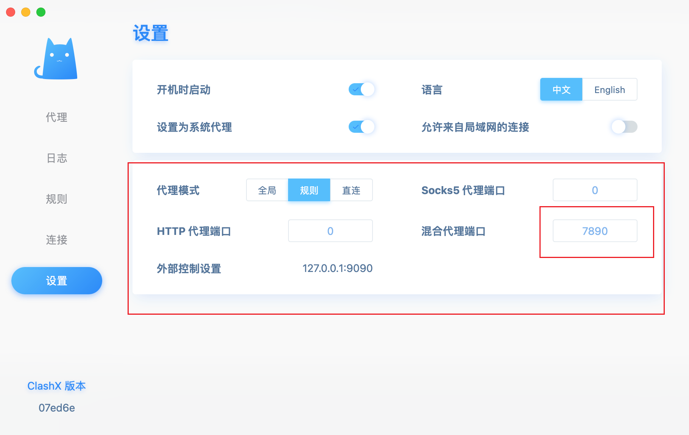

### github 使用代理

经常，在进行 git clone 或者 git push 时，由于 github 是在外网，而没法将项目拉取或者提交
这个时候，就可以使用代理


#### 获取代理地址

首先，需要有外网环境，例如 clash，然后拿到 clash 的代理地址



clash 的代理地址为：http://127.0.0.1:7890


#### 设置代理

然后，设置代理，有几种方式：

1、全局设置代理（不建议）

```shell
git config --global https.proxy http://127.0.0.1:7890
```

2、单个项目设置代理

```shell
git config --local http.proxy http://127.0.0.1:7890
```

3、只对某个地址设置代理（推荐）

```shel
git config --global http.https://github.com.proxy http://127.0.0.1:7890
```


取消代理

```shell
git config --global --unset http.proxy
```


查看全局代理

```shell
git config --global -l
```


#### 更多

一些关于 github 设置代理的讨论：https://gist.github.com/laispace/666dd7b27e9116faece6
