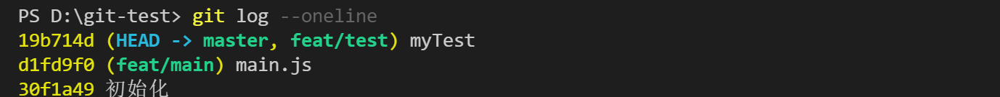
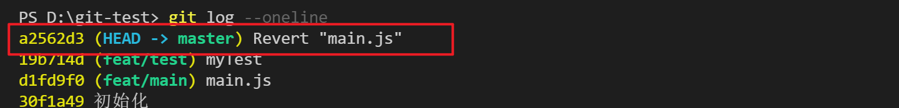

## Git 实践


### 1、常规使用

1. 将主分最新支代码拉下来

   ```js
   git pull origin master
   ```

2. 以主分支为基础，创建一个分支，并且切换到创建的分支

   ```js
   git checkout -b feat/xxx
   ```

   分支命名规范：

   - featute：或者简写 feat，代表新的迭代，加入新功能
   - hotfix：代表 bug 修复
   - optimize：代表优化，不影响现有功能
   - ......

3. 保存代码

   ```js
   git add .
   
   git commit -m ""
   ```

   如果发现 commit 有错，想要修改：

   ```js
   git commit --amend
   ```

4. 最后，在提交到 mr 的时候，需要将 commit 合并成一个

   ```js
   git rebase -i HEAD~2
   ```

   中途不想合并，可以取消

   ```js
   git rebase --abort
   ```

   如果合并途中有冲突，那么先修复冲突，然后：

   ```js
   git add .
   
   git rebase --continue
   ```

5. 多人开发，可能在开发途中，别人发了一个版本，那么当前分支落后主分支，需要合并主分支

   ```js
   // 1、先切换到主分支，将主分支最新代码 pull 下来
   git pull origin master
   
   // 2、然后切换回自己分支，合并主分支代码
   git rebase master
   ```

6. 最后，提交代码，发起 mr

   ```js
   git push origin feat/xxx
   ```

7. 在代码 code review 的时候，修复问题，再次推送到远程分支，如果推送不成功，可以使用强制推送

   ```js
   git push origin feat/xxx -f
   ```

   

### 2、线上出现问题，需要版本重做

1. 先找到需要重做的版本

   ```js
   git log --oneline
   ```

    

2. 然后进行版本重做

   ```js
   git rever 090aa90
   ```

   那么就会将撤销 090aa90 操作，此操作不会修改原本的提交记录，而是会新增一条提交记录来抵消某次操作

    


执行了 `git revert` 版本重做之后：

1. 以最新 master 分支创建新分支
2. 切换到新分支
3. 新分支 cherry-pick 评估代码的 commit id，得到评估版本文件
4. 处理冲突 --> add --> commit --> push
5. 重新提交 mr


### 3、获取当前分支名

1、通过 `git symbolic-ref`

```bash
const { execSync } = require('child_process');

const branchName = execSync('git symbolic-ref --short -q HEAD', {
  encoding: 'utf8'
}).trim();
```


2、通过 `git rev-parse`

```bash
const { execSync } = require('child_process')

const branch = execSync('git rev-parse --abbrev-ref HEAD').toString().replace(/\s+/, '');
```


