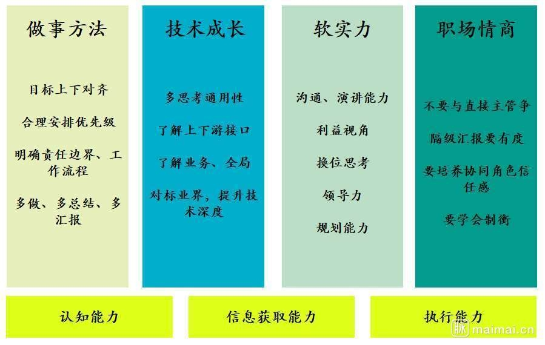

#### 学会如何工作，和学习技术一样重要

很多人，经常会或多或少有这些疑问：
1、为什么感觉自己做了很多，技术上却没提升？
2、为什么感觉自己像是个工具人，缺少价值感？
3、为什么自己很想表现自己，却很少受到认可？
4、为什么自己干的多，晋升的比别人晋升的慢？

今天就跟大家来聊一聊，互联网大厂的工作方法，或多或少可以解答上述疑问。
首先，我们有个基本的前提，拉开人与人之间差距的，主要有3个因素（当然身体第一）：
认知能力、信息获取能力、执行程度。这三个因素会影响你在职场所有的过程和结果。要先审视这三个要素，给自己一个客观的定位，我们再来谈具体的方法。

【认知能力】
首先要知道自己的认知，大概处在一个什么水准。我们假设市场待遇是相对客观的，那如果你自己是小圈子里的大牛，履历、职级、薪资都高出同龄人，大概率你对事情的认知水平是没问题的。如果你发现你的状况低于同水平的人，先不要怨天尤人，大概率你在认知上，在这个阶段或拉平年龄职级看还有进步的空间，先保持谦虚和空杯状态，多学习如何看透事情的背后和本质，这个环节后续我们可以深入讨论。

【信息获取能力】
要判断自己的信息获取能力是否足够强。一个是公司内的信息获取能力，一个是公司外行业的信息获取能力。公司内，你要知道大概的组织架构是什么样子的，大概的人与人之间的合作关系和渊源是怎样的。哪些是自己不能惹的对象，哪些是可以合作的对象，哪些是自己需要堤防的对象。经常会有些小同学，自己部门空降的领导都不认识，上来就得罪了，那可能后边所有的方法都免谈了。公司外的信息获取能力，就是要时不时关注下行业其他公司的状况，不要错过机会，当然这个不要花自己太多精力。

【执行程度】
如果你的认知是正常水准的，你的信息获取能力和意识是有的，那大概率你可以判断你当前的处境和局面不会有太大的自身缺陷和外部阻挠，如果你发现自己的认知水平在一个地方得不到提升或者信息获取不到，那大概率这个公司有问题，建议看一看外部行业的信息，换一换地方。后边就是要拼执行力了，所有的方法，都跟执行力有关系。执行力分为你的执行效率和执行质量。比如：我下边的同学，有的人，可以坚持，但坚持下来的含金量总是不尽人意。有的人，总是今天像打了鸡血，明天就凉了，这都是问题。要培养自己的快速执行、坚持和要做就做最好的意识和能力。

【做事方法篇】
1、目标上下对齐
做事之前，一定更要知道自己做这个事情的是属于哪个项目或者模块，这个项目或模块的目标是什么？有哪些人？Owner是谁。一般会在月度、双月、季度等环节，我都会跟部门下的同学说清部门目标、各方向目标和分工。避免好多同学最后产出不太OK，是目标不对，方向偏了。
2、合理安排优先级
目标没问题了，要合理安排自己手头事情的优先级。高优紧急的事情，要先做。当然，这个优先级，自己拿不准的时候，一定要找这个事情的Owner或者而部门领导对齐。否则你的产出可能不合时宜。
3、明确责任边界、工作流程
这个是大部分3年以下的同学，都会经常犯的错误，就是干了不该自己干的活，或者该自己干的活以为是该别人干。一个项目里，有运营、有产品、有分析师、有前端、有后端、有数据、有算法，一定要知道自己的职责范围是什么，职责范围内的一定要干好，不是自己职责范围的，如果你足够资深，可以推动一起解决问题。当然，如果你是Owner，那你的职责范围就是项目成败了。工作流程，也是一样，好多小同学，做事不按需求流程来，导致自己被陷入日常的不合规需求中，有口难开。发现这种情况，要及时跟主管沟通，要知道正确的研发流程是什么样的。
4、多做、多总结、多汇报
多做一点，在绝大多数情况下，是OK的。自己做的事情，要多总结复盘，并不是出了问题才需要复盘，自己要经常自己复盘。项目达到一个里程碑，要及时向部门领导呈现，确保自己做的事情是OK的。

【技术成长篇】
1、多思考通用性
不要只做需求。有一个很有意思的现象，相同难度的需求，你交给同职级的同学做，有的同学的方案就是具有通用性，甚至优秀的同学可以由此产生一个简单的复用性高的产品或者框架。但有些同学，就只是做需求，日积月累就觉得没有价值感，工具人。所以，我想说的是，价值感，很多时候，需要你先体现出自己的价值要高于其他人，才不会沦为工具人。价值感，是一个定性的词汇，很多时候是自我的一种感知。技术深度，技术赋能业务的方案，很多时候，是需要花额外时间思考和抽象的，是需要在工作中甚至工作外钻研的，不要用战术上的勤奋掩盖了战略上的懒惰。
2、了解上下游接口
业界大牛，王慧文曾经说过，如果你能在两个领域达到前25%的水平，你就具备不可替代性，这也就是所谓的π型人才。所以，在自己的技术领域OK的情况下，要有了解上下游技术对接的意识，可以先从上下游技术对接的接口文档开始，你们之间是如何交互的，接口文档设计需要注意哪些技术指标等等。慢慢的你也可以成为架构师。
3、了解业务、了解全局
经常有的同学做事情，不了解全局，一问三不知，或者其实他的工作只是项目中很小的一点，最后预期和绩效gap。觉得自己做的很好，其实没有拿到业务收益，或者说他做的东西只是全局中的一小部分。优秀的同学，你让他做一件事情，他总能了解全局，知道自己做的事情在这个局中的比重，合理安排自己的投入和方向，拿到匹配的收益。
4、对标业界，提升技术深度
其实，现在已经是互联网的下半场。大部分技术，在各个公司或多或少都会有一些成熟的解决方案。一定要打开自己的眼界，多去了解一些公司内其他部门或者公司外的解决方案，才能不断提升自己的技术深度。要不断假设自己的方案不是完美的。

【软实力篇】
1、沟通和演讲能力
这个可以根据自己的职级，沟通能力是都需要的，演讲能力尤其是项目负责人、部门Leader同学一定更要具备。说不清楚，讲不明白很难把大家团结在一起。大部分场景，要从无到有驱动一个事情，是需要舌战群儒的。
2、利益视角、换位思考
职场要收起自己的情绪，多从利益视角，换位考虑问题。做这些事情能否给大家、合作方、业务带来收益。不要YY，自己觉得好，但没人受益。
3、领导力
如果你觉得自己的技术水平还可以，以上的能力也都具备，那我建议你一定要培养自己的无授权领导力。就是一定可以拎起一个项目，或者从无到有拉扯一群人跟你落地一个事情，并符合大多数人的利益。即使在没有汇报关系，或者你没有绩效考核权的情况下，也一定要迈出这一步，这是你走向领导岗位必经的一步。
4、规划能力：不用多说，在自己的领域范围，在关键节点，抬头看路比低头干活更重要。还有句话：把事情清楚的记下来，问题就解决了一半。

【职场情商】
1、不要与直接主管争
要想清楚一件事情，自己手头所有的事情，都是直接主管安排的，你的晋升和绩效都是你的主管具有很大的决定权。如果你不能帮助直接主管开疆拓土，那也没有资格去争论更多权益。当然，如果确实受到了不公平待遇，那另说，该反馈反馈。
2、隔级汇报要有度
有句话叫，你的隔级主管才是你真正的主管。这句话，对于已经是领导的同学是对的，但是如果你还是个兵，不要轻信这句话，否则你会很惨。在和自己直接主管达成一致的情况下再隔级汇报，更容易拿到更大的成果。有隔级主管找你，也要及时和主管对齐信息，这样你会越走越顺。
3、要培养协同角色信任感
有时候，你很难推进一个事情，可能不是你的技术问题，或者流程问题，而是你自己没有取得别人的信任。信任这个东西，需要慢慢培养，不能操之过急。所以，要培养自己可以被信任的特质。生活没有彩排，每个需求和表现，都有可能影响你的信任力。
4、要学会制衡
这个说起来比较复杂。我想表达的是，不要以为自己跟办公室政治无关，只是，可能你已经身处其中，或者你并不是那么重要，才没有感知。所以，要知道可以跟谁争，不跟谁争，要制衡谁，要成就谁。才能成就自己。