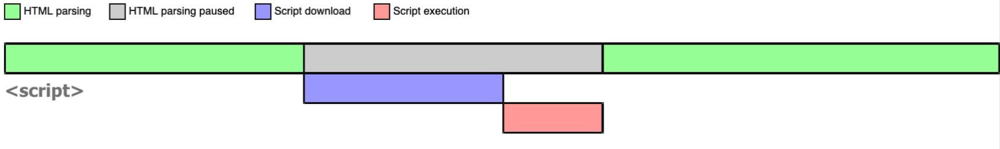
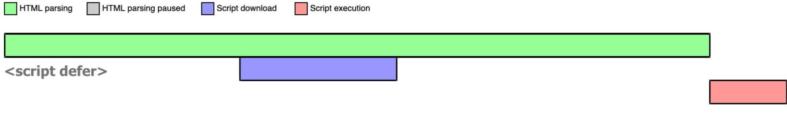
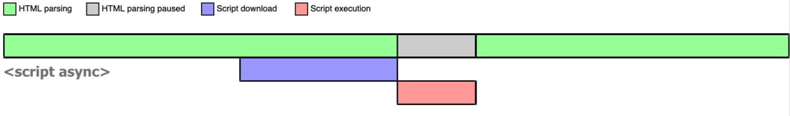
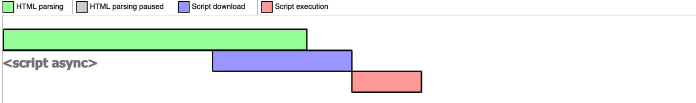

## HTML 相关知识点汇总

- [「2021」高频前端面试题汇总之HTML篇](https://juejin.cn/post/6905294475539513352)
- [html篇--这可能是目前较为全面的html面试知识点了吧](https://juejin.cn/post/6844904180943945742)
- [HTML专栏](https://github.com/yisainan/web-interview/blob/master/content/HTML.md)
- [HTML 面试知识点总结](https://github.com/CavsZhouyou/Front-End-Interview-Notebook/blob/master/Html/Html.md)


#### 1、XHTML与 HTML 的区别

相对于 HTML，XHTML 是 XML(可以自定义标签，过于宽松) 重写了 HTML 的规范，比 HTML 更加严格

- XHTML 标签名必须小写
- XHTML 元素必须被关闭
- XHTML 元素必须被正确的嵌套
- XHTML 元素必须要有根元素
- 把所有 < 和 & 特殊符号用编码表示
- 图片必须有 alt 属性说明文字


#### 2、图片的 title 与 alt 属性

- alt 是 img 的特有属性，当图片无法正常显示时候的替代文字、读屏器阅读图片，搜索引擎会重点分析
- title 通常当鼠标滑动到元素上的时候显示


#### 3、iframe 的优缺点

可以参考：https://www.pianshen.com/article/3071165311/

**优点：**

- iframe 可以实现无刷新文件上传
- 如果有多个网页引用 iframe，那么你只需要修改 iframe 的内容，就可以实现调用的每一个页面内容的更改，方便快捷
- iframe 能够原封不动的把嵌入的网页展现出来
- 如果遇到加载缓慢的第三方内容如图标和广告，这些问题可以由 iframe 来解决

**缺点：**

- iframe 会阻塞主页面的 onload 事件，如果页面的 onload 事件不能及时触发，会让用户觉得网页加载很慢，用户体验不好
- 无法被一些搜索引擎索引到，不利于 SEO
- 框架结构中出现各种滚动条
- 页面会增加服务器的 http 请求
- 会产生很多页面，不容易管理

现在基本上都是用 Ajax 来代替 iframe，所以 iframe 已经渐渐的退出了前端开发


#### 4、块级元素、行内元素、空元素

-   行内元素： a, b, span, img, input, select, strong, button
-   块级元素： div, ul, li, dl, dt, dd, h1-6, p 等
-   空元素： `<br>, <hr>, , <link>, <meta>` 等

块级元素和行内元素区别：

- 块级元素独占一行、可以设置宽高、margin、padding 等
- 行内元素不占一行、不可以设置宽高、padding 和 margin 只能设置左右而上下无效


#### 5、页面导入样式使用 link 和 @import 有什么区别

- link 属于 HTML 标签，而 @import 是 css 提供的
- 页面被加载时，link 会同时被加载，而 @import 引用的 css 会等到页面被加载完再加载
- @import 只在 IE5 以上才能识别，而 link 是 HTML 标签，无兼容问题
- link 方式的样式的权重高于 @import 的权重


#### 6、src 与 href 的区别

- src 用于替换当前元素；href 用于当前文档与引用资源质检确立联系
- src 是 source 的缩写，指向的内容将会嵌入到文档中当前标签所在位置；在请求src 资源时会将其指向的资源下载并应用到文档内，例如 js 脚本，img 图片和 frame 等元素
- href 是 Hypertext Reference 的缩写，指向网络资源所在位置，建立和当前元素（锚点）或当前文档（链接）之间的链接


#### 7、为什么图片不会阻塞浏览器渲染，js 脚本会

图片和 js 都是通过 src 引入的，为什么图片不会阻塞浏览器渲染，而 js 脚本通过 src 引入会阻塞浏览器渲染呢？

> 首先，必须要知道的是，src 引入的资源是不会阻塞浏览器渲染的，js 脚本通过 src 引入会阻塞与这个无关。主要的原因是 js 是可以操作 DOM 的，所以需要等到 js 完全加载完才继续进行渲染。

那既然图片不会阻塞浏览器的渲染，图片懒加载的意义是什么？
> 1、图片加载本身不会阻塞 DOMContentLoaded，但是会影响 load 事件的触发，加载完全部图片后才会触发 load。
2、图片资源本身会占一个 http 请求，即使浏览器做了相关优化也会占优先级和带宽，会和关键 html 与 css 资源抢带宽，影响首屏加载时间


#### 8、HTML 语义化的理解

语义化是指根据内容的结构化（内容语义化），选择合适的标签（代码语义化），便于开发者阅读和写出更优雅的代码的同时，让浏览器的爬虫和机器很好的解析。

**好处：**

- 有利于SEO：和搜索引擎建立良好沟通，有助于爬虫抓取更多的有效信息：爬虫依赖于标签来确定上下文和各个关键字的权重
- 便于团队开发和维护，语义化更具可读性，遵循 W3C 标准的团队都遵循这个标准，可以减少差异化
- 方便其他设备解析（如屏幕阅读器、盲人阅读器、移动设备）以意义的方式来渲染网页


#### 9、HTML5 新特性

**1、语义化标签：**

- header：定义文档的页眉（头部）
- nav：定义导航链接的部分
- footer：定义文档或节的页脚（底部）
- article：定义文章内容
- section：定义文档中的节（section、区段）
- aside：定义其所处内容之外的内容（侧边）

**2、媒体标签**

- audio：音频
- video：视频

**3、表单**

- email：能够验证当前输入的邮箱地址是否合法
- url：验证URL
- number：只能输入数字，其他输入不了，而且自带上下增大减小箭头，max属性可以设置为最大值，min可以设置为最小值，value为默认值
- search：输入框后面会给提供一个小叉，可以删除输入的内容，更加人性化
- range：可以提供给一个范围，其中可以设置max和min以及value，其中value属性可以设置为默认值
- color：提供了一个颜色拾取器
- time：时分秒
- data：日期选择年月日
- datatime：时间和日期
- datatime-local：日期时间控件
- week：周控件
- month：月控件

**4、其他**

- 数据存储：localStorage、sessionStorage
- canvas（画布）
- Geolocation（地理定位）
- websocket（通信协议）
- history API：go、forward、back、pushstate

**5、移除的元素**

- 纯表现的元素：basefont，big，center，font, s，strike，tt，u
- 对可用性产生负面影响的元素：frame，frameset，noframes；


#### 10、script 标签的的 defer 与 async

浏览器在解析 HTML 的时候，如果遇到一个没有任何属性的 script 标签，就会暂停解析，先发送网络请求获取该 JS 脚本的代码内容，然后让 JS 引擎执行该代码，当代码执行完毕后恢复解析。整个过程如下图所示：



可以看到，script 阻塞了浏览器对 HTML 的解析，如果获取 JS 脚本的网络请求迟迟得不到响应，或者 JS 脚本执行时间过长，都会导致白屏，用户看不到页面内容。


**defer script**

当浏览器遇到带有 defer 属性的 script 时，获取该脚本的网络请求也是异步的，不会阻塞浏览器解析 HTML，一旦网络请求回来之后，如果此时 HTML 还没有解析完，浏览器不会暂停解析并执行 JS 代码，而是等待 HTML 解析完毕再执行 JS 代码，图示如下：



如果存在多个 defer script 标签，浏览器（IE9及以下除外）会保证它们按照在 HTML 中出现的顺序执行，不会破坏 JS 脚本之间的依赖关系。


**async script**

当浏览器遇到带有 async 属性的 script 时，请求该脚本的网络请求是异步的，不会阻塞浏览器解析 HTML，一旦网络请求回来之后，如果此时 HTML 还没有解析完，浏览器会暂停解析，先让 JS 引擎执行代码，执行完毕后再进行解析，图示如下：



如果在 JS 脚本请求回来之前，HTML 已经解析完毕了，那就啥事没有，立即执行 JS 代码，如下图所示：



所以 async 是不可控的，因为执行时间不确定，你如果在异步 JS 脚本中获取某个 DOM 元素，有可能获取到也有可能获取不到。而且如果存在多个 async 的时候，它们之间的执行顺序也不确定，完全依赖于网络传输结果，谁先下载完就先执行谁。


#### 11、HTML5 drag API

- dragstart：事件主体是被拖放元素，在开始拖放被拖放元素时触发
- darg：事件主体是被拖放元素，在正在拖放被拖放元素时触发
- dragenter：事件主体是目标元素，在被拖放元素进入某元素时触发
- dragover：事件主体是目标元素，在被拖放在某元素内移动时触发
- dragleave：事件主体是目标元素，在被拖放元素移出目标元素是触发
- drop：事件主体是目标元素，在目标元素完全接受被拖放元素时触发
- dragend：事件主体是被拖放元素，在整个拖放操作结束时触发


#### 12、渐进增强与优雅降级

- 渐进增强：主要是针对低版本的浏览器进行页面重构，保证基本的功能情况下，再针对高级浏览器进行效果、交互等方面的改进和追加功能，以达到更好的用户体验
- 优雅降级：一开始就构建完整的功能，然后再针对低版本的浏览器进行兼容


#### 13、a 标签的四个伪类

- a:link，定义正常链接的样式
- a:visited，定义已访问过链接的样式
- a:hover，定义鼠标悬浮在链接上时的样式
- a:active，定义鼠标点击链接时的样式


#### 14、Doctype 作用? 标准模式与怪异模式？

- Doctype：<!DOCTYPE> 声明位于文档中的最前面，处于 html 标签之前。主要作用是：告诉浏览器（解析器）应该以什么样（html或xhtml）的文档类型定义来解析文档
- 标准模式：又称为严格模式，指浏览器按照 W3C 标准解析代码
- 怪异模式：又称混杂模式、兼容模式，是指浏览器用自己的方式解析代码，怪异模式通常模拟老式浏览器的行为，以防止老站点无法工作
- `<!doctype html>` 的作用就是让浏览器进入标准模式，使用最新的 HTML5标准来解析渲染页面；如果不写，浏览器就会进入怪异模式，应避免使用怪异模式


#### 15、如何让 IE6/IE7/IE8 支持 HTML5 标签

- 可以通过 `document.createElement` 方式创建 html5 标签
- 使用 html5shim 库


#### 16、浏览器内核

现在说的浏览器内核包括
- 渲染引擎：用于渲染页面
- js 引擎：用于加载执行 js

最开始渲染引擎和 JS 引擎并没有区分的很明确，后来 JS 引擎越来越独立，内核就倾向于只指渲染引擎


主流浏览器的内核：

- Trident：这种浏览器内核是 IE 浏览器用的内核，因为在早期 IE 占有大量的市场份额，所以这种内核比较流行，以前有很多网页也是根据这个内核的标准来编写的，但是实际上这个内核对真正的网页标准支持不是很好。但是由于 IE 的高市场占有率，微软也很长时间没有更新 Trident 内核，就导致了 Trident 内核和 W3C 标准脱节。还有就是 Trident 内核的大量 Bug 等安全问题没有得到解决，加上一些专家学者公开自己认为 IE 浏览器不安全的观点，使很多用户开始转向其他浏览器

- Gecko：这是 Firefox 和 Flock 所采用的内核，这个内核的优点就是功能强大、丰富，可以支持很多复杂网页效果和浏览器扩展接口，但是代价是也显而易见就是要消耗很多的资源，比如内存

- Presto：Opera 曾经采用的就是 Presto 内核，Presto 内核被称为公认的浏览网页速度最快的内核，这得益于它在开发时的天生优势，在处理 JS 脚本等脚本语言时，会比其他的内核快3倍左右，缺点就是为了达到很快的速度而丢掉了一部分网页兼容性

- Webkit：Webkit 是 Safari 采用的内核，它的优点就是网页浏览速度较快，虽然不及 Presto 但是也胜于 Gecko 和 Trident，缺点是对于网页代码的容错性不高，也就是说对网页代码的兼容性较低，会使一些编写不标准的网页无法正确显示。WebKit 前身是 KDE 小组的 KHTML 引擎，可以说 WebKit 是 KHTML 的一个开源的分支

- Blink：谷歌在 Chromium Blog 上发表博客，称将与苹果的开源浏览器核心 Webkit 分道扬镳，在 Chromium 项目中研发 Blink 渲染引擎（即浏览器核心），内置于 Chrome 浏览器之中。其实 Blink 引擎就是 Webkit 的一个分支，就像 webkit 是KHTML 的分支一样。Blink 引擎现在是谷歌公司与 Opera Software 共同研发，上面提到过的，Opera 弃用了自己的 Presto 内核，加入 Google 阵营，跟随谷歌一起研发 Blink


#### 17、meta 元数据

> `<meta>` 元素标签是提供有关HTML文档的元数据，元数据不会显示在页面上，但是能够被机器识别


可参考：[meta元素内容含义](https://juejin.cn/post/6844903957169438728) 、[meta标签的作用及整理](https://blog.csdn.net/yc123h/article/details/51356143?utm_medium=distribute.pc_feed_404.none-task-blog-2~default~BlogCommendFromMachineLearnPai2~default-2.nonecase&depth_1-utm_source=distribute.pc_feed_404.none-task-blog-2~default~BlogCommendFromMachineLearnPai2~default-2.nonecas)


**charset**

指定了 html 文档的编码格式，常用的是 utf-8

```html
<meta charset="utf-8">
```


**name 和 content**

> content 一般不单独使用，而是与 name、http-equiv 等配合使用

这部分对 SEO 非常有用，并且视口也是在这一块设置的

- author：定义了页面的作者

  ```html
  <meta name="author" content="gweid">
  ```

- keyworks：为搜索引擎提供关键字

  ```html
  <meta name="keyworks" content="html,js,css">
  ```

- description：对网页的整体描述

  ```js
  <meta name="description" content="一个 xxx 的平台">
  ```

- robots：定义网页搜索引擎

  ```html
  <!-- 通常有如下几种取值：none，noindex，nofollow，all，index和follow。 -->
  <meta name="robots" content="index,follow">
  ```
  
- viewport：设置页面视口

  ```js
  <meta name="viewport" content="width=device-width, initial-scale=1.0, maximum-scale=1.0, minmum-scale=1.0">
  ```

  - width：viewport 宽度(width=device-width 将页面宽度设置为跟随屏幕宽度变化而变化)
  - height: viewport 高度（很少使用）
  - initial-scale：初始缩放比例
  - maximum-scale：允许用户缩放的最大比例，0.0-10.0 正数
  - minimum-scale：允许用户缩放的最小比例，0.0-10.0 正数，必须小于或等于 maximum-scale
  - user-scalable：是否允许用户手动缩放(yes or no)


**http-equiv 与 content**

- refresh：刷新或者跳转网页

  ```html
  <!-- 每30秒刷新一次网页 -->
  <meta http-equiv="refresh" content="30">
  
  <!-- 3秒后跳转到 page2.html 页面 -->
  <meta http-equiv="refresh" content="3; url=page2.html" />
  ```

- X-UA-Compatible：告知浏览器以何种版本渲染网页

  ```html
  <!-- 使用 edge 浏览器 -->
  <meta http-equiv="X-UA-Compatible" content="ie=edge" />
  
  <!-- 优先使用最新的 chrome 版本 -->
  <meta http-equiv="X-UA-Compatible" content="chrome=1" />
  ```

- content-language：定义默认语言

  ```html
  <!-- 默认语言为中文 -->
  
  <meta http-equiv="content-language" content="zh-cn">
  ```

- Cache-Control：指定请求和响应遵循的缓存机制

  - public指示响应可被任何缓存区缓存

  - no-cache指示请求或响应消息不能缓存

  - no-store用于防止重要的信息被无意的发布。在请求消息中发送将使得请求和响应消息都不使用缓存。

  - max-age指示客户机可以接收生存期不大于指定时间（以秒为单位）的响应

  - min-fresh指示客户机可以接收响应时间小于当前时间加上指定时间的响应

  - max-stale指示客户机可以接收超出超时期间的响应消息。如果指定max-stale消息的值，那么客户机可以接收超出超时期指定值之内的响应消息。
  - 更多的属性可以参考 [MDN](https://developer.mozilla.org/zh-CN/docs/Web/HTTP/Headers/Cache-Control)

  ```html
  <!-- 禁止浏览器缓存 -->
  <meta http-equiv=”cache-control” content=”no-cache”>
  
  <!-- 禁止百度进行转码 -->
  <meta http-equiv="Cache-Control" content="no-siteapp">
  ```


**其他一些常用 meta 值**

```html
<!-- 设置网页缓存有效期 -->
<meta http-equiv="expires" content="Web,14 september 2020 16:30:00 GMT">

<!-- 禁止浏览器从本地计算机的缓存中访问页面内容 -->
<meta http-equiv="pragma" content="no-cache">

<meta name="apple-mobile-web-app-title" content="标题"> iOS 设备 begin
<meta name="apple-mobile-web-app-capable" content="yes"/>  添加到主屏后的标题（iOS 6 新增）

 是否启用 WebApp 全屏模式，删除苹果默认的工具栏和菜单栏
<meta name="apple-itunes-app" content="app-id=myAppStoreID, affiliate-data=myAffiliateData, app-argument=myURL">

添加智能 App 广告条 Smart App Banner（iOS 6+ Safari）
<meta name="apple-mobile-web-app-status-bar-style" content="black"/>

<meta name="format-detection" content="telphone=no, email=no"/>  设置苹果工具栏颜色
<meta name="renderer" content="webkit">  启用360浏览器的极速模式(webkit)
<meta name="HandheldFriendly" content="true">     针对手持设备优化，主要是针对一些老的不识别viewport的浏览器，比如黑莓
<meta name="MobileOptimized" content="320">   微软的老式浏览器
<meta name="screen-orientation" content="portrait">   uc强制竖屏
<meta name="x5-orientation" content="portrait">    QQ强制竖屏
<meta name="full-screen" content="yes">              UC强制全屏
<meta name="x5-fullscreen" content="true">       QQ强制全屏
<meta name="browsermode" content="application">   UC应用模式
<meta name="x5-page-mode" content="app">    QQ应用模式
<meta name="msapplication-tap-highlight" content="no">    windows phone 点击无高光

设置页面不缓存
<meta http-equiv="pragma" content="no-cache">
<meta http-equiv="cache-control" content="no-cache">
<meta http-equiv="expires" content="0">
```


#### 18、meta viewport 的原理

viewport 的原理：移动端浏览器通常都在一个比屏幕更宽的虚拟窗口中渲染页面，这个虚拟窗口就是viewport，目的是正常展示没有做移动端适配的网页，可以让他们完整的展现给用户；有时用移动设备访问桌面版网页就会看到一个横向滚动

解析：

Viewport ：字面意思为视图窗口，在移动 web 开发中使用。表示将设备浏览器宽度虚拟成一个特定的值（或计算得出），这样利于移动 web 站点跨设备显示效果基本一致。移动版的 Safari 浏览器最新引进了 viewport 这个 meta tag，让网页开发者来控制 viewport 的大小和缩放，其他手机浏览器也基本支持

在移动端浏览器当中，存在着两种视口，一种是可见视口（也就是设备大小），另一种是视窗视口（网页的宽度是多少）。 举个例子：假设屏幕是 320 像素 * 480 像素的大小（iPhone4），假设在浏览器中，320 像素的屏幕宽度能够展示 980 像素宽度的内容。那么 320 像素的宽度就是可见视口的宽度，而能够显示的 980 像素的宽度就是视窗视口的宽度。

为了显示更多的内容，大多数的浏览器会把自己的视窗视口扩大，简易的理解，就是让原本 320 像素的屏幕宽度能够容下 980 像素甚至更宽的内容（将网页等比例缩小）


#### 19、target

属性作用：指定所连接的页面在浏览器窗口中的打开方式

- \_self：默认值，在当前窗口打开
- \_blank：在新窗口打开
- \_parent ： 在父级窗口打开
- \_top ： 在顶级窗口打开


#### 20、label

当用户选择 label 标签时，浏览器会自动将焦点转到和 label 标签相关的表单控件上

```html
<!-- 使用方式1 -->
<label for="mobile">Number:</label>
<input type="text" id="mobile" />

<!-- 使用方式2 -->
<label>Date:<input type="text" /></label>
```


#### 21、title 与 h1 的区别、b 与 strong 的区别、i与 em 的区别？

- title 属性没有明确意义只表示是个标题，H1 则表示层次明确的标题，对页面信息的抓取有很大的影响
- i 内容展示为斜体，em 表示强调的文本
- strong 标签有语义，是起到加重语气的效果，而 b 标签是没有的，b 标签只是一个简单加粗标签。搜索引擎更侧重 strong 标签


#### 22、锚点定位

通过创建锚点链接，用户能够快速定位到目标内容

```html
<a href="#h1">点击进行锚点跳转</a>

<h3 id="h1">锚点目标</h3> 
```


#### 23、data-*

```html
<div data-user-name="jack" id="main">人名</div>

<script>
  const mainEle = document.getElementById('main')
  console.log(mainEle.dataset.userName)
  mainEle.dataset.userName = 'marry'
    
  // 还可以通过 getAttribute、setAttribute 方式操作
  mainEle.getAttribute('data-user-name')
  mainEle.setAttribute('data-user-name', 'mark')
</script>
```


#### 24、页面可见性

页面可见性： 就是对于用户来说，页面是显示还是隐藏。比如一次可以打开好多标签页面来回切换着，始终只有一个页面在我们眼前，其他页面就是隐藏的；还有一种就是把浏览器最小化，所有的页面就都不可见了

API 很简单，document.hidden 就返回一个布尔值，如果是 true, 表示页面可见，false 则表示，页面隐藏。 不同页面之间来回切换，触发 visibilitychange 事件。 还有一个 document.visibilityState, 表示页面所处的状态，取值：visible, hidden 等四个

使用场景：动画，视频，音频都可以在页面显示时播放，在页面隐藏时关闭；对服务器的轮询可以在隐藏的时候关闭


#### 25、如何实现浏览器内多个标签页之间的通信

实现多个标签页之间的通信，本质上都是通过中介者模式来实现的。因为标签页之间没有办法直接通信，因此我们可以找一个中介者，
让标签页和中介者进行通信，然后让这个中介者来进行消息的转发。


**1、使用 cookies**

在 A 页面，设置一个 cookies

```js
document.cookie = "userName=Allen";
```

在 B 页面，就可以拿到

```js
console.log(document.cookie);    // userName=Allen
```


**2、使用 localStorage**

A 页面存储

```js
localStorage.setItem("name", "lily")
```

B 页面拿到

```js
localStorage.getItem("name")
```


还可以监听 localStorage：

```js
window.addEventListener('storage', (event) => {})
```


**3、通过 WebSocket**

websocket 协议可以实现服务器推送，服务器就可以用来当做中介者。标签页通过向服务器发送数据，然后由服务器向其他标签页推送转发


**4、ShareWorker **

shareWorker 会在页面存在的生命周期内创建一个唯一的线程，并且开启多个页面也只会使用同一个线程。这个时候共享线程就可以充当中介者的角色。标签页间通过共享一个线程，然后通过这个共享的线程来实现数据的交换


#### 26、HTML5 的 form 如何关闭自动完成功能

将不想要自动完成的 `form` 或 `input` 设置为 `autocomplete=off`


#### 27、离线缓存

**什么是离线缓存**

- 离线缓存可以将站点的一些文件缓存到本地，它是浏览器自己的一种机制，

- 将需要的文件缓存下来，以便后期即使没有连接网络，被缓存的页面也可以展示。

- 即使有网络，优先本地存储的资源


**离线缓存优势**

-  离线浏览：用户可在应用离线时使用它们
- 速度：已缓存资源加载得更快
- 减少服务器负载：浏览器将只从服务器下载更新过或更改过的资源


**具体使用方式：**

- 首先，在需要使用离线缓存的页面
  ```html
  <html manifest = "cache.manifest"></html>
  ```
- 接着，编写 manifest 文件，说明哪些资源需要缓存


**浏览器怎么解析 manifest？**

- 在线的情况下，浏览器发现 html 头部有 manifest 属性，它会请求 manifest 文件，如果是第一次访问网页，那么浏览器就会根据 manifest 文件的内容下载相应的资源并且进行离线存储。如果已经访问过网页并且资源已经离线存储了，那么浏览器就会使用离线的资源加载页面，然后浏览器会对比新的 manifest 文件与旧的 manifest 文件，如果文件没有发生改变，就不做任何操作，如果文件改变了，那么就会重新下载文件中的资源并进行离线存储

- 离线的情况下，浏览器就直接使用离线存储的资源，manifest 文件基本格式如下：

  ```
  CACHE MANIFEST
  
  CACHE:
  ./js/main.js
  ./css/main.css
  
  NETWORK:
  * # * 代表除了在 CACHE 中的页面，其他都不缓存
  
  FALLBACK:
  # 当无法获取到该路径下的请求时，所有请求都会被转发到default.html文件来处理
  /app/ajax/ default.html
  ```

  - CACHE MANIFEST：标题，位于文件首行，告诉浏览器这个文件是干嘛的
  - CACHE：该部分指定需要缓存的文件列表
  - NETWORK：指定不需要缓存的文件，即永远从服务端获取
  - FALLBACK：指定文件获取失败后的处理方式


这里有几个注意点：

- 如果服务器对离线的资源进行了更新，那么必须更新 manifest 文件之后这些资源才能被浏览器重新下载，如果只是更新了资源而没有更新 manifest 文件的话，浏览器并不会重新下载资源，也就是说还是使用原来离线存储的资源。
- 对于 manifest 文件进行缓存的时候需要十分小心，因为可能出现一种情况就是你对 manifest 文件进行了更新，但是 http 的缓存规则告诉浏览器本地缓存的 manifest 文件还没过期，这个情况下浏览器还是使用原来的 manifest 文件，所以对于 manifest 文件最好不要设置缓存。
- 浏览器在下载 manifest 文件中的资源的时候，它会一次性下载所有资源，如果某个资源由于某种原因下载失败，那么这次的所有更新就算是失败的，浏览器还是会使用原来的资源。
- 在更新了资源之后，新的资源需要到下次再打开网页才会生效，如果需要资源马上就能生效，那么可以使用 `window.applicationCache.swapCache()` 方法来使之生效，出现这种现象的原因是浏览器会先使用离线资源加载页面，然后再去检查 manifest 是否有更新，所以需要到下次打开页面才能生效。


#### 28、前端需要注意哪些 SEO

- 合理的 title、description、keywords：搜索对着三项的权重逐个减小，title 值强调重点即可，重要关键词出现不要超过 2 次，而且要靠前，不同页面 title 要有所不同；description 把页面内容高度概括，长度合适，不可过分堆砌关键词，不同页面 description 有所不同；keywords 列举出重要关键词即可
- 语义化的 HTML 代码，符合 W3C 规范：语义化代码让搜索引擎容易理解网页
- 重要内容 HTML 代码放在最前：搜索引擎抓取 HTML 顺序是从上到下，有的搜索引擎对抓取长度有限制，保证重要内容一定会被抓取
- 重要内容不要用 js 输出：爬虫不会执行 js 获取内容
- 少用 iframe：搜索引擎不会抓取 iframe 中的内容
- 非装饰性图片必须加 alt
- 提高网站速度：网站速度是搜索引擎排序的一个重要指标

常说的 SEO 的 TDK 就是 title、description、keywords


#### 29、web 标准与 w3c 标准

web 标准简单来说可以分为结构、表现和行为。其中结构主要是有 HTML 标签组成。或许通俗点说，在页面 body 里面我们写入的标签都是为了页面的结构。表现即指 css 样式表，通过 css 可以是页面的结构标签更具美感。行为是指页面和用户具有一定的交互，同时页面结构或者表现发生变化，主要是有 js 组成。

web 标准一般是将该三部分独立分开，使其更具有模块化。但一般产生行为时，就会有结构或者表现的变化，也使这三者的界限并不那么清晰。

W3C 对 web 标准提出了规范化的要求，也就是在实际编程中的一些代码规范，包含如下几点：

- 对于结构要求：（标签规范可以提高搜索引擎对页面的抓取效率，对 SEO 很有帮助）
  - 标签字母要小写
  - 标签要闭合
  - 标签不允许随意嵌套

- 对于 css 和 js 来说
  - 尽量使用外链 css 样式表和 js 脚本。是结构、表现和行为分为三块，符合规范。同时提高页面渲染速度，提高用户的体验
  - 样式尽量少用行间样式表，使结构与表现分离，标签的 id 和 class 等属性命名要做到见文知义，标签越少，加载越快，用户体验提高，代码维护简单，便于改版
  - 不需要变动页面内容，便可提供打印版本而不需要复制内容，提高网站易用性


#### 30、用多个域名存储网站资源更有效？

- CDN 缓存更方便
- 突破浏览器并发限制，提高网站访问速度
- 并且一个域名挂掉，还可以通过其他域名打开
- 节约 cookie 带宽
- 节约主域名的连接数，优化页面响应速度
- 防止不必要的安全问题


#### 31、`<noscript>` 标签的作用

noscript 元素用来定义在脚本未被执行时的替代内容（文本）

此标签可被用于可识别 `<script>` 标签但无法支持其中的脚本的浏览器


#### 32、DOM 和 BOM 区别

- DOM：Document Object Model，文档对象模型。DOM 是为了操作文档出现的 API，document 是其的一个对象；DOM 和文档有关，这里的文档指的是网页，也就是 html 文档。DOM 和浏览器无关，他关注的是网页本身的内容

- BOM：Browser Object Model，浏览器对象模型。BOM 是为了操作浏览器出现的 API，window 是其的一个对象；window 对象为 javascript 访问浏览器提供 API，例如浏览器前进后退刷新等


#### 33、 div+css 的布局较 table 布局有什么优点

- 页面加载速度更快、结构化清晰、页面显示简洁，如果 table 的内容特别多，那么需要加载完所有 table 内容才会进行渲染而且没改动一个地方，整个 table 都会重新渲染

- 表现与结构相分离 

- 易于优化（seo）搜索引擎更友好，排名更容易靠前


#### 34、DOMContentLoaded 事件和 Load 事件的区别？

当初始的 HTML 文档被完全加载和解析完成之后，DOMContentLoaded 事件被触发，而无需等待样式表、图像和
子框架的加载完成

Load 事件是当所有资源加载完成后触发的


#### 35、IE 各版本和 Chrome 可以并行下载多少个资源？

- IE6 2 个并发，iE7 升级之后的 6 个并发，之后版本也是 6 个
- Firefox，chrome 也是6个


#### 36、为什么 HTML5 里面不需要DTD（Document Type Definition文档类型定义）？

HTML5没有使用 SGML 或者 XHTML，他是一个全新的东西，因此你不需要参考 DTD，对于 HTML5，你仅需放置下面的文档类型代码告诉浏览器识别这是 HTML5 文档


#### 37、常见的优化

 前端性能优化主要是为了提高页面的加载速度，优化用户的访问体验。可以从以下方面来进行优化：

 第一个方面是页面的内容方面

 （1）通过文件合并、css 雪碧图、使用 base64 等方式来减少 HTTP 请求数，避免过多的请求造成等待的情况。

 （2）通过 DNS 缓存等机制来减少 DNS 的查询次数。

 （3）通过设置缓存策略，对常用不变的资源进行缓存。

 （4）使用延迟加载的方式，来减少页面首屏加载时需要请求的资源。延迟加载的资源当用户需要访问时，再去请求加载。

 （5）通过用户行为，对某些资源使用预加载的方式，来提高用户需要访问资源时的响应速度。

 第二个方面是服务器方面

 （1）使用 CDN 服务，来提高用户对于资源请求时的响应速度。

 （2）服务器端启用 Gzip、Deflate 等方式对于传输的资源进行压缩，减小文件的体积。

 （3）尽可能减小 cookie 的大小，并且通过将静态资源分配到其他域名下，来避免对静态资源请求时携带不必要的 cookie

 第三个方面是 CSS 和 JavaScript 方面

 （1）把样式表放在页面的 head 标签中，减少页面的首次渲染的时间。

 （2）避免使用 @import 标签。

 （3）尽量把 js 脚本放在页面底部或者使用 defer 或 async 属性，避免脚本的加载和执行阻塞页面的渲染。

 （4）通过对 JavaScript 和 CSS 的文件进行压缩，来减小文件的体积。
  - height: viewport 高度
  - initial-scale：初始缩放比例
  - maximum-scale：允许用户缩放的最大比例，0.0-10.0 正数
  - minimum-scale：允许用户缩放的最小比例，0.0-10.0 正数，必须小于或等于 maximum-scale
  - user-scalable：是否允许用户手动缩放(yes or no)

