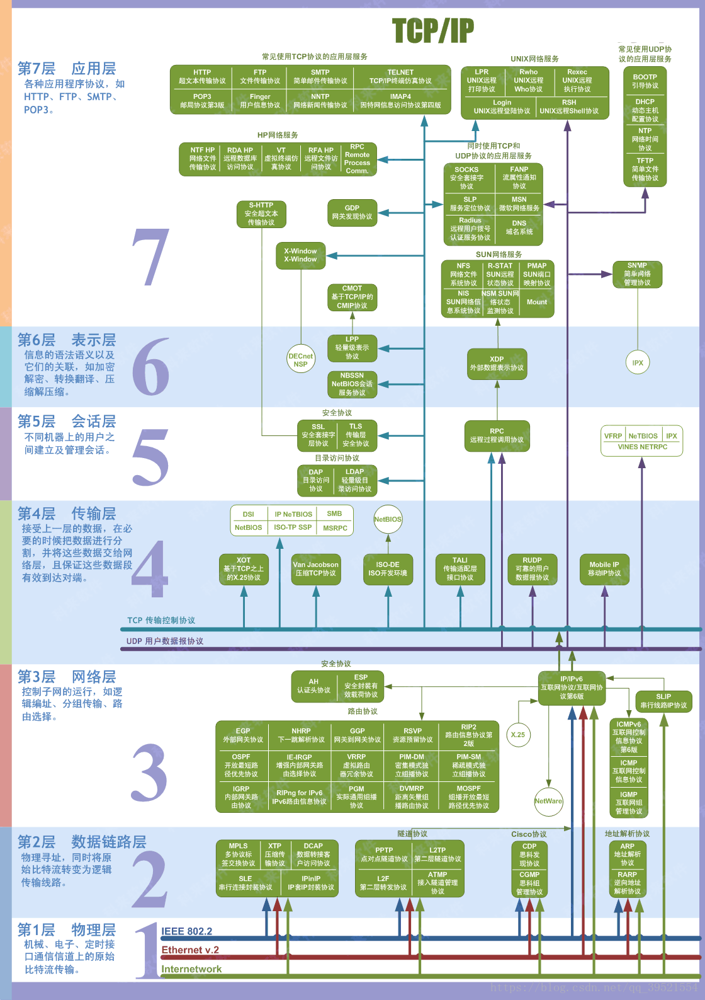
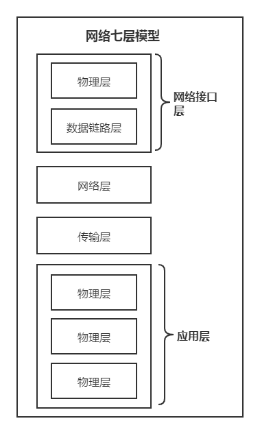
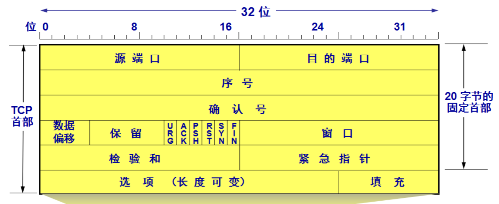

# 网络知识

本文为网络知识点随笔。

可参考：

[TCP协议灵魂之问，巩固你的网路底层基础](https://juejin.cn/post/6844904070889603085)

[关于 TCP 三次握手和四次挥手，满分回答在此](https://juejin.cn/post/6915024149203288072)

[计算机网络：TCP三次握手四次挥手面试题总结](https://juejin.cn/post/6867821346312290312)

[HTTP灵魂之问，巩固你的 HTTP 知识体系](https://juejin.cn/post/6844904100035821575)

[经得住拷问的HTTPS原理解析](https://juejin.cn/post/6942671833304924197)

[一文夯实你的网络基础](https://juejin.cn/post/6916818167205625863)

[网络知识点灵魂拷问](https://juejin.cn/post/6864175613209640973)

## 1、网络 OSI 七层模型与 TCP/IP 四层模型

 

### 1-1、网络 OSI 七层模型

- 物理层

- 数据链路层

  > 一般来讲，物理层与数据链路层归为网络接口层，比如说电缆、光纤之类的

- 网络层（ip）

- 传输层（tcp：安全可靠【三次握手】，分段传输，但是慢、udp：快【仅需发送一次确认】，但是会存在丢包）

- 会话层

- 表示层

- 应用层

  > 会话层、表示层、应用层归为应用层，主要就是 http

### 1-2、TCP/IP 四层模型

 

## 2、TCP

TCP 是传输层协议，是 HTTP 的上一层，所以可以说 HTTP 是基于 TCP 传输协议的。

### 2-1、TCP 与 UDP

TCP 是一个**面向连接的、可靠的、基于字节流的传输层协议。**

UDP 是一个**面向无连接的传输层协议。**

**两者之间的区别：**

- 面向连接：所谓的连接，指的是客户端和服务器的连接，在双方互相通信之前，TCP 需要三次握手建立连接；而 UDP 没有相应建立连接的过程，是即刻传输数据

- 可靠的：TCP 花了非常多的功夫保证连接的可靠性，主要体现在有状态和可控制。

  - TCP 有状态：精准记录哪些数据发送了，哪些数据被对方接收了，哪些没有被接收到，保证数据包按序到达，不允许半点差错
  - TCP 可控制：当意识到丢包了或者网络环境不佳，TCP 会根据具体情况调整自己的行为，控制自己的发送速度或者重发

  而 UDP 是无状态不可控的，所以 UDP 不能保证可靠性。

- 基于字节流：UDP 的数据传输是基于数据报的，这是因为仅仅只是继承了 IP 层的特性，而 TCP 为了维护状态，将一个个 IP 包变成了字节流

- 高效性（首部开销）：因为 UDP 没有 TCP 那么复杂，需要保证数据不丢失且有序到达。所以 UDP 的头部开销小，只有八字节，相比 TCP 的至少二十字节要少得多，在传输数据报文时是很高效的

- 拥塞控制：UDP 没有拥塞控制，一直会以恒定的速度发送数据。即使网络条件不好，也不会对发送速率进行调整。这样实现的弊端就是在网络条件不好的情况下可能会导致丢包，但是优点也很明显，在某些实时性要求高的场景（比如电话会议）就需要使用 UDP 而不是 TCP；TCP 有拥塞控制和流量控制机制，保证数据传输的安全性

- 服务对象：TCP 是一对一的两点服务，即一条连接只有两个端点；UDP 支持一对一、一对多、多对多的交互通信

**应用场景：**

由于 TCP 是面向连接，能保证数据的可靠性交付，因此经常用于：

- FTP 文件传输
- HTTP / HTTPS

由于 UDP 面向无连接，它可以随时发送数据，再加上UDP本身的处理既简单又高效，因此经常用于：

- 包总量较少的通信，如 DNS 、SNMP 等
- 视频、音频等多媒体通信
- 广播通信

### 2-2、TCP 报文段首部格式

 

其中几个比较重要的概念：

- **序号 Seq**：在一个 TCP 连接中传送的字节流中的每一个字节都按顺序编号。该字段表示本报文段所发送的数据的第一个字节的序号。**初始序号称为 Init Sequense Number, ISN**
- **确认号 ack**：期望收到对方下一个报文段的第一个数据字节的序号。若确认号为 N，则表明：到序号 N-1 为止的所有数据都已正确收到
- **确认 ACK**：仅当 ACK = 1 时确认号字段才有效，当 ACK = 0 时确认号无效。TCP 规定，在连接建立后所有传送的报文段都必须把 ACK 置为 1
- **同步 SYN**：SYN = 1 表示这是一个连接请求或连接接受报文。当 SYN = 1 而 ACK = 0 时，表明这是一个连接请求报文段。对方若同意建立连接，则应在响应的报文段中使 SYN = 1 且 ACK = 1。
- **终止 FIN**：用来释放一个连接。当 FIN = 1时，表明此报文段的发送发的数据已发送完毕，并要求释放运输连接。

### 2-3、TCP 三次握手

#### 2-3-1、握手过程

 

- `SYN`：连接请求/接收 报文段
- `seq`：发送的第一个字节的序号
- `ACK`：确认报文段
- `ack`：确认号。希望收到的下一个数据的第一个字节的序号

**刚开始客户端处于 `Closed` 的状态，而服务端处于 `Listen` 状态**：

> `CLOSED `：没有任何连接状态
>
> `LISTEN `：侦听来自远方 TCP 端口的连接请求

**第一次握手：**客户端向服务端发送一个 SYN 报文（SYN = 1），并指明客户端的初始化序列号 ISN(x)，即图中的 seq = x，表示本报文段所发送的数据的第一个字节的序号。此时客户端处于 `SYN_Send` 状态。

> `SYN-SENT` ：在发送连接请求后等待匹配的连接请求

**第二次握手：**服务器收到客户端的 SYN 报文之后，会发送 SYN 报文作为应答（SYN = 1），并且指定自己的初始化序列号 ISN(y)，即图中的 seq = y。同时会把客户端的 ISN + 1 作为确认号 ack 的值，表示已经收到了客户端发来的的 SYN 报文，希望收到的下一个数据的第一个字节的序号是 x + 1，此时服务器处于 `SYN_REVD` 的状态。

> `SYN-RECEIVED`：在收到和发送一个连接请求后等待对连接请求的确认

**第三次握手：**客户端收到服务器端响应的 SYN 报文之后，会发送一个 ACK 报文，也是一样把服务器的 ISN + 1 作为 ack 的值，表示已经收到了服务端发来的的 SYN 报文，希望收到的下一个数据的第一个字节的序号是 y + 1，并指明此时客户端的序列号 seq = x + 1（初始为 seq = x，所以第二个报文段要 +1），此时客户端处于 `Establised` 状态。

服务器收到 ACK 报文之后，也处于 `Establised 状态`，至此，双方建立起了 TCP 连接。

> `ESTABLISHED`：代表一个打开的连接，数据可以传送给用户

也就是说，对面是怎么确定是同一个发起连接的？首先，传过来的初始序号是 x，那么本地保存一个确认序号 x+1，如果下次传过来的序号不是 x+1，就可以确定不是同一个人发起的连接。

> 另外需要提醒你注意的是，SYN 是需要消耗一个序列号的，下次发送对应的 ACK 序列号要加1，因为凡是需要对端确认的，一定消耗TCP 报文的序列号。
>
> SYN 需要对端的确认， 而 ACK 并不需要，因此 SYN 消耗一个序列号而 ACK 不需要。

简单描述：

- 第一次握手，客户端告知服务端，我要发起请求

- 第二次握手，服务端表示收到通知，告知客户端可以开始发送请求

- 第三次握手，客户端收到，告知服务端，我要开始发送请求，请准备接收

由上面可以看出，进行数据传输，有一个重要的机制，就是接收方接收到数据包后必须要向发送方`确认`, 如果发送方没有接到这个`确认`的消息，就判定为数据包丢失，并重新发送该数据包。当然，发送的过程中还有一个优化策略，就是把`大的数据包拆成一个个小包`，依次传输到接收方，接收方按照这个小包的顺序把它们`组装`成完整数据包。

#### 2-3-2、三次握手过程中可以携带数据么

第三次握手的时候，可以携带。前两次握手不能携带数据。

如果前两次握手能够携带数据，那么一旦有人想攻击服务器，那么他只需要在第一次握手中的 SYN 报文中放大量数据，那么服务器势必会消耗更多的**时间**和**内存空间**去处理这些数据，增大了服务器被攻击的风险。

第三次握手的时候，客户端已经处于 `ESTABLISHED` （建立连接）状态，并且已经能够确认服务器的接收、发送能力正常，这个时候相对安全了，可以携带数据。

#### 2-3-3、为什么是三次握手？不是两次、四次？

**为什么不是两次？**

根本原因: 无法确认客户端的接收能力。

例如：失效的连接请求：主机 A 发出的连接请求没有收到主机 B 的确认，于是经过一段时间后，主机 A 又重新向主机 B 发送连接请求，且建立成功，顺序完成数据传输。但是连接关闭后，主机 A 第一次发送的连接请求并没有丢失，而是因为网络节点导致延迟达到主机 B，主机 B 以为是主机 A 又发起的新连接，于是主机 B 同意连接，并向主机 A 发回确认，但是此时主机 A 根本不会理会，主机 B 就一直在等待主机 A 发送数据，导致主机 B 的资源浪费。

**四次握手可以？**

三次握手的目的是确认双方 `发送` 和 `接收` 的能力，四次当然是可以的，100 次都可以。但为了解决问题，三次就足够了，再多用处不大，并且会有建立连接耗时过长问题。

### 2-4、四次挥手

#### 2-4-1、挥手过程

 

- `FIN` ：连接终止位
- `seq`：发送的第一个字节的序号
- `ACK`：确认报文段
- `ack`：确认号。希望收到的下一个数据的第一个字节的序号

四次挥手谁都可以先发起关闭，这里假设是客户端先发起关闭：

- **第一次挥手**：客户端发送一个 FIN 报文（请求连接终止：FIN = 1），报文中会指定一个序列号 seq = u。并**停止再发送数据，主动关闭 TCP 连接，但是会继续接受数据**。此时客户端处于 `FIN_WAIT1` （第一阶段等待状态）状态，等待服务端的确认。

  > `FIN-WAIT-1`  等待远程TCP的连接中断请求，或先前的连接中断请求的确认；第一阶段等待状态

  

- **第二次挥手**：服务端收到 FIN 之后，会发送 ACK 报文，且把客户端的序号值 +1 作为 ACK 报文的序列号值，表明已经收到客户端的报文了，此时服务端处于 `CLOSE_WAIT` 状态。此时服务端处于关闭等待状态，不会再接收数据，但会继续发送数据；客户端进入`FIN_WAIT2`（下一阶段等待状态）

  > `CLOSE-WAIT`  等待从本地用户发来的连接中断请求
  >
  > `FIN-WAIT-2`  从远程TCP等待连接中断请求

  

- **第三次挥手**：如果服务端也想断开连接了（没有要向客户端发出的数据），和客户端的第一次挥手一样，发送 FIN 报文，且指定一个序列号。此时服务端处于 `LAST_ACK` (最后确认阶段)的状态，等待客户端的确认。此时服务端不再接受和发送数据。

  > `LAST-ACK` - 等待原来发向远程TCP的连接中断请求的确认

  

- **第四次挥手**：客户端收到 FIN 之后，一样发送一个 ACK 报文作为应答（ack = w+1），且把服务端的序列值 +1 作为自己 ACK 报文的序号值（seq=u+1），此时客户端处于 **`TIME_WAIT` （时间等待）状态**。服务端收到后，会立即断开。

  - 注意了，这个时候，客户端需要等待 2MSL 才关闭，在这段时间内如果客户端没有收到服务端的重发请求，那么表示 ACK 成功到达，挥手结束，否则客户端重发 ACK。

简单描述：假设是客户端先发起关闭

- 第一次挥手：客户端发送请求，申请断开，进入等待阶段，此时不会发送数据，但是会继续接收数据

- 第二次挥手：服务端接收到请求，告知客户端已明白，此时服务端进入等待状态，不会再接收数据，但会继续发送数据；而客户端则进入下一阶段的等待状态

- 第三次挥手：服务端发送完剩余的数据后，告知客户端可以断开连接，此时服务端不会发送和接收数据，进入最后确认状态

- 第四次挥手：客户端收到后，告知服务端我开始断开连接，服务端收到后，直接就断开连接

#### 2-4-2、为什么需要等待 2MSL

保证客户端发送的最后一个 ACK 报文能够到达服务器，因为这个 ACK 报文可能丢失，若丢失，站在服务器的角度看来，我已经发送了请求断开了，客户端还没有给我回应，应该是我发送的请求断开报文它没有收到，于是服务器又会重新发送一次，而客户端就能在这个 2MSL 时间段内收到这个要求重传的报文，接着给出回应报文，并且会重启 2MSL 计时器

等待 1MSL 不可以吗？为什么要 2MSL

- 1 个 MSL 确保第四次挥手中主动关闭方最后的 ACK 报文最终能达到对端
- 1 个 MSL 确保对端如果没有收到 ACK，那么对端重新发送的 FIN 报文可以到达

#### 2-4-3、为什么是四次而不是三次

因为服务端在接收到`FIN`, 往往不会立即返回`FIN`, 必须等到服务端所有的报文都发送完毕了，才能发`FIN`。因此先发一个`ACK`表示已经收到客户端的`FIN`，延迟一段时间才发`FIN`。这就造成了四次挥手。

如果是三次挥手会有什么问题？

等于说服务端将`ACK`和`FIN`的发送合并为一次挥手，这个时候长时间的延迟可能会导致客户端误以为`FIN`没有到达客户端，从而让客户端不断的重发`FIN`。

## 3、HTTP

## 4、HTTPS

### 1. 请你概述一下HTTPS的工作流程
（简单的叙述，如果面试官要听具体的过程可以看第8题）

难度：🌟🌟🌟

HTTPS主要是采用对称密钥加密和非对称密钥加密组合而成的混合加密机制进行传输。

也就是发送密文的一方用"对方的公钥"进行加密处理"对称的密钥"，然后对方在收到之后使用自己的私钥进行解密得到"对称的密钥"，这在确保双发交换的密钥是安全的前提下使用对称密钥方式进行通信。

这个过程简单来说就是：

客户端首先向服务端发送一个HTTPS请求
服务端会把事先配置好的公钥证书随着其它的信息返回给客户端
客户端在收到服务端发来的证书之后进行验证，验证的过程参考数字证书验证，会得到服务端的信息以及它的公钥
验证成功之后生成一个叫做 client_params 的参数发送给服务器；同时自己会用伪随机函数生成一个 secret，这个secret就是它们后续进行通信的对称密钥。
服务器在收到刚刚的 client_params之后，也会根据伪随机函数生成一个secret。这时候双方都有了相同的对称密钥。
后面的传输都会用这个 secret 进行对称密钥加解密传输
### 2. 刚刚你提到的对称密钥加密和非对称密钥加密它们有什么区别吗？
难度：🌟🌟

对称密钥加密是最简单的一种加密方式，它的加解密用的都是相同的密钥，这样带来的好处就是加解密效率很快，但是并不安全，如果有人拿到了这把密钥那谁都可以进行解密了。

而非对称密钥会有两把密钥，一把是私钥，只有自己才有；一把是公钥，可以发布给任何人。并且加密的内容只有相匹配的密钥才能解。这样带来的一个好处就是能保证传输的内容是安全的，因为例如如果是公钥加密的数据，就算是第三方截取了这个数据但是没有对应的私钥也破解不了。不过它也有缺点，一是公钥因为是公开的，谁都可以过去，如果内容是通过私钥加密的话，那拥有对应公钥的黑客就可以用这个公钥来进行解密得到里面的信息；二来公钥里并没有包含服务器的信息，也就是并不能确保服务器身份的合法性；并且非对称加密的时候要消耗一定的时间，减低了数据的传输效率。

### 3. 那混合加密机制的好处是什么呢？
难度：🌟🌟

刚刚已经说到了对称密钥加密和非对称密钥加密都有它们各种的优缺点，而混合加密机制就是将两者结合利用它们各自的优点来进行加密传输。

比如既然对称密钥的优点是加解密效率快，那么在客户端与服务端确定了连接之后就可以用它来进行加密传输。不过前提是得解决双方都能安全的拿到这把对称密钥。这时候就可以里用非对称密钥加密来传输这把对称密钥，因为我们知道非对称密钥加密的优点就是能保证传输的内容是安全的。

所以它的好处是即保证了对称密钥能在双方之间安全的传输，又能使用对称加密方式进行通信，这比单纯的使用非对称加密通信快了很多。以此来解决了HTTP中内容可能被窃听的问题。

### 4. 那混合加密的缺点呢？
难度：🌟🌟

混合加密主要是为了解决HTTP中内容可能被窃听的问题。但是它并不能保证数据的完整性，也就是说在传输的时候数据是有可能被第三方篡改的，比如完全替换掉，所以说它并不能校验数据的完整性。如果需要做到这一点就需要使用到数字签名。

### 5. 数字签名？它是什么？
（数字签名的概念以及验证流程）

难度：🌟🌟🌟

数字签名的产生主要就是为了解决HTTP中内容可能被篡改的问题，即校验数据的完整性。它能确定消息是发送方发送过来的，因为这里会有一个验证数字签名的过程，别人是假冒不了发送方的签名的。

数字签名它是什么呢？它的产生过程其实就是两步，第一步将原文用Hash函数生成一个叫消息摘要的东西，第二步就是用发送方的私钥对这个消息摘要进行进行加密。这个产生的东西就叫做数字签名，它一般会与原文一起发送给接收者。

而验证它的过程其实也并不复杂。

首先发送方会将原文与数字签名(也就是加密后的摘要)一起发送给接收方
接收方会接收到这两样东西，即原文和数字签名
接收方用Hash函数处理原文会得到一份消息摘要
同时用发送方的公钥解密数字签名也会得到一份消息摘要
只要比较这两份消息摘要是否相等就可以验证出数据有没有被篡改了
当然这里关键的一步就是要保证发送方传递过来的公钥是可信赖的，这时候就得用到数字证书了。

### 6. 既然提到了数字证书那你就说说它吧
（数字证书的概念以及颁发流程）

难度：🌟🌟🌟

数字证书也叫公钥证书，或者简称证书。它主要是为了解决通信方身份遭伪装的问题，也就是验证通信方的身份。

因为我们知道在HTTPS中虽然有了混合加密机制保证数据不被监听，有了数字签名校验数据的完整性，但是数字签名校验的前提是能拿到发送方的公钥，并且保证这个公钥是可信赖的，所以就需要数字证书。

它简单来说其实是由一些权威的数字认证机构颁发给服务器的一个文件。数字认证机构简称CA，它是客户端和服务端都信任的第三方机构，我知道比较有名的一个就是威瑞信(VeriSign)。至于颁发证书的流程，主要是为：

服务器的运营人员会向认证机构提交自己的公钥、组织信息、个人信息等并申请认证
而认证机构在拿到这些信息后会通过线上、线下各种途径验证申请者提交信息的真实性
在确认其真实性后，认证机构给这些信息(申请者的公钥，组织信息，个人信息以及认证机构自己的信息等)，我们简称为明文信息，进行数字签名，过程也就是签名提到的数字签名的步骤：1.通过Hash函数处理明文信息生成一个信息摘要；2.再用认证机构自己的私钥对信息摘要进行加密处理。通过这两个步骤生成的文件就叫数字签名。
之后会将明文信息和数字签名组合而成的证书颁发给申请者，也就是服务器。
我画了证书的颁发流程：

### 7.为什么说数字证书就能对通信方的身份进行验证呢？
（数字证书使得浏览器能验证服务器，还有它的验证过程）

难度：🌟🌟🌟

那是因为在客户端第一次给服务端发送HTTPS请求的时候，服务端会将它自己的证书随着其它的信息(例如server_random、 server_params、需要使用的加密套件等东西)一起返给客户端。

客户端在收到之后首先会验证这个证书，只有验证通过之后才会有后续操作。而验证的过程其实也就是数字签名的验证过程(题5)：

前面说过了，证书其实是由明文信息(申请者的公钥，组织信息，个人信息以及认证机构自己的信息等)和这个明文信息的数字签名组成的。(对应着题5也就是原文和数字签名)
客户端会用Hash函数处理明文信息生成一个信息摘要
然后再用内置在浏览器上的CA的公钥来解密证书里的数字签名，得到一个信息摘要。因为我们知道证书实际是由CA颁发给服务器的，并且里面的数字签名也是用的CA的私钥加密的，所以只有CA的公钥才能解。
最后再将两个信息摘要进行对比，若是一样则能保证通信方的身份是正确的。
其实验证证书的过程不仅仅是数字签名的验证，客户端还会验证证书相关的域名信息，有效时间，是不是在CRL吊销列表里，以及它的上一级是否有效等等。

（一般答到这里就可以了，如果面试官继续问你上一级是否有效这样验证，你就回答：这是一个递归的过程，直到验证到根证书也就是操作系统内置的Root证书或者浏览器内置的Root证书为止）

就像前面说的，只有能用CA的公钥解密的数字签名并且通过了认证的证书才是有效的，因为证书是CA颁布的。这也就保证了客户端收到的服务器发来的公钥是真实可用的(因为公钥在证书的明文信息里)。

（想想其实很好理解，因为浏览器它自己没有辨别证书是否合法的能力，它就把这事交给CA去做，CA是信任的过的机构，它只要把自己的公钥内嵌到浏览器里，浏览器再用这个CA公钥来解证书里的签名就可以了。而证书的签名也是经过CA的私钥加密生成的，只有CA的公钥能解，但它的公钥又不是随便人能拿到的，只有各大浏览器厂商才有，所以这就是数字证书的验证过程）

### 8. 请详细的说一下HTTPS它的加密传输过程，涉及到哪些算法呢？
（前面的第1题只是概述，若是面试官叫你详细的说一下，涉及到具体算法的时候可以答这里）

难度：🌟🌟🌟🌟

在HTTPS加密传输中，实际上涉及到 SSL/TLS 协议，这里是有一个TSL握手的过程。对于传统的TLS握手也就是RSA握手我就不描述了，主要是说一下现在主流的TLS1.2版本的握手，也就是ECDHE握手。

它的过程大致来说是这样的：

客户端在第一次发送HTTPS请求的时候，会把 client_random、TSL版本号、加密套件列表发送给服务器

服务器在接收到之后确认TSL的版本号，同时发送 server_random、server_params、需要使用的加密套件、以及自己的证书给客户端

客户端在收到这些信息之后，首先是会对服务器的证书进行验证(也就是题目7)，若是验证成功则会传递一个 client_params 给服务器

与此同时客户端会通过ECDHE算法计算出一个pre_random，其中是传入了两个参数，一个是 client_params，还一个是 server_params。(也就是说：ECDHE(client_params, server_params) = per_random)

这时候客户端就同时拥有了 client_random、server_random、pre_random，它会将这三个参数通过一个伪随机函数计算得出最终的secret，这个secret就是它们后续通信所要用的对称密钥。

而在客户端生成完secret之后，会给服务器发送一个收尾消息，告诉服务器之后都要用对称加密，且对称加密的算法是用第一次约定好的。

服务器它在接收到刚刚传递过来的client_params之后，也会使用和客户端一样的方式生成secret，并且也会发送一个收尾消息给客户端。

当双方都收到收尾消息并验证成功之后，握手就结束了。后面开始用这个secret对称密钥加密报文进行传输。

（ECDHE基于椭圆曲线离散对数，传入的两个参数也被叫做椭圆曲线的公钥）

（此时面试官如果要问你RSA握手的细节就看题目9,10。如果不的话可能会问你RSA握手和ECDHE握手的区别，就看题目11）

### 9. 可我就是想你描述一下RSA握手
（这道题主要是怕面试官还想你再描述一下RSA握手，当然你也可以先用这个简单的版本说给他听，详细描述看题10）

难度：🌟🌟🌟

客户端首先向服务端发送一个HTTPS请求
服务端会把事先配置好的公钥证书随着其它的信息返回给客户端
客户端在收到服务端发来的证书之后进行验证，验证的过程参考数字证书验证，会得到服务端的信息以及它的公钥
验证成功之后会用伪随机函数计算出一个加密所需要的对称密钥(secret)，并且用服务端的公钥加密这个对称密钥发送给服务端
服务端再用自己的私钥解密刚刚的消息，得到里面的对称密钥。此时服务端和客户端都有了对称密钥。
后面的传输都会用这个 secret 进行对称密钥加解密传输
### 10. 能否详细描述一下RSA握手呢？
（还问你细节的话...就用这套）

难度：🌟🌟🌟🌟

客户端首先发送 client_random、TSL版本号、加密套件列表给服务器
服务器在接收到之后确认TSL版本号，同时发送server_random、需要使用的加密套件、自己的证书给客户端
客户端在收到这些信息之后，首先是会对服务器的证书进行验证(也就是题目7)，若是验证成功则会用RSA算法生成一个pre_random，且用服务器的公钥(在证书中)加密pre_random发送给服务器。
此时，客户端有了 client_random、server_random、pre_random，它会将这三个参数通过一个伪随机函数计算得出最终的secret，这个secret就是它们后续通信所要用的对称密钥。
服务器接收到了刚刚用自己公钥加密的pre_random之后，用自己的私钥进行解密，得到里面的 pre_random，用和客户端一样的方式生成secret。
之后就用这个 secret对称密钥加密报文传输。
（可以和题目8做一个对比，你很容易就可以看出，只是 step3 ，4，5不同而已）

### 11. 那么ECDHE握手和RSA握手又有什么区别呢？
难度：🌟🌟🌟

它们的区别主要是：

生成secret(对称密钥)的过程不同。RSA中是使用RSA算法生成一个pre_random并用服务器的公钥加pre_random发送给服务器，然后各自用伪随机函数生成相同的secret对称密钥；而在ECDHE握手中，它没有用到RSA算法，而是用ECDHE算法生成的pre_random，且这个过程中比RSA多了client_params和server_params两个参数。
在生成完secret之后，ECDHE握手在客户端发送完收尾消息后可以提前抢跑，直接发送 HTTP 报文，节省了一个 RTT，不必等到收尾消息到达服务器，然后等服务器返回收尾消息给自己，直接开始发请求。这也叫TLS False Start。
最主要的：RSA不具备向前安全性，ECDHE有
（向前安全性：一次破解并不影响历史信息的性质就是向前安全性）

### 12. 向前安全性？
难度：🌟🌟

一句话概括：一次破解并不影响历史信息的性质就是向前安全性。

比如在RSA握手的过程中，客户端拿到了服务端的公钥，然后用此公钥加密pre_random给服务端。如果此时有第三方有服务端的私钥，并且截获了之前所有报文的时候，那么它就可以破解这段密文并拿到pre_random、client_random、server_random并根据对应的伪随机函数生成secret，即拿到了最终通信的对称密钥，每一个历史报文都能通过这样的方式进行破解。它就不具有向前安全性。

但是ECDHE在每次握手的时候都会产生一个零时的密钥对(也就是client_params、server_params)，即使第三方有了私钥能破解，但是对之前的历史报文并没有影响。它就具有向前安全性。

### 13. 那你知道TSL1.3版本吗？它较TSL1.2做了哪些改进呢？
TSL1.3版本是2018年推出的。它较TSL1.2主要是做了以下改进：

强化安全
废除了很多的加密算法，只保留了5个加密套件。其中最主要的是废弃了RSA，因为在2015年发现了PRAEK攻击，即已经有人发现了RSA的漏洞能进行破解；而且RSA不具备向前安全性。

提高性能
同时利用会话复用节省了重新生成密钥的时间，利用 PSK 做到了0-RTT连接。