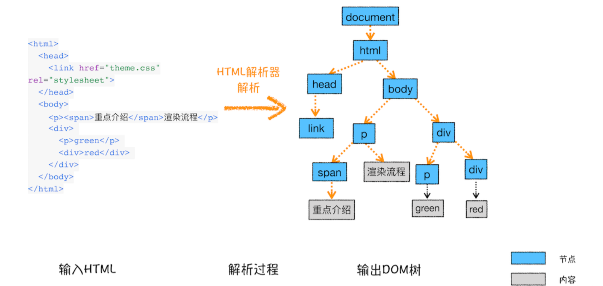
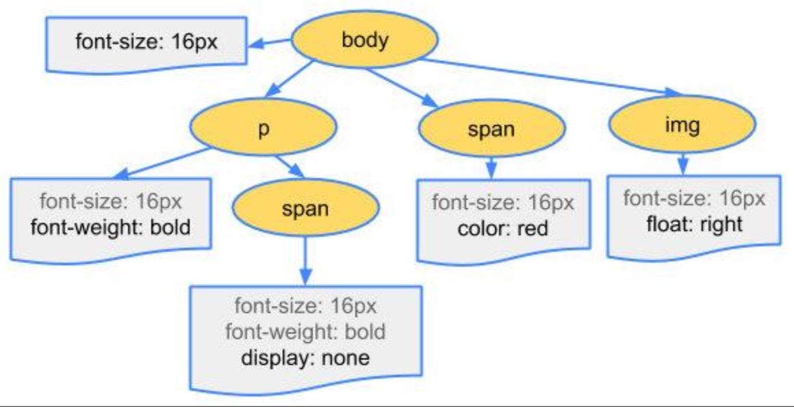

# 面试相关

[2021年前端面试必读文章【超三百篇文章/赠复习导图】](https://juejin.cn/post/6844904116339261447)


### 1、从浏览器输入 URL 到页面展示过程发生了什么

#### 浏览器会构建请求行

#### 1-0、先看有没有强缓存，如果命中直接使用，否则进入下一步

#### 1-1、DNS 域名解释

-   从本地 host 文件查找
-   从浏览器 DNS 缓存中查找
-   从 ip 服务器上去查找

#### 1-2、发起 tcp 连接

**三次握手：**

-   1.客户端告知服务端，我要发起请求
-   2.服务端表示收到通知，告知客户端可以开始发送请求
-   3.客户端收到，告知服务端，我要开始发送请求，请准备接收

**四次挥手：**

四次挥手谁先关闭都可以；这里假设客户端主动关闭，服务器被动关闭

-   1.客户端发送请求，申请断开，进入等待阶段，此时不会发送数据，但是会继续接收数据
-   2.服务端接收到请求，告知客户端已明白，此时服务端进入等待状态，不会再接收数据，但会继续发送数据；而客户端则进入下一阶段的等待状态
-   3.服务端发送完剩余的数据后，告知客户端可以断开连接，此时服务端不会发送和接收数据
-   4.客户端收到后，告知服务端我开始断开连接，服务端收到后，断开连接

#### 1-3、发起 http 请求

**http: 主要解决数据以何种格式传输，tcp 是决定数据怎么传输**

1.请求报文：由请求行、请求报头、请求正文组成

-   请求行：一般是规定请求方式及版本 （GET / HTTP/1.1）
-   请求报头：请求报头允许客户端向服务器传递请求的附加信息和客户端自身的信息，比如 cookies、user-agent
-   请求正文：一般是需要向服务端传输的数据

    2.http 缓存

-   强制缓存：当有强缓存并且强缓存没有过期，那么会直接使用强缓存。对于强制缓存，服务器响应的 header 中会用两个字段来表明 Expires 和 Cache-Control，而现在一般是 htpp1.1 版本，所以一般使用 Cache-Control

    private：客户端可以缓存

    public：客户端和代理服务器都可以缓存

    max-age=t：缓存内容将在 t 秒后失效

    no-cache：需要使用协商缓存来验证缓存数据

    no-store：所有内容都不会缓存。

-   协商缓存：浏览器第一次请求数据时，服务器会将缓存标识与数据一起响应给客户端，客户端将它们备份至缓存中。再次请求时，客户端会先从缓存数据库拿到一个缓存的标识，然后向服务端验证标识是否失效，如果没有失效服务端会返回 304，这样客户端可以直接去缓存数据库拿出数据，如果失效，服务端会返回新的数据

**强制缓存的优先级高于协商缓存，若两种缓存皆存在，且强制缓存命中目标，则协商缓存不再验证标识**

-   缓存的优点

          1.减少了冗余的数据传递，节省宽带流量
        
          2.减少了服务器的负担，大大提高了网站性能
        
          3.加快了客户端加载网页的速度 这也正是 HTTP 缓存属于客户端缓存的原因。

    3.响应体

-   响应行：（HTTP/1.1 200 OK）由 HTTP 协议版本、状态码和状态描述组成

        1xx：指示信息–表示请求已接收，继续处理。
        
        2xx：成功–表示请求已被成功接收、理解、接受。 200：成功  204：请求成功处理，没有实体的主体返回
        
        3xx：重定向–要完成请求必须进行更进一步的操作。 301：永久重定向  302：临时重定向  304：未修改，使用缓存
        
        4xx：客户端错误–请求有语法错误或请求无法实现。 400：错误请求，比如传参错误  401：未授权，例如没有 token  403：服务器拒绝请求  404：服务器找不到请求页面
        
        5xx：服务器端错误–服务器未能实现合法的请求。  500：服务器遇到错误，无法完成请求  503：服务不可用  504：网关错误

-   响应报头

        常见的响应报头字段有: Server, cache-control，expires，last-modified，content-encoding: gzip

-   响应报文

        从服务器请求的 HTML, CSS, JS 文件就放在这里面

#### 1-4、浏览器渲染流程

-   解析 HTML 生成 DOM 树



-   解析 CSS 生成 CSSOM：通过解析 CSS 文件、style 标签、行内 style 等，生成 CSSOM

        规范 css，即将 color: blue 转化成 color: rgb() 形式
        
        计算元素样式，例如 CSS 样式会继承父级的样式，如 font-size、color 之类的



-   加载或执行 JavaScript

-   生成渲染树：在有了 DOM 树和 CSSOM 之后，需要将两者结合生成渲染树 Render Tree。此时，渲染树就具备元素和元素的样式信息
-   布局：根据 Render Tree 渲染树，对树中每个节点进行计算，确定每个节点在页面中的宽度、高度和位置
-   建立图层树(分层)：对于一些复杂的场景，比如 3D 动画如何呈现出变换效果，浏览器在构建完布局树之后，还会对特定的节点进行分层，构建一棵图层树
-   生成绘制列表：接下来渲染引擎会将图层的绘制拆分成一个个绘制指令，比如先画背景、再描绘边框......然后将这些指令按顺序组合成一个待绘制列表
-   生成图块和生成位图（光栅化）：渲染引擎中的合成线程会根据当前视口的大小将图层进行分块处理，然后合成线程会对视口附近的图块生成位图，即光栅化。而渲染进程也维护了一个栅格化的线程池，专门用于将图块转为位图
-   显示：当所有的图块都经过栅格化处理后，渲染引擎中的合成线程会生成绘制图块的指令，提交给浏览器进程。然后浏览器进程将页面绘制到内存中。最后将内存绘制结果显示在用户界面上

#### 1-5、GPU 加速

利用 CSS3 的 transform、opacity、filter 这些属性就可以实现 GPU 加速

**GPU 加速的原因**

在合成的情况下，会直接跳过布局和绘制流程，直接进入非主线程处理的部分，即直接交给合成线程处理。交给它处理有两大好处:

-   能够充分发挥 GPU 的优势。合成线程生成位图的过程中会调用线程池，并在其中使用 GPU 进行加速生成，而 GPU 是擅长处理位图数据的。
-   没有占用主线程的资源，即使主线程卡住了，效果依然能够流畅地展示。

### 2、跨域

#### 2-1、浏览器同源策略

同源策略就是：协议、域名、端口都相同的。同源策略主要是为了保护用户信息安全

同源策略主要是两种，一个是 ajax 同源策略，一个是 DOM 同源策略

-   ajax 同源策略：1、不同源页面不能发起 ajax 请求 2、不同源页面不能获取 cookies。如果没有同源策略，那么只要任意一个脚本就能获取 cookies，去到相应网站发起恶意请求
-   DOM 同源策略：不同源页面不能获取 DOM。主要防止通过 iframe 嵌套一个真正网站地址，拿取用户信息

#### 2-2、解决跨域

1.jsonp：主要利用 script 标签的 src 天然支持跨域请求的原理

```
function jsonp({
  url,
  params,
  callback
}) {
  params = {
    ...params,
    callback
  }

  const str = Object.keys(params).map(item => {
    return `${item}=${params[item]}`
  }).join('&')

  const requestStr = `${url}?${str}`

  const script = document.createElement("script")

  script.setAttribute('src', requestStr)

  document.body.appendChild(script)
}

jsonp({
  url: 'http://www.xxxxx.com',
  params: {
    name: 'jack'
  },
  callback(res) {
    console.log(res);
  }
})
```

jsonp 的优缺点：

- 优点：
  - 它不像 XMLHttpRequest 对象实现的 Ajax 请求那样受到同源策略的限制，JSONP 可以跨越同源策略
  - 它的兼容性更好，在更加古老的浏览器中都可以运行
- 缺点：
  - 它只支持 GET 请求而不支持 POST 等其它类型的 HTTP 请求
  -  jsonp 在调用失败的时候不会返回各种 HTTP 状态码
  - 安全性问题。万一假如提供 jsonp 的服务存在页面注入漏洞，即它返回的 javascript 的内容被人控制的。那么结果是什么？所有调用这个 jsonp 的网站都会存在漏洞。于是无法把危险控制在一个域名。所以在使用 jsonp 的时候必须要保证使用的 jsonp 服务必须是安全可信的

2.CORS：跨域资源共享

这个一般需要服务器配置，通常的几个配置

        Access-Control-Allow-Origin： 服务器允许访问的域名
    
        Access-Control-Allow-Methods： 服务器允许使用的方法
    
        Access-Control-Allow-Headers： 服务器允许的首部字段
    
        Access-Control-Allow-Credentials
    
        Access-Control-Max-Age： 该响应的有效时间(s), 在有效时间内浏览器无需再为同一个请求发送预检请求

-   浏览器根据同源策略，发现是同源，则直接发送请求，如果不同源，发送跨域请求
-   服务器收到跨域请求，根据自身配置返回请求头；如果没配置过跨域，那么返回不包含 Access-Control-Allow-\*\*
-   浏览器根据有没有 Access-Control-Allow-\*\* 做判断，如果没有，则报警告

    3.服务器代理：同源策略主要存在于浏览器中，不利用浏览器发起请求，而是直接在两台服务器中，那么就不会存在跨域的问题

3.常见的 webpack 的 devServer

4.websocket：这是一种双向通讯协议，客户端和服务端都可以主动向对方发送东西

5.postMessage: HTML5 中的 API，可以实现跨文档通讯，一个窗口发送消息，另一个窗口接受消息

6.nginx：利用 nginx 跨域的关键就是在配置文件中设置 server 项，然后设置其中的 location 属性，proxy_pass：需要代理的服务器地址，add_header：给响应报文中添加首部字段，例如 Access-Control-Allow-Origin 设置为 \*，即允许所有的请求源请求。

```
events {
    worker_connections  1024;
}
http {
    include       mime.types;
    default_type  application/octet-stream;
    sendfile        on;
    keepalive_timeout  65;
    server {
        listen       80;
        server_name  localhost;
        location / {
            proxy_pass  http://localhost:8887;
            add_header  Access-Control-Allow-Origin *;
        }
    }
}
```

### 3、CommonJS 和 ES6 模块，AMD 与 CMD

#### 3-0、模块化

将一个复杂的程序依据一定的规则(规范)封装成几个块(文件), 并进行组合在一起

块的内部数据与实现是私有的, 只是向外部暴露一些接口(方法)与外部其它模块通信

**模块化好处**

-   避免命名冲突(减少命名空间污染)
-   更好的分离, 按需加载
-   更高复用性
-   高可维护性

#### 3-1、区别：

-   CommonJS 输出的是一个值的拷贝，ES6 输出的是值的引用
-   CommonJS 是在运行的时候加载，ES6 是在编译的时候
-   CommonJS 的 require 语法是同步的，所以 CommonJS 规范只适合于服务端
-   CommonJS 的 this 指向当前模块，ES6 的 this 指向 undefined
-   CommonJs 导入的模块路径可以是一个表达式，因为它使用的是 require() 方法；而 ES6 Modules 只能是字符串

#### 3-2、AMD 和 CMD 异步加载模块

1. 第一个方面是在模块定义时对依赖的处理不同。AMD 推崇依赖前置，在定义模块的时候就要声明其依赖的模块。而 CMD 推崇就近依赖，只有在用到某个模块的时候再去 require。
2. 第二个方面是对依赖模块的执行时机处理不同。首先 AMD 和 CMD 对于模块的加载方式都是异步加载，不过它们的区别在于模块的执行时机，AMD 在依赖模块加载完成后就直接执行依赖模块，依赖模块的执行顺序和我们书写的顺序不一定一致。而 CMD 在依赖模块加载完成后并不执行，只是下载而已，等到所有的依赖模块都加载好后，进入回调函数逻辑，遇 require 语句的时候才执行对应的模块，这样模块的执行顺序就和我们书写的顺序保持一致了。

```
// CMD
define(function(require, exports, module) {
  var a = require("./a");
  a.doSomething();
  // 此处略去 100 行
  var b = require("./b"); // 依赖可以就近书写
  b.doSomething();
  // ...
});

// AMD 默认推荐
define(["./a", "./b"], function(a, b) {
  // 依赖必须一开始就写好
  a.doSomething();
  // 此处略去 100 行
  b.doSomething();
  // ...
});
```

### 4、webpack 的 hash

-   hash 是跟整个项目的构建相关，只要项目里有文件更改，整个项目构建的 hash 值都会更改，并且全部文件都共用相同的 hash 值。(粒度整个项目)
-   chunkhash 是根据不同的入口进行依赖文件解析，构建对应的 chunk(模块)，生成对应的 hash 值。只有被修改的 chunk(模块) 在重新构建之后才会生成新的 hash 值，不会影响其它的 chunk。(粒度 entry 的每个入口文件)
-   contenthash 是跟每个生成的文件有关，每个文件都有一个唯一的 hash 值。当要构建的文件内容发生改变时，就会生成新的 hash 值，且该文件的改变并不会影响和它同一个模块下的其它文件。(粒度每个文件的内容)

### 5、重绘回流

#### 5-1、重绘


重绘是指样式比如颜色这些变化，但是没有几何属性的变化，会导致重绘;由于没有导致 DOM 几何属性的变化，因此元素的位置信息不需要更新,跳过了生成布局树和建图层树的阶段，直接生成绘制列表，然后继续进行分块、生成位图等后面一系列操作

#### 5-2、回流


回流是指元素的几何属性发生变化，例如宽高、增删移动节点等，引起页面回流;上面的渲染流水线，触发回流的时候，如果 DOM 结构发生改变，则重新渲染 DOM 树，然后将后面的流程(包括主线程之外的任务)全部走一遍

**重绘跟回流的成本是非常高的，回流由于发生了 DOM 的变化，会重新渲染，成本比重绘的还要大**

#### 5-3、避免重绘回流

-   不要频繁使用 style，而是使用 class 进行一次性修改
-   避免使用table布局
-   将动画效果放到脱离文档流的 position 属性为 absolute 或 fixed 的元素上
-   避免频繁操作DOM，创建一个documentFragment，在它上面应用所有DOM操作，最后再把它添加到文档中。
-   也可以先为元素设置 display: none，操作结束后再把它显示出来。因为在 display 属性为 none 的元素上进行的 DOM 操作不会引发回流和重绘
-   对于 resize、scroll 等进行防抖/节流处理
-   使用 css3 动画替代 js 操作 DOM，css3 动画会 GPU 加速

### 6、盒子模型

box-sizing: content-box（W3C 盒模型，又名标准盒模型）：元素的宽高大小表现为内容的大小。
box-sizing: border-box（IE 盒模型，又名怪异盒模型）：元素的宽高表现为内容 + 内边距 + 边框的大小。背景会延伸到边框的外沿。

### 7、rem 原理

```
// 这种JS代码是会影响页面的渲染的 放到前面写 就是为了让标签出来之前执行的 只要操作html元素只要html元素出来了JS就可以执行
function setNowFontSize() {
    // 1. 设计稿的宽度 假设750
    // 2. 设计稿屏幕的根元素字体大小 200
    // 3. 求得当前屏幕根元素字体大小 假设当前 375
    // 4. 当前根元素字体大小  375 / (750 / 200)  == 100px
    var designWidth = 750;
    var designFontSize = 200;
    // 获取当前屏幕宽度
    var windowWidth = document.documentElement.offsetWidth || document.body.offsetWidth || window.innerWidth;
    // 使用当前屏幕宽度 / (设计稿宽度/设计稿的字体大小)
    var nowFontSize = windowWidth / (designWidth / designFontSize);
    // console.log(nowFontSize);
    if (nowFontSize > 200) {
        nowFontSize = 200;
    }
    // 给当前根元素设置这个算好的字体大小
    document.documentElement.style.fontSize = nowFontSize + 'px';
}

// 一开始就马上设置
setNowFontSize();
// 当屏幕宽度一变化马上获取计算当前根元素字体大小 把 setNowFontSize 函数体传递过去的
window.addEventListener('resize', setNowFontSize);
```

### 8、http、tcp 相关

[http 掘金文](https://juejin.im/post/5e76bd516fb9a07cce750746)
[tcp 掘金文](https://juejin.im/post/5e527c58e51d4526c654bf41#heading-4)

http：超文本传输协议，无连接、无状态，规定了每段数据以什么形式表达才是能够被另外一台计算机理解

-   无连接：无连接的含义是限制每次连接只处理一个请求
-   无状态：无状态是指协议对于事务处理没有记忆能力。这也是为什么需要 session 标记用户的原因

#### 8-1、http 请求可以怎么拦截

在浏览器和服务器进行传输的时候，可以被 nginx 代理所拦截，也可以被网关拦截。

#### 8-2. https 的加密方式、混合加密的好处

HTTPS 使用的是对称密钥加密和非对称密钥加密组合而成的混合加密加密机制进行数据传输

也就是发送密文的一方用 "对方的公钥" 进行加密处理 "对称的密钥"，然后对方在收到之后使用自己的私钥进行解密得到 "对称的密钥"，这在确保双方交换的密钥是安全的前提下使用对称密钥方式进行通信。

混合加密的好处：对称密钥的优点是加解密效率快，在客户端与服务端确定了连接之后就可以用它来进行加密传输。不过前提是得解决双方都能安全的拿到这把对称密钥。这时候就可以利用非对称密钥加密来传输这把对称密钥，因为我们知道非对称密钥加密的优点就是能保证传输的内容是安全的。
所以好处是即保证了对称密钥能在双方之间安全的传输，又能使用对称加密方式进行通信，这比单纯的使用非对称加密通信快了很多。以此来解决了 HTTP 中内容可能被窃听的问题。

#### 8-3、https 工作流程

-   客户端首先向服务端发送一个 HTTPS 请求
-   服务端会把事先配置好的公钥证书随着其它的信息(例如 server_random、 server_params、需要使用的加密套件等东西)返回给客户端
-   客户端在收到服务端发来的证书之后进行验证，验证的过程参考数字证书验证，会得到服务端的信息以及它的公钥
-   验证成功之后生成一个叫做 client_params 的参数发送给服务器；同时自己会用伪随机函数生成一个 secret，这个 secret 就是它们后续进行通信的对称密钥。
-   服务器在收到刚刚的 client_params 之后，也会根据伪随机函数生成一个 secret。这时候双方都有了相同的对称密钥。
-   后面的传输都会用这个 secret 进行对称密钥加解密传输

或者：

-   客户端发起一个 HTTPS 请求。
-   服务端把事先配置好的公钥证书返回给客户端。
-   客户端验证公钥证书，验证通过，客户端使用伪随机数生成器生成加密所使用的对称密钥，然后用证书的公钥加密这个对称密钥，发给服务端。
-   服务端使用自己的私钥解密这个消息，得到对称密钥。至此，客户端和服务端双方都持有了相同的对称密钥。
-   服务端使用对称密钥加密“明文内容 A”，发送给 客户端。
-   客户端使用对称密钥解密响应的密文，得到“明文内容 A”。
-   客户端再次发起 HTTPS 的请求，使用对称密钥加密请求的“明文内容 B”，然后服务端使用对称密钥解密密文，得到“明文内容 B”。

#### 8-4、数字签名

数字签名来验证数字证书的完整性


尽管对称加密跟非对称加密混合，能够很好地实现加密传输；但实际上还是存在一些问题：假如在通信过程中，黑客拦截客户端与服务器之间的通信成为中间人，将自己的公钥发送给客户端，如果客户端没有能力识别公钥是否来自真正的服务器，那么数据就会泄露。如同下面这种情况，引自数字证书原理

数字签名的产生主要就是为了解决 HTTPS 中内容可能被篡改的问题，即校验数据的完整性。这个数字证书有两个作用:

    1.服务器向浏览器证明自己的身份。
    
    2.把公钥传给浏览器。

流程：

-   首先发送方会将原文与数字签名(也就是加密后的摘要)一起发送给接收方
-   接收方会接收到这两样东西，即原文和数字签名
-   接收方用 Hash 函数处理原文会得到一份消息摘要
-   同时用发送方的公钥解密数字签名也会得到一份消息摘要
-   只要比较这两份消息摘要是否相等就可以验证出数据有没有被篡改了

当然这里关键的一步就是要保证发送方传递过来的公钥是可信赖的，这时候就得用到数字证书了

#### 8-5、数字证书

数字证书也叫公钥证书，或者简称证书。它主要是为了解决通信方身份遭伪装的问题，也就是验证通信方的身份。

在 HTTPS 中虽然有了混合加密机制保证数据不被监听，有了数字签名校验数据的完整性，但是数字签名校验的前提是能拿到发送方的公钥，并且保证这个公钥是可信赖的，所以就需要数字证书

#### 8-6、http 中的 keep-alive

Keep-Alive 是 HTTP 的一个头部字段 Connection 中的一个值，它是保证我们的 HTTP 请求能建立一个持久连接；在 HTTP/1.1 中所有的连接默认都是持久连接的，但是 HTTP/1.0 并未标准化。Keep-Alive 功能使客户端到服务器端的连接持续有效，当出现对服务器的后继请求时，Keep-Alive 功能避免了建立或者重新建立连接

#### 8-7、get 请求和 post 请求区别

-   get 请求参数在 url 上，post 请求参数在请求体里
-   get 请求的参数有大小限制，一般为 2048，根据浏览器不同会有区别；post 请求的参数可以无限大
-   post 请求相对于 get 请求会稍微安全，因为请求参数不暴露在 url 上，但仅仅是相对的
-   get 请求能缓存，post 不能

#### 8-8、HTTP/1.0 和 HTTP/1.1 有什么区别

-   长连接： HTTP/1.1 支持长连接和请求的流水线，在一个 TCP 连接上可以传送多个 HTTP 请求，避免了因为多次建立 TCP 连接的时间消耗和延时
-   缓存处理： HTTP/1.1 引入 Entity tag，If-Unmodified-Since, If-Match, If-None-Match 等新的请求头来控制缓存，详见浏览器缓存小节
-   带宽优化及网络连接的使用： HTTP1.1 则在请求头引入了 range 头域，支持断点续传功能
-   Host 头处理： 在 HTTP/1.0 中认为每台服务器都有唯一的 IP 地址，但随着虚拟主机技术的发展，多个主机共享一个 IP 地址愈发普遍，HTTP1.1 的请求消息和响应消息都应支持 Host 头域，且请求消息中如果没有 Host 头域会 400 错误

#### 8-9、HTTP 和 HTTPS 有何区别

-   HTTPS 使用 443 端口，而 HTTP 使用 80
-   HTTPS 需要申请证书
-   HTTP 是超文本传输协议，是明文传输；HTTPS 是经过 SSL 加密的协议，传输更安全
-   HTTPS 比 HTTP 慢，因为 HTTPS 除了 TCP 握手的三个包，还要加上 SSL 握手的九个包

#### 8-10、http1.x 的缺点

-   HTTP/1.0 一次只允许在一个 TCP 连接上发起一个请求，HTTP/1.1 使用的流水线技术也只能部分处理请求并发，仍然会存在队列头阻塞问题，此版本的网络延迟问题主要由于队头堵塞导致，虽然通过持久性连接得到改善，虽然通过持久性连接得到改善，但是每一个请求的响应依然需要按照顺序排队，如果前面的响应处理较为耗费时间，那么同样非常耗费性能。
-   单向请求，只能由客户端发起。
-   请求报文与响应报文首部信息冗余量大。
-   数据未压缩，导致数据的传输量大。

#### 8-11、http2.0 特点

-   二进制传输，应用层（HTTP/2.0）和传输层（TCP or UDP）之间增加一个二进制分帧层，从而突破 HTTP1.1 的性能限制，改进传输性能，实现低延迟和高吞吐量
-   多路复用，允许同时通过单一的 HTTP/2 连接发起多重的请求-响应消息
-   Header 压缩，使用 HPACK 算法对 header 的数据进行压缩，这样数据体积小了，在网络上传输就会更快。高效的压缩算法可以很大的压缩 header ，减少发送包的数量从而降低延迟
-   服务器推送，双向通讯，服务器可以对客户端的一个请求发送多个响应，即服务器可以额外的向客户端推送资源，而无需客户端明确的请求
-   更安全

#### 8-12、21. TCP 和 UDP 的区别

**TCP 是一个面向连接的、可靠的、基于字节流的传输层协议**

TCP 为什么可靠，是因为它有三次握手来保证双方都有接受和发送数据的能力。
字节流服务：将大块数据分割为以报文段为单位的数据包进行管理

**UDP 是一个面向无连接的传输层协议（UDP 是一个面向报文（报文可以理解为一段段的数据）的协议。意思就是 UDP 只是报文的搬运工，不会对报文进行任何拆分和拼接操作）**

1.2 不可靠性

UDP 是无连接的，也就是说通信不需要建立和断开连接。

UDP 也是不可靠的。协议收到什么数据就传递什么数据，并且也不会备份数据，对方能不能收到是不关心的

UDP 没有拥塞控制，一直会以恒定的速度发送数据。即使网络条件不好，也不会对发送速率进行调整。这样实现的弊端就是在网络条件不好的情况下可能会导致丢包，但是优点也很明显，在某些实时性要求高的场景（比如电话会议）就需要使用 UDP 而不是 TCP

1.3 高效

因为 UDP 没有 TCP 那么复杂，需要保证数据不丢失且有序到达。所以 UDP 的头部开销小，只有八字节，相比 TCP 的至少二十字节要少得多，在传输数据报文时是很高效的

1.4、面向字节流

UDP 的数据传输是基于数据报的，这是因为仅仅只是继承了 IP 层的特性，而 TCP 为了维护状态，将一个个 IP 包变成了字节流。

#### 8-13、为什么是三次握手而不是二次握手

为了防止已失效的连接请求报文段突然又传送到了服务端，因而产生连接资源的浪费

解析 1：失效的连接请求：主机 A 发出的连接请求没有收到主机 B 的确认，于是经过一段时间后，主机 A 又重新向主机 B 发送连接请求，且建立成功，顺序完成数据传输。考虑这样一种特殊情况，主机 A 第一次发送的连接请求并没有丢失，而是因为网络节点导致延迟达到主机 B，主机 B 以为是主机 A 又发起的新连接，于是主机 B 同意连接，并向主机 A 发回确认，但是此时主机 A 根本不会理会，主机 B 就一直在等待主机 A 发送数据，导致主机 B 的资源浪费。

解析 2：如果是两次，你现在发了 SYN 报文想握手，但是这个包滞留在了当前的网络中迟迟没有到达，TCP 以为这是丢了包，于是重传，两次握手建立好了连接。
看似没有问题，但是连接关闭后，如果这个滞留在网路中的包到达了服务端呢？这时候由于是两次握手，服务端只要接收到然后发送相应的数据包，就默认建立连接，但是现在客户端已经断开了。

二次握手不可以，会造成上面说的失效的连接请求；四次握手可以，但没有必要。

#### 8-14、四次挥手为什么客户端最后还要等待 2MSL

-   第一，保证客户端发送的最后一个 ACK 报文能够到达服务器，因为这个 ACK 报文可能丢失，若丢失，站在服务器的角度看来，我已经发送了请求断开了，客户端还没有给我回应，应该是我发送的请求断开报文它没有收到，于是服务器又会重新发送一次，而客户端就能在这个 2MSL 时间段内收到这个要求重传的报文，接着给出回应报文，并且会重启 2MSL 计时器
-   第二，比如上面提到了的 已经失效的连接请求报文段 出现在连接中这种状况，客户端发送完最后一个确认报文后，在这个 2MSL 时间中，就可以使本连接持续的时间内所产生的所有报文段都从网络中消失，这样新连接中就不会出现旧连接的请求报

#### 8-15、队头阻塞

HTTP 传输是基于请求-应答的模式进行的，报文必须是一发一收，但值得注意的是，里面的任务被放在一个任务队列中串行执行，一旦队首的请求处理太慢，就会阻塞后面请求的处理。这就是著名的 HTTP 队头阻塞问题

解决：

-   并发连接：对于一个域名允许分配多个长连接，那么相当于增加了任务队列，不至于一个队伍的任务阻塞其它所有任务
-   域名分片：一个域名不是可以并发 6 个长连接吗？那我就多分几个域名

#### 8-16、301、302、303、307 之间的区别

301：永久性重定向

302：临时性重定向

303 和 307 都是临时重定向，是对 302 的细化，主要区别在于 post 请求上（302 是http1.0，303 和 307 是 http1.1）

303：对于POST请求，它表示请求已经被处理，客户端可以接着使用GET方法去请求Location里的URI

307：对于POST请求，表示请求还没有被处理，客户端应该向Location里的URI重新发起POST请求

#### 8-17、301 和 302 对于 seo 哪个更好

使用 301 表示永久性跳转，如果A页面已经被搜索引擎收录了，那么搜索引擎会知道以后再也没有A页面这个页面了，它已经转移到B页面上去了，搜索引擎会把原来对于A页面的排名权重转移到B页面上去，平稳过渡，然后在搜索引擎的数据库中删除A页面，替换成B页面

使用302表示暂时性跳转，302与301的区别在于，搜索引擎的数据库不会删除A页面，但仍会增加B页面。原来A网页页面的权重值排行并不会迁移到B网页页面

**百度搜索一直注重应用301**

### 9、反向代理

我们将请求发送到服务器，然后服务器对我们的请求进行转发，我们只需要和代理服务器进行通信就好。所以对于客户端来说，是感知不到服务器的

### 10、前端安全

#### 10-1、XSS 攻击 [掘金文](https://juejin.im/post/5df5bcea6fb9a016091def69#heading-64)

**XSS**

XSS(Cross Site Script) 跨站脚本攻击。指的是攻击者向网页注入恶意的客户端代码，通过恶意的脚本对客户端网页进行篡改，从而在用户浏览网页时，对用户浏览器进行控制或者获取用户隐私数据的一种攻击方式

**XSS 攻击原理**

-   往 Web 页面里插入恶意 Script 代码

**XSS 一般可以做以下事情：**

    1.窃取 Cookie
    
    2.监听用户行为，比如输入账号密码后直接发送到黑客服务器
    
    3.修改 DOM 伪造登录表单
    
    4.在页面中生成浮窗广告

**主要是分为三种：**

-   存储型：即攻击被存储在服务端，常见的场景是留言评论区提交一段脚本代码，如果前后端没有做好转义的工作，那评论内容存到了数据库，在页面渲染过程中直接执行, 相当于执行一段未知逻辑的 JS 代码，是非常恐怖的
-   反射型：恶意脚本作为网络请求的一部分。服务端接收到 URL 将恶意代码当做参数取出并拼接在 HTML 里返回，浏览器解析此 HTML 后即执行恶意代码

```
// 比如输入：

http://sanyuan.com?q=<script>alert("你完蛋了")</script>
```

-   文档型：文档型的 XSS 攻击并不会经过服务端，而是作为中间人的角色，在数据传输过程劫持到网络数据包，然后修改里面的 html 文档。这样的劫持方式包括 WIFI 路由器劫持或者本地恶意软件等

**如何防御 XSS 攻击：**

一个信念：不要相信用户输入；两个利用：1、利用 httpOnly 2、利用 CSP

-   输入检查：永远不要相信任何用户的输入，对输入内容中的 script 和 \<iframe\> 等标签进行转义或者过滤
-   设置 httpOnly：很多 XSS 攻击目标都是窃取用户 cookie 伪造身份认证，设置此属性可防止 JS 获取 cookie
-   开启 CSP：即开启白名单，可阻止白名单以外的资源加载和运行；1.限制其他域下的资源加载。2.禁止向其它域提交数据。3.提供上报机制，能帮助我们及时发现 XSS 攻击。
-   URL：使用 Javascript 的 encodeURIComponent() 方法对用户的输入进行编码

#### 10-2、CSRF 攻击 [掘金文](https://juejin.im/post/5df5bcea6fb9a016091def69#heading-80)

**CSRF：**

CSRF 攻击 (Cross-site request forgery) 跨站请求伪造。是一种劫持受信任用户向服务器发送非预期请求的攻击方式，通常情况下，它是攻击者借助受害者的 Cookie 骗取服务器的信任，但是它并不能拿到 Cookie，也看不到 Cookie 的内容，它能做的就是给服务器发送请求，然后执行请求中所描述的命令，以此来改变服务器中的数据，也就是并不能窃取服务器中的数据

比如：黑客诱导用户点击链接，打开黑客的网站，然后黑客利用用户目前的登录状态发起跨站请求

**CSRF 攻击方式：**

-   自动 GET 请求

```
// 假设用户在 aabbcc 网页登录

// 而在黑客网页里面可能有一段这样的代码:


// 这个请求会自动带上关于 xxx.com 的 cookie 信息
```

-   自动 POST 请求

```
// 黑客可能自己填了一个表单，写了一段自动提交的脚本

<form id='hacker-form' action="https://xxx.com/info" method="POST">
  <input type="hidden" name="user" value="hhh" />
  <input type="hidden" name="count" value="100" />
</form>
<script>document.getElementById('hacker-form').submit();</script>

// 同样也会携带相应的用户 cookie 信息，让服务器误以为是一个正常的用户在操作，让各种恶意的操作变为可能。
```

-   诱导点击发送 GET 请求。

```
在黑客的网站上，可能会放上一个链接，驱使你来点击，点击后，自动发送 get 请求，接下来和自动发 GET 请求部分同理

<a href="https://aabbcc/info?user=hhh&count=100" taget="_blank">这里有你想要的哦</a>
```

**CSRF 攻击原理：**

-   用户 C 打开浏览器，访问受信任网站 A，输入用户名和密码请求登录网站 A；
-   在用户信息通过验证后，网站 A 产生 Cookie 信息并返回给浏览器，此时用户登录网站 A 成功，可以正常发送请求到网站 A；
-   用户未退出网站 A 之前，在同一浏览器中，打开一个 TAB 页访问网站 B；
-   网站 B 接收到用户请求后，返回一些攻击性代码，并发出一个请求要求访问第三方站点 A；
-   浏览器在接收到这些攻击性代码后，根据网站 B 的请求，在用户不知情的情况下携带 Cookie 信息，向网站 A 发出请求。网站 A 并不知道该请求其实是由 B 发起的，所以会根据用户 C 的 Cookie 信息以 C 的权限处理该请求，导致来自网站 B 的恶意代码被执行。

**防御 CSRF 攻击：**

-   验证 Token：浏览器请求服务器时，服务器返回一个 token，每个请求都需要同时带上 token 和 cookie 才会被认为是合法请求
-   验证 Referer：通过验证请求头的 Referer 来验证来源站点，Referer 包含了具体的 URL 路径，但请求头很容易伪造
-   设置 SameSite：设置 cookie 的 SameSite，可以让 cookie 不随跨域请求发出，禁止第三方请求携带 Cookie，但浏览器兼容不一。
    SameSite 可以设置为三个值，Strict、Lax 和 None。

        a. 在 Strict 模式下，浏览器完全禁止第三方请求携带 Cookie。比如请求 sanyuan.com 网站只能在 sanyuan.com 域名当中请求才能携带 Cookie，在其他网站请求都不能。
        
        b. 在 Lax 模式，就宽松一点了，但是只能在 get 方法提交表单况或者 a 标签发送 get 请求的情况下可以携带 Cookie，其他情况均不能。
        
        c. 在 None 模式下，也就是默认模式，请求会自动携带上 Cookie。

### 11、requestAnimationFrame

requestAnimationFrame 在 MDN 的定义为，下次页面重绘前所执行的操作。是浏览器用于定时循环操作的一个接口，类似于 setTimeout，主要用途是按帧对网页进行重绘。对于 JS 动画，用 requestAnimationFrame 会比 setInterval 效果更好

requestAnimationFrame 姑且算是一个宏任务，但是他的执行时机是比微任务晚，比宏任务早

### 12、不使用框架如何实现组件按需加载以及原理

使用 babel-plugin-import 就可以实现

babel-plugin-import 原理：在 babel 转码的时候，把对整个库的引用，变为具体模块的引用

### 13、V8 如何执行一段 JS 代码

-   预解析：检查语法错误但不生成 AST
-   生成 AST：经过词法/语法分析，生成抽象语法树
-   生成字节码：基线编译器 (Ignition) 将 AST 转换成字节码
-   生成机器码：优化编译器 (Turbofan) 将字节码转换成优化过的机器码，此外在逐行执行字节码的过程中，如果一段代码经常被执行，那么 V8 会将这段代码直接转换成机器码保存起来，下一次执行就不必经过字节码，优化了执行速度

### 14、GPU 加速

-   优点：使用 transform、opacity、filters 等属性时，会直接在 GPU 中完成处理，这些属性的变化不会引起回流重绘
-   缺点：GPU 渲染字体会导致字体模糊，过多的 GPU 处理会导致内存问题

### 15、HTML 相关

#### 15-1、HTML5 的一些新特性

-   新增语义化标签 （aside / figure / section / header / footer / nav 等），增加多媒体标签 video 与 audio
-   删除了一些纯表现的元素 <u> 下划线、<\big>字体等
-   增强了表单的 type 属性
-   增加了 localStorage、sessionStorage 本地存储
-   新的 API、新的技术：canvas、pushState、地理定位、webworker、websocket 等；

#### 15-2、href 和 src 有什么区别

-   href：即超文本引用。当浏览器遇到 href 时，会并行地下载资源，不会阻塞页面解释，例如我们使用 \<link\> 引入 CSS，浏览器会并行地下载 CSS 而不阻塞页面解析. 因此我们在引入 CSS 时建议使用 \<link\> 而不是 @import
-   src：即资源，替换当前元素。当浏览器遇到 src 时，会暂停页面解析，直到该资源下载或执行完毕，这也是 script 标签之所以放底部的原因

### 15-3、块级元素、行内元素、空元素

-   行内元素： a, b, span, img, input, select, strong, button；
-   块级元素： div, ul, li, dl, dt, dd, h1-6, p 等；
-   空元素： <br>, <hr>, , <link>, <meta>；

块级元素和行内元素区别：块级元素独占一行、可以设置宽高、margin、padding 等；行内元素不占一行、不可以设置宽高、padding 和 margin 只能设置左右而上下无效

#### 15-4、浏览器如何对 HTML5 的离线储存资源进行管理和加载

-   有线情况下：

（1），浏览器发现 html 头部有 manifest 属性，它会请求 manifest 文件，如果是第一次访问 app，那么浏览器就会根据 manifest 文件的内容下载相应的资源并且进行离线存储。
（2），如果已经访问过 app 并且资源已经离线存储了，那么浏览器就会使用离线的资源加载页面，然后 浏览器会对比新的 manifest 文件与旧的 manifest 文件，如果文件没有发生改变，就不做任何操作，如果文件改变了，那么就会重新下载文件中的资源并进行离线存储。

-   在离线情况下： 浏览器直接使用离线缓存的资源；

### 16、CSS 相关

#### 16-1、CSS3 新特性

-   伪类选择器（li:first-child li:last-child li:nth-child） 伪元素选择器（:before :after）
-   border-radius: 圆角
-   box-shadow: 盒子阴影 text-shadow: 文字阴影
-   渐变：线性渐变、径向渐变
-   过渡：transition(css 属性，时间，曲线，延时)
-   2D、3D 变换
-   动画 animation
-   flex 弹性布局
-   @media 媒体查询

#### 16-2、如何触发 BFC

-   float 不为 none
-   overflow 的值不为 visible
-   position 的值不是 static 或者 relative
-   display 的值为 inline-block 或 table-cell 或 table-caption 或 grid

#### 16-3、BFC 的应用场景

-   清除浮动：BFC 内部的浮动元素会参与高度计算，因此可用于清除浮动，防止高度塌陷
-   阻止外边距重叠：属于同一个 BFC 的两个相邻 Box 的 margin 会发生折叠，不同 BFC 不会发生折叠

#### 16-4、去除图片底部空隙

给 img 添加 vertical-align:middle | top 等等。 让图片不要和基线对齐。（只能修改图片底部的间隙）

#### 16-5、盒子模型

```
//设置标准模型
box-sizing: content-box;
//设置IE模型
box-sizing: border-box;
```

#### 16-6、垂直水平居中

-   position: absolute 跟 margin 配合，需要知道子元素的宽高
-   position: absolute 跟 transfrom 配合
-   flex 布局

#### 16-7、link 与 @import 的区别？

-   link 是 HTML 方式， @import 是 CSS 方式；
-   页面被加载时，link 会同时被加载，而 @import 引用的 css 会等到页面被加载完再加载；
-   link 可以通过 rel="alternate stylesheet" 指定候选样式；
-   @import 只在 IE5 以上才能识别，而 link 是 XHTML 标签，无兼容问题；
-   link 方式的样式的权重高于 @import 的权重；

总的来说： link 优于 @import

#### 16-8、什么是 FOUC(Flash of Unstyled Content)？ 如何来避免 FOUC？

当使用@import 导入 CSS 时，会导致某些页面在 IE 出现奇怪的现象： 没有样式的页面内容显示瞬间闪烁，这种现象被称为“文档样式暂时失效”，简称 FOUC。

产生原因： 当样式表晚于结构性 html 加载时，加载到此样式表时，页面将会停止之前的渲染。等待此样式表被下载和解析后，再重新渲染页面，期间导致短暂的花屏现象。

解决办法： 只要在 <head> 之间加入一个 <link> 或者 <script>``</script> 元素即可。

#### 16-9、link、visited、hover、active

-   a:link 选择器设置 bai 指 du 向普通的、未被访问页面的链 zhi 接的样式
-   a:visited 选择器用于设置指向已被访问的页面的链接
-   a:hover 选择器用于选择鼠标指针浮动在上面的元素
-   a:active 选择器用于活动链接

### 17、执行上下文

当 JS 引擎解析到可执行代码片段（通常是函数调用阶段）的时候，就会先做一些执行前的准备工作，这个 “准备工作”，就叫做 "执行上下文(execution context 简称 EC)" 或者也可以叫做执行环境。

-   全局执行上下文:这是默认或者说是最基础的执行上下文，一个程序中只会存在一个全局上下文，它在整个 javascript 脚本的生命周期内都会存在于执行堆栈的最底部不会被栈弹出销毁。全局上下文会生成一个全局对象（以浏览器环境为例，这个全局对象是 window），并且将 this 值绑定到这个全局对象上
-   函数执行上下文: 每当一个函数被调用时，都会创建一个新的函数执行上下文

### 18、localStorage，sessionStorage 和 cookie 的区别

1.数据存储方面

-   cookie 数据始终在同源的 http 请求中携带（即使不需要），即 cookie 在浏览器和服务器间来回传递。cookie 数据还有路径（path）的概念，可以限制 cookie 只属于某个路径下
-   sessionStorage 和 localStorage 不会自动把数据发送给服务器，仅在本地保存

    2.存储数据大小

-   存储大小限制也不同，cookie 数据不能超过 4K，同时因为每次 http 请求都会携带 cookie、所以 cookie 只适合保存很小的数据，如会话标识
-   sessionStorage 和 localStorage 虽然也有存储大小的限制，但比 cookie 大得多，可以达到 5M 或更大

    3.数据存储有效期

-   sessionStorage：仅在当前浏览器窗口关闭之前有效
-   localStorage：始终有效，窗口或浏览器关闭也一直保存，本地存储，因此用作持久数据
-   cookie：只在设置的 cookie 过期时间之前有效，即使窗口关闭或浏览器关闭

    4.作用域不同

-   sessionStorage 不在不同的浏览器窗口中共享，即使是同一个页面；
-   localstorage 在所有同源窗口中都是共享的；也就是说只要浏览器不关闭，数据仍然存在；
-   cookie: 也是在所有同源窗口中都是共享的；

### 19、session 和 cookie

-   Session: 是在服务端保存的一个数据结构，用来跟踪用户的状态，这个数据可以保存在集群、数据库、文件中；session 的运行依赖 session id，而 session id 是存在 cookie 中的
-   Cookie: 是客户端保存用户信息的一种机制，用来记录用户的一些信息，也是实现 Session 的一种方式

1、 由于 HTTP 协议是无状态的协议，所以服务端需要记录用户的状态时，就需要用某种机制来识具体的用户，这个机制就是 Session.典型的场景比如购物车，当你点击下单按钮时，由于 HTTP 协议无状态，所以并不知道是哪个用户操作的，所以服务端要为特定的用户创建了特定的 Session，用用于标识这个用户，并且跟踪用户，这样才知道购物车里面有几本书。这个 Session 是保存在服务端的，有一个唯一标识

2、 思考一下服务端如何识别特定的客户?: 这个时候 Cookie 就登场了。每次 HTTP 请求的时候，客户端都会发送相应的 Cookie 信息到服务端。实际上大多数的应用都是用 Cookie 来实现 Session 跟踪的，第一次创建 Session 的时候，服务端会在 HTTP 协议中告诉客户端，需要在 Cookie 里面记录一个 Session ID，以后每次请求把这个会话 ID 发送到服务器，我就知道你是谁了

#### 19-1、cookie 和 session 的区别

-   cookie 数据存放在客户的浏览器上，session 数据放在服务器上
-   cookie 不是很安全，别人可以分析存放在本地的 cookie 并进行 cookie 欺骗，考虑到安全应当使用 session。用户验证这种场合一般会用 session
-   session 保存在服务器，客户端不知道其中的信息；反之，cookie 保存在客户端，服务器能够知道其中的信息
-   session 会在一定时间内保存在服务器上，当访问增多，会比较占用你服务器的性能，考虑到减轻服务器性能方面，应当使用 cookie，而 cookie 有大小限制
-   session 中保存的是对象，cookie 中保存的是字符串
-   session 不能区分路径，同一个用户在访问一个网站期间，所有的 session 在任何一个地方都可以访问到，而 cookie 中如果设置了路径参数，那么同一个网站中不同路径下的 cookie 互相是访问不到的

### 20、为什么 js 是单线程

作为浏览器脚本语言，JavaScript 的主要用途是与用户互动，以及操作 DOM。这决定了它只能是单线程，否则会带来很复杂的同步问题。比如，假定 JavaScript 同时有两个线程，一个线程在某个 DOM 节点上添加内容，另一个线程删除了这个节点，这时浏览器应该以哪个线程为准？

虽然 HTML5 提出了 Web Worker 标准。Web Worker 的作用，就是为 JavaScript 创造多线程环境，允许主线程创建 Worker 线程，将一些任务分配给后者运行。但是子线程完全不受主线程控制，且不得操作 DOM。所以这个并没有改变 JavaScript 单线程的本质。一般使用 Web Worker 的场景是代码中有很多计算密集型或高延迟的任务，可以考虑分配给 Worker 线程。

### 21、script 标签的 defer 与 async 区别

-   defer 属性（页面 load 后执行）：脚本会被延迟到整个页面都解析完毕之后再执行。若是设置了 defer 属性，就等于告诉浏览器立即下载，但是会延迟执行。注意 defer 属性只适用于外部脚本文件。
-   async 属性（页面 load 前执行）：为了不让页面等待脚本下载和执行，异步加载页面和其他内容。async 同样也只适用于外部文件（不会影响页面加载，但是不能控制加载的顺序）

defer 跟 async 都是异步加载，区别在于脚本加载完之后何时执行，defer 页面 load 后执行，并且按照加载顺序执行脚本的；async 页面 load 前执行，并且谁先加载完就先执行。所以 async 使用需要注意脚本的相互依赖问题

### 22、提升页面性能

-   资源压缩合并，减少 HTTP 请求
-   非核心代码异步加载（异步加载的方式，异步加载的区别） (defer、async)
-   利用浏览器缓存（缓存的分类，缓存原理）
-   使用 CDN
-   预解析 DNS

```
// 1、首先告诉浏览器使用 DNS 预解析
<meta http-equiv="x-dns-prefetch-controller" content="on">
// 2、强制对 DNS 预解析
<link rel="dns-prefetch" href="//host_name_to_prefetch.com">
```

### 23、浏览器缓存

强制缓存优先于协商缓存进行，若强制缓存 (Expires 和 Cache-Control) 生效则直接使用缓存，若不生效则进行协商缓存 (Last-Modified / If-Modified-Since 和 Etag / If-None-Match)，协商缓存由服务器决定是否使用缓存，若协商缓存失效，那么代表该请求的缓存失效，返回 200，重新返回资源和缓存标识，再存入浏览器缓存中；生效则返回 304，继续使用缓存。

#### 23-1、强缓存

强缓存：不会向服务器发送请求，直接从缓存中读取资源，在 chrome 控制台的 Network 选项中可以看到该请求返回 200 的状态码，并且 Size 显示 from disk cache 或 from memory cache。强缓存可以通过设置两种 HTTP Header 实现：Expires 和 Cache-Control。

-   Expires：缓存过期时间，用来指定资源到期的时间，是服务器端的具体的时间点。缺点：服务器的时间和浏览器的时间可能并不一致，那服务器返回的这个过期时间可能就是不准确的
-   Cache-Control：它并没有采用具体的过期时间点这个方式，而是采用过期时长来控制缓存，对应的字段是 max-age，还可以配合其他字段一起

**Expires 与 Cache-Control 区别**

Expires 是 http1.0 的产物，Cache-Control 是 http1.1 的产物，两者同时存在的话，Cache-Control 优先级高于 Expires

#### 23-2、协商缓存

协商缓存就是强制缓存失效后，浏览器携带缓存标识向服务器发起请求，由服务器根据缓存标识决定是否使用缓存的过程

-   Last-Modified 和 If-Modified-Since：浏览器在第一次访问资源时，服务器返回资源的同时，在 response header 中添加 Last-Modified 的 header，值是这个资源在服务器上的最后修改时间，浏览器接收后缓存文件和 header
-   ETag 和 If-None-Match：Etag 是服务器响应请求时，返回当前资源文件的一个唯一标识(由服务器生成)，只要资源有变化，Etag 就会重新生成

**Last-Modified 和 ETag 对比**

在精准度上，ETag 优于 Last-Modified。优于 ETag 是按照内容给资源上标识，因此能准确感知资源的变化。而 Last-Modified 就不一样了，它在一些特殊的情况并不能准确感知资源变化，主要有两种情况:

-   编辑了资源文件，但是文件内容并没有更改，这样也会造成缓存失效。
-   Last-Modified 能够感知的单位时间是秒，如果文件在 1 秒内改变了多次，那么这时候的 Last-Modified 并没有体现出修改了。

在性能上，Last-Modified 优于 ETag，也很简单理解，Last-Modified 仅仅只是记录一个时间点，而 Etag 需要根据文件的具体内容生成哈希值。

另外，如果两种方式都支持的话，服务器会优先考虑 ETag。

#### 23-3、存储位置

浏览器中的缓存位置一共有四种，按优先级从高到低排列分别是

-   Service Worker：借鉴了 Web Worker 的 思路，即让 JS 运行在主线程之外，由于它脱离了浏览器的窗体，因此无法直接访问 DOM。虽然如此，但它仍然能帮助我们完成很多有用的功能，比如离线缓存 Service Worker Cache
-   Memory Cache：指的是内存缓存，从效率上讲它是最快的。但是从存活时间来讲又是最短的，当渲染进程结束后，内存缓存也就不存在了
-   Disk Cache：就是存储在磁盘中的缓存，从存取效率上讲是比内存缓存慢的，但是他的优势在于存储容量和存储时长

所以，对于 Memory Cache 和 Disk Cache，比较大的 JS、CSS 文件会直接被丢进磁盘，反之丢进内存；内存使用率比较高的时候，文件优先进入磁盘

-   Push Cache：即推送缓存，这是浏览器缓存的最后一道防线。它是 HTTP/2 中的内容，虽然现在应用的并不广泛，但随着 HTTP/2 的推广，它的应用越来越广泛

### 24、错误监控

一般分为两类：1.即时运行错误（代码错误） 2.资源加载错误

#### 24-1、前端需要处理的异常

-   js 语法异常
-   ajax 请求异常
-   静态资源加载异常
-   Promise 异常
-   跨域 Script error
-   崩溃和卡顿

#### 24-2、try...catch

捕捉代码运行时的异常

注意：无法监控到异步错误

```
// 无法捕获到异步错误
try {
    setTimeout(() => {
        mamamam
    }, 2000)
} catch (error) {
    console.log("try...catch:"+error);
}
```

#### 24-3、window.onerror（可以监控异步错误）

当 JS 运行时错误发生时，window 会触发一个 ErrorEvent 接口的 error 事件，并执行 window.onerror()

注意：

-   onerror 最好写在所有 JS 脚本的前面，否则有可能捕获不到错误
-   onerror 无法捕获语法错误

```
window.onerror = function(message, source, lineno, colno, error) {
  // message：错误信息（字符串）。
  // source：发生错误的脚本URL（字符串）
  // lineno：发生错误的行号（数字）
  // colno：发生错误的列号（数字）
  // error：Error对象（对象）

  console.log('捕获到异常：',{message, source, lineno, colno, error});
}
```

#### 24-4、window.addEventListener

当一项资源（如图片或脚本）加载失败，加载资源的元素会触发一个 Event 接口的 error 事件，并执行该元素上的 onerror() 处理函数。这些 error 事件不会向上冒泡到 window ，不过能被单一的 window.addEventListener 捕获

注意：

-   不同浏览器下返回的 error 对象可能不同，需要注意兼容处理
-   需要注意避免 addEventListener 重复监听

```
<scritp>
  window.addEventListener('error', (error) => {
    console.log('捕获到异常：', error);
  }, true) // 必须要 true，即捕获；false 是冒泡
</script>


```

#### 24-5、Promise Catch

使用 Promise 可以利用它本身的 catch 捕捉异常；没有写 catch 的 Promise 中抛出的错误无法被 onerror 或 try-catch 捕获到

为了防止有漏掉的 Promise 异常，建议在全局增加一个对 unhandledrejection 的监

```
window.addEventListener("unhandledrejection", function(e){
  // e.preventDefault()
  console.log('捕获到异常：', e);
  returntrue;
});
Promise.reject('promise error');
```

#### 24-6、VUE errorHandler

```
Vue.config.errorHandler = (err, vm, info) => {
  console.error('通过vue errorHandler捕获的错误');
  console.error(err);
  console.error(vm);
  console.error(info);
}
```

#### 24-7、Script error

出现 Script error 这样的错误，基本上可以确定是出现了跨域问题

```
const script = document.createElement('script');
script.crossOrigin = 'anonymous';
script.src = url;
document.body.appendChild(script);
```

注意：服务器端需要设置：Access-Control-Allow-Origin

#### 24-8、崩溃和卡顿

-   用 window 对象的 load 和 beforeunload 事件实现了网页崩溃的监控

```
window.addEventListener('load', function () {
  sessionStorage.setItem('good_exit', 'pending');
  setInterval(function () {
      sessionStorage.setItem('time_before_crash', newDate().toString());
  }, 1000);
});

window.addEventListener('beforeunload', function () {
  sessionStorage.setItem('good_exit', 'true');
});

if(sessionStorage.getItem('good_exit') &&
  sessionStorage.getItem('good_exit') !== 'true') {
  /*
      insert crash logging code here
  */
  alert('Hey, welcome back from your crash, looks like you crashed on: ' + sessionStorage.getItem('time_before_crash'));
}
```

-   可以使用 Service Worker 来实现网页崩溃的监控。Service Worker 有自己独立的工作线程，与网页区分开，网页崩溃了，Service Worker 一般情况下不会崩溃；Service Worker 生命周期一般要比网页还要长，可以用来监控网页的状态；网页可以通过 navigator.serviceWorker.controller.postMessage API 向掌管自己的 SW 发送消息。

### 25、jquery 源码优点

-   jquery 源码封装在一个匿名函数的自执行环境中，有助于防止变量的全局污染，然后通过传入 window 对象参数，可以使 - window 对象作为局部变量使用，好处是当 jquery 中访问 window 对象的时候，就不用将作用域链退回到顶层作用域了，从而可以更快的访问 window 对象。同样，传入 undefined 参数，可以缩短查找 undefined 时的作用域链
-   将一些原型属性和方法封装在了 jquery.prototype 中，为了缩短名称，又赋值给了 jquery.fn，这是很形象的写法
-   有一些数组或对象的方法经常能使用到，jQuery 将其保存为局部变量以提高访问速度
-   jquery 实现的链式调用可以节约代码，所返回的都是同一个对象，可以提高代码效率

### 26、谈一谈箭头函数与普通函数的区别

-   函数体内的 this 对象，就是定义时所在的对象，而不是使用时所在的对象
-   不可以当作构造函数，也就是说，不可以使用 new 命令，否则会抛出一个错误
-   不可以使用 arguments 对象，该对象在函数体内不存在。如果要用，可以用 Rest 参数代替

### 27、如何渲染几万条数据并不卡住界面


**第一种：时间分片**

如何在不卡住页面的情况下渲染数据，也就是说不能一次性将几万条都渲染出来，而应该一次渲染部分 DOM，那么就可以通过 requestAnimationFrame 来每 16 ms 刷新一次

```
<html lang="en">
<head>
  <meta charset="UTF-8">
  <meta name="viewport" content="width=device-width, initial-scale=1.0">
  <meta http-equiv="X-UA-Compatible" content="ie=edge">
  <title>Document</title>
</head>
<body>
  <ul>控件</ul>
  <script>
    setTimeout(() => {
      // 插入十万条数据
      const total = 100000
      // 一次插入 20 条，如果觉得性能不好就减少
      const once = 20
      // 渲染数据总共需要几次
      const loopCount = total / once
      let countOfRender = 0
      let ul = document.querySelector("ul");
      function add() {
        // 优化性能，插入不会造成回流
        const fragment = document.createDocumentFragment();
        for (let i = 0; i < once; i++) {
          const li = document.createElement("li");
          li.innerText = Math.floor(Math.random() * total);
          fragment.appendChild(li);
        }
        ul.appendChild(fragment);
        countOfRender += 1;
        loop();
      }
      function loop() {
        if (countOfRender < loopCount) {
          window.requestAnimationFrame(add);
        }
      }
      loop();
    }, 0);
  </script>
</body>
</html>
```


**第二种：虚拟列表**

[高性能渲染十万条数据(虚拟列表)](https://juejin.cn/post/6844903982742110216)


### 28、Javascript 中 callee 和 caller 的作用

-   caller 是返回一个对函数的引用，该函数调用了当前函数；
-   callee 是返回正在被执行的 function 函数，也就是所指定的 function 对象的正文

### 29、Babel 原理

本质就是编译器，当代码转为字符串生成 AST，对 AST 进行转变最后再生成新的代码
分为三步：词法分析生成 Token，语法分析生成 AST，遍历 AST，根据插件变换相应的节点，最后把 AST 转换为代码

### 30、async...await 原理

async...await: 其实是 Generator 的语法糖

```
// Generator 写法
const fs = require('fs');

const readFile = function (fileName) {
  return new Promise(function (resolve, reject) {
    fs.readFile(fileName, function(error, data) {
      if (error){
          return reject(error);
        }
        resolve(data);
    });
  });
};

const foo = function* () {
  const f1 = yield readFile('/src/lib');
  const f2 = yield readFile('/src/utils');

  console.log(f1.toString());
  console.log(f2.toString());
}
```

**使用 async...await：其实就是将 \* 换成 async，将 yield 换成 await**

```
const asyncReadFile = async function () {
  const f1 =  await readFile('/src/lib');
  const f2 =  await readFile('/src/utils');

  console.log(f1.toString());
  console.log(f2.toString());
}
```

### 31、iframe 的优缺点

#### 31-1、优点

-   iframe 可以实现无刷新文件上传；
-   iframe 能够原封不动的把嵌入的网页展现出来；
-   如果遇到加载缓慢的第三方内容如图标和广告，这些问题可以由 iframe 来解决

#### 31-2、缺点

-   iframe 会阻塞主页面的 Onload 事件;
-   无法被一些搜索引擎索引到;
-   页面会增加服务器的 http 请求;
-   会产生很多页面，不容易管理。

### 32、Html5 应用程序缓存和 HTML 浏览器缓存有什么区别

新的 HTML5 规范的应用缓存最关键的就是支持离线应用，允许浏览器在链接客户端时预取一些或全部网站资产，如 HTML 文件，图像，CSS 以及 JS 等，预取文件加速了站点的性能。换句话说，应用程序缓存可以预取完全未被访问的页面，从而在常规的浏览器缓存中不可用。与传统的浏览器缓存比较，该特性并不强制要求用户访问网站。

```
function foo(callback){ // 定义函数的时候将另一个函数（回调函数）作为参数传入定义的函数中。
    $ajax({
        // ...
        success:callback // 异步操作执行完毕后，再执行该回调函数，确保回调在异步操作之后执行。
    });
}
function myCallback(result){
    //...
}
foo(myCallback);
```

（1），浏览器发现 html 头部有 manifest 属性，它会请求 manifest 文件，如果是第一次访问 app，那么浏览器就会根据 manifest 文件的内容下载相应的资源并且进行离线存储。
（2），如果已经访问过 app 并且资源已经离线存储了，那么浏览器就会使用离线的资源加载页面，然后浏览器会对比新的 manifest 文件与旧的 manifest 文件，如果文件没有发生改变，就不做任何操作，如果文件改变了，那么就会重新下载文件中的资源并进行离线存储。

在离线情况下： 浏览器直接使用离线缓存的资源；

### 33、实现图片懒加载

#### 33-1、首先有

```

```

#### 33-2、方法一、clientHeight、scrollTop 和 offsetTop

通过监听 scroll 事件判断图片是否到达视口，并且加上节流函数防止频繁触发

```
let img = document.getElementsByTagName("img");
let num = img.length;
let count = 0;//计数器，从第一张图片开始计

lazyload();//首次加载别忘了显示图片

window.addEventListener('scroll', throttle(lazyload, 200)));

function lazyload() {
  let viewHeight = document.documentElement.clientHeight;//视口高度
  let scrollTop = document.documentElement.scrollTop || document.body.scrollTop;//滚动条卷去的高度
  for(let i = count; i <num; i++) {
    // 元素现在已经出现在视口中
    if(img[i].offsetTop < scrollHeight + viewHeight) {
      if(img[i].getAttribute("src") !== "default.jpg") continue;
      img[i].src = img[i].getAttribute("data-src");
      count ++;
    }
  }
}
```

#### 33-3、方法二：getBoundingClientRect

通过 DOM 元素的 getBoundingClientRect API。

改写 lazyLoad 函数

```
function lazyload() {
  for(let i = count; i <num; i++) {
    // 元素现在已经出现在视口中
    if(img[i].getBoundingClientRect().top < document.documentElement.clientHeight) {
      if(img[i].getAttribute("src") !== "default.jpg") continue;
      img[i].src = img[i].getAttribute("data-src");
      count ++;
    }
  }
}
```

#### 33-4、方法三：ntersectionObserver

这是浏览器内置的一个 API，实现了监听 window 的 scroll 事件、判断是否在视口中以及节流三大功能

很方便地实现了图片懒加载，当然这个 IntersectionObserver 也可以用作其他资源的预加载，功能非常强大

```
let img = document.getElementsByTagName("img");

const observer = new IntersectionObserver(changes => {
  //changes 是被观察的元素集合
  for(let i = 0, len = changes.length; i < len; i++) {
    let change = changes[i];
    // 通过这个属性判断是否在视口中
    if(change.isIntersecting) {
      const imgElement = change.target;
      imgElement.src = imgElement.getAttribute("data-src");
      observer.unobserve(imgElement);
    }
  }
})
Array.from(img).forEach(item => observer.observe(item));
```

### 35、URI 和 URL

URI 组成：

```
scheme 表示协议名，比如http, https, file 等等。后面必须和://连在一起。
user: passwd@ 表示登录主机时的用户信息，不过很不安全，不推荐使用，也不常用。
host: port 表示主机名和端口。
path 表示请求路径，标记资源所在位置。
query 表示查询参数，为 key=val 这种形式，多个键值对之间用&隔开。
fragment 表示 URI 所定位的资源内的一个锚点，浏览器可以根据这个锚点跳转到对应的位置。
```

URI：注重的是唯一标识符
URL：注重的是位置

如果用 URI 来表述我们自己，那么 URI 就是我们的身份证号码，URL 就是我们身份证上的家庭住址，通过身份证号（URI）肯定能找到我，但是你通过我的住址（URL）那就不一定能找到我了

### 36、forEach 的 return 问题

在 forEach 中用 return 不会返回，函数会继续执行

中断方法：

-   使用 try...catch 监视代码块，在需要中断的地方抛出异常。
-   官方推荐方法（替换方法）：用 every 和 some 替代 forEach 函数。every 在碰到 return false 的时候，中止循环。some 在碰到 return true 的时候，中止循环

### 37、函数的 arguments

arguments 是一个类数组，只是跟数组像，是一个另外一种对象类型，只不过属性从 0 开始排，依次为 0，1，2...最后还有 callee 和 length 属性；但是不能操作数组的方法

arguments 转换为数组的方法

-   [].slice.call(arguments)
-   Array.from(arguments)
-   [...arguments]
-   直接 for 循环取值拼成数组

### 38、高阶函数

一个函数就可以接收另一个函数作为参数或者返回值为一个函数，这种函数就称之为高阶函数

### 39、this 指向

-   全局上下文 ---> 指向 window，例如直接调用函数 fn()
-   对象.方法 ---> 指向当前对象，例如 obj.a()
-   new 构造函数 ---> 指向实例对象
-   箭头函数 ---> 与同级兄弟的 this 一致
-   DOM 事件 ---> 指向当前绑定事件的元素，ie 用 attachEvent，指向 window

### 40、为什么 0.1 + 0.2 !== 0.3

计算机里所有的数据最终都是以二进制保存的，当然数字也一样。所以当计算机计算 0.1+0.2 的时候，实际上计算的是这两个数字在计算机里所存储的二进制，那么 0.1 在 JavaScript 里存储的二进制到底是多少？
我们先根据十进制转二进制的方法，把 0.1 转化为二进制是：0.0001100110011001100...（1100 循环），然后把 0.2 转化为二进制是：0.00110011001100...（1100 循环）。
我们发现，它们都是无限循环的二进制。显然，计算机当然不会用自己“无限的空间”去存储这些无限循环的二进制数字,而是使用 double 双精度存储，保留 53 位有效数字

### 41、Set、WeakSet、Map 和 WeakMap

#### 41-1、Set 和 WeakSet

-   Set 对象允许你存储任何类型的唯一值，无论是原始值或者是对象引用

```
const set = new Set(["a","b","c","d","d","e"])
```

-   可以使用 add 方法向 Set 实例中添加一个新值，因为 add 方法返回 Set 对象，所以可以以链式的方式再次使用 add。如果一个值已经存在于 Set 对象中，那么它将不再被添加

```
set.add('g').add('8')
```

-   可以使用 size 属性获得 Set 实例的长度

```
set.size
```

-   可以使用 clear 方法删除 Set 中的数据

```
set.clear()
```

-   可以使用 Set 对象来删除数组中重复的元素

```
const numbers = [1, 2, 3, 4, 5, 6, 6, 7, 8, 8, 5];
const uniqueNums = [...new Set(numbers)]; // [1,2,3,4,5,6,7,8]
```

-   WeakSet， 与 Set 类似，也是不重复的值的集合。但是 WeakSet 的成员只能是对象，而不能是其他类型的值。WeakSet 中的对象都是弱引用，即垃圾回收机制不考虑 WeakSet 对该对象的引用

#### 41-2、Map 和 WeakMap

-   WeakMap 的键值必须是对象，Map 的键值可以是任意

```
// Map
const map = new Map();
map.set(1, 2)

// WeakMap
const weakmap = new WeakMap();
weakmap.set(1, 2) // TypeError: 1 is not an object!
```

-   Map 有遍历的方法，如 keys、vulue，WeakMap 没有

```
const map = new Map([
  [1, 'one'],
  [2, 'two'],
  [3, 'three'],
]);

[...map.keys()]
// [1, 2, 3]

[...map.values()]
// ['one', 'two', 'three']

[...map.entries()]
```

-   WeakMap 键名引用的对象都是弱引用，也就是说，一旦不再需要，WeakMap 里面的键名对象和所对应的键值对会自动消失，不用手动删除引用

### 42、JS 的错误类型

-   SyntaxError： 语法错误，一般指解析代码时发生的语法错误；
-   ReferenceError：引用错误，一般指引用一个不存在的变量时发生的错误。
-   TypeError： 类型错误，一般是变量或参数不是预期类型时发生错误。
-   EvalError eval()： 函数执行错误，一般指当 eval()函数没有被正确执行时，会抛出 evalError 错误；
-   RangeError: 范围错误，一般指当一个值超出有效范围时发生的错误。

### 43、hash（哈希）表是什么

哈希表（亦称散列表），是根据关键码值直接进行访问的数据结构。也就是说，它通过把关键码映射到表中一个位置来访问记录，以加快查找的速度。这个映射函数也称散列函数，存放记录的数组叫做散列表。

### 44、节点有几种类型（三种）

-   元素节点： nodeType === 1;
-   属性节点： nodeType === 2；
-   文本节点： nodeType === 3

### 45、几种减低页面加载时间的方法

-   压缩 CSS、JS 文件；
-   合并 CSS、JS 文件，减少 http 请求；
-   外部 JS、CSS 放在最底层；
-   减少 DOM 操作，尽可能使用变量代替不必要的 DOM 操作；
-   优化图片文件，减小其尺寸，特别是缩略图；
-   使用多域名负载网页内的多个文件、图片；
-   服务器开启 gzip 压缩

### 46、Web Workers

-   Web Worker 是 HTML5 标准的一部分，这一规范定义了一套 API，它允许一段 JavaScript 程序运行在主线程之外的另外一个线程中。Web Worker 的作用，就是为 JavaScript 创造多线程环境，允许主线程创建 Worker 线程，将一些任务分配给后者运行。
-   但是，无法直接在 worker 线程中操纵 DOM 元素
-   主线程和 Worker 线程相互之间使用 postMessage() 方法来发送信息，并且通过 onmessage 这个事件处理器来接收信息

```
<script>
  if (window.Worker) {
    let worker = new Worker("dw-ping-pong.js");
    worker.onmessage = (e) =>
      console.log(`Main: Received message - ${e.data}`);
    worker.postMessage("PING");
  } else {
    console.log("呜呜呜，不支持 Web Worker");
  }
</script>

// dw-ping-pong.js
onmessage = (e) => {
  console.log(`Worker: Received message - ${e.data}`);
  postMessage("PONG");
}
```

### 47、service workers

Service workers 本质上充当 Web 应用程序与浏览器之间的代理服务器，也可以在网络可用时作为浏览器和网络间的代理。它们旨在（除其他之外）使得能够创建有效的离线体验，拦截网络请求并基于网络是否可用以及更新的资源是否驻留在服务器上来采取适当的动作。例如：http 缓存

### 48、if (a == 1 && a == 2 && a == 3) 和 if (a === 1 && a === 2 && a === 3)

1. if (a == 1 && a == 2 && a == 3)

```
const a = { value : 0 };
a.valueOf = function() {
    return this.value += 1;
};
```

2. if (a === 1 && a === 2 && a === 3)

```
var value = 0; //window.value
Object.defineProperty(window, 'a', {
    get: function() {
        return this.value += 1;
    }
});
```

### 49、线程和进程

两者区别：进程是一个工厂，它有独立的资源，线程是工厂中的工人，多个工人协作完成任务，工人之间共享工厂内的资源，比如工厂内的食堂或餐厅。此外，工厂（进程）与工厂（进程）之间是相互独立的。一条线程指的是进程中一个单一顺序的控制流，一个进程中可以并发多个线程，每条线程并行执行不同的任务。

### 50、将字符串当做 js 脚本执行

-   1、setTimeOut("要执行的字符串",500);setInterval("要执行的字符串",500);
-   2、eval("要执行的字符串");
-   3、new Function("要执行的字符串");

### 51、浏览器内核

-   渲染引擎： 负责取得页面的内容（html，xml， 图像等）、整理讯息（加入 css 等）、以及计算网页的显示方式，然后对输出至显示器或者打印机。浏览器的内核的不同对于网页的语法解释会有不同，所以渲染的效果也不同。所有网页浏览器、电子邮件客户以及其他所需要编辑、显示网络的应用程序都需要内核。
-   JS 引擎： 解析和执行 Javascript 来实现网页的动态效果。

### 52、style 标签写在 body 后与 body 前有什么区别

一般情况下，页面加载时自上而下的。将 style 标签至于 body 之前，为的是先加载样式。

若是写在 body 标签之后，由于浏览器以逐行方式对 html 文档进行解析，当解析到写在写在文档尾部的样式表时，会导致浏览器停止之前的渲染，等待加载且解析样式表完成之后会重新渲染，在 windows 的 IE 下可能会出现 FOUC 现象（页面闪烁）。

### 53、border:none;与 border:0;有什么区别

-   {border：0;}: 把 border 设置为 0 像素，虽然在页面上看不到，但是浏览器依然对 border-width/border-color 进行了渲染，即已经占用内存值；
-   {border：none；}被理解为 border-style:none。boder:0;比 border:none 多渲染了一个 border-width:0,所以 border:none 的性能要比 border:0 高；

### 54、js 的事件中心

-   分为三个阶段：1.捕获阶段 2.目标阶段 3.冒泡阶段
-   通过 addEventListener 注册事件，该函数有一个 useCapture 参数，该参数接收一个布尔值，默认值为 false ，代表注册事件为冒泡事件。若想注册事件为捕获事件，则将 useCapture 设置为 true
-   target：是事件触发的真实元素；currentTarget：是事件绑定的元素
-   先捕获，再冒泡
-   通过 e.stopPropagation 中断事件的向下或向上传递
-   使用 e.preventDefault 取消默认行为
-   通过冒泡进行事件代理（事件委托）

### 55、移动端一像素边框

-   采用 transfrom + 伪类
-   采用图片或者 background-image
-   采用 viewport 的 scale 的值

### 56、js 的数据类型的转换

-   转换为布尔值
-   转换为数字
-   转换为字符串


### 56、{}和[]的 valueOf 和 toString 的结果是什么

-   {} 的 valueOf 结果为 {} ，toString 的结果为 "[object Object]"
-   [] 的 valueOf 结果为 [] ，toString 的结果为 ""

### 57、console.log( [] == ![] ) 与 console.log( {} == !{} )

#### 57-1、js 的隐式转换

-   如果有一个操作数是布尔值，则在比较相等性之前先将其转换为数值——false 转换为 0，而 true 转换为 1
-   如果一个操作数是字符串，另一个操作数是数值，在比较相等性之前先将字符串转换为数字
-   如果一个操作数是对象，另一个操作数不是，则所有对象先调用 valueOf() 方法，如果此方法返回的是原始值，则对象转为这个原始值；如果 valueOf 方法返回的不是原始值，则调用 toString 方法；如果 valueOf 和 toString 方法均没有返回原始值，则抛出 TypeError 异常

#### 57-2、[] == ![] // 为 true

1. 根据运算符优先级 ，！ 的优先级是大于 == 的，所以先会执行 ![]，! [] 的结果是 false，此时就是 [] == false
2. 有一个是布尔值，那么布尔值转为数值，则有 [] == 0
3. 如果一个操作数是对象，另一个操作数不是，先调用对象的 valueOf，[].valueOf() = []，不行，再调用 toString,[].toString() = ""，所以结果就是 "" == 0
4. 如果一个操作数是字符串，另一个操作数是数值，在比较相等性之前先将字符串转换为数字，"" 结果是 0，所以 0 == 0

所以经过上面四步，得出 0 == 0，为 true

#### 57-3、{} == !{} // 为 false

1. 根据运算符优先级 ，！ 的优先级是大于 == 的，所以先会执行 !{}，!{} 的结果是 false，所以 {} == false
2. 有一个是布尔值，那么布尔值转为数值，则有 {} == 0
3. 如果一个操作数是对象，另一个操作数不是，先调用对象的 valueOf，{}.valueOf() = {}，不行，再调用 toString,{}.toString() = ""，所以结果就是 "[object Object]" == 0
4. 如果一个操作数是字符串，另一个操作数是数值，在比较相等性之前先将字符串转换为数字，"[object Object]"结果是 Nan，所以 Nan == 0

所以经过上面四步，得出 Nan == 0，Nan 不与任何数字相等，包括 Nan 本身，所以为 false

### 58、js 获取原型的方法

-   p.proto
-   p.constructor.prototype
-   Object.getPrototypeOf(p)

### 59、DOM 添加、移除、移动、复制、创建和查找节点

(1)创建新节点

```
createDocumentFragment()    //创建一个DOM片段
createElement()   //创建一个具体的元素
createTextNode()   //创建一个文本节点
```

(2)添加、移除、替换、插入

```
appendChild(node)
removeChild(node)
replaceChild(new,old)
insertBefore(new,old)
```

(3)查找

```
getElementById();
getElementsByName();
getElementsByTagName();
getElementsByClassName();
querySelector();
querySelectorAll();
```

(4)属性操作

```
getAttribute(key);
setAttribute(key, value);
hasAttribute(key);
removeAttribute(key);
```

### 60、js 延迟加载的方式有哪些

js 的加载、解析和执行会阻塞页面的渲染过程，因此我们希望 js 脚本能够尽可能的延迟加载，提高页面的渲染速度

1. 将 js 脚本放在文档的底部，来使 js 脚本尽可能的在最后来加载执行。
2. 给 js 脚本添加 defer 属性，这个属性会让脚本的加载与文档的解析同步解析，然后在文档解析完成后再执行这个脚本文件，这样的话就能使页面的渲染不被阻塞。多个设置了 defer 属性的脚本按规范来说最后是顺序执行的，但是在一些浏览器中可能不是这样。
3. 给 js 脚本添加 async 属性，这个属性会使脚本异步加载，不会阻塞页面的解析过程，但是当脚本加载完成后立即执行 js 脚本，这个时候如果文档没有解析完成的话同样会阻塞。多个 async 属性的脚本的执行顺序是不可预测的，一般不会按照代码的顺序依次执行。
4. 动态创建 DOM 标签的方式，我们可以对文档的加载事件进行监听，当文档加载完成后再动态的创建 script 标签来引入 js 脚本。

### 61、requireJS 的核心原理是什么

require.js 的核心原理是通过动态创建 script 脚本来异步引入模块，然后对每个脚本的 load 事件进行监听，如果每个脚本都加载完成了，再调用回调函数

### 62、为什么在调用这个函数时，代码中的 b 会变成一个全局变量

```
function myFunc() {
  let a = b = 0;
}

myFunc();
```

原因是赋值运算符是从右到左的求值的。这意味着当多个赋值运算符出现在一个表达式中时，它们是从右向左求值的。所以上面代码变成了这样

```
function myFunc() {
  let a = (b = 0);
}

myFunc();
```

首先，表达式 b = 0 求值，在本例中 b 没有声明。因此，JS 引擎在这个函数外创建了一个全局变量 b，之后表达式 b = 0 的返回值为 0，并赋给新的局部变量 a。

### 63、函数柯里化

柯里化是一种将使用多个参数的一个函数转换成一系列使用一个参数的函数的技术

例如：

```
function add(a, b) {
    return a + b;
}

// 执行 add 函数，一次传入两个参数即可
add(1, 2) // 3

// 假设有一个 curry 函数可以做到柯里化
var addCurry = curry(add);
addCurry(1)(2) // 3
```

### 64、Set、Map、WeakSet 和 WeakMap 的区别

set 是一种叫做**集合**的数据结构，map 是一种叫做**字典**的数据结构，主要的使用场景是**数组存储**和**数据重组**

#### 64-1、Set

set 类似数组，但是 set 的成员是**唯一且无序的**。

set 对象**允许存储任何类型的唯一值**；

向 set 加入值的时候，不会发生类型的转换，比如 1 和 '1' 是两个不同的值。set 内部判断两个值是否相同，使用的是“Same-value-zero equality” 算法，类似于 js 的 `===`，区别在于 set 认为 NaN 等于自身，`===` 认为 NaN 不等于自身

```js
const resSet = new Set()

[1, 2, 3, 4, 3, 2, 1].forEach(i => resSet.add(i))
for (let i of s) {
    console.log(i) // 1 2 3 4
}
```


set 的属性：

- constructor：构造函数

- size：元素数量

  ```js
  const s = new Set([1,2,1,2])
  
  console.log(s.size) // 2，元素数量为2，会去重
  ```

set 的一些方法：

- keys()：返回一个包含集合中所有**键**的迭代器

- values()：返回一个包含集合中所有**值**的迭代器

- entries()：返回一个包含集合中所有**键值对**的迭代器

- forEach(callbackFn,  thisArg)：遍历集合

  ```js
  const s = new Set([7,8,9])
  
  console.log(s.keys()) // SetIterator {7, 8, 9}
  console.log(s.values()) // SetIterator {7, 8, 9}
  console.log(s.entries()) // SetIterator {7 => 7, 8 => 8, 9 => 9}
  
  for(let i of s.keys()) {
      console.log(i) // [7,8,9]
  }
  
  for(let i of s.entries()) {
      console.log(i) // [[7,7], [8,8], [9,9]]
  }
  
  s.forEach((value, key) => {})
  ```

- add(value)：往集合里新增

- delete(value)：删除集合里的值

- has(value)：判断集合中是否存在某值

- clear()：清空集合

  ```js
  const s = new Set()
  
  s.add(7).add(8)
  s.has(7) // true
  s.delete(7)
  s.has(7) // false
  ```

set 转换为数组

- Array.from(set)

- [...set]

  ```js
  const s = new Set([7,8,9])
  
  const arr = Array.from(s)
  console.log(arr) // [7,8,9]
  
  console.log([...s]) // [7,8,9]
  ```

#### 64-2、WeakSet

WeakSet 是将一个弱引用存储在集合中

WeakSet 与 set 的区别：

- WeakSet 只能存储对象引用，不能存储值，set 两个都可以
- WeakSet 对象中储存的对象值都是被弱引用的，即垃圾回收机制不考虑 WeakSet 对该对象的应用，如果没有其他的变量或属性引用这个对象值，则这个对象将会被垃圾回收掉（不考虑该对象还存在于 WeakSet 中），所以，WeakSet 对象里有多少个成员元素，取决于垃圾回收机制有没有运行，运行前后成员个数可能不一致，遍历结束之后，有的成员可能取不到了（被垃圾回收了），WeakSet 对象是无法被遍历的（ES6 规定 WeakSet 不可遍历），也没有办法拿到它包含的所有元素

WeakSet 的一些方法：

- add(value)：往 WeakSet 中添加一些元素

- has(value)：判断 WeakSet 是否包含某个元素

- delete(value)：删除 WeakSet 中的 value 元素

  ```js
  const ws = new WeakSet([[1,2], [3,4]])
  ```

  

#### 64-3、Map

Map 类似对象，也是键值对的集合，但是“键”的范围不限制于字符串，各种类型的值（包含对象）都可以当作键；Map 也可以接受一个数组作为参数，数组的成员是一个个表示键值对的数组。注意Map里面也不可以放重复的项。

Map 与 Set 的区别：

- 共同点：都是存储**不重复**的值
- 不同点：Set 集合是以 [value, value] 的形式存储元素，Map 字典是以 [key, value] 的形式存储元素

```js
const m = new Map()
m.set('a', '值是a')
```


Map 的属性：

- constructor：构造函数

- size：返回字典中所包含元素的个数

  ```js
  const m = new Map()
  m.set('a', '值是a')
  
  console.log(m.size) // 1
  ```

Map 的一些方法：

- set(key, value)：向字典中添加新元素

- get(key)：通过键查找特定元素，并返回值

- has(key)：判断字典中是否存在 key

- delete(key)：通过键 key 从字典中删除对应数据

- clear()：清空字典的所有元素

- keys()：将字典中包含的所有键名以迭代器形式返回

- values()：将字典中包含的所有数值以迭代器形式返回

- entries()：返回所有成员的迭代器

- forEach()：遍历字典的所有成员

  ```js
  const m = new Map([
      ['1', 'name'],
      ['2', 'age']
  ])
  
  console.log(m.keys()) // MapIterator {"1", "2"}
  console.log(m.values()) // MapIterator {"name", "age"}
  console.log(m.entries()) //MapIterator {"1" => "name", "2" => "age"}
  
  ```

Map 也可以接受一个数组作为参数，数组的成员是一个个表示键值对的数组

```js
const m = new Map([
    ['1', 'name'],
    ['2', 'age']
])

console.log(m.get('1')) // name
```

**注意，只有对同一个对象的引用，Map 结构才将其视为同一个键**

```js
// 例子1：
const m = new Map()

m.set(['a'], '值a')
m.get(['a']) // undefined

// 例子2：
const mm = new Map()

const b = ['b']
m.set(b, '值b')
m.get(b) // 值b

总结：很明显，b 始终指向同一个对象，所以能够获取到值
```

#### 64-4、WeakMap

WeakMap 是一组键值对的字典，**键是弱引用对象，值可以是任意**

WeakMap 中，每个键对自己所引用对象的引用都是弱引用，在没有其他引用和该键引用同一对象，这个对象将会被垃圾回收（相应的 key 则变成无效的），所以，WeakMap 的 key 是不可枚举的

#### 64-5、总结

- Set

- - 成员唯一、无序且不重复
  - [value,  value]，键值与键名是一致的（或者说只有键值，没有键名）
  - 可以遍历，方法有：add、delete、has

- WeakSet

- - 成员都是对象
  - 成员都是弱引用，可以被垃圾回收机制回收，可以用来保存DOM节点，不容易造成内存泄漏
  - 不能遍历，方法有add、delete、has

- Map

- - 本质上是键值对的集合，类似集合
  - 可以遍历，方法很多可以跟各种数据格式转换

- WeakMap

- - 只接受对象作为键名（null除外），不接受其他类型的值作为键名
  - 键名是弱引用，键值可以是任意的，键名所指向的对象可以被垃圾回收，此时键名是无效的
  - 不能遍历，方法有get、set、has、delete

 ### 65、前端图片引入方式优缺点

|        | 网络请求 | 缓存 | 灵活性 | 存在的问题                                                   |
| ------ | -------- | ---- | ------ | ------------------------------------------------------------ |
| 雪碧图 | 少       | 好   | 差     | 多张sprite可能有重复的部分，有几个小图标更换的时候就要换整张图 |
| base64 | 无       | 差   | 好     | 增加html/css文件大小                                         |
| 单图   | 多       | 好   | 好     | 增加请求数                                                   |

- base64 图本身确实无法缓存，但是 base64 图一般可以存在于 cs s里的，那么就可以随着 css 被缓存而实现间接缓存，所以它的缓存属性不是“无”。说它“差”是因为并不是直接被当做图片缓存。当然如果是直接写在html里的，那就没法缓存了
- base64 额外增加 html/css 大小并不是主要问题，问题是，因此造成的渲染堵塞有时候是致命的！而作为图片文件加载则不存在这个问题，因为图片是不会堵塞到 html 和 css 加载的，因此也不会影响首屏渲染

### 66、怎么进行首屏优化

**从代码、网络、缓存等层面来描述**

- 代码层角度：首屏、预加载、懒加载（资源、代码）、按需加载、tree-shaking、async、defer、webwork

- 网络角度：http2、cdn、dns预加载

- 体验角度：预渲染、ssr、骨架屏

- 缓存角度：http缓存、浏览器缓存、localStorage、cookie缓存、离线缓存