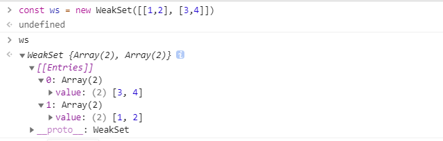
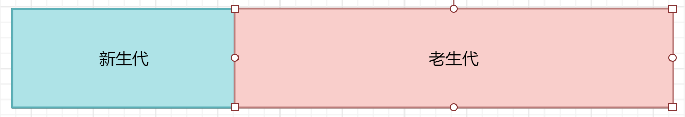

#  JS 知识点

[收集的 JS 资料](./dataLink.md)


## 1、数据类型


### 1-1、常见的类型检测方法

**typeof**

```js
console.log(typeof 2)               // number
console.log(typeof true)            // boolean
console.log(typeof 'str')           // string
console.log(typeof [])              // object    
console.log(typeof function(){})    // function
console.log(typeof {})              // object
console.log(typeof undefined)       // undefined
console.log(typeof null)            // object
```

其中数组、对象、null 都会被判断为 object，其他判断都正确。


**instanceof**：判断一个对象的原型是否在另外一个对象的原型链上，换一种说法就是：判断一个对象是否是某个构造函数的实例

```js
console.log(2 instanceof Number)                    // false
console.log(true instanceof Boolean)                // false 
console.log('str' instanceof String)                // false 

console.log([] instanceof Array)                    // true
console.log(function(){} instanceof Function)       // true
console.log({} instanceof Object)                   // true
```

instanceof **只能正确判断引用数据类型**，而不能判断基础数据类型，因为基础数据类型（如字符串、数字、布尔值等）不是对象，它们不具有原型链

即 instanceof 的比对步骤：
1. 获取对象的原型（object.__proto__）
2. 获取构造函数的原型（constructor.prototype）
3. 比较两者是否相等。如果不等，则继续沿着原型链向上查找，直到找到匹配的原型或到达原型链的顶端 null


**constructor**

```js
console.log((2).constructor === Number)                  // true
console.log((true).constructor === Boolean)              // true
console.log(('str').constructor === String)              // true
console.log(([]).constructor === Array)                  // true
console.log((function() {}).constructor === Function)    // true
console.log(({}).constructor === Object)                 // true
```

在 JavaScript 中，每个对象都有一个 constructor 属性，它指向创建该对象的构造函数。
对于基础数据类型（如 number、string、boolean 等），JavaScript 在访问它们的属性或方法时，会临时将它们包装成对应的包装对象（如 Number、String、Boolean）。即隐式转换。


constructor 与 instanceof 的区别：
- 依赖于原型链，只能用于对象
- constructor 依赖于对象的 constructor 属性，而基础数据类型在访问 constructor 时会隐式转换为对象，因此可以用于判断基础数据类型


> 注意：
>  1. 这种方法如果修改了原型，判断就不正确
>  2. null 和 undefined 没有 constructor 属性，访问时会报错


**Object.prototype.toString.call()**

JavaScript 中的每个对象都有一个内部属性 [[Class]]，它表示对象的类型。Object.prototype.toString 会访问这个内部属性，并返回 [object Type]，其中 Type 就是 [[Class]] 的值

Object.prototype.toString 是基于对象的内部 [[Class]] 属性，因此它不会受到手动修改对象属性（如 constructor 或 __proto__）的影响

```js
Object.prototype.toString.call('name').slice(8, -1)      // 'String'
Object.prototype.toString.call(110).slice(8, -1)         // 'Number'
Object.prototype.toString.call(true).slice(8, -1)        // 'Boolean'
Object.prototype.toString.call({}).slice(8, -1)          // 'Object'
Object.prototype.toString.call([]).slice(8, -1)          // 'Array'
```


**常用的判断数组方法**

```js
console.log(Object.prototype.toString.call([]).slice(8, -1) === 'Array') // true
console.log(Array.isArray([])) // true
console.log([] instanceof Array) // true
console.log([].constructor === Array) // true
console.log([].__proto__ === Array.prototype) // true
console.log(Array.prototype.isPrototypeOf([])) // true
```


### 1-2、typeof NaN 的结果

```js
typeof NaN    // 'number'
```

NaN 是 Number 类型的一个值，NaN 被视为一个特殊的数值，代表的是一个不确定的数值


### 1-3、typeof null 问题

typeof null 的结果是 object。为什么呢？

这是 JS 存在的一个悠久 Bug。在 JS 的最初版本中使用的是 32 位系统，为了性能考虑使用低位存储变量的类型信息，000 开头代表是对象。而 null 为全零，所以将它错误的判断为 object 。


### 1-4、isNaN 和 Number.isNaN 的区别

基本用法：

```js
isNaN()

Number.isNaN()
```

- isNaN 是 ES5 的方法，本意是通过 Number 方法把参数转换成数字类型，如若转换成功，则返回 false，反之返回 true，它只是判断参数是否能转成数字，不能用来判断是否严格等于 NaN
- Number.isNaN 是 ES6 提供，用来判断一个值是否严格等于 NaN，它会首先判断传入的值是否为数字类型，如不是，直接返回 false
- 区别：isNaN 方法首先转换类型，而 Number.isNaN 方法不用；isNaN 不能用来判断是否严格等于 NaN，Number.isNaN 方法可以

```js
console.log(isNaN(10)) // false
console.log(isNaN('10')) // false
console.log(isNaN({})) // true
console.log(isNaN(NaN)) // true

console.log(Number.isNaN(10)) // false
console.log(Number.isNaN('10')) // false
console.log(Number.isNaN({})) // false
console.log(Number.isNaN(NaN)) // true
```


### 1-5、0.1 + 0.2 === 0.3 吗？为什么？

JavaScript使用 Number 类型表示数字（整数和浮点数），遵循 [IEEE 754](https://zh.wikipedia.org/wiki/IEEE_754) 标准，通过64位来表示一个数字

 

- 第0位：符号位，0表示正数，1表示负数(s)
- 第1位到第11位：储存指数部分（e）
- 第12位到第63位：储存小数部分（即有效数字）


而在运算的时候，计算机无法直接对十进制的数字进行运算，所以需要先按照IEEE 754转成相应的二进制，然后对阶运算。因此：0.1和0.2 转换成二进制后会无限循环

```js
0.1 -> 0.0001100110011001...(无限循环)
0.2 -> 0.0011001100110011...(无限循环)
```

但是由于 IEEE 754 尾数位数限制，需要将后面多余的位截掉，这样在进制之间的转换中精度就已经损失


**解决精度问题：**

1. 将数字转换为整数，后相加减，再除以放大的倍数

   ```js
   function add(num1, num2) {
    const num1Digits = (num1.toString().split('.')[1] || '').length;
    const num2Digits = (num2.toString().split('.')[1] || '').length;
    const baseNum = Math.pow(10, Math.max(num1Digits, num2Digits));
    return (num1 * baseNum + num2 * baseNum) / baseNum;
   }
   ```

2. 使用第三方库，例如 [Math.js](https://mathjs.org/)、[big.js](http://mikemcl.github.io/big.js)


### 1-6、BigInt

BigInt 是一种数字类型的数据，它可以表示任意精度格式的整数，使用 BigInt 可以安全地存储和操作大整数，即使这个数已经超出了 Number 能够表示的安全整数范围，例如表示高分辨率的时间戳，使用大整数id 等


**怎么创建 BigInt**

```js
// 第一种，只需要在数字末尾追加 n 即可
console.log(9007199254740995n)    // → 9007199254740995n


// 第二种，使用 BigInt() 构造函数
BigInt("9007199254740995");    // → 9007199254740995n
```


需要注意的是，BigInt 不能与普通的 Number 类型直接进行算术运算，否则会抛出 TypeError


### 1-7、Object.is 和 === 的区别

Object.is 在 === 的基础上修复了一些特殊情况下的失误，具体来说就是 +0 和 -0，NaN 和 NaN

```js
console.log(Object.is(0, -0)) // false
console.log(Object.is(0, +0)) // true
console.log(Object.is(+0, -0)) // false
console.log(Object.is(NaN, NaN)) // true
```

其他情况与 === 是完全一样的


**实现一个 Object.is**

```js
function myObjectIs(x, y) {
  // 检查是否是 -0
  // 使用 === 的时候，0 === -0 是 true
  // 但是使用 1 除的时候，会有差异，1/0 是 Infinity，-1/0 是 -Infinity，这样就可以判断了
  if (x === 0 && y === 0) {
    return 1 / x === 1 / y;
  }

  // 检查是否是 NaN
  // NaN === NaN 是 false, 这是不对的，在这里做一个拦截，x !== x，那么一定是 NaN, y 同理
  // 两个都是 NaN 的时候返回 true
  if (x !== x) {
    return y !== y;
  }

  // 其他情况
  return x === y;
}
```


### 1-8、数据类型转换

可参考：https://juejin.cn/post/6940945178899251230#heading-12


**1、基本转换**

js 中类型转换只有三种：

- 转换为数字
- 转换为字符串
- 转换为布尔值

基本转化规则如下：


其它值转字符串：

- Null 和 Undefined 类型 ，null 转换为 "null"，undefined 转换为 "undefined"
- Boolean 类型，true 转换为 "true"，false 转换为 "false"
- Number 类型的值直接转换，不过那些极小和极大的数字会使用指数形式
- Symbol 类型的值直接转换，但是只允许显式强制类型转换，使用隐式强制类型转换会产生错误
- 对普通对象来说，除非自行定义 toString() 方法，否则会调用 toString()（Object.prototype.toString()）来返回内部属性 [[Class]] 的值，数组 [1, 2] --> ’1, 2‘；对象 { name: 'jack'} --> ['object', 'Object']。如果对象有自己的 toString() 方法，字符串化时就会调用该方法并使用其返回值


其它值转数字：

- Undefined 类型的值转换为 NaN

- Null 类型的值转换为 0

- Boolean 类型的值，true 转换为 1，false 转换为 0

- String 类型的值转换如同使用 Number() 函数进行转换，如果包含非数字值则转换为 NaN，空字符串为 0

- Symbol 类型的值不能转换为数字，会报错

- 对象（包括数组）会首先被转换为相应的基本类型值，如果返回的是非数字的基本类型值，则再遵循以上规则将其强制转换为数字


其它值转换到布尔值的规则

- `undefined、null、false、+0、-0、NaN、""`  这几个值为 false，其它的都为 true


**3、`==` 的隐式转换**

当使用 `==` 的时候，两边类型不一致，会进类型转换之后再比较，隐式转换规则如下：

1. 两边的类型是否相同，相同的话就比较值的大小

   ```js
   1 == 1   --> true
   ```

2. 首先判断的是否是 null 和 undefined 在对比，是的话就返回 true

   ```js
   null == undefined   --> true
   ```

3. 判断的类型是否是 String 和 Number，是的话，把 String 类型转换成 Number，再进行比较

   ```js
   1 == '1'
         ↓
   1 ==  1      --> true
   ```

4. 判断其中一方是否是 Boolean，是的话就把Boolean转换成Number，再进行比较

   ```js
   '1' == true
    ↓      ↓
   '1' ==  1
    ↓      ↓
    1  ==  1
   ```

5. 如果其中一方为 Object，且另一方为 String、Number 或者 Symbol 等原始类型的时候，会将 Object 转换成相应的原始类型，再进行比较。


**4、Object 类型转原始类型的流程**

1. 如果 Symbol.toPrimitive() 方法，优先调用再返回
2. 调用 valueOf()，如果转换为原始类型，则返回
3. 调用 toString()，如果转换为原始类型，则返回
4. 如果都没有返回原始类型，会报错

```js
const obj = {
  value: 3,
  valueOf() {
    return 4;
  },
  toString() {
    return '5'
  },
  [Symbol.toPrimitive]() {
    return 6
  }
}
console.log(obj + 1); // 输出7

// 可以看到，有 toPrimitive，优先调用，结果就是 6 + 1 = 7
```


对于数组：

```js
const arr = [1, 2]

// 如果没有专门给 arr 定义 valueOf 和 toString 方法，那么就是调用的内部的 valueOf 和 toString
arr.valueOf()             ---> [1, 2] 还是一样，没变化
arr.toString()            ---> '1, 2'


const arr1 = []
arr.valueOf()             ---> [] 还是一样，没变化
arr.toString()            ---> ''
```

对于对象：

```js
const obj = {name: 'jack'}

// 如果没有专门给 obj 定义 valueOf 和 toString 方法，那么就是调用的内部的 valueOf 和 toString
obj.valueOf()            ---> {name: 'jack'}
obj.toString()           ---> "[object Object]"


const obj = {}
obj.valueOf()            ---> {}
obj.toString()           ---> "[object Object]"
```


**5、如何让if(a == 1 && a == 2)条件成立**

```js
const a = {
  value: 0,
  valueOf: function() {
    this.value++;
    return this.value;
  }
}
console.log(a == 1 && a == 2) // true
```


### 1-9、|| 与 &&

- ||：这个就是找真，只要找到一个真，那么就是 true，找不到就是 false
- &&：找假，只要找到一个是假，就返回 false，找不到就是 true


### 1-10、什么是 JavaScript 中的包装类型

JavaScript 中的原始数据类型（如 number、string、boolean 等）本身不是对象，因此不能直接调用方法或访问属性。为了方便操作原始值，JavaScript 提供了对应的包装类型：

- Number：对应原始类型 number。
- String：对应原始类型 string。
- Boolean：对应原始类型 boolean。

这些包装类型是对象，可以调用方法或访问属性。所以包装类型的主要作用是为原始类型提供对象的行为。

比如：

```js
const a = "abc";
a.length; // 3
a.toUpperCase(); // "ABC"
```

在访问`'abc'.length`时，JavaScript 将`'abc'`在后台转换成`String('abc')`，然后再访问其`length`属性


## 2、闭包、作用域、执行上下文


### 2-1、闭包

参考：https://juejin.cn/post/6844903974378668039#heading-23


**1、什么是闭包**

闭包，简单来讲，就是一个函数可以访问都另外一个函数内部的变量


**2、闭包产生的原因**

要说这个，就先得从作用域链说起：当访问一个变量的时候，会先从当前作用域查找，如果没找到，就去上一层作用域去查找，还是没找到，继续往更上一层作用于查找，直到找到全局作用域，这一层层查找的链路就是作用域链

也就是说，当前环境中存在指向父级作用域的引用，就产生了闭包


**3、闭包的表现形式**

1. 返回函数

   ```js
   function fn() {
     var a = 1
     function fn1() {
       console.log(a)
     }
     return fn1
   }

   var fn1 = fn()
   fn1()  // 1
   ```

2. 存在作用域引用关系

   ```js
   var fn1
   function fn() {
     var a = 1
     fn1 = function() {
       console.log(a)
     }
   }
   
   var fn1 = fn()
   fn1()  // 1
   ```

3. 函数作为参数

   ```js
   var a = 1;
   function foo() {
     var a = 2;
     function baz() {
       console.log(a);
     }
     bar(baz);
   }
   function bar(fn) {
     // 这就是闭包
     fn();
   }
   
   // 输出2，而不是1
   foo();
   ```

4. 在定时器、事件监听、Ajax请求、跨窗口通信、Web Workers或者任何异步中，只要使用了回调函数，实际上就是在使用闭包

   ```js
   // 定时器
   setTimeout(function timeHandler() {
     console.log('111');
   }，100)
   
   // 事件监听
   $('#app').click(function() {
     console.log('DOM Listener');
   })
   ```

5. IIFE 立即执行函数

   ```js
   var a = 2
   (function IIFE(){
     // 输出2
     console.log(a)
   })()
   ```

5. 函数柯里化

   ```js
    function add(a) {
      return function (b) {
        return a + b;
      };
    }
   
    const add5 = add(5);
    console.log(add5(3)); // 8
   
    // 在这个例子中，add5 是一个闭包，它“记住”了参数 a 的值
   ```


**4、闭包的优缺点**

优点：

- 访问外部变量。在外部访问到函数内部的变量，可以使用这种方法来创建私有变量。
- 形成沙箱。避免环境污染
- 保存状态。闭包可以“记住”其词法作用域中的变量值，从而实现状态的保存。
- 延长变量生命周期。闭包会阻止其词法作用域中的变量被垃圾回收，从而延长变量的生命周期。


缺点：

- 内存长期驻用，增加内存用量，使用不当会导致内存泄漏


### 2-2、作用域与作用域链


**1、几种作用域**

1. 全局作用域

   - 最外层函数和最外层函数外面定义的变量拥有全局作用域
   - 所有 window 对象的属性拥有全局作用域
   - 全局作用域有很大的弊端，过多的全局作用域变量会污染全局命名空间，容易引起命名冲突

2. 函数作用域

   - 函数作用域声明在函数内部的变量，一般只有固定的代码片段可以访问到
   - 作用域是分层的，内层作用域可以访问外层作用域，反之不行

3. 块级作用域

   - 使用 ES6 中新增的 let 和 const 指令可以声明块级作用域，块级作用域可以在函数中创建也可以在一个代码块中的创建（由`{ }`包裹的代码片段）

   - let 和 const 声明的变量不会有变量提升，也不可以重复声明

   - 在循环中比较适合绑定块级作用域，这样就可以把声明的计数器变量限制在循环内部。


**2、作用域链**

在当前作用域中查找所需变量，如果在自己作用域找不到该变量就去父级作用域查找，依次向上级作用域查找，直到访问到 window 对象就被终止，这一层层的关系就是作用域链


### 2-3、执行上下文


**1、上下文类型**

1. 全局上下文
   - 任何不在函数内部的都是全局执行上下文，它首先会创建一个全局的window对象，并且设置this的值等于这个全局对象，一个程序中只有一个全局执行上下文
2. 函数上下文
   - 当一个函数被调用时，就会为该函数创建一个新的执行上下文，函数的上下文可以有任意多个
3. eval 上下文，用得比较少，了解即可


**2、上下文定义**

在执行 JS 代码之前，需要先解析代码。解析的时候会先创建一个全局执行上下文环境，先把代码中即将执行的变量、函数声明都拿出来，变量先赋值为 undefined，函数先声明好可使用。这一步执行完了，才开始正式的执行程序。

在一个函数执行之前，也会创建一个函数执行上下文环境，跟全局执行上下文类似，不过函数执行上下文会多出 this、arguments 和函数的参数。

- 全局上下文：变量定义，函数声明
- 函数上下文：变量定义，函数声明，`this`，`arguments`


**3、上下文栈**

javaScript 引擎使用 `上下文栈` 来管理执行上下文

当 JavaScrip t执行代码时，首先遇到全局代码，会**创建一个全局执行上下文**并且**压入执行栈底**，每当遇到一个函数调用，就会**为该函数创建一个新的执行上下文并压入栈顶**，引擎会执行位于执行上下文栈顶的函数，当函数执行完成之后，执行上下文从栈中弹出，继续执行下一个上下文。当所有的代码都执行完毕之后，从栈底弹出全局执行上下文


## 3、原型与原型链


### 3-1、原型

一张图了解原型

 

- 每一个构造函数的内部都有一个 prototype 属性
- 通过构造函数实例化出来的实例对象，有原型属性 \_\_proto\_\_
- 构造函数的 prototype 属性与实例的原型属性 \_\_proto\_\_ 指向同一处


### 3-2、原型链

当访问一个对象的属性时，如果这个对象内部不存在这个属性，那么它就会去它的原型对象里找这个属性，这个原型对象又会有自己的原型，于是就这样一直找下去，也就是原型链的概念。


可以看到，原型的起点是 Function，终点是指向 null


## 4、继承


### 4-1、借用 call 构造继承

```js
function Parent() {
  this.name = 'jack'
}
Parent.prototype.getName = function() {
  return this.name
}

function Child() {
  Parent.call(this)
  this.age = 18
}

const res = new Child()
console.log(res.name) // jack
console.log('call 构造继承', res.getName()) // 报错，res.getName is not a function
```

缺点：无法继承父类的方法


### 4-2、原型链继承

```js
function Parent() {
  this.name = 'jack'
}
Parent.prototype.getName = function() {
  return this.name
}

function Child() {
  this.age = 18
}
Child.prototype = new Parent()
Child.prototype.getAge = function() {
  return this.age
}

const res = new Child()
console.log(res.getName()) // jack
```

缺点：所有 Child 实例原型都指向同一个 Parent 实例, 如果父类的属性是引用类型（如数组、对象），所有子类实例会共享该属性。修改一个实例的属性会影响其他实例。例如：

```js
function Parent() {
  this.colors = ["red", "blue"];
}

function Child() {}

Child.prototype = new Parent();

const child1 = new Child();
const child2 = new Child();

child1.colors.push("green");
console.log(child2.colors); // ["red", "blue", "green"]
```


### 4-3、组合继承

```js
function Parent() {
  this.name = 'jack'
}
Parent.prototype.getName = function() {
  return this.name
}

function Child() {
  Parent.call(this)
  this.age = 18
}
Child.prototype = new Parent()
Child.prototype.constructor = Child
Child.prototype.getAge = function() {
  return this.name
}

const res = new Child()
console.log('组合继承', res.getName()) // jack
```

组合继承就是结合了 call 与原型链，缺点：每次创建子类实例都执行了两次构造函数  SuperType.call() 和 new Parent()，虽然这并不影响对父类的继承，但子类创建实例时，原型中会存在两份相同的属性和方法，这并不优雅


### 4-4、寄生组合继承

```js
function Parent() {
  this.name = 'jack'
}
Parent.prototype.getName = function() {
  return this.name
}

function Child() {
  Parent.call(this)
  this.age = 18
}
// Object.create 作用：创建一个新对象，并将新对象的原型指向指定的对象
Child.prototype = Object.create(Parent.prototype) // 将`指向父类实例`改为`指向父类原型`
Child.prototype.constructor = Child
Child.prototype.getAge = function() {
  return this.age
}

const res = new Child()
console.log('寄生组合继承', res.getName()) // jack
```

目前最完美的继承方法


### 4-5、class 继承

```js
class Parent {
  constructor(name) {
    this.name = name
  }

  getName() {
    return this.name
  }
}

class Child extends Parent {
  constructor(name, age) {
    super(name)
    this.age = age
  }

  getAge() {
    return this.age
  }
}

const res = new Child('jack', 20)
console.log('class 继承', res.getName()) // jack
```

class 继承实际上就是寄生继承，只是包装了一层语法糖而已


## 5、arguments

`arguments`是一个对象，它的属性是从 0 开始依次递增的数字，还有`callee`和`length`等属性，与数组相似；但是它却没有数组常见的方法属性，如`forEach`, `reduce`等，所以叫它们类数组。


将类数组转换为数组，常用的方法有：

1. 利用 `call` 或者 `apply`方法将数组的方法应用到类数组上

   ```js
   function foo() { 
     const res = Array.prototype.slice.call(arguments)
   }
   ```

2. 通过 Array.from 转换为数组

   ```js
   function foo() { 
     const res = Array.from(arguments) 
   }
   ```

3. 通过展开运算符转换为数组

   ```js
   function foo() { 
     const res = [...arguments]
   }
   ```


## 6、this 问题

this 是执行上下文中的一个属性，**它指向最后一次调用这个方法的对象**。在实际开发中，this 的指向可以通过以下几种调用模式来判断：

- **函数调用模式**：当一个函数不是一个对象的属性时，直接作为函数来调用时，this 指向全局对象 window

  ```js
  function fun() {
    console.log(this) // window
  }
  ```

- **方法调用模式**：当一个函数作为一个对象方法的时候，this 分两种情况

  - 当是普通函数时，指向这个对象

    ```js
    const obj = {
      fun: function() {
        console.log(this)
      }
    }
    console.log(obj.fun()) // obj
    ```

  - 当是箭头函数时，与这个对象外层的 this 指向一致

    ```js
    const obj = {
      fun: () => {
        console.log(this)
      }
    }
    console.log(obj.fun()) // window
    ```

- **构造器调用模式**：如果一个函数用 new 调用时，函数执行前会新创建一个对象，this 指向这个新创建的对象

  ```js
  const a = 'b'
  function Func() {
    console.log(this.a) // undefined
  }
  const res = new Func()
  ```

  可以看到，new Func() 的时候，输出的 this.a 是 undefined，并不是 ’b‘，这就证明了 this 指向这个新创建的对象

  

  ```js
  class Person {
    constructor(name) {
      this.name = name
    }

    getName() {
      console.log(this.name)
    }
  }

  const p = new Person('jack')
  p.getName() // jack

  const func = p.getName
  func('jack') // 直接报错，因为此时没有绑定 this，this 为 undefined，undefined.name 会报错
  ```

  

- **apply、call 和 bind 调用模式**：这三个方法都可以显式指定调用函数的 this 指向

  ```js
  var name = 'marry'
  const obj = {
    name: 'jack'
  }
  
  function fun() {
    console.log(this.name)
  }
  
  fun()   // 'marry'
  fun.call(obj) // 'jack'
  ```


## 7、call、apply 与 bind


### 7-1、call 与 apply 的区别

它们的作用都是改变 this 指向，并且马上执行，区别仅在于传入参数的形式的不同

- apply 接受两个参数，第一个参数指定了函数体内 this 对象的指向，第二个参数可以为数组，也可以为类数组，apply 方法把这个集合中的元素作为参数传递给被调用的函数
- call 传入的参数数量不固定，跟 apply 相同的是，第一个参数也是代表函数体内的 this 指向，从第二个开始往后，都被当做参数依次传递函数给被调用的函数


### 7-2、bind 与 call、apply 区别

bind() 方法会创建一个函数的实例，其 this 值会被绑定到传给 bind() 函数的值。意思就是 bind() 会返回一个新函数。

- call/apply 改变了函数的 this 上下文后马上执行该函数
- bind 则是返回改变了上下文后的函数，不执行该函数


### 7-3、手写 call、apply、bind

[手写 call](#手写 call)

[手写 apply](#手写 apply)

[手写 bind](#手写 bind)


## 8、Set、Map、WeakSet 和 WeakMap 的区别

set 是一种叫做**集合**的数据结构，map 是一种叫做**字典**的数据结构，主要的使用场景是**数据存储**和**数据重组**


### 8-1、Set

set 类似数组，但是 set 的成员是**唯一且无序的**。

set 对象**允许存储任何类型的唯一值**；

向 set 加入值的时候，不会发生类型的转换，比如 1 和 '1' 是两个不同的值。set 内部判断两个值是否相同，使用的是“Same-value-zero equality” 算法，类似于 js 的 `===`，区别在于 set 认为 NaN 等于自身，`===` 认为 NaN 不等于自身

```js
const resSet = new Set()

[1, 2, 3, 4, 3, 2, 1].forEach(i => resSet.add(i))
for (let i of s) {
    console.log(i) // 1 2 3 4
}
```

重复的不会添加：

  


set 的属性：

- constructor：构造函数

- size：元素数量

  ```js
  const s = new Set([1,2,1,2])
  
  console.log(s.size) // 2，元素数量为2，会去重
  ```

set 的一些方法：

- keys()：返回一个包含集合中所有**键**的迭代器

- values()：返回一个包含集合中所有**值**的迭代器

- entries()：返回一个包含集合中所有**键值对**的迭代器

- forEach(callbackFn, thisArg)：遍历集合

  ```js
  const s = new Set([7,8,9])
  
  console.log(s.keys()) // SetIterator {7, 8, 9}
  console.log(s.values()) // SetIterator {7, 8, 9}
  console.log(s.entries()) // SetIterator {7 => 7, 8 => 8, 9 => 9}
  
  for(let i of s.keys()) {
      console.log(i) // 7、8、9
  }
  
  for(let i of s.entries()) {
      console.log(i) // [7,7]、[8,8]、[9,9]
  }
  
  s.forEach((value, key) => {})
  ```

- add(value)：往集合里新增

- delete(value)：删除集合里的值

- has(value)：判断集合中是否存在某值

- clear()：清空集合

  ```js
  const s = new Set()
  
  s.add(7).add(8)
  s.has(7) // true
  s.delete(7)
  s.has(7) // false
  ```

set 转换为数组

- Array.from(set)

- [...set]

  ```js
  const s = new Set([7,8,9])
  
  const arr = Array.from(s)
  console.log(arr) // [7,8,9]
  
  console.log([...s]) // [7,8,9]
  ```


### 8-2、WeakSet

WeakSet 是将一个**弱引用存储在集合中**

WeakSet 与 set 的区别：

- WeakSet 只能存储对象引用，不能存储值，set 任意类型都可以
- WeakSet 对象中储存的对象值都是被弱引用的，即垃圾回收机制不考虑 WeakSet 对该对象的应用，如果没有其他的变量或属性引用这个对象值，则这个对象将会被垃圾回收掉（不考虑该对象还存在于 WeakSet 中），所以，WeakSet 对象里有多少个成员元素，取决于垃圾回收机制有没有运行，运行前后成员个数可能不一致，有的成员可能取不到了（被垃圾回收了），**WeakSet 对象是无法被遍历的**（ES6 规定 WeakSet 不可遍历），也没有办法拿到它包含的所有元素

相对于 Set 丰富的方法属性，WeakSet 只有下面三个方法：

- add(value)：往 WeakSet 中添加一些元素

- has(value)：判断 WeakSet 是否包含某个元素

- delete(value)：删除 WeakSet 中的 value 元素

  ```js
  const ws = new WeakSet([[1,2], [3,4]])
  
  const target = [5, 6]
  ws.add(target)
  console.log(ws)
  console.log(ws.has(target))
  ws.delete(target)
  console.log(ws)


  // 注意：直接这样子添加，ws.has([5, 6]) 与 ws.delete([5, 6]) 都无效
  // 也就是只有对同一个对象进行弱引用会将其是为同一个值
  ws.add([5, 6])
  ```

   


### 8-3、Map

Map 类似对象，也是键值对的集合，但是“键”的范围不限制于字符串，任意类型（包含对象）都可以当作键；Map 也可以接受一个数组作为参数，数组的成员是一个个表示键值对的数组。注意Map里面也不可以放重复的项。

Map 与 Set 的区别：

- 共同点：都是存储**不重复**的值
- 不同点：Set 集合是以 [value, value] 的形式存储元素，Map 字典是以 [key, value] 的形式存储元素

```js
const m = new Map()
m.set('a', '值是a')
  ```

 

Map 的属性：

- constructor：构造函数

- size：返回字典中所包含元素的个数

  ```js
  const m = new Map()
  m.set('a', '值是a')
  
  console.log(m.size) // 1
  ```

Map 的一些方法：

- set(key, value)：向字典中添加新元素

- get(key)：通过键查找特定元素，并返回值

- has(key)：判断字典中是否存在 key

- delete(key)：通过键 key 从字典中删除对应数据

- clear()：清空字典的所有元素

- keys()：将字典中包含的所有键名以迭代器形式返回

- values()：将字典中包含的所有数值以迭代器形式返回

- entries()：返回所有成员的迭代器

- forEach()：遍历字典的所有成员

  ```js
  const m = new Map([
      ['1', 'name'],
      ['2', 'age']
  ])
  
  console.log(m.keys()) // MapIterator {"1", "2"}
  console.log(m.values()) // MapIterator {"name", "age"}
  console.log(m.entries()) //MapIterator {"1" => "name", "2" => "age"}
  ```

Map 也可以接受一个数组作为参数，数组的成员是一个个表示键值对的数组

```js
const m = new Map([
    ['1', 'name'],
    ['2', 'age']
])

console.log(m.get('1')) // name
```

**注意，只有对同一个对象的引用，Map 结构才将其视为同一个键**

```js
// 例子1：
const m = new Map()

m.set(['a'], '值a')
m.get(['a']) // undefined

// 例子2：
const mm = new Map()

const b = ['b']
m.set(b, '值b')
m.get(b) // 值b

总结：很明显，b 始终指向同一个对象，所以能够获取到值
```


Map 转换成 Object 对象

```js
const m = new Map()
m.set('1', 'aa')
m.set('2', 'bb')

const obj = {}
// forEach 是 map 提供的迭代方法
m.forEach((value, key) => {
  obj[key] = value
})
console.log(obj)
```


### 8-4、WeakMap

WeakMap 是一组键值对的字典，**键是弱引用对象，值可以是任意**

WeakMap 中，每个键对自己所引用对象的引用都是弱引用，在没有其他引用和该键引用同一对象，这个对象将会被垃圾回收（相应的 key 则变成无效的），所以，WeakMap 的 key 是不可枚举的，也是不可遍历的。

相对于 Map 丰富的方法属性，WeakMap 只有下面这几个方法：

- set(key, value)：设置值
- get(key)：根据 key 获取某个值
- has(key)：根据 key 判断是否存在某个值
- delete(key)：根据 key 删除某个值

```js
const wm = new WeakMap()

const key = ['1']
wm.set(key, ['aa'])
console.log(wm)
console.log(wm.has(key))
console.log(wm.get(key))
wm.delete(key)
console.log(wm)
```


**WeakMap 与 Map 区别：**

- Map 数据结构。它类似于对象，也是键值对的集合，但是“键”的范围不限于字符串，各种类型的值（包括对象）都可以当作键
- WeakMap 结构与 Map 结构类似，也是用于生成键值对的集合。但是 WeakMap 只接受对象作为键名（ null 除外），不接受其他类型的值作为键名。而且 WeakMap 的键名所指向的对象，不计入垃圾回收机制


### 8-5、总结

- Set
  - 成员唯一、无序且不重复，可以存储任意类型
  - [value, value]，键值与键名是一致的（或者说只有键值，没有键名）
  - 可以遍历，方法有：add、delete、has
- WeakSet
  - 成员都是对象
  - 成员都是弱引用，可以被垃圾回收机制回收，可以用来保存 DOM 节点，不容易造成内存泄漏
  - 不能遍历，方法有 add、delete、has
- Map
  - 本质上是键值对的集合，键可以是任意类型
  - 成员也是唯一的（键 key 唯一）
  - 可以遍历，方法很多可以跟各种数据格式转换
- WeakMap
  - 只接受对象作为键名（null 除外），不接受其他类型的值作为键名
  - 键名是弱引用，键值可以是任意的，键名所指向的对象可以被垃圾回收，此时键名是无效的
  - 不能遍历，方法有 get、set、has、delete


## 9、Map 与 Object 的区别

|          | Map                                                          | Object                                                       |
| -------- | ------------------------------------------------------------ | ------------------------------------------------------------ |
| 意外的键 | Map 默认情况不包含任何键，只包含显式插入的                   | Object 有一个原型, 原型链上的键名有可能和自己在对象上的设置的键名产生冲突 |
| 键的类型 | Map 的键可以是任意值，包括函数、对象或任意基本类型           | Object 的键必须是 String 或是 Symbol。                       |
| 键的顺序 | Map 中的 key 是有序的。因此，当迭代的时候， Map 对象以插入的顺序返回键值 | Object 的键是无序的                                          |
| Size     | Map 的键值对个数可以轻易地通过 size 属性获取                 | Object 的键值对个数只能手动计算                              |
| 迭代     | Map 是 iterable 的，所以可以直接被迭代                       | 迭代 Object 需要以某种方式获取它的键然后才能迭代             |
| 性能     | 在频繁增删键值对的场景下表现更好                             | 在频繁添加和删除键值对的场景下未作出优化                     |


## 10、操作数组


### 10-1、判断是否在数组里

```js
const arr = [1, 2, 3]

// 找到，返回对一个的下标，找不到，返回 -1
console.log(arr.indexOf(1))

// 找到，返回 true，找不到，返回 false
console.log(arr.includes(1))

// 找到，返回对应的值，只找第一个匹配的，找不到，返回 undefined
console.log(arr.find(item => item === 1))

// 找到，返回对应的下标，只找第一个匹配的，找不到，返回 -1
console.log(arr.findIndex(item => item === 1))
```


### 10-2、遍历数组

**1、for 循环**

```js
const arr = [1, 2, 3]
for(let i = 0, len = arr.length; i < len; i++) {
  // if (arr[i] === 1) {
  //   break
  // }
  if (arr[i] === 1) {
    continue
  }
  console.log(i)
}
```

for 循环可以随时使用 break 终止循环，或者使用 continue 终止本轮循环

> 注意，return 只能在函数内部使用，单独的 for 循环没办法使用 return


**2、forEach**

forEach 没办法终止循环，使用 return 只能退出终止本轮循环，继续下一轮循环

forEach 没有返回值

```js
const arr = [1, 2, 3]
arr.forEach((item, index, initArr) => {
  // item: 数组每一项
  // index: 数组每一项对应的下标
  // initArr: 原数组
  console.log(item);
  console.log(index);
  console.log(initArr);
})
```


**3、map**

map 循环，返回一个新数组，不会影响原来数组，只是将原来数组拷贝一份，把拷贝的进行更改

```js
const arr = [1, 2, 3]
const newArr = arr.map((item, index, initArr) => {
  // item: 数组每一项
  // index: 数组每一项对应的下标
  // initArr: 原数组
  return item * 2
})
console.log(newArr)  // [2, 4, 6]
```


**4、reduce**

```js
array.reduce((accumulator, currentValue, currentIndex, array) => {
  // accumulator: 数组每一段的累加值
  // currentValue: 当前值
  // currentIndex: 当前索引
  // array: 原数组
}, startValue) // startValue: 初始累积值
```

累加器，参数: 接收两个参数，一个为回调函数，另一个为初始值。回调函数中三个默认参数，依次为积累值、当前值、整个数组


例子：求和

```js
const arr = [1, 2, 3]
const total = arr.reduce((a, b) => {
  return a + b
}, 0)
console.log(total)
```


**5、filtter**

filter: 过滤，返回匹配的结果为 true 的项, 结果为数组

```js
const arr = [1, 2, 3]
const newArr = arr.filter(item => {
  return item >= 2
})
console.log(newArr) // [2, 3]
```


**6、find、findIndex**

- find：找到数组中的某一项，并返回值，当找到第一个，就不会继续往下找了，找不到，返回 undefined

- findIndex：找到数组中某一项的下标，并返回下标，当找到第一个，就不会继续往下找了，找不到，返回 -1

```js
const arr = [1, 2, 3]
const res = arr.find(item => {
  return item === 2
})
console.log(res) // 2

const resIdx = arr.findIndex(item => {
  return item === 1
})
console.log(resIdx) // 0
```


**7、some**

some 满足某一个条件返回 true，只要有一个满足即返回 true，并且退出循环。所以可以使用这个来代替上面的几个不能退出循环的操作

```js
const arr = [1, 2, 3]
arr.some(item => {
  if (item === 2) {
    return true
  } else {
    console.log(item)
    return false
  }
})

// 只打印了 1，后面的都退出了循环
```


**8、every**

every 满足所有条件则返回 true，如果有某一个不满足，返回 false，并且退出循环。所以可以使用这个来代替上面的几个不能退出循环的操作

```js
const arr = [1, 2, 3]
arr.every(item => {
  if (item === 2) {
    return false
  } else {
    console.log(item)
    return true
  }
})

// 只打印了 1，后面的都退出了循环
```


### 10-3、数组去重

**ES6 的 Set 去重**

```js
const arr = [1, 2, 3, 2, 1]

const res = [...new Set(arr)]
console.log(res)
```


**ES5 遍历去重**

```js
const arr = [1, 2, 3, 2, 1]
function unique(arr) {
  const res = []
  arr.forEach(item => {
    if (!res.includes(item)) {
      res.push(item)
    }
  })
  return res
}
console.log(unique(arr))
```


### 10-4、扁平化数组

**flat 方法扁平化**

```js
const arr = [[1, 2], 3, [4, [5, 6]]]
const res = arr.flat(Infinity) // 里面是数字，数字是多少，就扁平化多少层，Infinity 代表无穷
console.log(res)
```

flat 接受一个数值类型参数，数值为几，就扁平化多少层，Infinity 代表无穷


**递归方法**

```js
function flatFun(arr) {
  let res = []
  arr.forEach(item => {
    if (Array.isArray(item)) {
      res = res.concat(flatFun(item))
    } else {
      res.push(item)
    }
  })
  return res
}
const arr = [[1, 2], 3, [4, [5, 6]]]
console.log(flatFun(arr))
```


**raduce 方法**

```js
function flatFun(arr) {
  const res = arr.reduce((a, b) => {
    return a.concat(Array.isArray(b) ? flatFun(b) : b)
  }, [])

  return res
}

const arr = [[1, 2], 3, [4, [5, 6]]]
console.log(flatFun(arr))
```


## 11、模块化

模块化放在另外一个文件

[模块化](../jsModule/readme.md)


### 11-1、ES Module 与 CommonJs 的区别

- 语法区别：
  - ES Module 使用 import 和 export 关键字
  - CommonJs 使用 require 和 module.exports 关键字
- 加载方式：
  - ES Module 是静态加载，模块的依赖关系在代码解析阶段（编译时）确定；也可以动态引入，需要使用 import() 函数
  - CommonJs 是动态加载，模块的依赖关系在运行时确定
- 运行环境：
  - ES Module 主要用于浏览器端和现代 Node.js 环境（Node.js 12+），在浏览器中需要通过 `<script type="module">` 标签加载，在 Node.js 中需要通过 .mjs 文件扩展名或在 package.json 中设置 "type": "module"。
  - CommonJs 主要用于 Node.js 环境，是 Node.js 的默认模块系统,在浏览器中不支持直接使用，需要通过打包工具（如 Webpack、Browserify）转换为浏览器可用的代码
- 循环依赖：
  - ES Module：支持循环依赖，但可能会导致部分模块未完全初始化
  - CommonJS：也支持循环依赖，但由于动态加载特性，可能导致更复杂的初始化问题
- 性能：
  - ES Module：静态分析能力使其更适合现代化构建工具（如 Rollup、Vite），可以进行深度优化（如 Tree Shaking 和懒加载）
  - CommonJS：动态加载特性使其在某些场景下更灵活，但无法享受静态分析带来的性能优化


### 11-2 AMD 和 CMD 的异同点
两者都是异步加载。

AMD 的异步加载机制：**​提前声明依赖**
- 在模块定义时，提前声明依赖。
- 加载器异步加载所有依赖模块。
- 所有依赖加载完成后，执行模块逻辑。

CMD 的异步加载机制：**​就近声明依赖**
- 在模块逻辑中，需要用到依赖时再加载。
- 加载器异步加载依赖模块。
- 依赖加载完成后，继续执行模块逻辑。


## 12、垃圾回收

可参考：

- [V8引擎垃圾回收原理解析](https://juejin.cn/post/6969875260472557582)
- [V8 引擎如何进行垃圾内存的回收？](https://juejin.cn/post/6844904004007247880#heading-1)


JS 语言不像 C/C++, 让程序员自己去开辟或者释放内存，而是类似 Java，采用自己的一套垃圾回收算法进行自动的内存管理。而 JS 是没有能力去管理内存的，一般都是依赖浏览器引擎，例如 V8 引擎。接下来的垃圾回收都是围绕着 V8 引擎怎么进行 JS 垃圾回收的。


### 12-1、垃圾数据的产生

如下面代码：

```js
const obj = new Array(5)
```

当 JavaScript 执行这段代码的时候，会先在全局作用域中添加一个 obj 变量，并在堆中创建了一个长度为 5 的数组，将该数组的地址指向了 obj。

 

如果此时，将另外一个对象赋值给 obj：

```js
obj = {}
```

 

此时，obj 重新指向 Object，而原来的 Array 就成了垃圾数据。


### 13-2、V8 内存限制

V8 只能使用系统的一部分内存，具体来说，在`64`位系统下，V8最多只能分配`1.4G`, 在 32 位系统中，最多只能分配`0.7G`。在前端方面，这样的大内存需求其实并不大，但对于后端而言，比如 nodejs，如果遇到一个 2G 多的文件，那么将无法全部将其读入内存进行各种操作。

在 JS 中，将内存存储分为栈堆。对于栈内存而言，当ESP指针下移，也就是上下文切换之后，栈顶的空间会自动被回收。但是对于堆内存，就会复杂很多。

V8 为什么要给它设置内存上限？明明我的机器大几十G的内存，只能让我用这么一点，主要原因是：

- JS 是单线程运行的，这意味着一旦进入到垃圾回收，那么其它的各种运行逻辑都要暂停
- 垃圾回收其实是非常耗时间的操作，V8 官方是这样形容的：以 1.5GB 的垃圾回收堆内存为例，V8 做一次小的垃圾回收需要 50ms 以上，做一次非增量式的垃圾回收甚至要 1s 以上

由于垃圾回收非常耗时，那么在垃圾回收期间，JS 代码执行会一直没有响应，造成应用卡顿，应用性能和响应能力直线下降。因此，V8 做了一个简单粗暴的选择，那就是限制堆内存，这也算是一种权衡的手段，因为大部分情况是不会遇到操作几个 G 内存这样的场景的。


当然，也可以通过手动设置调整内存：

- 调整老生代的内存，单位是 MB

  ```js
  node --max-old-space-size=2048 xxx.js 
  ```

- 调整新生代的内存，单位是 KB

  ```js
  node --max-new-space-size=2048 xxx.js
  ```


### 12-3、V8 内存分代

在V8中，主要将内存分为`新生代`和`老生代`两种，新生代就是临时分配的内存，存活时间短，老生代是常驻内存，存活的时间长，如下图所示：

 

V8 堆内存的整体大小就是新生代内存空间加上老生代内存空间。

而根据两种不同种类的堆内存，V8 采取了不同的策略进行回收，做出针对性的优化。


### 12-4、新生代回收

新生代回收也叫副垃圾回收

新生代，默认的内存大小在 64 位中是 32M，在 32 位中是 16M。可以看出，这是非常的小，不过也可以理解，新生代中的变量存活时间短，来了马上就走，不容易产生太大的内存负担，因此可以将它设的足够小。


接下来看看新生代是怎么回收的。

首先，将新生代内分为两块：

 

- From 表示正在使用的内存
- To 表示目前闲置的内存

在垃圾回收的过程中，V8 会对 From 部分进行检查，如果是存活的对象，那么复制到 To 内存中（To 内存中是按照顺序从头放置的），如果是非存活对象，进行回收即可。


当所有的From中的存活对象按照顺序进入到To内存之后，From 和 To 两者的角色`对调`，From 现在被闲置，To 为正在使用，如此循环。


那么为什么不直接将非存活对象回收了，而是要这样子做呢？

在 To 内存中按照顺序从头放置的，这是为了应对这样的场景：

 

深色的小方块代表存活对象，白色部分表示待分配的内存，由于堆内存是连续分配的，这样零零散散的空间可能会导致稍微大一点的对象没有办法进行空间分配，这种零散的空间也叫做**内存碎片**。

新生代垃圾回收算法也叫 **Scavenge算法**。主要解决内存碎片的问题，在进行一顿复制之后，To空间变成了这个样子：

 

这样就大大方便了后续连续空间的分配。

不过 Scavenge 算法的劣势也非常明显，就是内存只能使用新生代内存的一半，但是它只存放生命周期短的对象，这种对象`一般很少`，因此`时间`性能非常优秀。


总结新生代回收流程就是：

- 先将堆内存一分为二，分成 From 空间与 To 空间

- 处于使用状态的空间称为 From 空间，处于闲置状态的空间称为 To 空间

- 当我们分配对象时，先是在 From 空间中进行分配

- 开始进行垃圾回收时，会检查 From 空间中存活的对象

- 存活的被复制到 To 空间中，非存活对象直接清除

- 完成复制后，From 空间和 To 空间的角色发生对换


### 12-5、老生代回收

老生代回收也叫主垃圾回收。

在新生代中，当一个对象经过多次复制仍然存活时，它将会被认为是生命周期较长的对象，这种对象随后会被移动到老生代堆内存中，采用新的算法进行处理，从新生代移动到老生代的过程被称为**对象晋升**。

发生晋升其实不只是这一种原因，我们来梳理一下会有那些情况触发晋升:

- 已经经历过一次 Scavenge 回收
- To（闲置）空间的内存占用超过 25%

进入到老生代的垃圾回收机制当中，老生代中累积的变量空间一般都是很大的，当然不能用 `Scavenge` 算法，浪费一半空间不说，对庞大的内存空间进行复制也是非常消耗性能的。


而老生代进行内存回收主要分为下面几个阶段：

第一阶段：进行标记-清除，也就是标记阶段和清除阶段。首先会遍历堆中的所有对象，对它们做上标记，然后对于代码环境中`使用的变量`以及被`强引用`的变量取消标记，剩下的就是要删除的变量了，在随后的`清除阶段`对其进行空间的回收

当然这又会引发内存碎片的问题，存活对象的空间不连续对后续的空间分配造成障碍。

所以，接下来的第二步就是整理内存碎片。V8 的解决方式非常简单粗暴，在清除阶段结束后，把存活的对象全部往一端靠拢

 

由于是移动对象，它的执行速度不可能很快，事实上也是整个过程中最耗时间的部分。


总结老生代回收流程就是：

1. 在标记阶段遍历堆中的所有对象
2. 然后标记活着的对象
3. 在清除阶段中，将未标记的对象进行清除
4. 对内存空间进行整理，将存活对象向一端移动


### 12-6、增量标记

由于 JS 的单线程机制，V8 在进行垃圾回收的时候，不可避免地会阻塞业务逻辑的执行，倘若老生代的垃圾回收任务很重，那么耗时会非常可怕，严重影响应用的性能。
那这个时候为了避免这样问题，V8 采取了增量标记的方案，即将一口气完成的标记任务分为很多小的部分完成，每做完一个小的部分就"歇"一下，换 js 应用逻辑执行一会儿，然后再执行下面的部分，如此循环，直到标记清除阶段完成才进入内存碎片的整理阶段。


### 12-7、避免内存泄露

- 尽可能少地创建变量
- 手动清除定时器
- 少使用或者合理使用闭包
- 清除 DOM 引用
- 使用 WeakMap 和 WeakSet 弱引用


## 13、事件循环 Event Loop

[事件循环Event Loop 与异步 IO](https://github.com/gweid/node_test#7%E4%BA%8B%E4%BB%B6%E5%BE%AA%E7%8E%AFevent-loop-%E4%B8%8E%E5%BC%82%E6%AD%A5-io)


## 14、异步编程


### 14-1、异步编程的实现方式

- **回调函数** 的方式，使用回调函数的方式有一个缺点是，多个回调函数嵌套的时候会造成回调函数地狱
- **generator** 的方式
- **Promise** 的方式，使用 Promise 的方式可以将嵌套的回调函数作为链式调用。但是使用这种方法，有时会造成多个 then 的链式调用，可能会造成代码的语义不够明确
- **async 函数** 的方式，是基于 generator 和 promise 实现的的语法糖，在书写上类似同步代码，很好地解决了 promise.then 调用的问题，算是比较完美的一个异步解决方法


### 14-2、回调函数

回调函数有一个致命的弱点，就是容易写出回调地狱（Callback hell）。假设多个请求存在依赖性，就会出现如下代码：

```js
ajax(url, () => {
    // 处理逻辑
    ajax(url1, () => {
        // 处理逻辑
        ajax(url2, () => {
            // 处理逻辑
        })
    })
})
```

 


### 14-2、Promise

Promise 相关整理在 promise 文件夹下


## 15、ES6 相关


### 15-1、var、let、const

主要的区别：

|               区别               |  var   |  let   | const  |
| :------------------------------: | :----: | :----: | :----: |
|         是否有块级作用域         | 不存在 |  存在  |  存在  |
|         是否存在变量提升         |  存在  | 不存在 | 不存在 |
| 是否添加全局属性（往 window 上） |  可以  | 不可以 | 不可以 |
|         能否重复声明变量         |  可以  | 不可以 | 不可以 |
|    声明的变量是否可以重新赋值    |  可以  |  可以  | 不可以 |
|        是否必须设置初始值        |   否   |   否   |   是   |


### 15-2、箭头函数与普通函数的区别

- 箭头函数比普通函数更加简洁

- 箭头函数没有自身的 this，所以 call()、apply()、bind() 等方法不能改变箭头函数中 this 的指向

- 箭头函数没有 arguments，箭头函数通过剩余参数获取所有的参数

  ```js
  const fun = (...rest) => {
    
  }
  ```

- 箭头函数没有 prototype

- 箭头函数不能作为构造函数被 new

- 箭头函数的 this 永远与外部的 this 一致


### 15-3、箭头函数为什么不能作为构造函数

首先，构造函数是可以被 new 的，而 new 的过程分为以下几步：

1. 创建一个对象
2. 将对象的 \_\_proto\_\_ 属性指向构造函数的 prototype 属性
3. 将构造函数中的 this 指向该对象，并为这个对象添加属性和方法
4. 返回这个新的对象


而箭头函数：

- 没有自己的 this 值，用 call() 或者 apply() 调用箭头函数时，无法对this进行绑定
- 没有 prototype 属性 ，不能作为构造函数，否则 new 命令在执行时无法将构造函数的 prototype 赋值给
  新的对象的 proto


### 15-4、如何提取高度嵌套的对象里的指定属性

例如：

```js
const school = {
   classes: {
      stu: {
         name: 'Bob',
         age: 24,
      }
   }
}
```

比较标准的解法是：

```js
const { classes: { stu: { name } }} = school
```


## 16、进程与线程

本质上来说，进程与线程都是 CPU 工作时间片的一个描述

- 进程描述了 CPU 在运行指令及加载和保存上下文所需的时间，放在应用上来说就代表了一个程序
- 线程是进程中的更小单位，描述了执行一段指令所需的时间

**举例**： 把这些概念拿到浏览器中来说，当你打开一个 `Tab` 页时，其实就是创建了一个**进程**，一个进程中可以有多个线程，比如**渲染**线程、**JS 引擎**线程、**HTTP 请求**线程等等。当你发起一个请求时，其实就是创建了一个线程，当请求结束后，该线程可能就会被销毁

**单线程的好处**： 上文说到了 JS 引擎线程和渲染线程，大家应该都知道，在 JS 运行的时候可能会阻止 UI 渲染，这说明了两个线程是互斥的。这其中的原因是因为 JS 可以修改 DOM，如果在 JS 执行的时候 UI 线程还在工作，就可能导致不能安全的渲染 UI。这其实也是一个单线程的好处，得益于 JS 是单线程运行的，可以达到节省内存，节约上下文切换时间，没有锁的问题的


## 17、V8 执行 JS 代码的过程

基本流程如下：

 

1. 通过 parse 模块，进行词法分析，生成词法数组，然后进行语法分析，生成语法 token，最后按照一定的规则，转换成 AST
2. 生成 AST 之后，直接通过 V8 的解释器(也叫Ignition)来生成字节码。但是字节码并不能让机器直接运行
   - 既然字节码不能直接让机器运行，那么为什么不直接转换成机器码呢？在 V8 的早期是这么做的，但后来因为机器码的体积太大，引发了严重的内存占用问题
   - 字节码是介于AST 和 机器码之间的一种代码，但是与特定类型的机器码无关，字节码需要通过解释器将其转换为机器码然后执行
   - 字节码仍然需要转换为机器码，但和原来不同的是，现在不用一次性将全部的字节码都转换成机器码，而是通过解释器来逐行执行字节码，然后执行，省去了生成二进制文件的操作，这样就大大降低了内存的压力
3. 最后就是字节码解释执行的阶段。在执行字节码的过程中，如果发现某一部分代码重复出现，那么 V8 将它记做`热点代码`(HotSpot)，然后将这么代码编译成`机器码`保存起来，这个用来编译的工具就是V8的`编译器`(也叫做`TurboFan`)，以优化执行效率。然后通过解析器逐行执行字节码


编译器和解释器的区别：编译器会编译生成二进制文件，解释器不会


## 其它 JS 知识


### 1、JS 延迟加载的方法

- **让 JS 最后加载：** 将 js 脚本放在文档的底部，来使 js 脚本尽可能的在最后来加载执行

- **defer 属性：** 给 js 脚本添加 defer 属性，这个属性会让脚本的加载与文档的解析同步解析，然后在文档解析完成后再执行这个脚本文件，这样的话就能使页面的渲染不被阻塞。设置了多个 defer 属性的脚本按规范来说是在按照顺序执行的，但是在一些浏览器中可能不是这样

- **async 属性：** 给 js 脚本添加 async 属性，这个属性会使脚本异步加载，不会阻塞页面的解析过程，但是当脚本加载完成后立即执行 js 脚本，这个时候如果文档没有解析完成的话同样会阻塞。多个 async 属性的脚本的执行顺序是不可预测的

- **动态创建 DOM 方式：** 动态创建 DOM 标签的方式，可以对文档的加载事件进行监听，当文档加载完成后再动态的创建 script 标签来引入 js 脚本


### 2、Javascript 中 callee 和 caller 的作用

- caller：获取调用这个函数的引用 (我被谁调用了)，如果函数 b 中调用函数 a 那么函数 a 的 caller 就是函数 b，如果是全局调用(window调用) 那么函数的 caller 就是 null
- callee：是属于 arguments 对象的，作用是获取函数本身，应用于匿名函数递归调用


### 3、什么是 DOM 和 BOM？

- DOM 指的是文档对象模型，它指的是把文档当做一个对象，这个对象主要定义了处理网页内容的方法和接口。

- BOM 指的是浏览器对象模型，它指的是把浏览器当做一个对象来对待，这个对象主要定义了与浏览器进行交互的法和接口。BOM的核心是 window，而 window 对象具有双重角色，它既是通过 js 访问浏览器窗口的一个接口，又是一个 Global（全局）对象。这意味着在网页中定义的任何对象，变量和函数，都作为全局对象的一个属性或者方法存在。window 对象含有 location 对象、navigator 对象、screen 对象等子对象，并且 DOM 的最根本的对象 document 对象也是 BOM 的 window 对象的子对象。


### 4、常见的 DOM 操作

**获取元素**

```js
getElementById // 按照 id 查询
getElementsByTagName // 按照标签名查询
getElementsByClassName // 按照类名查询
querySelector // 按照 css 选择器查询
```

**创建 DOM 节点**

```js
<div id="container"> 
  <h1 id="title">我是标题</h1>
</div> 


// 首先获取父节点
var container = document.getElementById('container')
// 创建新节点
var targetSpan = document.createElement('span')
// 设置 span 节点的内容
targetSpan.innerHTML = 'hello world'
// 把新创建的元素塞进父节点里去
container.appendChild(targetSpan)
```

**删除 DOM 节点**

```js
<div id="container"> 
  <h1 id="title">我是标题</h1>
</div>


// 获取目标元素的父元素
var container = document.getElementById('container')
// 获取目标元素
var targetNode = document.getElementById('title')
// 删除目标元素
container.removeChild(targetNode)
```

**将指定的两个 DOM 元素交换位置**

```js
<div id="container"> 
  <h1 id="title">我是标题</h1>
  <p id="content">我是内容</p>
</div>   


// 获取父元素
var container = document.getElementById('container')   
 
// 获取两个需要被交换的元素
var title = document.getElementById('title')
var content = document.getElementById('content')
// 交换两个元素，把 content 置于 title 前面
container.insertBefore(content, title)

// 如果是插入到最后面，也可以使用 appendChild
```


### 5、use strict是什么意思 ? 使用它区别是什么？

use strict 是一种 ECMAscript5 添加的（严格模式）运行模式，这种模式使得 Javascript 在更严格的条件下运行。设立严格模式的目的如下：

- 消除 Javascript 语法的不合理、不严谨之处，减少怪异行为
- 消除代码运行的不安全之处，保证代码运行的安全
- 提高编译器效率，增加运行速度
- 为未来新版本的 Javascript 做好铺垫

区别：

- 变量必须声明后再使用
- 函数的参数不能有同名属性，否则报错
- 不能使用with语句
- 不能对只读属性赋值，否则报错
- 不能使用前缀0表示八进制数，否则报错
- 不能删除不可删除的属性，否则报错
- 不能删除变量delete prop，会报错，只能删除属性delete global[prop]
- eval不会在它的外层作用域引入变量
- eval和arguments不能被重新赋值
- arguments不会自动反映函数参数的变化
- 不能使用arguments.callee
- 不能使用arguments.caller
- 禁止this指向全局对象
- 不能使用fn.caller和fn.arguments获取函数调用的堆栈
- 增加了保留字（比如protected、static和interface）


### 6、利用原生 ajax 写一个请求

**get 方法**

```js
const xhr = new XMLHttpRequest()
xhr.open('get', '/', true) // true 代表是异步
xhr.send()
xhr.onreadystatechange = function() {
  if (xhr.readyState === 4 && xhr.status === 200) {
    console.log(xhr.responseText)
  }
}
```

**post 方法**

```js
const data = {}
const xhr = new XMLHttpRequest()
xhr.open('post', '/data', true)
xhr.setRequestHeader('Content-type', 'application/x-www-form-urlencoded')
xhr.send(data)
xhr.onreadystatechange = function() {
  if (xhr.readyState === 4 && xhr.status === 200) {
    console.log(xhr.responseText)
  }
}
```

readyState 的状态解析：

- 0: 请求未初始化

- 1: 服务器连接已建立

- 2: 请求已接收

- 3: 请求处理中

- 4: 请求已完成，且响应已就绪


### 7、js 为什么要进行变量提升

首先，js 在执行代码的时候：

- **解析阶段**：JS会检查语法，并对函数进行预编译。解析的时候会先创建一个全局执行上下文环境，先把代码中即将执行的变量、函数声明都拿出来，变量先赋值为undefined，函数先声明好可使用。在一个函数执行之前，也会创建一个函数执行上下文环境，跟全局执行上下文类似，不过函数执行上下文会多出this、arguments和函数的参数
- **执行阶段**：按照代码的顺序依次执行

而进行变量提升，主要是：

- **提高性能**：在JS代码执行之前，会进行语法检查和预编译，并且这一操作只进行一次。这么做就是为了提高性能。在解析的过程中，还会为函数生成预编译代码。在预编译时，会统计声明了哪些变量、创建了哪些函数，并对函数的代码进行压缩，去除注释、不必要的空白等。这样做的好处就是每次执行函数时都可以直接为该函数分配栈空间（不需要再解析一遍去获取代码中声明了哪些变量，创建了哪些函数），并且因为代码压缩的原因，代码执行也更快了
- **容错性更好**：比如变量在 var 声明之前就直接使用，如果没有变量提升，会直接报错，而有嗯变量提升，只是输出 undefined


### 8、什么是尾调用，使用尾调用有什么好处

- 尾调用指的是函数的最后一步调用另一个函数
- 代码执行是基于执行栈的，所以当在一个函数里调用另一个函数时，会保留当前的执行上下文，然后再新建另外一个执行上下文加入栈中
- 使用尾调用的话，因为已经是函数的最后一步，所以这时可以不必再保留当前的执行上下文，从而节省了内存，这就是尾调用优化

例子：

```js
function f(x) { 
 return g(x)
}
```

这个就是在最后一步实现函数调用，属于尾调用


```js
function f(x) {
 let y = g(x)
 return y
}
 
function f(x) {
 return g(x) + 1
}
```

这两种都不是尾调用：

- 首先，第一个是先执行了 g(x) 拿到结果再返回结果
- 第二个也是一样的，先执行 g(x) 拿到结果，再将结果＋1再返回


```js
const a = x => x ? f() : g()
```

拆解：

```js
const a = x => {
  if (x) {
    return f()
  } else {
    return g()
  }
}
```

f 和 g 函数都在尾调用位置上，属于尾调用


```js
const a = () => f() || g()
```

拆解：

```js
const a = () => {
  const res = f()
  if (res) {
    return res
  } else {
    return g()
  }
}
```

这里 f 函数不在尾递归位置上，而 g 函数在尾递归位置上


### 9、for...in 与 for...of

- for…of 是 ES6 新增的遍历方式，允许遍历一个含有iterator接口的数据结构（数组、类数组、Map 等）并且返回各项的值，一般不能对普通对象使用 for...of，因为对象没有 iterator 迭代器对象

- for...in 循环主要是为了遍历对象而生


### 10、事件冒泡、事件捕获、事件委托


**1、事件冒泡与事件捕获**

- 事件冒泡：结构上（非视觉上）嵌套关系的元素，会存在冒泡的功能，**即同一事件，自子元素向父元素层层冒泡（自底向上）**
- 事件捕获：结构上（非视觉上）嵌套关系的元素，会存在事件捕获的功能，**即同一事件，自父元素向子元素层层捕获（自顶向下）**（ie没有捕获事件）

触发顺序是：先捕获，后冒泡


阻止冒泡：

```js
e.stopPropagation() // W3C 标准

// ie 需要使用
event.cancelBubble = true
```

> addEventListener 的第三个参数为 true 代表捕获，为 false 代表冒泡


阻止默认事件：

- return false; 以对象属性的方式注册的事件才生效
- event.preventDefault(); w3c 标准，ie9 以下不兼容

- event.returnValue = false; 兼容 ie


**2、事件委托**

事件委托是利用事件的冒泡原理来实现的

```html
<ul id="ulElm">
  <li id="oneLi">第一个</li>
  <li id="twoLi">第二个</li>
  <li id="threeLi">第三个</li>
</ul>
```

```js
const ulElm = document.querySelector('#ulElm')
ulElm.onclick = function(e) {
  e = e || window.event
  const target = e.target || e.srcElement

  switch(target.id) {
    case 'oneLi': 
      alert(1)
      break
    case 'twoLi': 
      alert(2)
      break
    case 'threeLi': 
      alert(3)
      break
  }
}
```

target 和 currentTarget

- target：触发事件的元素，上面的例子就是每个 li
- currentTarget：是事件绑定的元素，上面的例子就是 ul

事件委托的好处：

- 性能好，不需要循环所有的元素一个个绑定事件
- 更灵活，当有新的子元素时不需要重新绑定事件


### 11、ajax、axios、fetch 的区别

**ajax**

它是一种在**无需重新加载整个网页的情况下，能够更新部分网页的技术**。通过在后台与服务器进行少量数据交换，Ajax 可以使网页实现异步更新。这意味着可以在不重新加载整个网页的情况下，对网页的某部分进行更新。传统的网页（不使用 Ajax）如果需要更新内容，必须重载整个网页页面


**fetch**

fetch 号称是 AJAX 的替代品，是在 ES6 出现的，使用了 ES6 中的 promise 对象。Fetch是基于 promise 设计的。Fetch 的代码结构比起ajax 简单多。**fetch 不是 ajax 的进一步封装，而是原生 js，没有使用 XMLHttpRequest 对象**


**axios**

是一种基于 Promise 封装的 HTTP 客户端，特点是：

- 浏览器端发起 XMLHttpRequests 请求
- node 端发起 http 请求
- 支持 Promise API
- 监听请求和返回
- 对请求和返回进行转化
- 取消请求
- 自动转换 json 数据
- 客户端支持抵御 XSRF 攻击


### 12、强类型语言与弱类型语言、解释型语言与编译型语言

**强类型语言与弱类型语言**

- **强类型语言**：强类型语言也称为强类型定义语言，是一种总是强制类型定义的语言，要求变量的使用要严格符合定义，所有变量都必须先定义后使用
- **弱类型语言**：弱类型语言也称为弱类型定义语言，与强类型定义相反，类型定义没有那么明确，不同类型之间可以进行隐式转换


**解释型语言与编译型语言**

- **解释型语言**：使用专门的解释器对源程序逐行解释成特定平台的机器码并立即执行。是代码在执行时才被解释器一行行动态翻译和执行，而不是在执行之前就完成翻译。解释型语言不需要事先编译，其直接将源代码解释成机器码并立即执行，所以只要某一平台提供了相应的解释器即可运行该程序
  - 解释型语言每次运行都需要将源代码解释称机器码并执行，效率较低
  - 只要平台提供相应的解释器，就可以运行源代码，所以可以方便源程序移植
- **编译型语言**：编译型语言 使用专门的编译器，针对特定的平台，将高级语言源代码一次性的编译成可被该平台硬件执行的机器码，并包装成该平台所能识别的可执行性程序的格式
  - 一次性的编译成平台相关的机器语言文件，运行时脱离开发环境，运行效率高
  - 与特定平台相关，一般无法移植到其他平台


JS 就是属于弱类型语言、解释型语言


### 13、高阶函数

`一个函数` 可以接收另一个函数作为参数或者返回值为一个函数，`这种函数`就称之为高阶函数。


### 14、获取 url 参数

```js
// 获取 url 参数
function paramUrl(url) {
  const str = url.split('?')[1]
  const arr = str.split('&')

  const res = {}
  arr.forEach(item => {
    const resArr = item.split('=')
    res[resArr[0]] = resArr[1]
  })
  return res
}

const url = 'http://item.taobao.com/item.html?a=1&b=2&c=&d=xxx&e'
console.log(paramUrl(url))
```


### 15、柯里化

在计算机科学中，柯里化（Currying）是把接受多个参数的函数变换成接受一个单一参数(最初函数的第一个参数)的函数，并且返回接受余下的参数且返回结果的新函数的技术。也就是一种将使用多个参数的一个函数转换成一系列使用一个参数的函数的技术


例子：如何实现一个`add`函数，使得：

```js
add(1, 2, 3) // 6
add(1) // 1
add(1)(2) // 3
add(1, 2)(3) // 6
add(1)(2)(3) // 6
add(1)(2)(3)(4) // 10
```

柯里化实现：

```js
function curry(fn) {
  // 获取原函数参数长度
  const len = fn.length
  // 保留预置参数
  const args = [...arguments].slice(1)

  // 返回一个函数
  return function() {
    // 新函数调用时会继续传参
    const subArgs = [...arguments]
    const allArgs = [...args, ...subArgs]
    if (allArgs.length >= len) {
      // 如果参数够了，就执行原函数
      return fn.apply(this, allArgs)
    } else {
      // 否则，继续柯里化
      return curry.call(null, fn, ...allArgs)
    }
  }
}


function fn(a, b, c) {
  return a + b + c;
}
const add = curry(fn)
console.log(add(1, 2, 3))
console.log(add(1)(2)(3))
```


### 16、if(a =\= 1 && a =\= 2 && a =\= 3) 成立、if(a =\=\= 1 && a =\=\= 2 && a =\=\= 3) 成立

使 if(a =\= 1 && a =\= 2 && a =\= 3) 成立：

```js
const a = {
  value: 0
  valueOf: () => {
    return this.value += 1
  }
}
```


使 if(a =\=\= 1 && a =\=\= 2 && a =\=\= 3) 成立：

```js
var value = 0 // window.value

Object.defineProperty(window, 'a', {
  get() {
    return value += 1
  }
})
```


## 手写题


### 1、手写 instanceof

```js
// 一直查找左边的 __proto__ 是否与右边的 prototype 相等，直到指向 null
function myInstanceof(left, right) {
  if (typeof left !== 'object' || left === null) return false

  let leftProto = left.__proto__
  let rightPrototype = right.prototype

  while(true) {
    // 没找到，返回 false 并退出循环
    if (leftProto === null) return false
    // 找到，返回 true 并退出循环
    if (leftProto === rightPrototype) return true
    leftProto = leftProto.__proto__
  }
}

console.log(myInstanceof('', Array))
```


### 2、手写 Object.is

```js
function myObjectIs(x, y) {
  // 检查是否是 -0
  // 使用 === 的时候，0 === -0 是 true
  // 但是使用 1 除的时候，会有差异，1/0 是 Infinity，-1/0 是 -Infinity，这样就可以判断了
  if (x === 0 && y === 0) {
    return 1 / x === 1 / y;
  }

  // 检查是否是 NaN
  // NaN === NaN 是 false, 这是不对的，在这里做一个拦截，x !== x，那么一定是 NaN, y 同理
  // 两个都是 NaN 的时候返回 true
  if (x !== x) {
    return y !== y;
  }

  // 其他情况
  return x === y;
}

console.log(myIs(0, -0)) // false
console.log(myIs(0, +0)) // true
console.log(myIs(+0, -0)) // false
console.log(myIs(NaN, NaN)) // true
```


### 3、手写 Object.create

步骤：

1. 创建一个临时性的构造函数

2. 将传入的对象作为这个构造函数的原型

3. 最后返回了这个临时类型的一个新实例

```js
function myCreate(proto) {
  function F() {}
  F.prototype = proto
  return new F()
}

console.log(myCreate({ name: 'jack' }))
```


### 4、手写 new

首先 new 做了什么

1. 创建一个对象

2. 将对象的 __proto__ 属性指向构造函数的 prototype 属性

3. 将构造函数中的 this 指向该对象，并为这个对象添加属性和方法

4. 返回这个对象

```js
function myNew() {
  // 第一步，创建一个对象
  const obj = {}

  // 将对象的 __proto__ 指向构造函数的 prototype
  const Con = [].shift.call(arguments) // 拿到第一个参数，就是构造函数
  obj.__proto__ = Con.prototype

  // 将构造函数的 this 指向这个对象，并为这个对象添加属性和方法
  const res = Con.apply(obj, arguments)

  // 最后，返回这个对象
  return typeof res === 'object' ? res : obj
}

function Dog(name, age) {
  this.name = name
  this.age = age
}
let dog = myNew(Dog, '汪', '2')
console.log('手写new', dog.name)
```


### 5、手写 call

```js
// 1、更改this指向    2、函数立刻执行
// fun.call(xxx, args1, args2, ...)
Function.prototype.myCall = function (context) {
  // 没有传值，则 context 指向 window
  context = context || window

  // 因为是 fun.call(xxx)，这个 this 就是 fun
  context.fn = this

  // arguments 是一个类数组，并不是真正的数组，没有数组的方法，所以需要 [...arguments] 转换为数组
  // arguments 第一个参数是 context, 后面是其余参数; 主要是取出其余参数
  const args = [...arguments].slice(1)

  // 执行函数
  let res = context.fn(...args)

  delete context.fn

  return res
}


const obj = {
  value: 'aaaa',
}
function func(name) {
  return {
    value: this.value,
    name,
  }
}
console.log('手写call：', func.myCall(obj, 'myCall'))
```


### 6、手写 apply

```js
// 与 call 基本一致，只是传递的参数不一样
// fun.apply(xx, ['jack'])
Function.prototype.myApply = function(context, args) {
  context = context || window
  context.fn = this
  let res
  if (!args) {
    res = context.fn()
  } else {
    res = context.fn(...args)
  }
  delete context.fn
  return res
}


const obj = {
  value: 'aaaa',
}
function func(name, age) {
  return {
    value: this.value,
    name,
    age
  }
}
console.log('手写apply：', func.myApply(obj, ['myCall', 20]))
```


### 7、手写 bind

```js
// 返回一个函数  1、指定this；2、返回一个函数；3、传递参数并柯里化
// const res = fun.bind(xxx)
// res(args) 返回的函数还可以接受参数
Function.prototype.myBind = function (context) {
  // 判断调用 bind 是不是函数
  if (typeof this !== 'function') {
    throw new Error('不是一个函数')
  }

  const _this = this
  // arguments 第一个参数是 context, 后面是其余参数; 主要是取出其余参数
  const args = [...arguments].slice(1)

  return function () {
    // 主要就是 bind 可以接收参数, 返回的函数也可以接收参数, 并且从第一位开始就是参数，所以 args.concat([...arguments])
    return _this.apply(context, args.concat([...arguments]))
  }
}

const obj = {
  value: 'aaaa'
}
function func(name, age) {
  return {
    value: this.value,
    name,
    age
  }
}
const res = func.bind(obj, 'name')
console.log(res(20))
```


### 8、深拷贝

```js
function checkType(val) {
  return Object.prototype.toString.call(val).slice(8, -1)
}

function deepClone(source) {
  let res
  if (checkType(source) === 'Object') {
    res = {}
  } else if (checkType(source) === 'Array') {
    res = []
  } else {
    res = source
  }

  for (let key in source) {
    let value = source[key]
    if (['Object', 'Array'].includes(checkType(value))) {
      res[key] = deepClone(value)
    } else {
      res[key] = value
    }
  }

  return res
}


let obj = {
  a: '222',
  b: {
    name: 'jaja',
  }
}
let cloneRet = deepClone(obj)
cloneRet.b.name = '333'
console.log('深拷贝：', cloneRet.b)
console.log('原数据：', obj.b)
```


### 9、防抖、节流

**防抖**：

- 是指在一定时间内，在动作被连续频繁触发的情况下，动作只会被执行一次

- 也就是说当调用动作过 n 毫秒后，才会执行该动作

- 若在这 n 毫秒内又调用此动作则将重新计算执行时间，所以短时间内的连续动作永远只会触发一次

```js
function debounce(fn, delay) {
  let timeId = null
  const args = arguments
  const that = this

  return function() {
    if (timeId !== null) clearTimeout(timeId)

    timeId = setTimeout(() => {
      fn.apply(that, args)
    }, delay)
  }
}


const debounceBtn = document.querySelector('.debounceBtn')
function clickFun() {
  console.log('防抖函数')
}
debounceBtn.addEventListener('click', debounce(clickFun, 1500))
```


**节流**：

- 是指一定时间内执行的操作只执行一次
- 也就是说即预先设定一个执行周期，当调用动作的时刻大于等于执行周期则执行该动作，然后进入下一个新周期
- 一个比较形象的例子是如果将水龙头拧紧直到水是以水滴的形式流出，那你会发现每隔一段时间，就会有一滴水流出

```js
function throttle(fn, delay) {
  let timeId = null
  const args = arguments
  const that = this

  return function() {
    if (!timeId) {
      timeId = setTimeout(() => {
        fn.apply(that, args)
        timeId = null
      }, delay)
    }
  }
}

const throttleBtn = document.querySelector('.throttleBtn')
function clickFun() {
  console.log('节流函数')
}
throttleBtn.addEventListener('click', throttle(clickFun, 1500))
```


### 10、发布订阅

发布订阅模式：

- 发布-订阅模式其实是一种对象间一对多的依赖关系，当一个对象的状态发生改变时，所有依赖于它的对象都将得到状态改变的通知
- 既然一对多 肯定有一个事件调度中心用来调度事件 订阅者可以注册事件（on）到调度中心 发布者可以发布事件（emit）到调度中心 订阅者也可以 取消订阅（off）或者只订阅一次（once）

```js
class EventEmitter {
  constructor() {
    this.events = {}
  }

  on(type, callback) {
    if (!this.events[type]) {
      this.events[type] = [callback]
    } else {
      this.events[types].push(callback)
    }
  }

  emit(type, params) {
    this.events[type] && this.events[type].forEach(cb => cb(params))
  }

  off(type, callback) {
    if (!this.events[type]) return
    if (callback) {
      this.events[type] = this.events[type].filtter(cb => cb !== callback)
    } else {
      this.events[type] = []
    }
  }

  once(type, callback) {
    function fn(params) {
      callback(params)
      this.off(type, fn)
    }
    this.on(type, fn)
  }
}
```


### 11、六大排序算法

- 冒泡排序
- 快速排序
- 选择排序
- 插入排序
- 归并排序
- 计数排序

[具体实现](../algorithm/排序算法/readme.md)


### 12、斐波那契数列

斐波那契数列 1, 1, 2, 3, 5, 8, 13,...，求第 n 个的值

```js
// function fib(n) {
//   const obj = {}

//   function fibSub(n) {
//     if (n <= 0) return
//     if (n === 1 || n === 2) {
//       obj[n] = 1
//       return 1
//     }
//     if(!obj[n]) {
//       obj[n] = fibSub(n - 2) + fibSub(n - 1)
//     }
//     return obj[n]
//   }

//   return fibSub(n)
// }

// console.log(fib(100))

// 对于频繁增加读取，使用 map 字典性能更优
function fib(n) {
  const resMap = new Map()

  function fibSub(n) {
    if (n < 0) return
    if (n === 1 || n === 2) {
      resMap.set(n, 1)
      return 1
    }
    if (!resMap.has(n)) {
      resMap.set(n, fibSub(n - 2) + fibSub(n - 1))
    }
    return resMap.get(n)
  }

  return fibSub(n)
}

console.log(fib(10000))
```

