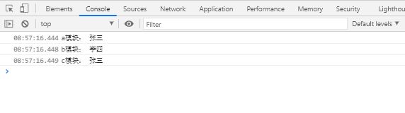
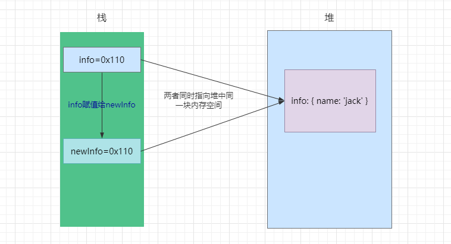
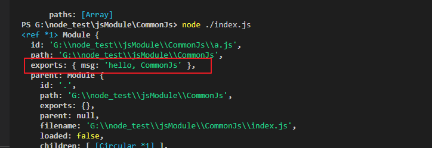
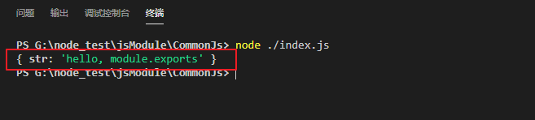
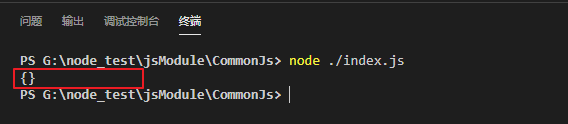
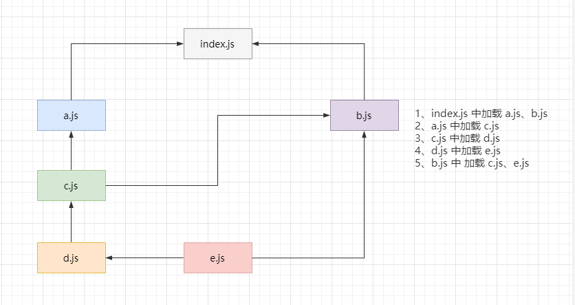
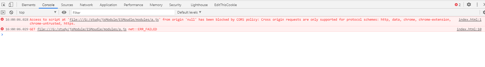
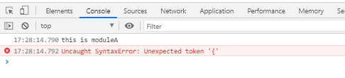

# 模块化

在早期，js 仅仅作为一门简单的脚本语言，做一些简单的表单验证或动画实现等。但是随着前端和 js 的快速发展，js 代码变得越来越复杂：

- ajax 的出现，前后端开发分离，意味着后端返回数据后，需要通过 js 进行前端页面的渲染

- SPA 的出现，前端页面变得更加复杂：前端路由、状态管理等等一系列复杂的需求需要通过 js 来实现

- 在 Node 中，js 编写复杂的后端程序，没有模块化是致命的硬伤

以上，都需要模块化来进行更好的管理，但是 js 在 es6 才推出官方的模块化方案。在此之前，为了让 js 支持模块化，社区涌现出了很多不同的模块化规范：AMD、CMD、CommonJS 等


## 1、模块化开发

### 1.1、模块化开发的过程就是：

- 将程序划分成一个个小的结构
- 在这个结构中可以编写属于自己的逻辑代码，有自己的作用域，不会影响到其他的模块结构
- 并且可以将自己希望暴露的变量、函数、对象等导出给其结构使用
- 也可以通过某种方式，导入另外结构中的变量、函数、对象等


### 1.2、没有模块化带来的一些问题

- 全局作用域被污染
- 开发人员必须手动解决模块依赖关系（顺序）
- 在大型、多人合作项目中，会导致整体架构混乱
- ......


## 2、模块化方案

早期，为了避免全局作用域被污染问题一般都是使用**立即执行函数处理（IIFE）**

比如：

a.js 中：

```js
var moduleA = (function() {
  var userName = '张三'

  console.log('a模块：', userName)
  
  // 将要导出给其他地方使用的用 return 返回
  return {
    userName
  }
})()
```

b.js 中：

```js
// 定义了一个全局的 userName
var userName = '李四'

console.log('b模块：', userName)
```

c.js 中：

```js
// 使用 moduleA 中的 userName
console.log('c模块：', moduleA.userName)
```

index.html 中：

```js
<!DOCTYPE html>
<html lang="en">
<head>
    <meta charset="UTF-8">
    <meta http-equiv="X-UA-Compatible" content="IE=edge">
    <meta name="viewport" content="width=device-width, initial-scale=1.0">
    <title>Document</title>
</head>
<body>
    
    <script src="./a.js"></script>
    <script src="./b.js"></script>
    <script src="./c.js"></script>
</body>
</html>
```

打印结果：



可以看出，IIFE 解决了全局作用域被污染的问题，将 c.js 中需要使用的 userName 放到了 moduleA 中


但是这样也会带来很多问题：

- 模块的命名也会冲突，比如 a.js 中使用了 moduleA，如果其他地方也使用了 moduleA 就会造成冲突
- 代码写起来混乱不堪，每个文件中的代码都需要包裹在一个匿名函数中来编写
- 没有一定的规范去约束模块化代码的编写，这也是灾难性的
- ......


### 2.1、CommonJs

CommonJs 是一种模块化规范，最初是叫 ServerJS，用于浏览器以外的地方使用，后来也被用于浏览器，为了体现它的广泛性，修改为 CommonJS，简称 CJS。

- CommonJs 在服务端的体现：Node
- CommonJs 在浏览器的体现：Browserify
- webpack 中也支持 CommonJS


#### 2.1.1、Node 中的 CommonJs

在 Node 中，对 CommonJs 实现了支持:

- 在 Node中 每一个 js 文件都是一个单独的模块
- 每个 js 模块都可以进行导入导出
  - exports 和 module.exports 可以帮助进行模块导出
  - require 可以帮助进行模块（自定义模块、系统模块、第三方模块）导入


#### 2.1.2、Node.js 的 exports 对象 

例子：

a.js：

```js
const msg = 'hello, CommonJs'

exports.msg = msg
```

index.js：

```js
const { msg } = require('./a')

console.log(msg) // hello, CommonJs
```


每一个模块的 exports 默认是一个空对象{}，可以往 exports 身上挂属性，最后这些挂载在 expoers 上的属性都会随着 exports 被导出

require 是一个函数，这个函数返回一个对象，在这里就是 a.js 的 exports 对象，可以使用解构的方式拿到里面的 msg，当然，也可以

```js
const moduleA = require('./a')

console.log(moduleA.msg) // hello, CommonJs
```

不使用结构的方式，直接将 exports 对象赋值给 moduleA，然后通过 moduleA.xxx 的方式调用


也就是说：**moduleA 与 exports 其实就是同一个对象，moduleA 是 exports 的浅拷贝**

这得益于： js 中的复杂数据类型，会在堆中开辟一块内存空间存储这个复杂类型，这个堆中存储的复杂类型会有自己的内存地址，内存地址保存在栈中。将这个复杂类型赋值给另外一个，实际上只是将栈中的内存地址复制了一份，而这两份地址都指向堆中的同一个

比如：

```js
const info = { name: 'jack' }

const newInfo = info
```



同理，exports 可以理解为 info，moduleA 就可以理解为 newInfo

这也意味着，无论是通过 exports 改变还是 moduleA 改变里面的属性，都会互相影响。所以一般不直接修改 moduleA 的属性，因为这样子会影响数据源。一般是通过深拷贝一份数据，再操作。


#### 2.1.3、Node.js 的 module.exports

module.exports 与 exports 的关系：

- 为了实现模块导出，Node 中使用了 Module 类，每一个模块（js 文件）都是一个 Module 类的实例，也就是 module
- 所以在 Node 中真正用于导出的不是 exports，而是 module.exports；在另外一个模块引入的也是 module.exports

证明：

a.js：

```js
const msg = 'hello, CommonJs'

exports.msg = msg

console.log(module)
```

可以看到，打印出来的 module：




> 问题：为什么 exports 也可以进行导出？

实际上，在 Node 的源码中做了一件事，就是将 module.exports 与 exports 同时指向了同一个对象

```js
exports = module.exports = {}
```

所以，可以通过 exports.xxx 这样子往 exports 上挂属性，**实际上修改的都是同一个对象，但是导出还是 mdule.exports 导出，在另外一个模块引入的也是 module.exports**。所以，**一旦手动改变 module.exports 或者 exports 的指向，那么将会有所改变**

先来看看第一个例子：

b.js：

```js
const str = 'hello, module.exports'

exports.name = '哈哈哈哈'

module.exports = {
  str
}
```

index.js：

```js
const moduleB = require('./b')

console.log(moduleB)
```

执行结果输出：



可以看到，上面 通过 `moduele.exports = {}` 的方式改变了指向，那么 module.exports 和 exports 指向的就不是同一个对象，而真正导出的是 module.exports，所以在另外一个模块引入的只是 module.exports 对象，只会输出 `{ str: 'hello, module.exports' }`，而 exports.name 的修改就不会输出


接着看看第二个例子：

b.js：

```js
const str = 'hello, module.exports'

exports = {
  str
}
```

index.js：

```js
const moduleB = require('./b')

console.log(moduleB)
```

执行结果输出：



输出的居然是一个空对象。这也是因为 Node 中实际上导出的是 module.exports，一开始，默认就是

```js
module.exports = exports = {}
```

而 `exports = {}` 修改了 exports 的指向，使得 exports 与 module.exports 修改的不是同一个，不会相互影响，而在 index.js 中引入的还是 module.exports，所以输出的是空对象 {}。

通过上面两个例子，已经可以完全证明：**在 Node 中真正用于导出的不是 exports，而是 module.exports；在另外一个模块引入的也是 module.exports**


> 那么又有一个问题：既然真正导出的是 module.exports，那么 exports 就感觉可有可无了

确实，在 Node 中，其实是可以完全不用 exports 的，那么 Node 为什么会实现一个 exports 呢？因为，Node 是遵循 CommonJs 规范的，CommonJs 规范要求要有一个 exports 导出。但是实际上 CommonJs 中是没有module.exports 概念的，可以理解为，Node 的 CommonJs 是在社区原有的 CommonJs 规范上实现的符合自身的 2.0 版本


#### 2.1.4、Node 的导入函数 require

require 主要用来引入一个文件（模块）中导入的对象；它有自己的一套查找规则，具体可以参考：https://nodejs.org/dist/latest-v14.x/docs/api/modules.html#modules_all_together

现在以 `require(xxx)` 为例，来看看一些常见的查找规则：

- 当 xxx 是一个 Node 内置核心模块，比如 path、fs 等，那么会直接返回核心模块，并且停止查找

- 当 xxx 是以 `./`  或 `../` 或 `/`（根目录）开头的

  1. 首先将 xxx 当做一个文件去查找
     1. 如果有后缀名，根据后缀名查找，没找到，报错：not found，模块找不到
     2. 没有后缀名
        1. 先直接查找 xxx 文件
        2. 没找到，按照 xxx.js 查找
        3. 没找到，按照 xxx.json 查找
        4. 没找到，按照 xxx.node 查找

  2. 将 xxx 当做一个文件没找到，那么接下来将 xxx 当做一个文件夹去查找，查找 xxx 目录下的 index 文件
     1. 先查找 xxx/index.js
     2. 没找到，查找 xxx/index.json
     3. 没找到，查找 xxx/index.node

  上面1、2 步都没有找到，那么就会报错：not found，模块找不到

- 当 xxx 是 `require('gweid')`，**并且不是 Node 内置核心模块**

  比如，在 `src/user/common/main.js` 中，编写了 `require('gweid')`

  1. 首先去 `src/user/common/node_modules` 中查找，有没有 gweid
  2. 没找到，去 `src/user/node_modules` 中查找
  3. 没找到，去 `src/node_modules` 中查找
  4. 没找到，去 `node_modules` 中查找

  最后还是没找到，报错：not found，模块找不到。实际上就是将 gweid 当成了 npm 安装的第三方包，那么就会在各个目录的 node_modules 中查找，直到最顶层的 node_modules


#### 2.1.5、Node 中模块加载

1. 在模块第一次被引入是，里面的 js 代码会执行一次

2. 模块被多次引用，会被缓存，最终只会加载一次。每个模块都有一个 loaded 属性，loaded=false 代表没有被加载过；loaded=true 代表已加载，会被缓存起来

3. 如果一个模块被循环引入，例如：

   

   很明显看到，c.js 同时被 a.js、b.js 引入，e.js 同时被d.js、b.js 引入，那么此时的加载顺序是什么呢？

   在 Node 中，采用的是深度优先算法，也就是模块加载顺序是：index.js --> a.js --> c.js --> d.js -->e.js --> b.js，其中遇到被加载过的模块，也就是模块的 loaded 被标记为 true 了，不会再去加载

采用深度优先算法的主要原因就是 **CommonJs 是同步加载**的，这就意味着：

```js
const moduleA = require('./a')
const moduleB = require('./b')
```

要等 moduleA 里面的所有逻辑加载完，才开始加载 moduleB


> 问题：CommonJs 同步加载不会有很大的性能问题吗

性能影响不会很大，因为 Node 是在服务端执行的，那么就意味着所有的文件都是在同一个服务器中，这就相当于在同一台电脑下操作不同目录文件而已，这是非常快的。

如果实在客户端进行同步加载，就会带来很大的性能问题，因为这意味着需要从服务器中把文件下载下来，这就会严重收到文件大小、网络等的影响，阻塞后面的加载。所以在客户端一般不使用同步加载的模式。


所以在早期为了可以在浏览器中使用模块化，主要使用的方案有两种：AMD 和 CMD

但是，由于 webpack 等工具可以实现对 Commons 或者 ES Module代码的转换，并且现代浏览器开始逐步支持 ES Moudle，AMD 和 CMD 其实已经很少使用了。更多的是在服务端使用 CommonJs，在浏览器端使用 es6 的模块化方案（低版本浏览器说用 webpack 转换）


### 2.2、AMD

AMD，一个应用于浏览器异步加载模块的规范。

实现 AMD 比较常用的库是 require.js。


#### 2.2.1、require.js 实现 AMD

首先，需要先去把 require.js 下载下来： https://github.com/requirejs/requirejs

基本目录结构：

```
AMD
├── lib
│   └── require.js
├── modules
│   ├── a.js
│   └── b.js
├── index.html
└── index.js
```

> 首先，在 index.html

```js
<!DOCTYPE html>
<html lang="en">
<head>
    <meta charset="UTF-8">
    <meta http-equiv="X-UA-Compatible" content="IE=edge">
    <meta name="viewport" content="width=device-width, initial-scale=1.0">
    <title>Document</title>
</head>
<body>
    <script src="./lib/require.js" data-main="./index.js"></script>
</body>
</html>
```

- script:src 引入 require.js
- data-main 声明入口文件

> 接着，在 index.js 中

```js
(function() {
  // 这个 require 变量是在 require.js 中定义的
  // 配置模块映射关系
  require.config({
    baseUrl: '',
    paths: {
      // 不需要跟后缀名，require.js 会自动加上后缀名
      moduleA: './modules/a',
      moduleB: './modules/b'
    }
  })
})();
```

- 通过 rqeuire.config 配置模块映射关系，require 这个全局变量由 require.js 得到


基础配置完成，接下来是使用：

> modules/a.js

```js
define(function() {
  const moduleInfo = 'this is moduleA'
  const sayHi = function(name) {
    console.log('hello,' + name)
  }
  
  // 通过 return 将需要共享的属性导出 
  return {
    moduleInfo,
    sayHi
  }
})
```

- 通过 define 声明模块
- 通过 return 将需要给其他模块使用的变量暴露出去

> modules/b.js

```js
// define 的第一个参数是一个数组，代表需要引用的模块，模块名与 index 中的映射一致
define(['moduleA'], function(moduleA) {
  console.log(moduleA.moduleInfo)
  moduleA.sayHi('jack')

  const moduleInfo = 'this is moduleB'

  return {
    moduleInfo
  }
})
```

- define 函数的第一个参数，代表需要引入的模块，与 index.js 中定义的模块映射名一致

> index.js

```js
(function() {
  // 这个 require 变量是在 require.js 中定义的
  // 配置模块映射关系
  require.config({
    baseUrl: '',
    paths: {
      // 不需要跟后缀名，require.js 会自动加上后缀名
      moduleA: './modules/a',
      moduleB: './modules/b'
    }
  })
  
  // 引入模块 b
  require(['moduleB'], function(moduleB) {
    console.log(moduleB.moduleInfo)
  })
})();
```

以上就是 require.js 实现 AMD 的过程。

define 函数：

- 第一个参数：一个数组，代表需要导入的模块，可有可无，没有就代表不需要导入模块
- 第二个参数：回调函数，在导入模块成功后执行，不需要导入模块，直接执行


AMD，**推崇依赖前置，依赖模块提前执行**，也就是：如下，依赖的 moduleA 加载完之后再执行回调函数

```js
require(['moduleA'], function(moduleB) {})
```


### 2.3、CMD

CMD，也是一种浏览器异步加载模块的规范，它吸收了 CommonJs 的优点，相对 AMD 用法更加简单，也更加接近 CommonJs。

实现 CMD 常用的库是 SeaJs。


#### 2.3.1、SeaJs 实现 CMD

第一步，是先把 sea.js 下载下来：https://seajs.github.io/seajs/docs/#downloads

基础目录结构：

```
CMD
├── lib
│   └── sea.js
├── modules
│   └── a.js
├── index.html
└── index.js
```

> 首先，在 index.html

```js
<!DOCTYPE html>
<html lang="en">
<head>
    <meta charset="UTF-8">
    <meta http-equiv="X-UA-Compatible" content="IE=edge">
    <meta name="viewport" content="width=device-width, initial-scale=1.0">
    <title>Document</title>
</head>
<body>
    <script src="./lib/sea.js"></script>
    <script>
        seajs.use('./index.js')
    </script>
</body>
</html>
```

- 通过 script:src 引入 sea.js
- 通过 seajs.use 声明入口文件（seajs 全局变量在 sea.js 中创建）

> 然后是 modules/a.js

```js
define(function(require, exports, module) {
  const moduleInfo = 'this is moduleA'

  module.exports = {
    moduleInfo
  }
})
```

- 通过 define 声明模块
- 通过 module.exports 将需要共享的变量导出

> index.js

```js
define(function(require, exports, module) {
  const moduleA = require('./modules/a')

  console.log(moduleA.moduleInfo)
})
```

- define 声明变量
- require 引入模块a


seajs 实现 CMD 的 过程基本如上，可以看出，CMD 跟 CommonJs 真的很像,通过 module.exports 导出模块，通过 require 引入模块


CMD，**推崇依赖就近，依赖模块延迟执行**，例如：以下代码，依赖可以就近书写，只有 require 之后，模块才开始加载

```js
define(function(require, exports, module) {
  const moduleA = require('./modules/a')
})
```


### 2.4、ES Module

在早期，js 本身没有模块化一直是它的痛点。但是在 es6 之后，js 实现了 模块化的功能，这就是 es module。

- es module 使用 export 和 import **关键字**来实现模块化，export 负责导出，import 负责导入
- es module 采用编译期的静态分析，也加入了动态引入的方式
- 使用 es module 将自动使用严格模式：use strict


#### 2.4.1、ES Module 的基本使用

例子基本目录结构：

```
ESModule
├── modules
│   ├── a.js
│   └── index.js
├── index.html
└── main.js
```


要使用 ES Module 非常简单，只需要在 srript 标签中添加 `type="module"`  即可

```js
<!DOCTYPE html>
<html lang="en">
<head>
    <meta charset="UTF-8">
    <meta http-equiv="X-UA-Compatible" content="IE=edge">
    <meta name="viewport" content="width=device-width, initial-scale=1.0">
    <title>Document</title>
</head>
<body>
    <script src="./modules/a.js" type="module"></script>
</body>
</html>
```

但是，如果直接将本地的 html 在浏览器打开（(即以 file:// 协议加载 html），会报 CORS 跨域错误。这是因为 js 模块安全性需要。



需要通过一个服务器来测试，在 vscode 中可以使用 Live Server 插件来开启服务器


#### 2.4.2、export、import 导入导出

export 关键字用于将模块的内容导出。

import 关键字用于从另外一个模块中导入内容。


**几种导出的方式：**

- 在声明语句前直接加上 export

  ```js
  export const name = 'jack'
  export const sayHi = (name) => {
    console.log('hello' + name)
  }
  ```

- 将需要导出的标识符放在 export 后面的 {} 里面

  ```js
  const name = 'jack'
  
  const sayHi = (name) => {
    console.log('hello' + name)
  }
  
  export {
    name,
    sayHi
  }
  ```

  **注意点： 这里的 {} 并不是表示一个对象，也就是说 export { name: name } 这种写法是错误的，export {} 其实是一种语法**

- 导出的时候可以给标识符起一个别名（用得比较少）

  ```js
  const sayHi = (name) => {
    console.log('hello' + name)
  }
  
  export {
    sayHi as sayHiFun
  }
  ```


**几种导入方式：**

- 上面的三种导出方式，都是使用 `import {} from xxx` 进行导入

  1. 如果导出没有使用标识符别名

     ```js
     import { name, sayHi } from './modules/a.js'
     
     console.log(name)
     console.log(sayHi('mark'))
     ```

  2. 导出使用了标识符别名，那么导入的是标识符别名的形式

     ```js
     import { sayHiFun } from './modules/a.js'
     
     console.log(sayHiFun('mark'))
     ```

- 导入时可以给标识符起别名

  就算导出时没有取标识符别名，导入的时候也可以取标识符别名

  ```js
  import { sayHi as sayHiFun } from './modules/a.js'
  
  console.log(sayHiFun('mark'))
  ```

- 通过 \* 将模块功能放到放到一个对象上，就可以使用 xxx.yy 的方式使用

  ```js
  import * as moduleA from './modules/a.js'
  
  console.log(moduleA.name)
  console.log(moduleA.sayHi('mark'))
  ```


#### 2.4.3、export 和 import 同时结合使用

这种主要就是在开发和封装一个功能库时，希望将暴露的所有接口放到一个文件中，方便指定统一的接口规范，也方便阅读。这里假设 modules 就是封装的功能库，里面暴露接口统一放在 module/index.js 中

```
ESModule
├── modules
│   ├── a.js
│   └── index.js
```

按照常规的做法，需要：

```js
import { name, sayHi } from './a.js'

export {
  name,
  sayHi
}
```

但是，如果使用 export 和 import 结合的话，只需要：

```js
export { name, sayHi } from './a.js'
```

写法上会相对简洁很多，目前很多流行色第三方库使用的这种方法。


#### 2.4.4、default

其实，除了上面说的那几种常规的导入导出方法，还有一种，就是通过 `export default {}` 的方式导出

- 默认导出 export 时可以不需要指定名字
- 在导入时不需要使用 {}，并且可以自己来指定名字
- 在一个模块中，只能有一个默认导出（default export），而 export 可以有多个
- 一般来讲，导出单个值，可以使用 export default 也可以使用 export，导出多个值，使用 export 更好，这样可以做到按需引入


> module/a.js 

```js
export default function () {
  console.log('hello');
}
```

> main.js 

```js
import sayHi from './modules/a.js'

console.log(sayHi())
```


#### 2.4.5、import() 函数的使用

ES Module 使用 **import 关键字**加载模块是不能放在逻辑代码里面的，比如：

```js
let flag = true
if(flag) {
  import { name, sayHi as sayHiFun } from './modules/a.js'
}
```

会直接报错：不被期待的代码



因为：在 ES Module 被 js 引擎解析的时候，就必须知道依赖关系，在 js 引擎解析的时候，会经过：

`源代码 --> parse 解析成 AST --> 字节码 --> 二进制机器码 --> 运行`

在 parse 解析成 AST 的时候，就需要确定依赖关系的，不确定就直接报错了，根本就没等到最后机器码运行的时候


如果确实需要在**代码运行时动态加载**一个模块，ES Module 提供了 import() 函数的方式

> main.js

```js
let flag = true
if(flag) {
  import('./modules/a.js')
    .then(({ name, sayHi }) => {
      console.log(name)
      console.log(sayHi('mark'))
    })
    .catch(err => {
      console.log(err)
    })
}
```


那么问题就来了，为什么 import 关键字不可以在代码运行时加载，import() 函数就可以呢？其实这涉及到了 ES Module 的加载


#### 2.4.6、ES Module 的加载

ES Module 加载 js 模块实在**编译时加载**的，并且是**异步加载**

- 编译时加载，就意味着 import 关键字**不能与运行时相关的逻辑代码放到一起**。比如：不能将 import 放到 if 等语句的代码块中，不能动态获取 form 后面的路径等。所以，一般也称 ES Module 是**静态解析的**，而不是动态或者运行时解析的

- 异步加载，意味着 js 在遇到 import 语法是，回去获取对应 js 模块，但并不会阻塞主线程的执行。也就是说，在 script 标签中添加 `type="module"`，相当于为 script 标签加上了 `async` 属性。如下：a.js 的加载并不会阻塞 m.js 的加载

  ```js
  <script src="./modules/a.js" type="module"></script>
  <script src="./m.js"></script>
  ```

  