# TS 类型编程


##为什么 TypeScript 类型编程又叫类型体操

- TypeScript 给 JavaScript 增加了一套类型系统，但并没有改变 JS 的语法，只是做了扩展，是 JavaScript 的超集。
- 这套类型系统支持泛型，也就是类型参数，有了一些灵活性。而且又进一步支持了对类型参数的各种处理，也就是类型编程，灵活性进一步增强。
- 现在 TS 的类型系统是图灵完备的，**能描述各种可计算逻辑。简单点来理解就是循环、条件等各种 JS 里面有的语法它都有，JS 能写的逻辑它都能写**。
- 但是很多类型编程的逻辑写起来比较复杂，因此被戏称为类型体操。


##类型运算

主要看看 ts 中几种类型运算


### 条件类型

ts 中条件判断是 `extends ? :`，叫做条件类型。其实就是 ts 类型系统里的 if else。例子：

```typescript
type isTrue<T> = T extends 2 ? true : false

type res = isTrue<1>   // false
```

类型运算逻辑都是用来做一些动态的类型的运算的，也就是对类型参数的运算（如上面例子）

这种类型也叫`高级类型`，**高级类型的特点是传入类型参数，经过一系列类型运算逻辑后，返回新的类型。**


### 类型推导

类型推导，infer，主要用来`提取类型的一部分`。

例如：提取元组类型的第一个元素

```typescript
type IFirst<Tuple extends unknown[]> = Tuple extends [infer T, ...infer R] ? T : never

type res1 = IFirst<[1, 2]>
```

第一个 extends 不是条件，条件类型是 `extends ? :`，这里的 extends 是约束的意思，也就是约束类型参数只能是数组类型。

等号后面的 [infer T, ...infer R]，infer T 代表第一个参数，......infer R 展开运算符，剩余参数


### 联合与交叉

联合类型类似 js 里的或运算符 |，但是作用于类型，代表类型可以是几个类型之一

```typescript
type INum = 1 | 2 | 3;
```


交叉类型（Intersection）类似 js 中的与运算符 &，但是作用于类型，代表对类型做合并

```typescript
type IObj = { a: number } & { b: string }
```

需要注意的是，交叉类型对于同一类型可以合并，不同的类型没法合并，会被舍弃

```typescript
type IObj1 = 'aaa' & 'bbb' // never
```

> **never** 代表不可达，比如函数抛异常的时候，返回值就是 never


### 映射类型

对象、class 在 TypeScript 对应的类型是索引类型，`映射类型`可以对索引类型作修改。

例如：

```js
type IMap<T> = {
  [key in keyof T]: T[key]
}
```

- keyof T 是查询索引类型中所有的索引，叫做`索引查询`

- T[Key] 是取索引类型某个索引的值，叫做`索引访问`

- in 是用于遍历联合类型的运算符

```typescript
type IMapVal<T> = {
  [key in keyof T]: [T[key], T[key]]
}
type res2 = IMapVal<{name: 'jack', age: 20}>
```

结果就是：

 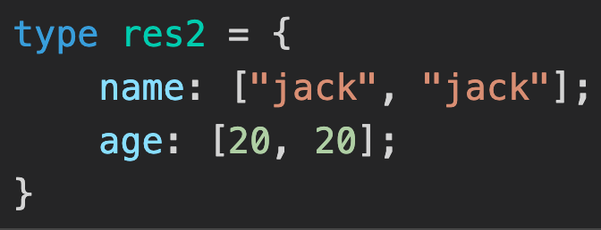

映射类型除了可以修改值，索引 key 也可以做变化。用 as 运算符，叫做`重映射`。例如：

```typescript
type IMapKey<T> = {
  [key in keyof T as `${key & string}${key & string}`]: T[key]
}

type res3 = IMapKey<{name: 'jack', age: 20}>
```

结果是：

 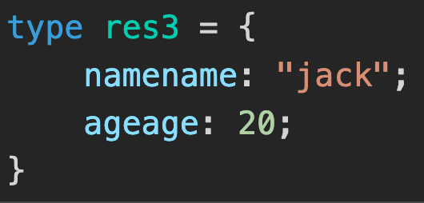

> 解析一下这里的 & string：
>
> 因为索引类型（对象、class 等）可以用 string、number 和 symbol 作为 key，这里 keyof T 取出的索引就是 string | number | symbol 的联合类型，和 string 取交叉部分就只剩下 string 了。就像前面所说，交叉类型会把同一类型做合并，不同类型舍弃。
>
> 如果不这样做，会不能将 xxx 类型赋值给 xxx 类型的错误


## TS类型编程的套路


### 套路一：模式匹配做提取

#### 认识模式匹配

下面通过一个例子，来了解模式匹配：有如下一个 Promise 类型

```typescript
type PTest = Promise<'test'>
```

如果想要获取 value 的类型，可以：

```typescript
type GetValueType<T> = T extends Promise<infer value> ? value : never
```

> 解析：
>
> 通过 extends 对传入的类型参数 P 做模式匹配，其中值的类型是需要提取的，通过 infer 声明一个局部变量 Value 来保存，如果匹配，就返回匹配到的 Value，否则就返回 never 代表没匹配到。

结果是：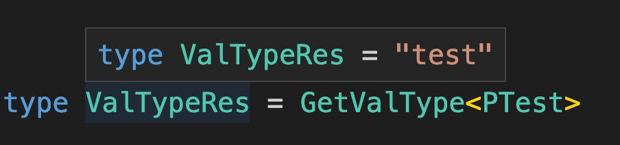

这就是 typescript 的模式匹配：

**Typescript 类型的模式匹配是通过 extends 对类型参数做匹配，结果保存到通过 infer 声明的局部类型变量里，如果匹配就能从该局部变量里拿到提取出的类型。**


#### 数组类型做模式匹配

有如下数组类型

```typescript
type Arr = [1, 2, 3]
```


提取第一个元素的类型：

```typescript
type GetArrFirst<T extends unknown[]> =
		T extends [infer First, ...unknown[]] ? First: never
```

> 解析：
>
> 1、类型参数通过 extends 约束只能是数组类型，数组元素是 unkown 也就是可以是任何值
>
> 对 Arr 做模式匹配，把我们要提取的第一个元素的类型放到通过 infer 声明的 First 局部变量里，后面的元素可以是任何类型，用 unknown 接收，然后把局部变量 First 返回。

结果是：

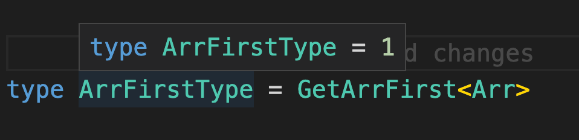


同理，可以通过如下方式提取数组类型的最后一个元素类型：

```typescript
type GetArrLast<T extends unknown[]> =
		T extends [...unknown[], infer Last] ? Last : never
```


上面取了首尾元素，当然也可以取剩余的数组，比如取去掉了最后一个元素的数组：

```ty
type GetArrRest<T extends unknown[]> =
		T extends [] ? []
				: T extends [...infer Rest, unknown] ? Rest: never
```

> 解析：
>
> 如果是空数组，就直接返回，否则匹配剩余的元素，放到 infer 声明的局部变量 Rest 里，返回 Rest

结果是：

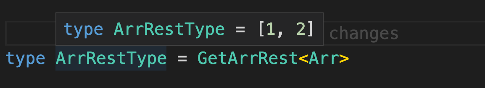


#### 字符串类型模式匹配


**例一：判断字符串是否以某个前缀开头**

```typescript
type StartWith<Str extends strirng, Prefix extends string> =
		Str extends `${Prefix}${string}` ? true : false
```

> 用 infer 声明是为了可以后面使用，这里不需要使用，所以不需要 infer 去声明
>
> 解析：
>
> 字符串 Str、匹配的前缀 Prefix 两个类型参数，它们都是 string。
>
> 用 Str 去匹配一个模式类型，模式类型的前缀是 Prefix，后面是任意的 string，如果匹配返回 true，否则返回 false。

结果是：

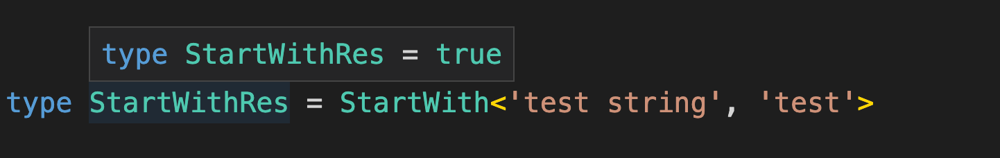


**例二：字符串匹配一个模式类型，提取相关部分，再构成新的类型**

```typescript
type ReplaceStr<
	Str extends string,
  From extends string,
  To extends string
> = Str extends `${infer Prefix}${From}${infer Suffix}`
			? `${Prefix}${To}${Suffix}` : Str
```

> 解析：
>
> 传入要替换的字符串 Str、待替换的字符串 From、替换成的字符串 3 个类型参数，通过 extends 约束为都是 string 类型。
>
> 用 Str 去匹配模式串，模式串由 From 和之前之后的字符串构成，把之前之后的字符串放到通过 infer 声明的局部变量 Prefix、Suffix 里。
>
> 用 Prefix、Suffix 加上替换到的字符串 To 构造成新的字符串类型返回。

结果

匹配时：

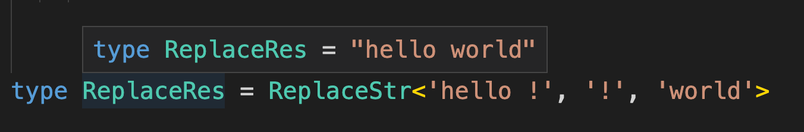

不匹配时：

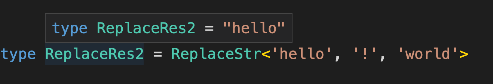


**例三：实现去掉空白字符串**

因为我们不知道有多少个空白字符，所以只能一个个匹配和去掉，**需要递归**

首先，实现替换右边空白 TrimRight

```typescript
type TrimRight<Str extends string> =
		Str extends `${infer Rest}${' ' | '\n' | '\t'}` ? TrimRight<Rest> : Str
```

> 类型参数 Str 是要 Trim 的字符串。
>
> 如果 Str 匹配字符串 + 空白字符 (空格、换行、制表符)，那就把字符串放到 infer 声明的局部变量 Rest 里。
>
> 把 Rest 作为类型**参数递归** TrimRight，直到不匹配，这时的类型参数 Str 就是处理结果。

接着，实现替换左边空白 TrimLeft

```typescript
type TrimLeft<Str extends string> =
		Str extends `${' ' | '\n' | '\t'}${infer Rest}` ? TrimLeft<Rest> : Str
```

两者结合，就是完整的 Trim

```typescript
type Trim<Str extends string> = TrimRight<TrimLeft<Str>>
```

结果：

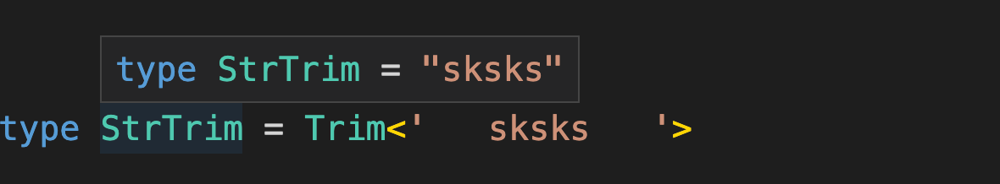


#### 函数类型做模式匹配

函数同样也可以做类型匹配，比如提取参数、返回值的类型


**例一：通过模式匹配来提取参数的类型**

即 ts 内置类型 Parameters 的实现原理

```typescript
type GetParameters<Func extends Function> =
		Func extends (...args: infer Args) => unknown ? Args : never
```

> 解析：
>
> 类型参数 Func 是要匹配的函数类型，通过 extends 约束为 Function。
>
> Func 和模式类型做匹配，参数类型放到用 infer 声明的局部变量 Args 里，返回值可以是任何类型，用 unknown。
>
> 返回提取到的参数类型 Args。

结果是：

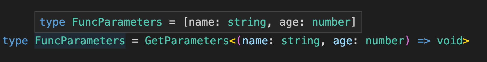


**例二：提取函数的返回类型**

即 ts 内置类型 ReturnType 的实现原理

```typescript
type GetReturnType<Func extends Function> = 
		Func extends (...args: any[]) => infer ReturnType ? ReturnType : never
```

> 解析：
>
> Func 和模式类型做匹配，提取返回值到通过 infer 声明的局部变量 ReturnType 里返回
>
> 这里不能用 unknown，涉及到参数的逆变性质，如果使用 unknown[]，会导致返回 never

结果：

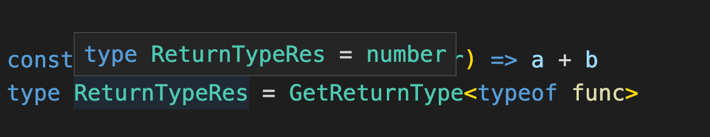


#### 构造器模式匹配

构造器和函数的区别是，构造器是用于创建对象的，所以可以被 new


有如下代码：

```typescript
interface Person {
  name: string
}
interface PersonConstructor {
  new (name: string): Person
}
```

> 构造器类型可以用 interface 声明，使用 new(): xx 的语法。


**例一：模式匹配提取构造器返回值的类型**

```typescript
type GetInstanceType<
  P extends new (...args: any)=> any
> = P extends new (...args: any)=> infer InstanceType ? InstanceType : never
```

> 解析：
>
> 类型参数 P 是待处理的类型，通过 extends 约束为构造器类型。
>
> 用 P 匹配一个模式类型，提取返回的实例类型到 infer 声明的局部变量 InstanceType 里，返回 InstanceType。

结果：

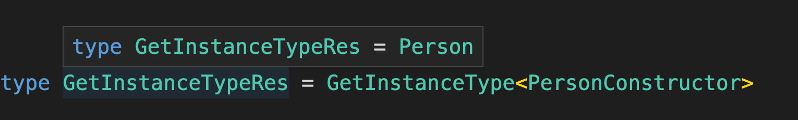


**例二：模式匹配提取构造器参数的类型**

```typescript
type GetConstructorParameters<
  P extends new (...args: any)=> any
> = P extends new (...args: infer ParametersType)=> any ? ParametersType : never
```

结果：

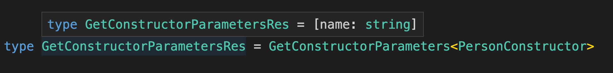


#### 索引类型模式匹配

索引类型也同样可以用模式匹配提取某个索引的值的类型，这个用的也挺多的，比如 React 的 index.d.ts 里的 PropsWithRef 的高级类型，就是通过模式匹配提取了 ref 的值的类型：

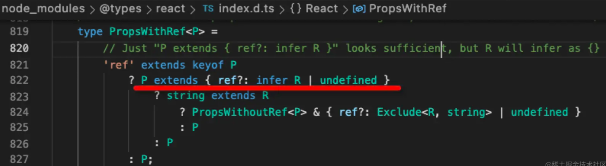


简化下，提取 Props 里 ref 的类型：

```typescript
type GetRefProps<Props> =
  'ref' extends keyof Props
    ? Props extends { ref: infer value } 
      ? value
      : never
    : never
```

> 解析：
>
> 类型参数 Props 为待处理的类型。
>
> 通过 keyof Props 取出 Props 的所有索引构成的联合类型，判断下 ref 是否在其中，也就是 'ref' extends keyof Props。
>
> 如果有 ref 这个索引的话，就通过 infer 提取 Value 的类型返回，否则返回 never。

结果：

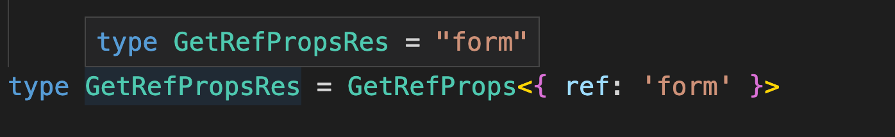


#### 模式匹配总结

就像字符串可以匹配一个模式串提取子组一样，TypeScript 类型也可以匹配一个模式类型提取某个部分的类型。模式匹配的套路在数组、字符串、函数、构造器、索引类型、Promise 等类型中都有大量的应用。

**TypeScript 类型的模式匹配是通过类型 extends 一个模式类型，把需要提取的部分放到通过 infer 声明的局部变量里，后面可以从这个局部变量拿到类型做各种后续处理。**


