# TS 类型编程


##为什么 TypeScript 类型编程又叫类型体操

- TypeScript 给 JavaScript 增加了一套类型系统，但并没有改变 JS 的语法，只是做了扩展，是 JavaScript 的超集。
- 这套类型系统支持泛型，也就是类型参数，有了一些灵活性。而且又进一步支持了对类型参数的各种处理，也就是类型编程，灵活性进一步增强。
- 现在 TS 的类型系统是图灵完备的，**能描述各种可计算逻辑。简单点来理解就是循环、条件等各种 JS 里面有的语法它都有，JS 能写的逻辑它都能写**。
- 但是很多类型编程的逻辑写起来比较复杂，因此被戏称为类型体操。


##类型运算

主要看看 ts 中几种类型运算


### 条件类型

ts 中条件判断是 `extends ? :`，叫做条件类型。其实就是 ts 类型系统里的 if else。例子：

```typescript
type isTrue<T> = T extends 2 ? true : false

type res = isTrue<1>   // false
```

类型运算逻辑都是用来做一些动态的类型的运算的，也就是对类型参数的运算（如上面例子）

这种类型也叫`高级类型`，**高级类型的特点是传入类型参数，经过一系列类型运算逻辑后，返回新的类型。**


### 类型推导

类型推导，infer，主要用来`提取类型的一部分`。

例如：提取元组类型的第一个元素

```typescript
type IFirst<Tuple extends unknown[]> = Tuple extends [infer T, ...infer R] ? T : never

type res1 = IFirst<[1, 2]>
```

第一个 extends 不是条件，条件类型是 `extends ? :`，这里的 extends 是约束的意思，也就是约束类型参数只能是数组类型。

等号后面的 [infer T, ...infer R]，infer T 代表第一个参数，......infer R 展开运算符，剩余参数


### 联合与交叉

联合类型类似 js 里的或运算符 |，但是作用于类型，代表类型可以是几个类型之一

```typescript
type INum = 1 | 2 | 3;
```


交叉类型（Intersection）类似 js 中的与运算符 &，但是作用于类型，代表对类型做合并

```typescript
type IObj = { a: number } & { b: string }
```

需要注意的是，交叉类型对于同一类型可以合并，不同的类型没法合并，会被舍弃

```typescript
type IObj1 = 'aaa' & 'bbb' // never
```

> **never** 代表不可达，比如函数抛异常的时候，返回值就是 never


### 映射类型

对象、class 在 TypeScript 对应的类型是索引类型，`映射类型`可以对索引类型作修改。

例如：

```js
type IMap<T> = {
  [key in keyof T]: T[key]
}
```

- keyof T 是查询索引类型中所有的索引，叫做`索引查询`

- T[Key] 是取索引类型某个索引的值，叫做`索引访问`

- in 是用于遍历联合类型的运算符

```typescript
type IMapVal<T> = {
  [key in keyof T]: [T[key], T[key]]
}
type res2 = IMapVal<{name: 'jack', age: 20}>
```

结果就是：

 

映射类型除了可以修改值，索引 key 也可以做变化。用 as 运算符，叫做`重映射`。例如：

```typescript
type IMapKey<T> = {
  [key in keyof T as `${key & string}${key & string}`]: T[key]
}

type res3 = IMapKey<{name: 'jack', age: 20}>
```

结果是：

 

> 解析一下这里的 & string：
>
> 因为索引类型（对象、class 等）可以用 string、number 和 symbol 作为 key，这里 keyof T 取出的索引就是 string | number | symbol 的联合类型，和 string 取交叉部分就只剩下 string 了。就像前面所说，交叉类型会把同一类型做合并，不同类型舍弃。
>
> 如果不这样做，会不能将 xxx 类型赋值给 xxx 类型的错误


## TS类型编程的套路


### 套路一：模式匹配做提取

#### 认识模式匹配

下面通过一个例子，来了解模式匹配：有如下一个 Promise 类型

```typescript
type PTest = Promise<'test'>
```

如果想要获取 value 的类型，可以：

```typescript
type GetValueType<T> = T extends Promise<infer value> ? value : never
```

> 解析：
>
> 通过 extends 对传入的类型参数 P 做模式匹配，其中值的类型是需要提取的，通过 infer 声明一个局部变量 Value 来保存，如果匹配，就返回匹配到的 Value，否则就返回 never 代表没匹配到。

结果是：

这就是 typescript 的模式匹配：

**Typescript 类型的模式匹配是通过 extends 对类型参数做匹配，结果保存到通过 infer 声明的局部类型变量里，如果匹配就能从该局部变量里拿到提取出的类型。**


#### 数组类型做模式匹配

有如下数组类型

```typescript
type Arr = [1, 2, 3]
```


提取第一个元素的类型：

```typescript
type GetArrFirst<T extends unknown[]> =
		T extends [infer First, ...unknown[]] ? First: never
```

> 解析：
>
> 1、类型参数通过 extends 约束只能是数组类型，数组元素是 unkown 也就是可以是任何值
>
> 对 Arr 做模式匹配，把我们要提取的第一个元素的类型放到通过 infer 声明的 First 局部变量里，后面的元素可以是任何类型，用 unknown 接收，然后把局部变量 First 返回。

结果是：


同理，可以通过如下方式提取数组类型的最后一个元素类型：

```typescript
type GetArrLast<T extends unknown[]> =
		T extends [...unknown[], infer Last] ? Last : never
```


上面取了首尾元素，当然也可以取剩余的数组，比如取去掉了最后一个元素的数组：

```ty
type GetArrRest<T extends unknown[]> =
		T extends [] ? []
				: T extends [...infer Rest, unknown] ? Rest: never
```

> 解析：
>
> 如果是空数组，就直接返回，否则匹配剩余的元素，放到 infer 声明的局部变量 Rest 里，返回 Rest

结果是：


#### 字符串类型模式匹配


**例一：判断字符串是否以某个前缀开头**

```typescript
type StartWith<Str extends strirng, Prefix extends string> =
		Str extends `${Prefix}${string}` ? true : false
```

> 用 infer 声明是为了可以后面使用，这里不需要使用，所以不需要 infer 去声明
>
> 解析：
>
> 字符串 Str、匹配的前缀 Prefix 两个类型参数，它们都是 string。
>
> 用 Str 去匹配一个模式类型，模式类型的前缀是 Prefix，后面是任意的 string，如果匹配返回 true，否则返回 false。

结果是：


**例二：字符串匹配一个模式类型，提取相关部分，再构成新的类型**

```typescript
type ReplaceStr<
	Str extends string,
  From extends string,
  To extends string
> = Str extends `${infer Prefix}${From}${infer Suffix}`
			? `${Prefix}${To}${Suffix}` : Str
```

> 解析：
>
> 传入要替换的字符串 Str、待替换的字符串 From、替换成的字符串 3 个类型参数，通过 extends 约束为都是 string 类型。
>
> 用 Str 去匹配模式串，模式串由 From 和之前之后的字符串构成，把之前之后的字符串放到通过 infer 声明的局部变量 Prefix、Suffix 里。
>
> 用 Prefix、Suffix 加上替换到的字符串 To 构造成新的字符串类型返回。

结果

匹配时：


不匹配时：


**例三：实现去掉空白字符串**

因为我们不知道有多少个空白字符，所以只能一个个匹配和去掉，**需要递归**

首先，实现替换右边空白 TrimRight

```typescript
type TrimRight<Str extends string> =
		Str extends `${infer Rest}${' ' | '\n' | '\t'}` ? TrimRight<Rest> : Str
```

> 类型参数 Str 是要 Trim 的字符串。
>
> 如果 Str 匹配字符串 + 空白字符 (空格、换行、制表符)，那就把字符串放到 infer 声明的局部变量 Rest 里。
>
> 把 Rest 作为类型**参数递归** TrimRight，直到不匹配，这时的类型参数 Str 就是处理结果。

接着，实现替换左边空白 TrimLeft

```typescript
type TrimLeft<Str extends string> =
		Str extends `${' ' | '\n' | '\t'}${infer Rest}` ? TrimLeft<Rest> : Str
```

两者结合，就是完整的 Trim

```typescript
type Trim<Str extends string> = TrimRight<TrimLeft<Str>>
```

结果：


#### 函数类型做模式匹配

函数同样也可以做类型匹配，比如提取参数、返回值的类型


**例一：通过模式匹配来提取参数的类型**

即 ts 内置类型 Parameters 的实现原理

```typescript
type GetParameters<Func extends Function> =
		Func extends (...args: infer Args) => unknown ? Args : never
```

> 解析：
>
> 类型参数 Func 是要匹配的函数类型，通过 extends 约束为 Function。
>
> Func 和模式类型做匹配，参数类型放到用 infer 声明的局部变量 Args 里，返回值可以是任何类型，用 unknown。
>
> 返回提取到的参数类型 Args。

结果是：


**例二：提取函数的返回类型**

即 ts 内置类型 ReturnType 的实现原理

```typescript
type GetReturnType<Func extends Function> = 
		Func extends (...args: any[]) => infer ReturnType ? ReturnType : never
```

> 解析：
>
> Func 和模式类型做匹配，提取返回值到通过 infer 声明的局部变量 ReturnType 里返回
>
> 这里不能用 unknown，涉及到参数的逆变性质，如果使用 unknown[]，会导致返回 never

结果：


#### 构造器模式匹配

构造器和函数的区别是，构造器是用于创建对象的，所以可以被 new


有如下代码：

```typescript
interface Person {
  name: string
}
interface PersonConstructor {
  new (name: string): Person
}
```

> 构造器类型可以用 interface 声明，使用 new(): xx 的语法。


**例一：模式匹配提取构造器返回值的类型**

```typescript
type GetInstanceType<
  P extends new (...args: any)=> any
> = P extends new (...args: any)=> infer InstanceType ? InstanceType : never
```

> 解析：
>
> 类型参数 P 是待处理的类型，通过 extends 约束为构造器类型。
>
> 用 P 匹配一个模式类型，提取返回的实例类型到 infer 声明的局部变量 InstanceType 里，返回 InstanceType。

结果：


**例二：模式匹配提取构造器参数的类型**

```typescript
type GetConstructorParameters<
  P extends new (...args: any)=> any
> = P extends new (...args: infer ParametersType)=> any ? ParametersType : never
```

结果：


#### 索引类型模式匹配

索引类型也同样可以用模式匹配提取某个索引的值的类型，这个用的也挺多的，比如 React 的 index.d.ts 里的 PropsWithRef 的高级类型，就是通过模式匹配提取了 ref 的值的类型：


简化下，提取 Props 里 ref 的类型：

```typescript
type GetRefProps<Props> =
  'ref' extends keyof Props
    ? Props extends { ref: infer value } 
      ? value
      : never
    : never
```

> 解析：
>
> 类型参数 Props 为待处理的类型。
>
> 通过 keyof Props 取出 Props 的所有索引构成的联合类型，判断下 ref 是否在其中，也就是 'ref' extends keyof Props。
>
> 如果有 ref 这个索引的话，就通过 infer 提取 Value 的类型返回，否则返回 never。

结果：


#### 模式匹配总结

就像字符串可以匹配一个模式串提取子组一样，TypeScript 类型也可以匹配一个模式类型提取某个部分的类型。模式匹配的套路在数组、字符串、函数、构造器、索引类型、Promise 等类型中都有大量的应用。

**TypeScript 类型的模式匹配是通过类型 extends 一个模式类型，把需要提取的部分放到通过 infer 声明的局部变量里，后面可以从这个局部变量拿到类型做各种后续处理。**


### 套路二：重新构造做变换

#### 简介

类型编程主要的目的就是对类型做各种转换，那么如何对类型做修改呢？

TypeScript 类型系统支持 3 种可以声明任意类型的变量： type、infer、类型参数。


type 叫做类型别名，其实就是声明一个变量存储某个类型：

```typescript
type PTest = Promise<number>;
```


infer 用于类型的提取，然后存到一个变量里，相当于局部变量：

```typescript
type GetValueType<P> = P extends Promise<infer Value> ? Value : never;
```


类型参数用于接受具体的类型，在类型运算中也相当于局部变量：

```typescript
type IsTwo<T> = T extends 2 ? true : false;
```


但是，严格来说这三种也都不叫变量，因为它们不能被重新赋值。

TypeScript 设计可以做类型编程的类型系统的目的就是为了产生各种复杂的类型，那不能修改怎么产生新类型呢？

答案是**重新构造**。


#### 数组类型的重新构造


**例一：数组添加元素**

```typescript
// 末尾添加一个元素
type PushTuple<T extends unknown[], P> = [...T, P]

// 前面插入一个元素
type UnshiftTuple<T extends unknown[], P> = [P, ...T]
```

结果：

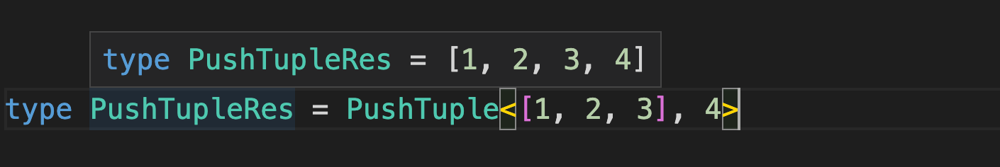


**例二：合并两个数组**

例如，有两个元组：

```typescript
type tuple1 = [1, 2]
type tuple2 = ['name', 'age']
```

想要合并成：

```typescript
type tuple = [[1, 'name'], [2, 'age']]
```

那么可以：

```typescript
type ZipTuple<
  T extends [unknown, unknown],
  P extends [unknown, unknown]
> = T extends [infer TOne, infer TTwo]
      ? P extends [infer POne, infer PTwo]
        ? [[TOne, POne], [TTwo, PTwo]]
        : []
      : []
```

> 解析
>
> 两个类型参数 T、P 是两个元组，类型是 [unknown, unknown]，代表 2 个任意类型的元素构成的元组。
>
> 通过 infer 分别提取 T 和 P 的元素到 infer 声明的局部变量 TOne、TTwo、POne、PTwo 里。
>
> 用提取的元素构造成新的元组返回即可

结果：

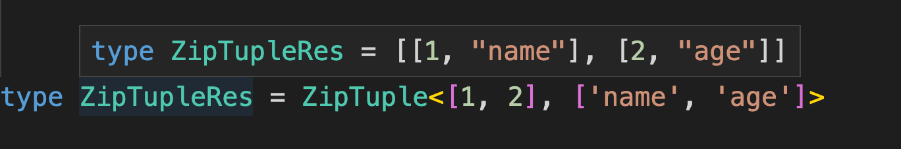


但是这样只能合并两个元素的数组，下面实现一下任意个元素的：

```typescript
type ZipAllTuple<
  T extends unknown[],
  P extends unknown[]
> = T extends [infer TOne, ...infer TOther]
      ? P extends [infer POne, ...infer POther]
        ? [[TOne, POne], ...ZipAllTuple<TOther, POther>]
        : []
      : []
```

> 解析：
>
> 类型参数 T、P 声明为 unknown[]，也就是元素个数任意，类型任意的数组。
>
> 每次提取 T 和 P 的第一个元素 TOne、POne，剩余的放到 TOther、POther 里。
>
> 用 TOne、POne 构造成新的元组的一个元素，剩余元素继续**递归**处理 TOther、POther。

结果：

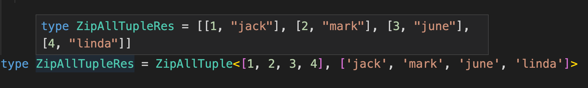


#### 字符串类型的重新构造


**例一：字符串首字母转为大写**

```typescript
type CapitalizeStr<Str extends string> =
		Str extends `${infer First}${infer Rest}` ? `${Uppercase<First>}${Rest}` : Str
```

> 解析：
>
> 声明了类型参数 Str 是要处理的字符串类型，通过 extends 约束为 string。
>
> 通过 infer 提取出首个字符到局部变量 First，提取后面的字符到局部变量 Rest。
>
> 然后使用 TypeScript 提供的内置高级类型 Uppercase 把首字母转为大写，加上 Rest，构造成新的字符串类型返回。

结果：

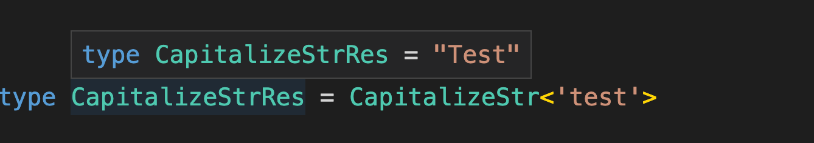


**例二：实现下划线转驼峰**

```typescript
type CamelCase<Str extends string> =
  Str extends `${infer Left}_${infer Right}${infer Rest}`
    ? `${Left}${Uppercase<Right>}${CamelCase<Rest>}`
    : Str 
```

> 解析：
>
> 类型参数 Str 是待处理的字符串类型，约束为 string。
>
> 提取 _ 之前和之后的两个字符到 infer 声明的局部变量 Left 和 Right，剩下的字符放到 Rest 里。
>
> 然后把右边的字符 Right 大写，和 Left 构造成新的字符串，剩余的字符 Rest 要继续递归的处理。

结果：

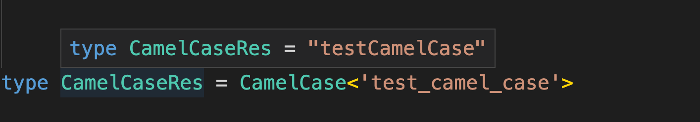


**例三： 删除字符串某个子串**

```typescript
type DelSubStr<
  Str extends string,
  DelStr extends string
> = Str extends `${infer Prefix}${DelStr}${infer Suffix}`
		? `${Prefix}${Suffix}`
		: Str
```

> 解析：
>
> 类型参数 Str 是待处理的字符串， DelStr 是要删除的字符串，都通过 extends 约束为 string 类型。
>
> 通过模式匹配提取 DelStr 之前和之后的字符串到 infer 声明的局部变量 Prefix、Suffix 中。
>
> 如果不匹配就直接返回 Str。
>
> 如果匹配，那就用 Prefix、Suffix 构造成新的字符串，然后返回

结果：

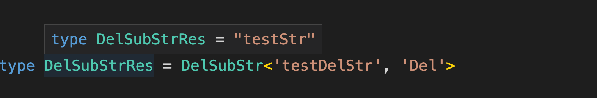


但是，上面的处理方式有个缺点，就是当字符串有多处重复的子串需要删除，就没法做到。需要在上面的基础上，加递归处理

```typescript
type DelSubStrAll<
  Str extends string,
  DelStr extends string
> = Str extends `${infer Prefix}${DelStr}${infer Suffix}`
    ? `${DelSubStrAll<`${Prefix}${Suffix}`, DelStr>}`
    : Str
```

> 解析：
>
> 递归调用 DelSubStrAll 去处理

结果：

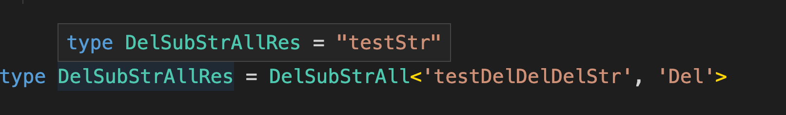


#### 函数类型的重新构造

**例一：在已有的函数类型上添加一个参数**

```typescript
type AppendArgument<Func extends Function, Arg>
  = Func extends (...args: infer Args) => infer ReturnType
    ? (...args: [...Args, Arg]) => ReturnType
    : never
```

> 解析：
>
> 类型参数 Func 是待处理的函数类型，通过 extends 约束为 Function，Arg 是要添加的参数类型。
>
> 通过模式匹配提取参数到 infer 声明的局部变量 Args 中，提取返回值到局部变量 ReturnType 中。
>
> 用 Args 数组添加 Arg 构造成新的参数类型，结合 ReturnType 构造成新的函数类型返回。

结果：

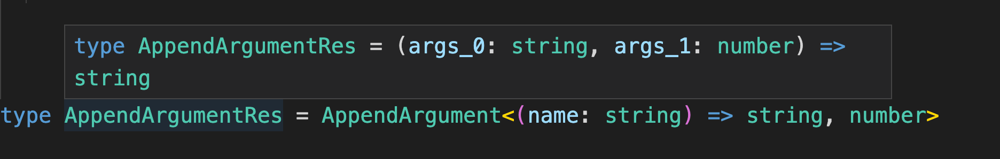


#### 索引类型的重新构造


**例一： 索引类型修改值value**

```typescript
type MapValue<T extends object> = {
  [K in keyof T]: [T[K], T[K]]
}
```

> 解析：
>
> 类型参数 T 是待处理的索引类型，通过 extends 约束为 object。
>
> 用 keyof 取出 T 的索引，作为新的索引类型的索引，也就是 K in keyof T。
>
> 值的类型可以做变换，这里用索引类型的值 T[K] 构造成了三个元素的元组类型 [T[K], T[K]]

结果：

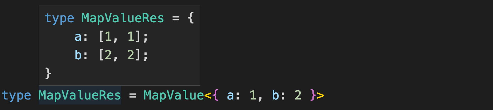


**例二： 索引类型修改 key**

除了可以对 Value 做修改，也可以对 Key 做修改，使用 as，这叫做`重映射

比如把索引类型的 Key 变为大写

```typescript
type UpperKey<T extends object> = {
  [K in keyof T as Uppercase<K & string>]: T[K]
}
```

> 解析：
>
> 类型参数 T 是待处理的索引类型，通过 extends 约束为 object。
>
> 新的索引类型的索引为 T 中的索引，也就是 K in keyof T，但要做一些变换，也就是 as 之后的。
>
> 通过 Uppercase 把索引 K 转为大写，因为索引可能为 string、number、symbol 类型，而这里只能接受 string 类型，所以要 & string，也就是取索引中 string 的部分。
>
> value 保持不变，也就是之前的索引 K 对应的值的类型 T[K]。

结果：

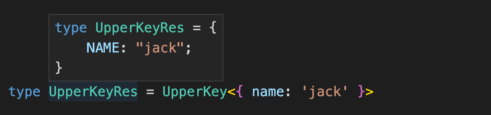


如果只是想将 Key 的首字母大写，可以做如下改造：

```typescript
type UpperKey<T extends object> = {
  [
    K in keyof T as K extends `${infer First}${infer Rest}`
      ? `${Uppercase<First>}${Rest}`
      : K
  ]: T[K]
}
```

结果：

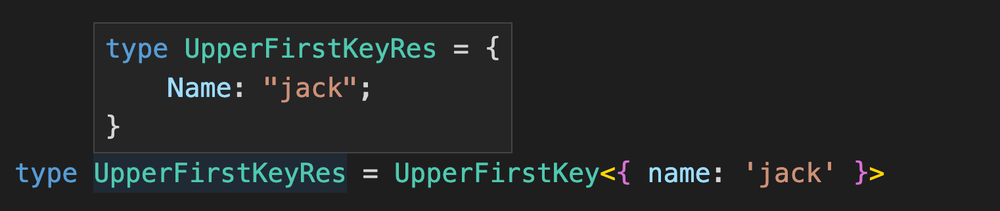


**例三： 模拟实现 Record**

```typescript
type MyRecord<K extends string | number | symbol, T> = {
  [P in K]: T
}
```

结果：

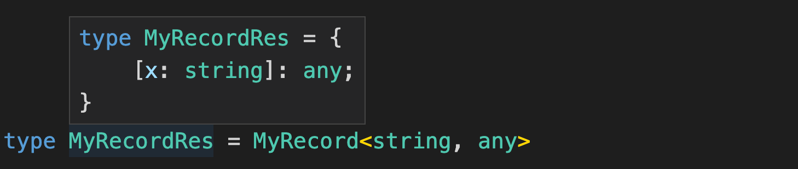


**例四： 只读与可选的操作**

1、添加只读修饰符

```typescript
type ToReadonly<T> = {
  readonly [K in keyof T]: T[K]
}
```

结果：

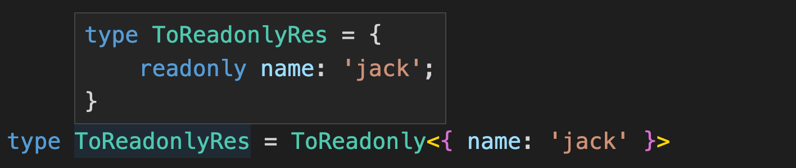


2、添加可选修饰符

```typescript
type ToPartial<T> = {
  [K in keyof T]?: T[K]
}
```

结果：

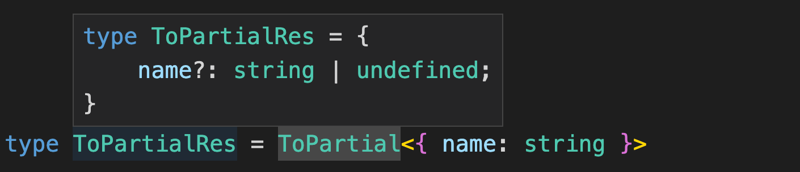


3、去除只读修饰符

```typescript
type DelReadonly<T> = {
  -readonly [K in keyof T]: T[K]
}
```

结果：

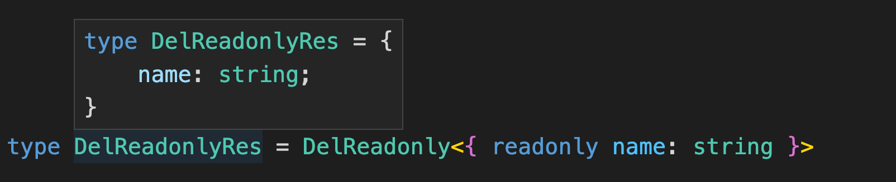


4、去除可选修饰符

```typescript
type DelPartial<T> = {
  [K in keyof T]-?: T[K]
}
```

结果：

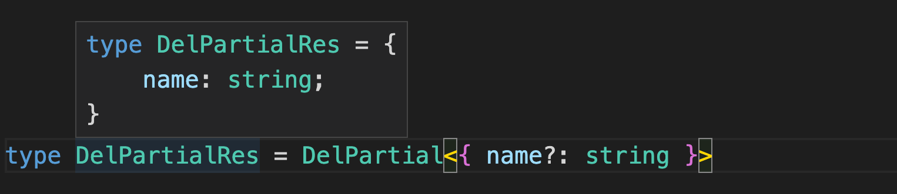


**例五：根据值的类型做过滤**

```typescript
type FilterByValueType<T extends Record<string, any>, P> = {
  [K in keyof T as T[K] extends P ? K : never]: T[K]
}
```

> 解析：
>
> 类型参数 T 为要处理的索引类型，通过 extends 约束为索引为 string，值为任意类型的索引类型 Record<string, any>。
>
> 类型参数 P 为要过滤出的值的类型。
>
> 构造新的索引类型，索引为 T 的索引，也就是 Key in keyof T，但要做一些变换，也就是 as 之后的部分。
>
> 如果原来索引的值 T[K] 是 P 类型，索引依然为之前的索引 K，否则索引设置为 never，never 的索引会在生成新的索引类型时被去掉。
>
> 值保持不变，依然为原来索引的值，也就是 T[K]。
>
> 这样就达到了过滤索引类型的索引，产生新的索引类型的目的

结果：

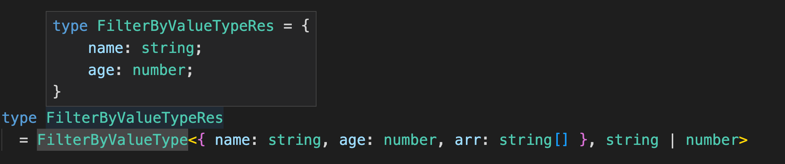


**例六：根据 Key 值做过滤**

```typescript
type FilterByKey<T extends Record<string, any>, P> = {
  [K in keyof T as K extends P ? never : K]: T[K]
}
```

结果：

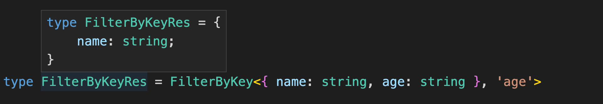


#### 重新构造做变换总结

TypeScript 支持 type、infer、类型参数来保存任意类型，相当于变量的作用。

但其实也不能叫变量，因为它们是不可变的。**想要变化就需要重新构造新的类型，并且可以在构造新类型的过程中对原类型做一些过滤和变换。**

数组、字符串、函数、索引类型等都可以用这种方式对原类型做变换产生新的类型。其中索引类型有专门的语法叫做映射类型，对索引做修改的 as 叫做重映射。


