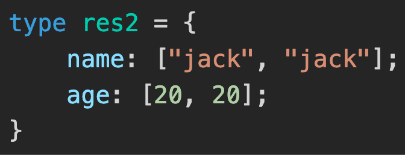
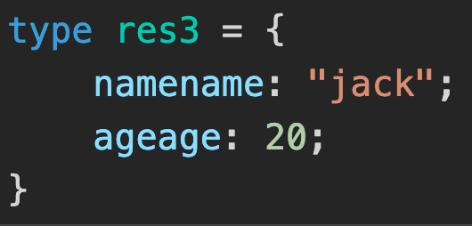

# 基础认知


### 为什么 TypeScript 类型编程又叫类型体操

- TypeScript 给 JavaScript 增加了一套类型系统，但并没有改变 JS 的语法，只是做了扩展，是 JavaScript 的超集。
- 这套类型系统支持泛型，也就是类型参数，有了一些灵活性。而且又进一步支持了对类型参数的各种处理，也就是类型编程，灵活性进一步增强。
- 现在 TS 的类型系统是图灵完备的，**能描述各种可计算逻辑。简单点来理解就是循环、条件等各种 JS 里面有的语法它都有，JS 能写的逻辑它都能写**。
- 但是很多类型编程的逻辑写起来比较复杂，因此被戏称为类型体操。


### 类型运算

主要看看 ts 中几种类型运算


#### 条件类型

ts 中条件判断是 `extends ? :`，叫做条件类型。其实就是 ts 类型系统里的 if else。例子：

```typescript
type isTrue<T> = T extends 2 ? true : false

type res = isTrue<1>   // false
```

类型运算逻辑都是用来做一些动态的类型的运算的，也就是对类型参数的运算（如上面例子）

这种类型也叫`高级类型`，**高级类型的特点是传入类型参数，经过一系列类型运算逻辑后，返回新的类型。**


#### 类型推导

类型推导，infer，主要用来`提取类型的一部分`。

例如：提取元组类型的第一个元素

```typescript
type IFirst<Tuple extends unknown[]> = Tuple extends [infer T, ...infer R] ? T : never

type res1 = IFirst<[1, 2]>
```

第一个 extends 不是条件，条件类型是 `extends ? :`，这里的 extends 是约束的意思，也就是约束类型参数只能是数组类型。

等号后面的 [infer T, ...infer R]，infer T 代表第一个参数，......infer R 展开运算符，剩余参数


#### 联合与交叉

联合类型类似 js 里的或运算符 |，但是作用于类型，代表类型可以是几个类型之一

```typescript
type INum = 1 | 2 | 3;
```


交叉类型（Intersection）类似 js 中的与运算符 &，但是作用于类型，代表对类型做合并

```typescript
type IObj = { a: number } & { b: string }
```

需要注意的是，交叉类型对于同一类型可以合并，不同的类型没法合并，会被舍弃

```typescript
type IObj1 = 'aaa' & 'bbb' // never
```

> **never** 代表不可达，比如函数抛异常的时候，返回值就是 never


#### 映射类型

对象、class 在 TypeScript 对应的类型是索引类型，`映射类型`可以对索引类型作修改。

例如：

```js
type IMap<T> = {
  [key in keyof T]: T[key]
}
```

- keyof T 是查询索引类型中所有的索引，叫做`索引查询`

- T[Key] 是取索引类型某个索引的值，叫做`索引访问`

- in 是用于遍历联合类型的运算符

```typescript
type IMapVal<T> = {
  [key in keyof T]: [T[key], T[key]]
}
type res2 = IMapVal<{name: 'jack', age: 20}>
```

结果就是：

 


映射类型除了可以修改值，索引 key 也可以做变化。用 as 运算符，叫做`重映射`。例如：

```typescript
type IMapKey<T> = {
  [key in keyof T as `${key & string}${key & string}`]: T[key]
}

type res3 = IMapKey<{name: 'jack', age: 20}>
```

结果是：

 

> 解析一下这里的 & string：
>
> 因为索引类型（对象、class 等）可以用 string、number 和 symbol 作为 key，这里 keyof T 取出的索引就是 string | number | symbol 的联合类型，和 string 取交叉部分就只剩下 string 了。就像前面所说，交叉类型会把同一类型做合并，不同类型舍弃。
>
> 如果不这样做，会不能将 xxx 类型赋值给 xxx 类型的错误


