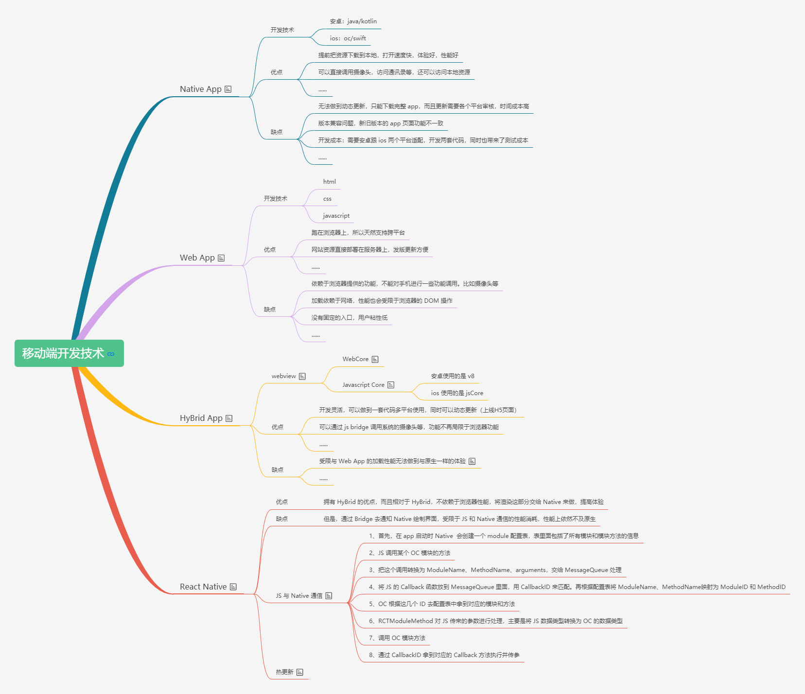

# 移动端开发技术


## 1、移动端开发技术

[移动端开发技术](https://juejin.cn/post/6915377977765134344#heading-17)




## 2、JS Bridge

[JS Bridge](https://juejin.cn/post/6916316666208976904#heading-19)

JS Bridge，桥接，主要用来连接 js 和 Native，实现两者之间的通信。一般就两种情况，js 调用 native 和 native 调用 js。


### 2-1、WebView

- 安卓的 webview

  低版本和高版本的安卓使用了不同的 webkit 内核，4.4 后直接使用了`Chrome`

- ios 的 webview

  ios 的 webview 分为两种，一种是 UIWebView，ios2 就有，但是性能较差，特性支持差。另外一种是 WKWebView，ios8 之后出现，占用内存更少，大概是 UIWebView 的 1/3，支持更好的 HTML5 特性，性能更加强大；但也有一些缺点，比如不支持缓存，需要自己注入 Cookie，发送 POST 请求的时候带不了参数，拦截 POST 请求的时候无法解析参数等等


### 2-2、JS 调用 Native

js 调用 native 进行通信的方式一般有三种：

- 拦截 webview 请求的 url scheme
- 拦截弹窗
- 向 webview 中注入 js 的 api

#### 2-2-1、拦截 webview 请求的 url scheme

**认识 url scheme**

url scheme 是一种特殊的 url，一般用于在 web 端调起 app，或者打开 app 的某一个页面

例如，`<a href="weixin://">打开微信</a>`，点击就会弹起提示：是否要打开微信

基于以上我们也可以自定义用来通信的 url scheme

**拦截 scheme：**

对于 js 来说，发起一个 ajax 请求是最常见的需求，而对于客户端 app 来说，是可以直接拦截请求的

那么就意味着可以通过用 js 请求一个地址，地址上带有一些参数，然后客户端拦截，拿到地址，解析出参数

```js
axios.get('http://xxxx?func=aaa&callback=bbb')
```

客户端解析出 func，判断需要调用哪个功能，然后根据 callback 回调。也就是说：把域名和路径当做通信标识，参数里面的 func 当做指令，callback 当做回调函数，其他参数当做数据传递。

现在主流的方式是前面我们看到的自定义 Scheme 协议，以这个为通信标识，域名和路径当做指令

- 在 js 这边

  1. 使用 iframe 跳转（**目前使用最广泛的就是 iframe**）

     ```js
     const iframe = document.createElement('iframe')
     iframe.src =  'gweid://'
     iframe.style.display = 'none'
     docuemnt.body.appendChild(iframe)
     ```

  2. 使用 a 标签跳转
      ```js
      <a href="gweid://"><a/>
      ```
      
  3. 使用重定向
  
      ```js
      location.href = "gweid://"
      ```
  
- 在 Android

  可以使用 shouldOverrideUrlLoading 来拦截 url 请求

  ```js
  @Override
  public boolean shouldOverrideUrlLoading(WebView view, String url) {
      if (url.startsWith("taobao")) {
          // 拿到调用路径后解析调用的指令和参数，根据这些去调用 Native 方法
          return true;
      }
  }
  ```

- 在 ios

  


#### 2-2-2、弹窗拦截：


#### 2-2-3、注入上下文：

主要通过 webview 向 js 的上下文注入对象和方法，可以让 JS 直接调用原生

**在 ios 的 UIWebView**

ios 侧注入：

```js
// 获取 JS 上下文
JSContext *context = [webview valueForKeyPath:@"documentView.webView.mainFrame.javaScriptContext"];
// 注入 Block
context[@"callHandler"] = ^(JSValue * data) {
    // 处理调用方法和参数
    // 调用 Native 功能
    // 回调 JS Callback
}
```

js 调用:

```js
window.callHandler({
    type: "scan",
    data: "",
    callback: function(data) {
    }
});
```

好处：JS 调用是同步的，可以立马拿到返回值；也不再需要像拦截方式一样，每次传值都要把对象做 `JSON.stringify`，可以直接传 JSON 过去，也支持直接传一个函数过去

**ios 的 WKWebView**

ios 侧注入：

```js
WKWebView *wkWebView = [[WKWebView alloc] init];
WKWebViewConfiguration *configuration = wkWebView.configuration;
WKUserContentController *userCC = configuration.userContentController;

// 注入对象
[userCC addScriptMessageHandler:self name:@"nativeObj"];
// 清除对象
[userCC removeScriptMessageHandler:self name:@"nativeObj"];

// 客户端处理前端调用
- (void)userContentController:(WKUserContentController *)userContentController didReceiveScriptMessage:(WKScriptMessage *)message
{
    // 获取前端传来的参数
    NSDictionary *msgBody = message.body;
    // 如果是 nativeObj 就进行相应处理
    if (![message.name isEqualToString:@"nativeObj"]) {
        // 
        return;
    }
}
```

js 侧调用：

```js
window.webkit.messageHandlers.nativeObj.postMessage(data);
```

**安卓的 addJavascriptInterface**

安卓侧注入：

```js
public void addJavascriptInterface() {
        mWebView.addJavascriptInterface(new DatePickerJSBridge(), "DatePickerBridge");
    }
private class PickerJSBridge {
    public void _pick(...) {
    }
}
```

js 侧调用：

```js
window.DatePickerBridge._pick(...)
```


### 2-3、Native 调用 JS

Native 调用 js 基本就是直接 js 代码字符串的形，类似于使用 eval 去执行一段代码字符串。一般有 loadUrl、evaluateJavascript 等。需要注意的是，不管哪种方式，客户端都只能拿到挂载到 `window` 对象上面的属性和方法

#### 2-3-1、Android

在 4.4 以前的版本使用 loadUrl，使用方式类似我们在 a 标签的 `href` 里面写 JS 脚本一样，都是`javascript:xxx` 的形式；4.4 之后使用 evaluateJavascript

```js
if (Build.VERSION.SDK_INT > 19) //see what wrapper we have
{
    webView.evaluateJavascript("javascript:foo()", null);
} else {
    webView.loadUrl("javascript:foo()");
}
```

#### 2-3-2、ios

**UIWebView**

在 iOS 的 UIWebView 里面使用 `stringByEvaluatingJavaScriptFromString` 来调用 JS 代码。这种方式是同步的，会阻塞线程

```js
results = [self.webView stringByEvaluatingJavaScriptFromString:"foo()"];
```

**WKWebView**

使用 `evaluateJavaScript` 方法来调用 JS 代码

```js
[self.webView evaluateJavaScript:@"document.body.offsetHeight;" completionHandler:^(id _Nullable response, NSError * _Nullable error) {
    // 获取返回值 response
    }];
```

