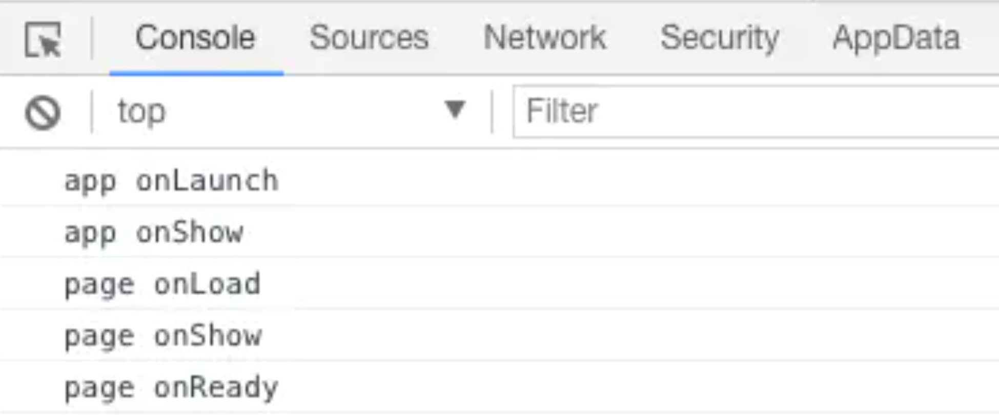
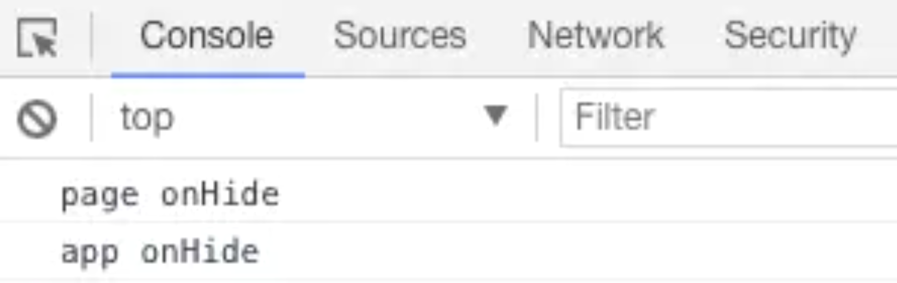
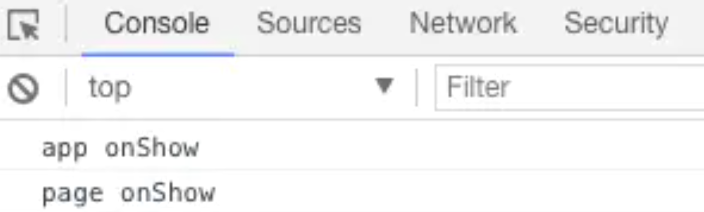

# 小程序相关

[知识点合集](https://juejin.im/post/5da444ab6fb9a04e054d93d8)


## 小程序基础


### 小程序里边的双向绑定和 vue 的双向绑定有什么区别

-   1，首先利用 bindinput 来触发改变 input 输入框中的值
-   2，使用 data-name 来获取改变的数据的内容 name 自己取名
-   3， bindinput 触发后在方法中通过 e.currentTarget.dataset.name 来获取改变后的内容
-   4， 通过 this.setData()来改变 data-name 绑定的参数就好了

```
<input type="text" bindinput="inputEdit" data-name="inputValue" placeholder="姓名" value="{{inputValue}}">

inputEdit(e) {
    console.log(e.currentTarget.dataset.name)
}
```


**或者使用简易双向数据绑定：**

```html
<input model:value="{{value}}" />
```

这就跟 Vue 中的 v-model 差不多


### 小程序页面间传递数据的方法

#### 通过路由传参

```
wx.navigateTo({url: 'index/a?id=aaa'})

// 在另外一个页面
onLoad: function(opt) {
    opt.id
}
```


#### 使用全局变量实现数据传递。在 app.js 文件中定义全局变量 globalData， 将需要存储的信息存放在里面


#### 也可以通过本地存储


### 请谈谈小程序的主要目录和文件的作用

-   project.config.json 项目配置文件
-   App.js 配置一些全局的基础数据
-   App.json 小程序底部 tab 栏，标题栏的文字，颜色，大小，路由，等的设置
-   App.wxss 全局的公共样式
-   sitemap.json 文件用来配置小程序及其页面是否允许被微信索引
-   Pages 配置每个页面
    -   index.json: 单独页面的标题栏的文字，颜色，大小
    -   index.wxml：html
    -   index.wxss：css
    -   index.js：js


### 点击事件拿到数据 data-

```
<view bindtap="selectInvitation" data-invitation="{{item}}">

selectInvitation: function (e) {
    var invitation = e.currentTarget.dataset.invitation;
}
```


### 小程序生命周期

全局 App 的生命周期：

- onLaunch：初始化小程序时触发，全局只触发一次
- onShow：小程序初始化完成或用户从后台切换到前台显示时触发
- onHide：用户从前台切换到后台隐藏时触发


这个是页面 Page 的生命周期

-   onLoad() 页面加载时触发，全局只会调用一次，在该周期内可获取当前页面路径的参数
-   onShow() 页面显示时触发或者切入前台时触发，也就是在该周期内可以获取请求数据
-   onReady() 页面初次渲染完成时触发，只会调用一次，代表页面已经可以和视图层进行交互
-   onHide() 页面隐藏或者切入后台时触发，如底部 tab 切换到其他页面或小程序切入后台时触发
-   onUnload() 页面卸载时触发


首次进入小程序时：

 

前台切到后台：

 

后台切到前台：

 


### 小程序的 wxss 和 css 有哪些不一样的地方

-   wxss 的图片引入需使用外链地址
-   没有 Body；样式可直接使用 import 导入
-   没有 css 支持的属性多


### 程序关联微信公众号如何确定用户的唯一性

使用 wx.getUserInfo 方法 withCredentials 为 true 时 可获取 \<encryptedData，里面有 union_id。后端需要进行对称解密


### 简述微信小程序原理

-   微信小程序采用 JavaScript、WXML、WXSS 三种技术进行开发,本质就是一个单页面应用，所有的页面渲染和事件处理，都在一个页面内进行，但又可以通过微信客户端调用原生的各种接口
-   微信的架构，是数据驱动的架构模式，它的 UI 和数据是分离的，所有的页面更新，都需要通过对数据的更改来实现
-   小程序分为两个部分 webview 和 appService 。其中 webview 主要用来展现 UI ，appService 有来处理业务逻辑、数据及接口调用。它们在两个进程中运行，通过系统层 JSBridge 实现通信，实现 UI 的渲染、事件的处理


### bindtap 和 catchtap 的区别是什么

-   相同：首先他们都是作为点击事件函数，就是点击时触发
-   不同：bindtap 是不会阻止冒泡事件的，catchtap 是会阻值冒泡


### 小程序 wxml 与标准的 html 的异同　

-   标签名字不一样，且小程序标签更少，单一标签更多；
-   多了一些`wx:if` 这样的属性以及 `{{ }}`这样的表达式
-   WXML仅能在微信小程序开发者工具中预览，而`HTML`可以在浏览器内预览；
-   组件封装不同， `WXML`对组件进行了重新封装，
-   小程序运行在`JS Core`内，没有`DOM树`和`window`对象，小程序中无法使用`window`对象和`document`对象。


### 小程序 Dom 问题

微信官方禁止小程序操作 dom 元素，因而无法像前端一样操作小程序 DOM，好在官方提供了 API：wx.createSelectorQuery()

```
page({
    data:{
         swiperHeight:0
    } ,
     /*由于期待页面加载完毕就显示，所以我放在了onload函数内*/
     /**
   * 生命周期函数--监听页面初次渲染完成
   */
  　onReady: function () {
  　  var that = this
  　  const query = wx.createSelectorQuery();
  　  query.select('.cont1').boundingClientRect(function (res) {
  　      //这里返回元素自身的DOM属性
  　      console.log(res);
  　  }).exec(function(rect){
  　      that.setData({
  　        swiperHeight: rect[0].height + 0
  　      })
  　      // rect返回一个数组，需要使用下标0才能找到
  　      // console.log(s[0].height)
  　  });
  　}
})
```


### 小程序对 wx:if 和 hidden 使用的理解

wx:if 有更高的切换消耗。
hidden 有更高的初始渲染消耗。
因此，如果需要频繁切换的情景下，用 hidden 更好，如果在运行时条件不大可能改变则 wx:if 较好。


### 微信小程序与 H5 的区别

-   运行环境的不同

传统的 HTML5 的运行环境是浏览器，包括 webview，而微信小程序的运行环境并非完整的浏览器，是微信开发团队基于浏览器内核完全重构的一个内置解析器，针对小程序专门做了优化，配合自己定义的开发语言标准，提升了小程序的性能。

-   开发成本的不同

只在微信中运行，所以不用再去顾虑浏览器兼容性，不用担心生产环境中出现不可预料的奇妙 BUG


### app.json 的全局配置的参数

-   pages：用于描述当前小程序所有页面路径，这是为了让微信客户端知道当前你的小程序页面定义在哪个目录。
-   window：小程序所有页面的顶部背景颜色，文字颜色定义在这里的
-   tabBar：底部 tab 栏的表现
-   networkTimeout：网络超时时间
-   subpackages：分包
-   plugins：使用到的插件


### 小程序 onPageScroll 方法的使用注意什么

由于此方法调用频繁，不需要时，可以去掉，不要保留空方法，并且使用 onPageScroll 时，尽量避免使用 setData()，尽量减少 setData()的使用频次


### webview 中的页面怎么跳回小程序中

```
首先要引入最新版的jweixin-x.x.x.js，然后

wx.miniProgram.navigateTo({
url: '/pages/login/login'+'$params'
})
```


### webview 的页面怎么跳转到小程序导航的页面

```
小程序导航的页面可以通过switchTab，但默认情况是不会重新加载数据的。若需加载新数据，则在success属性中加入以下代码即可：
success: function (e) {
    var page = getCurrentPages().pop();
    if (page == undefined || page == null) return;
    page.onLoad();
}


webview的页面，则通过
 wx.miniProgram.switchTab({
    url: '/pages/index/index'
})
```


### 微信小程序的优劣势

#### 优势

-   1、无需下载，通过搜索和扫一扫就可以打开。
-   2、良好的用户体验：打开速度快。
-   3、开发成本要比 App 要低。
-   4、安卓上可以添加到桌面，与原生 App 差不多。
-   5、为用户提供良好的安全保障。小程序的发布，微信拥有一套严格的审查流程，不能通过审查的小程序是无法发布到线上的。

#### 劣势

-   1、限制较多。主包大小不能超过 2M。不能打开超过 5 个层级的页面。
-   2、样式单一。小程序的部分组件已经是成型的了，样式不可以修改。例如：幻灯片、导航。
-   3、推广面窄，不能分享朋友圈，只能通过分享给朋友，附近小程序推广。其中附近小程序也受到微信的限制。


### 小程序运行机制

#### 前台/后台状态

小程序启动后，界面被展示给用户，此时小程序处于前台状态。

当用户点击右上角胶囊按钮关闭小程序，或者按了设备 Home 键离开微信时，小程序并没有完全终止运行，而是进入了后台状态，小程序还可以运行一小段时间。

当用户再次进入微信或再次打开小程序，小程序又会从后台进入前台。但如果用户很久没有再进入小程序，或者系统资源紧张，小程序可能被销毁，即完全终止运行。


#### 小程序启动

小程序启动可以分为两种情况，一种是冷启动，一种是热启动。

- 冷启动：如果用户首次打开，或小程序销毁后被用户再次打开，此时小程序需要重新加载启动，即冷启动。
- 热启动：如果用户已经打开过某小程序，然后在一定时间内再次打开该小程序，此时小程序并未被销毁，只是从后台状态进入前台状态，这个过程就是热启动。


#### 小程序销毁时机

通常，只有当小程序进入后台一定时间，或者系统资源占用过高，才会被销毁。具体而言包括以下几种情形：

- 当小程序进入后台，可以维持一小段时间的运行状态，如果这段时间内都未进入前台，小程序会被销毁。
- 当小程序占用系统资源过高，可能会被系统销毁或被微信客户端主动回收。
- 在 iOS 上，当微信客户端在一定时间间隔内连续收到系统内存告警时，会根据一定的策略，主动销毁小程序，并提示用户 「运行内存不足，请重新打开该小程序」。具体策略会持续进行调整优化。
- 建议小程序在必要时使用 wx.onMemoryWarning 监听内存告警事件，进行必要的内存清理


### 小程序更新机制

#### 未启动时更新

开发者在管理后台发布新版本的小程序之后，如果某个用户本地有小程序的历史版本，此时打开的可能还是旧版本。微信客户端会有若干个时机去检查本地缓存的小程序有没有更新版本，如果有则会静默更新到新版本。总的来说，开发者在后台发布新版本之后，无法立刻影响到所有现网用户，但最差情况下，也在发布之后 24 小时之内下发新版本信息到用户。用户下次打开时会先更新最新版本再打开。


#### 启动时更新

小程序每次冷启动时，都会检查是否有更新版本，如果发现有新版本，将会异步下载新版本的代码包，并同时用客户端本地的包进行启动，即新版本的小程序需要等下一次冷启动才会应用上。

如果需要马上应用最新版本，可以使用 wx.getUpdateManager API 进行处理。


## 小程序一些问题


#### 小程序中使用web-view打开pdf, IOS 可以正常打开，Android 打开为空白

正常情况下：src 里放链接就能够正常实现

```js
<web-view src="{{link}}"></web-view>
```

但是 src 里面放 pdf 的链接涉及到了兼容性问题（苹果手机可以正常打开 pdf 格式文件，安卓打开为空白）

解决：使用 wx.downloadFile 和 wx.openDocument

```js
wx.downloadFile({
  url: 'https://.../XXX.pdf', //要预览的 PDF 的地址
  success: function (res) {
    if (res.statusCode === 200) { //成功
      var Path = res.tempFilePath //返回的文件临时地址，用于后面打开本地预览所用
      wx.openDocument({
        fileType: 'pdf', // 文件类型
        filePath: Path, //要打开的文件路径
        success: function (res) {
          console.log('打开 PDF 成功');
        }
      })
    }
  },
  fail: function (err) {
    console.log(err); //失败
  }
})
```


#### 小程序A内嵌H5点击跳转小程序B

参考：https://developers.weixin.qq.com/community/develop/doc/0006a452298b081a330edba5658c00?highLine=%25E5%2586%2585%25E5%25B5%258CH5%25E8%25B7%25B3%25E8%25BD%25AC%25E5%2585%25B6%25E5%25AE%2583%25E5%2590%2591%25E7%25A8%258B%25E5%25BA%258F


#### 小程序内嵌H5下载APP

内嵌H5无法下载 APP，需要引导用户，打开外部浏览器下载

参考：https://developers.weixin.qq.com/community/develop/doc/0006e0bd1d49089b6c1dd438056400?highLine=%25E5%2586%2585%25E5%25B5%258CH5%25E4%25B8%258B%25E8%25BD%25BDAPP

同时，要注意诱导下载行为，参考：https://developers.weixin.qq.com/community/business/doc/0000203f3e0ac853053df659d5600d


#### 小程序人脸问题

如果小程序需要人脸，需要主体类符合规范，也就是需要资质

资质：https://developers.weixin.qq.com/community/business/doc/000442d352c1202bd498ecb105c00d

人脸问题：https://developers.weixin.qq.com/community/develop/doc/000ea42be4ce4022a9edbe2ac51809?highLine=%25E4%25BA%25BA%25E8%2584%25B8

接入流程：https://developers.weixin.qq.com/community/develop/article/doc/000eeeb87d0948e3bbdd820905c013

同时，无法使用第三方api进行人脸操作


#### APP内嵌H5跳转小程序

参考：https://developers.weixin.qq.com/community/develop/doc/000c6c84ac4d90b04f2cd538e56400?jumpto=comment&commentid=0000a4205e899891432c0befb518
